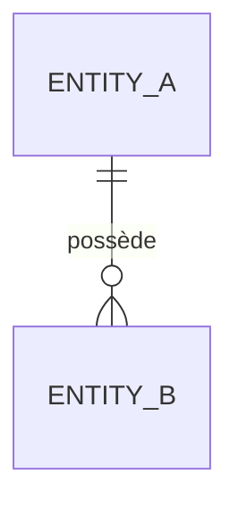

# Domaine : [Nom du Domaine] ([slug]) — Modèles & Schéma de Données

> **Mission du Domaine :** [Rappel de la mission]

---

## 1. Modèle Domaine (Core / Entités Métier)

### Agrégat / Entité : `[Nom de l'Entité]`
* **Fichier de définition :** `[Chemin relatif vers l'entité ou la structure de données]`
* **Type d'identifiant :** `[ex: UUIDv7, Auto-incrément, ULID, CUID, etc.]`
* **Attributs & Value Objects :**
  * `[Propriété 1]` : Type et signification métier
  * `[Propriété 2]` : Type et signification métier

---

## 2. Schéma de Persistance & Stockage

### Table / Collection : `[nom_de_la_table]`
* **Fichier de migration / DDL :** `[Chemin relatif vers le fichier de migration ou schema DDL]`
* **Composant d'accès aux données :** `[Repository / Data Access Layer]`

| Champ / Colonne | Type | Nullable | Contraintes / Index | Description Métier |
|---|---|---|---|---|
| `id` | `[Type]` | Non | `PRIMARY KEY` | Identifiant unique de l'entité |
| `created_at` | `[Timestamp]` | Non | `DEFAULT NOW()` | Date de création |
| `[champ]` | `[Type]` | Non / Oui | `INDEX / UNIQUE` | Description |

---

## 3. Relations & Diagramme ERD

