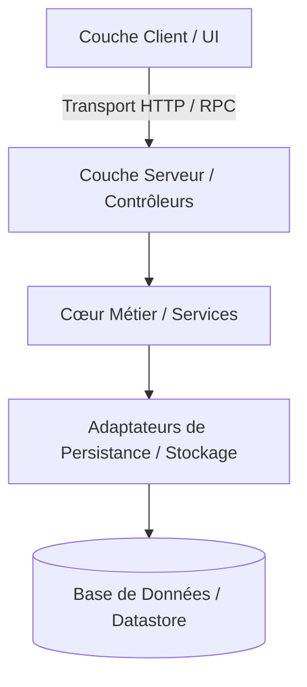

# Domaine : [Nom du Domaine] ([slug]) — Architecture Technique

> **Mission :** [1 phrase claire sur les responsabilités techniques et architecturales de ce domaine]

---

## 1. Périmètre Technique & Frontières

* **Composants hébergés dans ce domaine :**
  * Couche Serveur / Backend : [Services, UseCases, Handlers, Modules]
  * Couche Client / Frontend : [Modules UI, Contexts, Hooks, State Stores]
* **Délégations & Domaines Connexes :**
  * *[Service délégué] :* Délégué à `[slug-autre-domaine]`.

---

## 2. Architecture & Patterns Structurants

* **Patterns Architecturaux Clés :**
  * [ex: Architecture hexagonale, CQRS, Event-Driven, MVC...]
  * [Mécanisme d'isolation et d'étanchéité architecturale]
* **Gestion d'État & Concurrence :**
  * [Comment l'état est maintenu, synchronisé ou invalidé]

---

## 3. Organisation des Composants Clés

### Couche Serveur / Backend
* **Composants Métier Principaux :**
  * `[Composant 1]` : Rôle technique
  * `[Composant 2]` : Rôle technique
* **Persistance & Intégrations :**
  * [Repositories, adaptateurs de stockage ou clients externes]

### Couche Client / Consommateurs
* **Gestion d'État & Contexte :** [Contexts, stores, gestion du cache]
* **Composants d'Interaction :** [Composants clés d'interface ou handlers]

---

## 4. Invariants Techniques & Sécurité

* **`INV-TECH-01` ([Nom de l'invariant]) :** [Règle technique incontournable : contrôle d'accès, isolation, chiffrement].
* **`INV-TECH-02` ([Nom de l'invariant]) :** [Règle de performance, résilience ou politique de cache].

---

## 5. Décisions d'Architecture Liées (ADRs / PDRs)

* `ADR-XXX` : [Titre et lien vers l'arbitrage technique associé]
* `PDR-XXX` : [Titre et lien vers l'arbitrage produit ou ergonomique associé]
