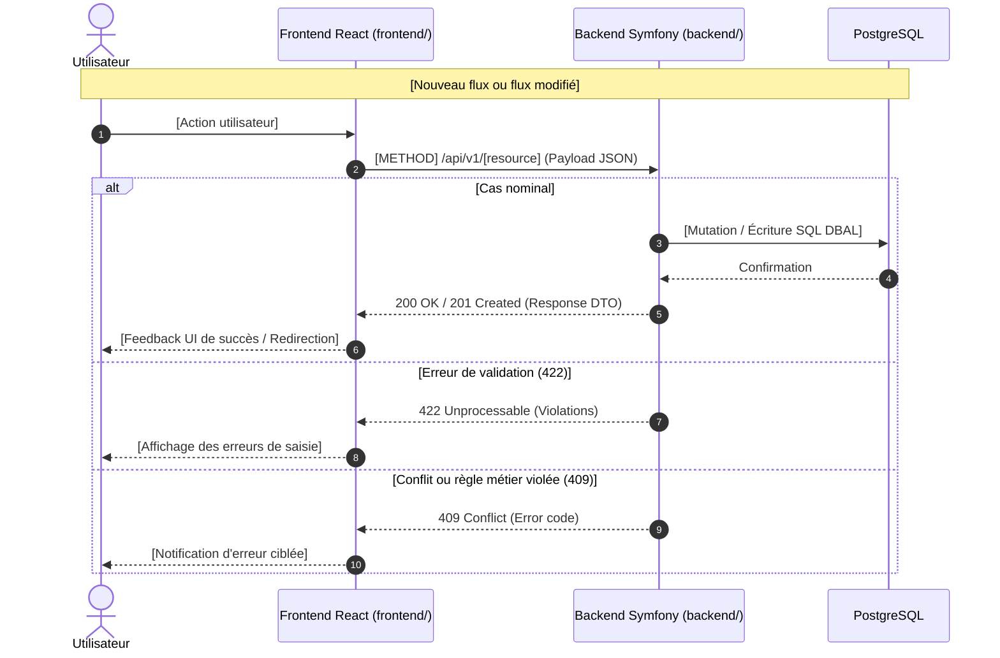
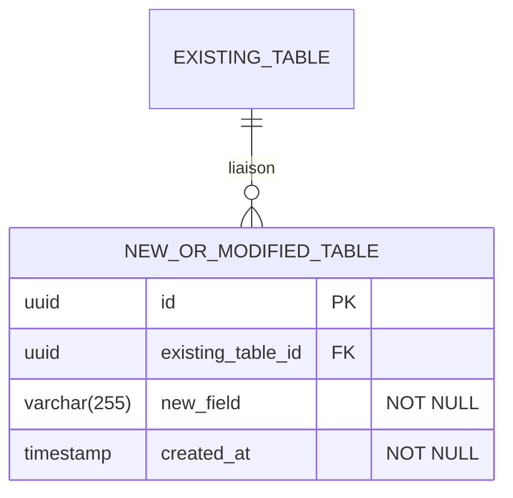

# Change : [XXX] - [Nom de l'évolution]

## Métadonnées
* **Domaine concerné :** `.specs/current/domains/[nom-du-domaine]/`
* **Type de changement :** `Nouveau module` | `Évolution` | `Refonte` | `Fix`
* **Cible :** `Fullstack` | `backend` | `frontend` | `tests-e2e`

---

## 1. Intention & Contexte (Le « Why » du Delta)
* **Problème résolu / Besoin :** [Explication en 1-2 phrases du besoin et de l'irritant utilisateur traité].
* **Impact utilisateur :** [Ce qui change concrètement dans l'expérience par rapport à l'état courant].
* **In Scope (Ce qui est ajouté/modifié) :**
  * [Livrable ou modification 1]
  * [Livrable ou modification 2]
* **Out of Scope (Exclusions strictes) :**
  * [Comportement non touché ou reporté]

---

## 2. Flux & Architecture (Diff)



---

## 3. Delta Modèle de données & Base de données

### 3.1. Diagramme Entité-Relation (ERD - Nouveaux éléments / Liaisons)



### 3.2. Modifications de tables

#### Table : `[nom_de_la_table]` (`Création` | `Modification`)
* **Entité / Value Object Core :** `backend/src/Core/Domain/[Aggregate]/[EntityName].php`
* **Port Repository :** `backend/src/Core/Port/[Aggregate]/Repository.php`
* **Adapter Persistence :** `backend/src/Adapter/Driven/Persistence/[Aggregate]/DoctrineRepository.php`

| Action | Champ | Type SQL / DBAL | Nullable | Contraintes & Index | Description métier |
|---|---|---|---|---|---|
| `Ajout` | `id` | `uuid` (v7) | Non | `PRIMARY KEY` | Identifiant unique généré. |
| `Ajout` | `new_field` | `varchar(255)` | Non | `INDEX idx_[table]_[field]` | Description du champ. |
| `Modif` | `status` | `varchar(50)` | Non | `DEFAULT 'draft'` | Ajout d'une nouvelle valeur d'état. |

### 3.3. Règles de migration & Intégrité
* **Fichier de migration :** `backend/migrations/VersionYYYYMMDDHHMMSS.php`.
* **Rétrocompatibilité :** [Ex. Pas d'ajout de colonne NOT NULL sans valeur par défaut sur une table existante volumineuse].

---

## 4. Delta Contrats d'API (Symfony)

### Endpoint : `[METHOD] /api/v1/[resource]` (`Nouveau` | `Modifié`)
* **Authentification requise :** `PUBLIC_ACCESS` | `ROLE_USER` | `Voter:[VoterName]`
* **Headers :** `Content-Type: application/json` | `Authorization: Bearer <token>`

#### Request (`[InputDtoName]`)
```php
final readonly class [InputDtoName]
{
    public function __construct(
        #[Assert\NotBlank(message: 'Champ obligatoire.')]
        #[Assert\Email(message: 'Format d\'email invalide.')]
        public string $fieldA,

        #[Assert\NotBlank(message: 'Champ obligatoire.')]
        #[Assert\PositiveOrZero(message: 'Doit être supérieur ou égal à 0.')]
        public int $fieldB,
    ) {}
}
```

#### Responses
* `200 OK` / `201 Created` :
  ```json
  {
    "id": "01918a24-7b3b-7c99-b1d5-2a1d2f34e567",
    "fieldA": "valeur",
    "fieldB": 10,
    "createdAt": "2026-08-31T01:00:00Z"
  }
  ```
* `422 Unprocessable Entity` : Format standard des violations Symfony (`violations: [{ propertyPath, title }]`).
* `400 / 401 / 403 / 404 / 409` : `{ "code": "ERROR_CODE", "message": "Description de l'erreur." }`

---

## 5. Configuration Réseau, Prérequis DNS & Sécurisation des Endpoints

### 5.1. Prérequis DNS Externes (Registrar / Zone DNS)
*Indiquer les enregistrements DNS requis si de nouveaux sous-domaines ou services exposés sont introduits.*

| Sous-domaine / Hôte | Type DNS | Cible | Rôle |
|---|---|---|---|
| `[service].nanko.dev` | `A` (ou `CNAME`) | `<IP_PUBLIQUE_VPS>` | [Description du rôle de l'hôte / service] |

> [!NOTE]
> Préciser si l'entrée est déjà couverte par un wildcard existant (ex: `*.nanko.dev` pointant vers l'IP du VPS) ou si une création manuelle est requise chez le registrar.

### 5.2. Matrice d'Exposition et Sécurisation des Endpoints
*Détailler pour chaque endpoint ou service son niveau d'exposition, son authentification et les mesures de mitigation associées.*

| Endpoint / Service | Exposition (`Publique` / `Restreinte` / `Interne Docker`) | Authentification & Contrôle d'accès | Mesures de mitigation (CORS, Rate-limit, Payload max, TLS/HSTS) |
|---|---|---|---|
| `[Nom Endpoint/URL]` | `Publique` / `Restreinte` | `Bearer Token JWT` / `Public` / `BasicAuth` | CORS restreint aux origines Nanko, Rate limiting X req/min, HSTS |
| `[Flux Interne]` | `Interne Docker` | Réseau privé `edge` | Aucun port exposé publiquement sur l'hôte |

### 5.3. Variables d'Environnement & Secrets requis
| Variable | Composant (`backend` / `frontend` / `compose`) | Environnement (`local` / `preprod` / `prod`) | Description & Exemple |
|---|---|---|---|
| `[NOM_VARIABLE]` | `frontend` | Tous | [Description de la variable et valeur par défaut] |

---

## 6. Delta Maquettes & Layout UI

### 6.1. Référence visuelle (Vision / Humain)
* **Fichier mockup :** `.specs/mockups/[XXX]-[change-name].png` *(ou URL Figma ciblée)*.
* **Consigne :** Respecter les alignements, proportions et contrastes de la maquette.

### 6.2. Wireframes conceptuels (ASCII Layout)

#### Vue Desktop (≥ 1024px)
```text
+-----------------------------------------------------------------------+
|  [Header / BrandLogo]                                                 |
+-----------------------------------+-----------------------------------+
|                                   |                                   |
|   ZONE SECONDAIRE / CONTEXTE      |   CONTENEUR PRINCIPAL (max-w-md)  |
|                                   |                                   |
|   - Titre / Visuel                |   +---------------------------+   |
|   - Informations d'aide           |   | Titre formulaire          |   |
|                                   |   |                           |   |
|                                   |   | Champ A : [             ] |   |
|                                   |   | Champ B : [             ] |   |
|                                   |   |                           |   |
|                                   |   | [ Action (Primary) ]      |   |
|                                   |   +---------------------------+   |
|                                   |   Lien secondaire             |   |
|                                   |                                   |
+-----------------------------------+-----------------------------------+
```

#### Vue Mobile (< 768px)
```text
+-----------------------------------+
|  [Header Mobile]                  |
+-----------------------------------+
|                                   |
|  Titre formulaire                 |
|                                   |
|  Champ A :                        |
|  [                              ] |
|                                   |
|  Champ B :                        |
|  [                              ] |
|                                   |
|  [     Action (Full width)      ] |
|                                   |
|  Lien secondaire                  |
|                                   |
+-----------------------------------+
```

### 5.3. Squelette JSX & Arborescence attendue

```text
frontend/src/features/[feature-name]/
├── components/
│   └── [FeatureForm].tsx
├── layouts/
│   └── [FeatureLayout].tsx
├── hooks/
│   └── use[FeatureMutation].ts
└── schemas.ts
```

```tsx
// Structure de layout et classes utilitaires attendues
<FeatureLayout>
  <div className="hidden lg:flex flex-col justify-between bg-slate-900 p-12 text-white">
    <FeatureContextDisplay/>
  </div>

  <div className="flex flex-1 items-center justify-center p-6 sm:p-12">
    <div className="w-full max-w-md space-y-6">
      <div className="space-y-2 text-center">
        <h1 className="text-2xl font-bold tracking-tight">[Titre]</h1>
        <p className="text-sm text-slate-500">[Texte explicatif]</p>
      </div>

      <FeatureForm/>
    </div>
  </div>
</FeatureLayout>
```

---

## 7. Delta Spécifications UI & Logique Client (React)

### Schéma de validation Zod (`schemas.ts`)
```typescript
import { z } from 'zod';

export const [featureSchema] = z.object({
  fieldA: z.string().trim().email('Format email invalide'),
  fieldB: z.number().int().nonnegative('Doit être un entier positif ou nul')
});

export type [FeatureInput] = z.infer<typeof [featureSchema]>;
```

### Matrice des états d'interface

| État | Déclencheur | Rendu visuel & Comportement |
|---|---|---|
| **Idle** | Arrivée sur la vue | Formulaire accessible, inputs actifs, bouton d'action activé. |
| **Submitting** | Clic sur le bouton d'action | Inputs en `disabled`, spinner animé sur le bouton + texte adapté (« En cours... »). |
| **Error (Validation)** | Erreur 422 ou échec Zod | Bordure d'input en rouge (`border-destructive`), message sous le champ, focus sur le premier champ invalide. |
| **Error (Serveur / Réseau)** | Erreur 500 / 409 / Réseau | Bannière d'alerte dismissible en haut du conteneur avec message explicite. |
| **Success** | Réponse 200 / 201 | Redirection vers la route cible ou notification toast de succès. |

---

## 8. Invariants & Cas limites (*Edge cases*)
1. **Rétrocompatibilité :** [Impact sur les endpoints existants ou sur les clients déjà connectés].
2. **Idempotence & Concurrence :** [Gestion des doubles soumissions ou accès concurrents].
3. **Contrôle d'accès :** [Vérification des droits et renvoi explicite de 403 Forbidden via un Voter ou Capability].

---

## 9. Plan d'exécution séquentiel

- [ ] **Phase 1 : Backend (`backend/`)**
  - [ ] 1. Modèle & DB : Créer/mettre à jour la migration Doctrine et les types DBAL.
  - [ ] 2. Core : Entité Domain, Value Objects (Id UUIDv7), Ports Repository et Use Case (Command/Handler).
  - [ ] 3. Adapter Persistence : Implémenter le repository DBAL dans `Adapter/Driven/Persistence/`.
  - [ ] 4. Adapter Driver : Contrôleur HTTP dans `Adapter/Driver/Http/Controller/` et DTOs d'entrée avec contraintes `Assert\*`.
  - [ ] **Validation Architecture :** Vérifier les frontières hexagonales avec `make deptrac`.
  - [ ] **Tests Unitaires Backend :** Valider la logique métier pure et DTOs sans DB (`backend/tests/Unit/`).
  - [ ] **Tests d'Intégration Backend :** Valider la persistance DBAL et les endpoints (`backend/tests/Integration/` / `make test-backend`).

- [ ] **Phase 2 : Frontend (`frontend/`)**
  - [ ] 1. Contrats : Déclarer le schéma Zod et exporter les types TypeScript (`schemas.ts`).
  - [ ] 2. Hooks & API : Créer le hook TanStack Query (`useMutation` / `useQuery`).
  - [ ] 3. Composants : Implémenter le layout, le formulaire et gérer la matrice des 5 états UI.
  - [ ] **Tests & Types Frontend :** Valider avec `pnpm --filter frontend typecheck` et `pnpm --filter frontend lint`.

- [ ] **Phase 3 : End-to-End (`tests-e2e/`)**
  - [ ] 1. Implémenter le parcours utilisateur complet dans Playwright (`tests-e2e/tests/[feature].spec.ts`).
  - [ ] **Tests E2E :** Exécuter la suite de tests contre l'environnement cible (`pnpm --filter tests-e2e exec playwright test`).

- [ ] **Phase 4 : Synchronisation documentaire (Automatisable via `/sync-current`)**
  - [ ] 1. Répercuter les modifications dans `.specs/current/domains/[domaine]/behavior.md`.
  - [ ] 2. Répercuter les nouveaux contrats dans `.specs/current/domains/[domaine]/contracts.md`.
  - [ ] 3. Répercuter les schémas de données dans `.specs/current/domains/[domaine]/models.md`.
  - [ ] 4. Déplacer ce fichier dans `.specs/changes/archive/[XXX]-[nom].md`.

---

## 10. Definition of Done & Stratégie de tests

### 10.1. Scénarios de validation (Format Gherkin avec tags)

```gherkin
# ==============================================================================
# TESTS E2E (tests-e2e/ - Exécutés contre l'environnement cible)
# ==============================================================================

@e2e @preprod
Fonctionnalité: Parcours complet [Nom de l'évolution]

  Scénario: Parcours nominal complet du delta
    Étant donné que l'utilisateur est sur la page "/[route]"
    Quand il remplit les champs obligatoires avec des données valides
    Et qu'il soumet le formulaire
    Alors l'action est enregistrée en base
    Et l'utilisateur est redirigé vers "/[route-cible]" avec un message de confirmation

# ==============================================================================
# TESTS BACKEND (backend/ - Unitaires, Intégration & Architecture)
# ==============================================================================

@api @integration
Fonctionnalité: Endpoints API [Nom de la ressource]

  Scénario: Exécution nominale du nouvel endpoint
    Quand l'API reçoit une requête "POST /api/v1/[resource]" avec un payload valide
    Alors le code de réponse HTTP est 201
    Et le header "Location" contient l'URI de la ressource créée
    Et la ressource est bien persistée dans la table "[nom_de_la_table]"

  @api @integration
  Scénario: Rejet en cas de conflit ou doublon
    Étant donné qu'une ressource existe déjà avec le même identifiant métier
    Quand l'API reçoit une requête "POST /api/v1/[resource]" identique
    Alors le code de réponse HTTP est 409
    Et le payload contient le code d'erreur "[ERROR_CODE]"

  @api @unit
  Scénario: Validation des contraintes du DTO
    Quand le DTO "[InputDtoName]" est instancié avec des données invalides
    Alors le validateur Symfony renvoie les violations attendues

# ==============================================================================
# TESTS FRONTEND (frontend/ - Unitaires & Intégration UI)
# ==============================================================================

@web @unit
Fonctionnalité: Schémas de validation client

  Scénario: Validation Zod échouée sur champ invalide
    Quand un objet invalide est passé à "[featureSchema]"
    Alors la validation échoue avec les messages d'erreur ciblés

  @web @integration
  Scénario: Rendu des états UI et gestion des erreurs API
    Étant donné le composant "<[FeatureForm]/>" rendu avec un mock API en erreur 422
    Quand l'utilisateur clique sur le bouton de soumission
    Alors les messages d'erreur s'affichent sous les champs concernés
```

### 9.2. Commandes de validation automatisée

```bash
# 1. Architecture, Base de données & Backend (backend/)
make deptrac
make test-backend
make static-analysis
make lint

# 2. Frontend (frontend/)
pnpm --filter frontend typecheck
pnpm --filter frontend lint

# 3. End-to-End (tests-e2e/)
pnpm --filter tests-e2e exec playwright test
```
