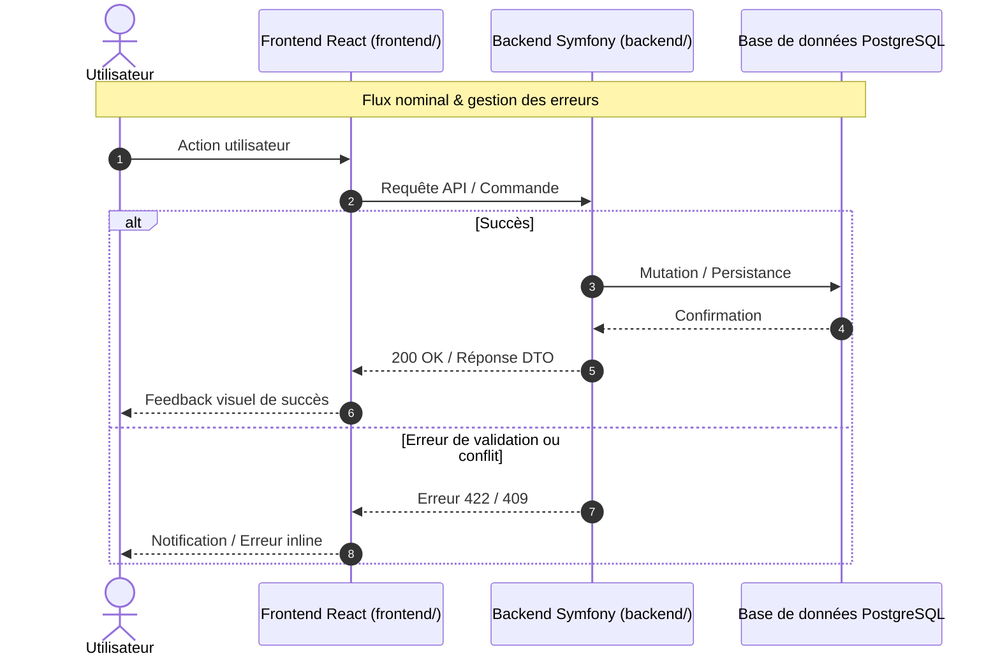

# Change : [XXX] - [Nom de l'évolution]

## Métadonnées
* **Domaine concerné :** `.specs/current/domains/[nom-du-domaine]/`
* **Type de changement :** `Nouveau module` | `Évolution` | `Refonte` | `Fix`
* **Cible :** `Fullstack` | `backend` | `frontend` | `tests-e2e`
* **Complexité :** `Faible` | `Moyenne` | `Élevée`

---

## 1. Intention & Contexte (Le « Why »)

* **Problème résolu / Besoin :** [Explication en 1-2 phrases du besoin et de l'irritant utilisateur traité].
* **Impact utilisateur :** [Ce qui change concrètement dans l'expérience par rapport à l'état courant].
* **In Scope (Ce qui est ajouté/modifié) :**
  * [Livrable ou modification 1]
  * [Livrable ou modification 2]
* **Out of Scope (Exclusions strictes) :**
  * [Comportement non touché ou reporté à un delta ultérieur]

> *Note d'omission (si applicable) : « Sections [DBAL / API Symfony / Réseau / UI Layout] : Sans objet ([Raison : ex. Évolution purement client / refactor interne / sans persistance]). »*

---

## 2. Flux & Architecture



---

## 3. Inventaire des Fichiers & Responsabilités

### 3.1. Arborescence & Responsabilités
*Chemins relatifs à la racine du projet, statuts `[NEW]` (création) ou `[MOD]` (modification existante), et rôles synthétiques en 1 ligne.*

```text
[frontend|backend]/src/
├── [module-or-feature]/
│   ├── [SubComponent].tsx                      [NEW] Rôle en 1 phrase courte
│   ├── [ExistingService].ts                    [MOD] Rôle en 1 phrase courte
│   └── tests/
│       └── [SubComponent].test.tsx             [NEW] Tests unitaires & intégration
tests-e2e/tests/
└── [feature].spec.ts                           [NEW] Scénarios Playwright E2E
```

### 3.2. Contrats & Signatures Clés
*Définitions TypeScript ou PHP des interfaces, DTOs ou callbacks critiques pour lever toute ambiguïté d'implémentation.*

```typescript
// Exemple de types / callbacks critiques
export interface [FeatureProps] {
  [propKey]: string;
  [onAction]: (id: string, value: string) => void;
}
```

```php
// Exemple de DTO / Command PHP
final readonly class [FeatureCommand]
{
    public function __construct(
        public string $id,
        public string $value,
    ) {}
}
```

---

## 4. Spécifications Détaillées (Données, API & UI)

*(Conserver les sous-sections pertinentes selon la cible de l'évolution, omettre les autres)*

### 4.1. Modèle de données & API (Backend)
*(À renseigner si l'évolution touche la persistance ou expose de nouveaux endpoints)*

* **Migration SQL / DBAL :** `backend/migrations/VersionYYYYMMDDHHMMSS.php`
* **Contrat Endpoint :** `[METHOD] /api/v1/[resource]` (`200 OK` / `422 Unprocessable` / `409 Conflict`)

### 4.2. Spécifications UI, Wireframes & États (Frontend)
*(À renseigner si l'évolution comporte une interface visuelle)*

```text
[ WIREFRAME ASCII ]
+-------------------------------------------------------+
|  [Composant / Vue]                                    |
|  +---------------------------+                        |
|  | Champ A : [             ] |                        |
|  | [ Action Principale ]     |                        |
|  +---------------------------+                        |
+-------------------------------------------------------+
```

#### Matrice des États d'Interface
| État | Déclencheur | Rendu visuel & Comportement |
|---|---|---|
| **Idle** | Chargement initial | Affichage par défaut des données. |
| **En cours / Saisie** | Interaction utilisateur | Rendu dynamique du champ / état focalisé. |
| **Validation / Succès** | Soumission valide | Synchronisation de l'état, feedback visuel. |
| **Erreur** | Données invalides / échec | Message d'erreur inline, préservation de la saisie. |

---

## 5. Invariants Métier & Traçabilité des Tests

Chaque invariant métier correspond à son scénario Gherkin en section 8.1 et est vérifié par les tests suivants :

* **INV-1 · [Nom de la règle 1]**  
  [Description concise de la règle et du comportement garanti en cas de violation].  
  ↳ *Couvert par :* [`[FichierTest.test.tsx]`](#annexe-index-des-fichiers)

* **INV-2 · [Nom de la règle 2]**  
  [Description concise de la règle et du comportement garanti en cas de violation].  
  ↳ *Couvert par :* [`[AutreTest.test.ts]`](#annexe-index-des-fichiers)

---

## 6. Pièges Techniques & Anti-Patterns (*Watchouts*)

* **[Piège technique 1] :** [Description concrète du piège d'implémentation anticipé et de la parade recommandée].
* **[Piège technique 2] :** [Description concrète du piège d'implémentation anticipé et de la parade recommandée].
* **[Piège technique 3] :** [Description concrète du piège d'implémentation anticipé et de la parade recommandée].

---

## 7. Plan d'Exécution Séquentiel

- [ ] **Phase 1 : Socle & Contrats de Données**
  - [ ] Implémenter les types et utilitaires dans [`[fichier.ts]`](#annexe-index-des-fichiers).
  - [ ] Écrire les tests unitaires associés dans [`[fichier.test.ts]`](#annexe-index-des-fichiers).

- [ ] **Phase 2 : Composants & Logique Métier**
  - [ ] Créer / adapter les composants dans [`[Composant.tsx]`](#annexe-index-des-fichiers).
  - [ ] Compléter les suites de tests d'intégration dans [`[Composant.test.tsx]`](#annexe-index-des-fichiers).

- [ ] **Phase 3 : Intégration E2E & Quality Gates**
  - [ ] Créer le test E2E Playwright dans [`[feature.spec.ts]`](#annexe-index-des-fichiers).
  - [ ] Valider l'intégralité des quality gates (`pnpm test`, `typecheck`, `lint`, `make lint`).

---

## 8. Validation BDD & Commandes de Test

### 8.1. Scénarios Gherkin Exhaustifs
*Tous les invariants de la section 5 doivent obligatoirement disposer d'un scénario Gherkin ci-dessous, ordonnés par niveau de test.*

```gherkin
Fonctionnalité: [Nom de la fonctionnalité]

  # ============================================================================
  # 1. Tests Unitaires (@unit)
  # ============================================================================

  @unit
  Scénario: [INV-X] [Comportement unitaire spécifique]
    Étant donné [contexte initial isolé]
    Quand [fonction ou méthode appelée avec paramètres]
    Alors [valeur retournée conforme à l'invariant]

  # ============================================================================
  # 2. Tests d'Intégration & Composants (@component / @integration)
  # ============================================================================

  @component
  Scénario: [INV-Y] [Comportement de composant ou service intégré]
    Étant donné [composant monté dans un état donné]
    Quand [interaction utilisateur ou appel de service]
    Alors [état visuel ou résultat d'intégration garanti]

  # ============================================================================
  # 3. Tests End-to-End (@e2e)
  # ============================================================================

  @e2e @web
  Scénario: [INV-Z] [Parcours utilisateur complet]
    Étant donné [utilisateur connecté sur la vue cible]
    Quand [série d'actions utilisateur de bout en bout]
    Alors [résultat observable et persistance validée après rechargement]
```

### 8.2. Commandes d'Exécution & Quality Gates

```bash
# 1. Tests unitaires et composants ciblés
pnpm --filter frontend test -- [NomDuTest.test.ts]
# ou pour le backend : make test-backend

# 2. Quality Gates statiques
pnpm --filter frontend typecheck
pnpm --filter frontend lint
make lint

# 3. Test E2E Playwright
npx playwright test tests/[feature].spec.ts
```

---

<a id="annexe-index-des-fichiers"></a>
## Annexe : Index des Fichiers

Table de correspondance des chemins complets (relatifs au projet) pour l'outillage et l'automatisation :

| Fichier court | Chemin relatif projet |
|---|---|
| `[NomCourt.ts]` | `[frontend|backend]/src/.../[NomCourt.ts]` |
| `[NomCourt.test.ts]` | `[frontend|backend]/src/.../[NomCourt.test.ts]` |
| `[feature.spec.ts]` | `tests-e2e/tests/.../[feature.spec.ts]` |
