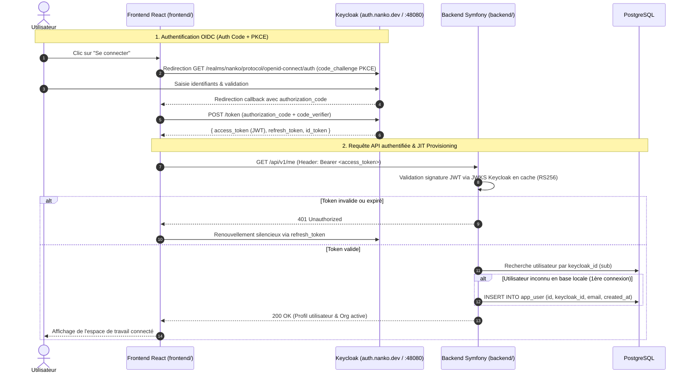
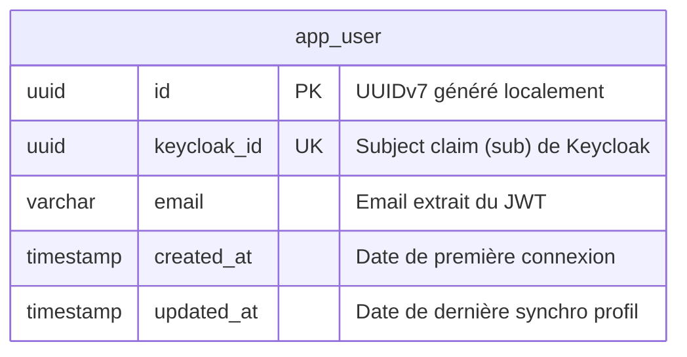

# Change : 001 - Intégration Keycloak pour l'Authentification et la Gestion des Utilisateurs

## Métadonnées
* **Domaine concerné :** `.specs/current/domains/auth-and-identity/`
* **Type de changement :** `Nouveau module` | `Refonte`
* **Cible :** `Fullstack` (Infra, Backend Symfony, Frontend React, Tests E2E)

---

## 1. Intention & Contexte (Le « Why » du Delta)
* **Problème résolu / Besoin :** Déléguer l'ensemble du cycle de vie des identités, du stockage sécurisé des mots de passe, du MFA et des flux de connexion à un Identity Provider (IdP) OIDC dédié et standardisé (Keycloak), plutôt que de développer et maintenir un serveur OAuth/identités maison dans Symfony.
* **Impact utilisateur :** Expérience de connexion fluide et sécurisée via la mire Keycloak standard (avec support futur de 2FA, social login Google/GitHub, réinitialisation de mot de passe autonome). L'application React redirige vers Keycloak et récupère la session sans manipulation directe de mot de passe par le code client.
* **In Scope (Ce qui est ajouté/modifié) :**
  * Conteneur Docker Keycloak (Quarkus) dans `infra/local/compose.yaml` (port `48080`, realm `nanko`, client public `nanko-web` avec PKCE).
  * Frontend React : Intégration OIDC via `keycloak-js` (Authorization Code Flow + PKCE), persistance de session en mémoire, injection du header `Authorization: Bearer <token>`, gestion du refresh automatique.
  * Backend Symfony : Configuration en tant que **Resource Server** OIDC vérifiant la signature RS256 des Access Tokens JWT via le JWKS de Keycloak mis en cache.
  * Provisioning Just-In-Time (JIT) : Création automatique d'une entité utilisateur locale minimale (`app_user` avec `keycloak_id`, `email`) lors de sa première requête authentifiée.
  * Endpoint `GET /api/v1/me` renvoyant le profil de l'utilisateur courant et ses contextes.
* **Out of Scope (Exclusions strictes) :**
  * Formulaire de saisie de mot de passe direct dans React (exclu par OAuth 2.1).
  * Synchronisation complexe par webhooks ou SPI Java custom côté Keycloak.
  * Gestion des rôles RBAC fins dans Keycloak (gérés côté Nanko via les `Capability` applicatives).

---

## 2. Flux & Architecture (Diff)



---

## 3. Delta Modèle de données & Base de données

### 3.1. Diagramme Entité-Relation (ERD)



### 3.2. Modifications de tables

#### Table : `app_user` (`Création`)
* **Bounded Context :** `backend/src/AuthAndIdentity/`
* **Entité Core :** `backend/src/AuthAndIdentity/Core/Domain/User/User.php`
* **Value Object Id :** `backend/src/AuthAndIdentity/Core/Domain/User/Id.php` (UUIDv7)
* **Port Repository :** `backend/src/AuthAndIdentity/Core/Port/User/Repository.php`
* **UseCase JIT :** `backend/src/AuthAndIdentity/Core/UseCase/User/SynchronizeUser/{Command,Handler}.php`
* **Adapter Persistence :** `backend/src/AuthAndIdentity/Adapter/Driven/Persistence/User/DoctrineRepository.php`
* **Adapter Driver Controller :** `backend/src/AuthAndIdentity/Adapter/Driver/Http/Controller/User/Me.php`
* **Adapter Driver Security :** `backend/src/AuthAndIdentity/Adapter/Driver/Http/Security/JwtKeycloakAuthenticator.php`

| Action | Champ | Type SQL / DBAL | Nullable | Contraintes & Index | Description métier |
|---|---|---|---|---|---|
| `Ajout` | `id` | `uuid` (v7) | Non | `PRIMARY KEY` | Identifiant interne Nanko. |
| `Ajout` | `keycloak_id` | `uuid` | Non | `UNIQUE INDEX uniq_user_keycloak_id` | Identifiant `sub` unique émis par Keycloak. |
| `Ajout` | `email` | `varchar(180)` | Non | `INDEX idx_user_email` | Adresse email synchronisée depuis le JWT. |
| `Ajout` | `created_at` | `timestamptz` | Non | `DEFAULT NOW()` | Date du premier JIT provisioning. |
| `Ajout` | `updated_at` | `timestamptz` | Non | `DEFAULT NOW()` | Date de dernière mise à jour. |

### 3.3. Règles de migration & Intégrité
* **Fichier de migration :** `backend/migrations/Version20260905000001.php`.
* **Rétrocompatibilité :** Création de la table `app_user`. Pas de mot de passe stocké en local (sécurité maximale).

---

## 4. Delta Contrats d'API (Symfony)

### Authentification & Sécurité (Adapter Driver)
* **Classe :** `backend/src/AuthAndIdentity/Adapter/Driver/Http/Security/JwtKeycloakAuthenticator.php`
* **Moyen d'authentification :** Authenticator Symfony personnalisé interceptant le header `Authorization: Bearer <token>`.
* **Validation cryptographique :** Validation RS256 contre les clés publiques JWKS de Keycloak (`http://keycloak:8080/realms/nanko/protocol/openid-connect/certs`).
* **Mise en cache JWKS :** Cache Symfony (ex: 24h) avec invalidation automatique si un `kid` inconnu est rencontré.

### Endpoint : `GET /api/v1/me` (`Nouveau`)
* **Contrôleur :** `backend/src/AuthAndIdentity/Adapter/Driver/Http/Controller/User/Me.php`
* **Authentification requise :** `ROLE_USER` (Jeton Bearer Keycloak valide)
* **Headers :** `Authorization: Bearer <access_token>`

#### Response `200 OK`
```json
{
  "id": "0191c280-496a-7312-bf91-a1b2c3d4e5f6",
  "keycloakId": "3fa85f64-5717-4562-b3fc-2c963f66afa6",
  "email": "user@nanko.dev",
  "createdAt": "2026-09-05T08:00:00Z"
}
```

#### Response `401 Unauthorized`
```json
{
  "code": "UNAUTHORIZED",
  "message": "Token JWT manquant, invalide ou expiré."
}
```

---

## 5. Delta Maquettes & Layout UI

### 5.1. Wireframes conceptuels (ASCII Layout)

#### Vue Navigation - État Déconnecté
```text
+-----------------------------------------------------------------------+
| [NANKO Logo]                                      [ Se connecter ]    |
+-----------------------------------------------------------------------+
|                                                                       |
|   Bienvenue sur Nanko. Concevez vos schémas d'architecture.           |
|                                                                       |
+-----------------------------------------------------------------------+
```

#### Vue Navigation - État Connecté
```text
+-----------------------------------------------------------------------+
| [NANKO Logo]   Projets   Organisations        [ Avatar : user@... v ] |
+-----------------------------------------------------------------------+
|                                               | Mon Profil          | |
|   Tableau de bord des architectures           | Déconnexion         | |
|                                               +---------------------+ |
+-----------------------------------------------------------------------+
```

### 5.2. Structure des Composants Frontend

```text
frontend/src/
├── auth/
│   ├── KeycloakProvider.tsx    # Initialisation de keycloak-js et Context React
│   ├── useAuth.ts              # Hook custom pour accéder au token, user et login/logout
│   ├── ProtectedRoute.tsx      # Garde de routage redirigeant vers Keycloak si non authentifié
│   └── httpClient.ts           # Instance fetch/axios injectant le Bearer token et gérant le refresh
└── components/
    └── UserMenu.tsx            # Menu utilisateur affichant l'email et bouton déconnexion
```

---

## 6. Delta Spécifications UI & Logique Client (React)

### Matrice des états d'authentification

| État | Déclencheur | Rendu visuel & Comportement |
|---|---|---|
| **Initializing** | Chargement de la page | Spinner discret de démarrage pendant l'init silencieuse de Keycloak (`check-sso`). |
| **Unauthenticated** | Aucun token actif / Visiteur | Bouton « Se connecter » visible dans le header. Les routes protégées déclenchent `keycloak.login()`. |
| **Authenticating** | Retour de redirection Keycloak | Traitement du code d'autorisation, échange de jeton, feedback de chargement. |
| **Authenticated** | Token valide chargé | Affichage de l'avatar/email, accès complet aux routes applicatives. |
| **Token Expired** | Expiration du token d'accès | Appel silencieux à `keycloak.updateToken()`. Si le refresh token est expiré, redirection vers `login()`. |

---

## 7. Invariants & Cas limites (*Edge cases*)
1. **Topologie Bounded Context & Isolation :** Le backend adopte une topologie de Monolithe Modulaire où chaque domaine DDD réside sous `backend/src/<BoundedContext>/` avec son propre hexagone (`Core/` et `Adapter/`). Pour ce delta, tout le code réside sous `backend/src/AuthAndIdentity/`.
2. **Séparation Stricte Authentification vs Autorisation :** `AuthAndIdentity` est uniquement responsable de valider l'identité et d'émettre un `UserId` (UUIDv7) garanti. Il n'a aucune connaissance des Organisations, Projets, ou `Capability`. La vérification des droits d'accès aux ressources du workspace incombe exclusivement à `WorkspaceManagement` (via ses propres Voters/UseCases se basant sur le `UserId`).
3. **Résilience API si Keycloak est indisponible :** Le backend valide les jetons localement via sa copie en cache du JWKS. Si le token est valide et que l'utilisateur existe déjà en base, l'API répond normalement sans dépendance réseau synchrone à Keycloak.
4. **Rotation des clés de signature (Key rollover) :** Si Keycloak effectue une rotation de ses clés de signature, le backend rafraîchit son cache JWKS dès réception d'un token portant un nouvel identifiant de clé (`kid`).
5. **Idempotence du JIT Provisioning :** La recherche par `keycloak_id` et l'insertion en base gèrent les conflits de concurrence (`ON CONFLICT DO NOTHING` ou `find_or_create`) pour éviter tout doublon lors de requêtes simultanées au premier login.
6. **Logout global :** La déconnexion dans React appelle `keycloak.logout()`, invalidant la session sur Keycloak et redirigeant vers la page d'accueil.

---

## 8. Plan d'exécution séquentiel

- [ ] **Phase 1 : Infrastructure Docker (`infra/local/`)**
  - [ ] 1. Ajouter le service `keycloak` dans `infra/local/compose.yaml` (image `quay.io/keycloak/keycloak:26.1` ou `25.x`, ports `48080:8080`).
  - [ ] 2. Configurer un realm d'export/import initial `nanko` (client `nanko-web` public avec PKCE et redirect URIs configurées).
  - [ ] 3. Valider le démarrage du conteneur Keycloak avec `make dev` ou `docker compose up -d keycloak`.

- [ ] **Phase 2 : Backend Symfony (`backend/src/AuthAndIdentity/`)**
  - [ ] 1. Architecture : Mettre en place l'arborescence du Bounded Context sous `backend/src/AuthAndIdentity/` (`Core/Domain/`, `Core/Port/`, `Core/UseCase/`, `Adapter/Driven/`, `Adapter/Driver/`).
  - [ ] 2. Modèle & DB : Migration de création de la table `app_user` (id UUIDv7, keycloak_id, email) et type DBAL custom `backend/src/AuthAndIdentity/Adapter/Driven/Persistence/User/DoctrineId.php`.
  - [ ] 3. Core Domain : Entité `User`, value objects (`Id`, `KeycloakId`).
  - [ ] 4. Core Port : Interface `backend/src/AuthAndIdentity/Core/Port/User/Repository.php`.
  - [ ] 5. Core UseCase : `backend/src/AuthAndIdentity/Core/UseCase/User/SynchronizeUser/{Command,Handler}.php` pour orchestrer le JIT provisioning.
  - [ ] 6. Adapter Persistence : `backend/src/AuthAndIdentity/Adapter/Driven/Persistence/User/DoctrineRepository.php` (requêtes DBAL explicites et hydratation).
  - [ ] 7. Adapter Driver Security : `backend/src/AuthAndIdentity/Adapter/Driver/Http/Security/JwtKeycloakAuthenticator.php` (validation JWT via JWKS).
  - [ ] 8. Adapter Driver Controller : `backend/src/AuthAndIdentity/Adapter/Driver/Http/Controller/User/Me.php` (`GET /api/v1/me`).
  - [ ] 9. Tooling & Deptrac : Mettre à jour `backend/deptrac.php` pour supporter les jokers `src/*/Core/...` et `src/*/Adapter/...`.
  - [ ] **Tests & Gates :**
    - `make deptrac` (respect des couches hexagonales dans chaque bounded context).
    - `make test-backend` (tests unitaires dans `backend/tests/Unit/AuthAndIdentity/` et d'intégration dans `backend/tests/Integration/AuthAndIdentity/`).
    - `make static-analysis` (PHPStan sans erreur).
    - `make lint` (PHP-CS-Fixer).

- [ ] **Phase 3 : Frontend React (`frontend/`)**
  - [ ] 1. Dépendances : Installer `keycloak-js`.
  - [ ] 2. Provider : Mettre en place `KeycloakProvider` avec configuration (URL `:48080`, realm `nanko`, client `nanko-web`).
  - [ ] 3. Intercepteur HTTP : Injecter le token dans les requêtes vers `VITE_API_BASE_URL` et gérer le refresh.
  - [ ] 4. Composants : Intégrer les boutons Login/Logout et le composant `UserMenu`.
  - [ ] **Tests & Gates :**
    - `pnpm --filter frontend typecheck`.
    - `pnpm --filter frontend lint`.

- [ ] **Phase 4 : End-to-End Playwright (`tests-e2e/`)**
  - [ ] 1. Scénario de test E2E de connexion via la mire Keycloak et vérification du profil sur Nanko.

- [ ] **Phase 5 : Synchronisation documentaire (via `/sync-current 001`)**
  - [ ] 1. Mettre à jour `.specs/current/domains/auth-and-identity/behavior.md`.
  - [ ] 2. Mettre à jour `.specs/current/domains/auth-and-identity/tech.md`.
  - [ ] 3. Mettre à jour `.specs/current/domains/auth-and-identity/contracts.md`.
  - [ ] 4. Mettre à jour `.specs/current/domains/auth-and-identity/models.md`.
  - [ ] 5. Déplacer ce fichier dans `.specs/changes/archive/001-keycloak-auth.md`.

---

## 9. Definition of Done & Stratégie de tests

### 9.1. Scénarios de validation (Format Gherkin avec tags)

```gherkin
# ==============================================================================
# TESTS E2E (tests-e2e/)
# ==============================================================================

@e2e
Fonctionnalité: Authentification avec Keycloak

  Scénario: Connexion utilisateur réussie via Keycloak
    Étant donné un utilisateur non connecté sur le frontend Nanko
    Quand il clique sur "Se connecter"
    Alors il est redirigé vers la mire de connexion Keycloak
    Quand il saisit des identifiants valides et valide
    Alors il est redirigé vers l'application Nanko
    Et son adresse email s'affiche dans la barre de navigation

# ==============================================================================
# TESTS BACKEND (backend/)
# ==============================================================================

@api @integration
Fonctionnalité: Validation du token JWT et JIT Provisioning

  Scénario: Premier appel avec un JWT valide émis par Keycloak
    Quand l'API reçoit "GET /api/v1/me" avec un Bearer token signé valide (sub="uuid-1", email="user@nanko.dev")
    Alors le code de réponse HTTP est 200
    Et le corps contient le profil utilisateur avec son ID local
    Et un enregistrement correspondant existe dans la table "app_user"

  @api @integration
  Scénario: Rejet d'une requête sans token ou avec token expiré
    Quand l'API reçoit "GET /api/v1/me" sans header d'autorisation
    Alors le code de réponse HTTP est 401
    Et le payload contient le code d'erreur "UNAUTHORIZED"

  @api @unit
  Scénario: Validation des claims du token JWT
    Quand un token JWT ne possède pas de claim "sub"
    Alors le validateur de token rejette l'authentification
```

### 9.2. Commandes de validation automatisée

```bash
# 1. Architecture & Backend (backend/)
make deptrac
make test-backend
make static-analysis
make lint

# 2. Frontend (frontend/)
pnpm --filter frontend typecheck
pnpm --filter frontend lint

# 3. E2E
pnpm --filter tests-e2e exec playwright test
```
