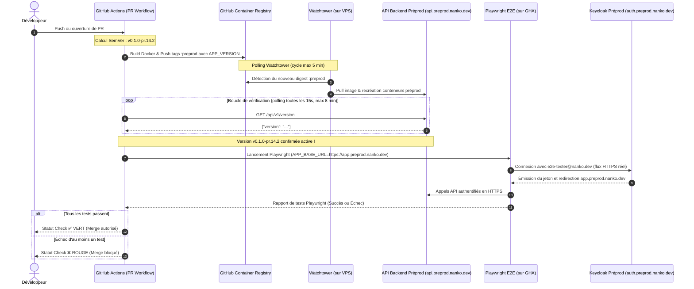

# Change : 002 - Validation E2E Préproduction sur PR avec Versionnement SemVer

## Métadonnées
* **Domaine concerné :** `.specs/current/domains/platform/`
* **Type de changement :** `Évolution`
* **Cible :** `Fullstack` (CI/CD GitHub Actions, Backend Symfony, Tests E2E Playwright, Infra)

---

## 1. Intention & Contexte (Le « Why » du Delta)
* **Problème résolu / Besoin :** Les tests E2E exécutés localement ne garantissent pas que l'application fonctionne dans les conditions réelles de production (noms de domaine réels, certificats TLS Let's Encrypt, routage sous-domaines `caddy-docker-proxy`, cookies de session en HTTPS cross-subdomain, flux de redirection OAuth2 Keycloak réels). Actuellement, la préproduction est mise à jour automatiquement après le merge sur `main` sans validation préalable des E2E en conditions réelles, ce qui peut laisser passer des régressions d'infrastructure ou de configuration jusqu'à la prod.
* **Impact développeur / Qualité :** Tout commit ou pull request déclenche un déploiement automatique sur l'environnement de préproduction (`*.preprod.nanko.dev`), attend la confirmation que la version exacte est servie par le VPS, puis exécute la suite de tests Playwright contre l'infrastructure réelle. Le merge de la PR est bloqué si les tests E2E échouent (*Required Status Check*).
* **In Scope (Ce qui est ajouté/modifié) :**
  * **Calcul SemVer dynamique :**
    * Calcul d'une version SemVer valide basée sur les Git Tags récents (`git describe --tags --always`).
    * Format PR : `<base-tag>-pr.<pr_number>.<run_number>` (ex. `v0.1.0-pr.14.2`).
    * Format Main : `<base-tag>-rc.<run_number>` (ex. `v0.1.0-rc.35`).
    * Injection de `APP_VERSION` au build Docker et transmission à l'environnement d'exécution du backend Symfony.
  * **Endpoint Backend de Diagnostic & Version :**
    * Nouveau contrôleur Symfony `GET /api/v1/version` renvoyant la version SemVer courante, le commit SHA et l'environnement actif.
    * Accès public non authentifié (`PUBLIC_ACCESS`).
  * **Chaîne CI/CD sur Pull Request (`.github/workflows/pr-preprod-e2e.yml`) :**
    * Déclenchement sur `pull_request` (open, synchronize, reopen).
    * Sérialisation stricte des déploiements préprod via `concurrency` (évite les conflits entre PRs simultanées).
    * Build et publication des images Docker (`:preprod` et `:preprod-<sha>`) sur GHCR avec injection de la version SemVer.
    * Boucle d'attente active (*polling HTTP*) interrogeant `https://api.preprod.nanko.dev/api/v1/version` jusqu'à ce que le VPS serve la version SemVer exacte (délai d'attente compatible avec le cycle de polling 5 min de Watchtower, timeout à 8 minutes).
    * Exécution de la suite Playwright ciblant `https://app.preprod.nanko.dev` avec le compte de test dédié (`e2e-tester@nanko.dev`).
    * Statut de commit GitHub bloquant le merge en cas d'échec.
* **Out of Scope (Exclusions strictes) :**
  * Modification du daemon Watchtower sur le VPS (on conserve le polling toutes les 5 minutes sans introduire de clés SSH ou de webhook dans la CI, respect strict de l'ADR-0010).
  * Création dynamique d'environnements éphémères par sous-domaine de PR (Review Apps) : un seul environnement de préproduction partagé sérialisé par `concurrency`.
  * Modification du modèle de données ou des entités métier.

---

## 2. Flux & Architecture (Diff)



---

## 3. Delta Modèle de données & Base de données

* **Aucune modification de base de données.**
* La variable d'environnement `APP_VERSION` est injectée dans le conteneur backend via `ENV APP_VERSION=...` lors du build Docker et accessible au runtime via `$_SERVER['APP_VERSION']` / paramètre Symfony `kernel.app_version`.

---

## 4. Delta Contrats d'API (Symfony)

### Endpoint : `GET /api/v1/version` (`Nouveau`)
* **Authentification requise :** `PUBLIC_ACCESS`
* **Headers de requête :** `Accept: application/json`

#### Response
* `200 OK` :
  ```json
  {
    "status": "ok",
    "version": "v0.1.0-pr.14.2",
    "commit": "a1b2c3d4e5f67890",
    "environment": "preprod"
  }
  ```

#### Implémentation Backend
* Contrôleur invokable : `backend/src/Adapter/Driver/Http/Controller/System/VersionController.php`.
* Route : `#[Route('/api/v1/version', name: 'api_version', methods: ['GET'])]`.
* Lecture du paramètre Symfony `%app.version%` (configuré dans `config/services.yaml` via `%env(default::APP_VERSION)%`).

---

## 5. Delta Maquettes & Layout UI
* Pas de modification visuelle majeure requise.
* Optionnel : La version peut être lue côté client ou affichée en console/tooltip pour le debug en préprod.

---

## 6. Delta Spécifications UI & Logique Client
* Aucune modification des formulaires ni des flux React client.
* Les tests E2E existants ([tests-e2e/tests/app/auth.spec.ts](file:///Users/ngdo/dev/nanko/tests-e2e/tests/app/auth.spec.ts)) sont exécutés sans altération contre l'URL `https://app.preprod.nanko.dev`.

---

## 7. Invariants & Cas limites (*Edge cases*)

1. **Sérialisation des PRs (Concurrence) :**
   * Pour éviter que la PR #2 n'écrase l'environnement de préprod pendant que la PR #1 exécute ses tests Playwright, le workflow définit :
     ```yaml
     concurrency:
       group: preprod-shared-env
       cancel-in-progress: false
     ```
   * Les runs de PR sont ainsi mis en file d'attente séquentielle.
2. **Timeout de Watchtower :**
   * Watchtower ayant un intervalle de scrutation de 5 minutes, le redéploiement prend entre 1 et 5 minutes selon le moment du push.
   * La boucle d'attente de la CI est configurée avec un timeout de **8 minutes** et un intervalle de test de 15 secondes. Si le timeout expire, le job échoue avec un log explicite : `« Timeout: Preprod environment did not update to version $EXPECTED_VERSION within 8 minutes »`.
3. **Persistance de l'utilisateur de test :**
   * Le compte `e2e-tester@nanko.dev` est pré-provisionné dans le Keycloak de préprod.
   * Ses identifiants sont stockés dans les secrets GitHub du repository : `E2E_USERNAME` et `E2E_PASSWORD`.
4. **Conservation de l'ADR-0010 :**
   * Aucun secret SSH ni accès direct au serveur n'est confié à GitHub Actions.

---

## 8. Plan d'exécution séquentiel

- [ ] **Phase 1 : Backend Symfony (`backend/`)**
  - [ ] 1. Configurer le paramètre `app.version` dans `config/services.yaml` avec fallback par défaut (`v0.0.0-dev`).
  - [ ] 2. Créer le contrôleur `VersionController` dans `backend/src/Adapter/Driver/Http/Controller/System/VersionController.php`.
  - [ ] 3. Mettre à jour `backend/Dockerfile` pour accepter l'argument de build `ARG APP_VERSION` et l'exporter en `ENV APP_VERSION`.
  - [ ] 4. Écrire le test d'intégration PHPUnit vérifiant la réponse de `GET /api/v1/version`.
- [ ] **Phase 2 : Workflow GitHub Actions (`.github/workflows/`)**
  - [ ] 1. Créer le workflow `.github/workflows/pr-preprod-e2e.yml` déclenché sur `pull_request`.
  - [ ] 2. Ajouter l'étape de calcul SemVer dynamique à partir du dernier tag Git (`git describe --tags`).
  - [ ] 3. Mettre à jour les étapes `docker/build-push-action` pour injecter `APP_VERSION`.
  - [ ] 4. Ajouter le script de boucle d'attente HTTP vers `https://api.preprod.nanko.dev/api/v1/version`.
  - [ ] 5. Ajouter l'étape d'exécution Playwright pointant sur `https://app.preprod.nanko.dev`.
- [ ] **Phase 3 : Validation & Tests**
  - [ ] 1. Tester localement le contrôleur `/api/v1/version`.
  - [ ] 2. Valider la construction de l'image Docker avec l'argument `APP_VERSION`.
  - [ ] 3. Valider la syntaxe du workflow GitHub Actions via linter/check.

---

## 9. Critères d'acceptation & Scénarios de test (Gherkin BDD)

```gherkin
Fonctionnalité: Déploiement en préproduction et validation E2E sur Pull Request

  Scénario: Exposition de la version SemVer par l'API backend
    Quand j'envoie une requête GET sur "/api/v1/version"
    Alors le code de statut de réponse doit être 200
    Et le corps de la réponse doit contenir les champs "version", "commit" et "environment"
    Et la valeur de "version" doit respecter le format SemVer

  Scénario: Validation E2E réussie autorisant le merge d'une PR
    Étant donné une Pull Request ouverte numéro 42 avec le commit "abc1234"
    Et un tag de base "v0.1.0"
    Quand le workflow CI génère la version "v0.1.0-pr.42.1"
    Et que l'image Docker est poussée sur GHCR
    Et que la préproduction répond avec la version "v0.1.0-pr.42.1" sous 5 minutes
    Et que tous les tests Playwright s'exécutent avec succès sur "https://app.preprod.nanko.dev"
    Alors le statut du check GitHub passe au vert
    Et le merge de la PR est autorisé

  Scénario: Échec des tests E2E bloquant le merge d'une PR
    Étant donné une Pull Request avec un bug d'authentification ou d'interface
    Quand l'image est déployée en préproduction
    Et que le test Playwright échoue lors de la connexion sur "https://app.preprod.nanko.dev"
    Alors le statut du check GitHub passe au rouge avec le rapport Playwright en artefact
    Et le merge de la PR est bloqué
```
