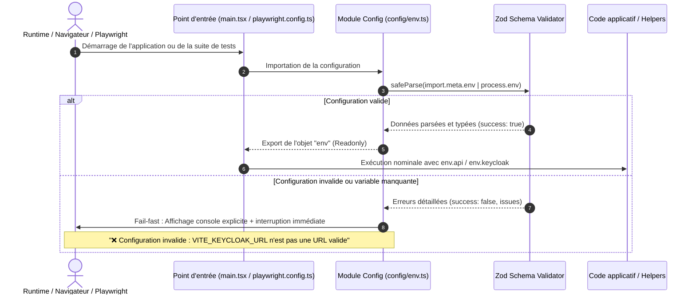

# Change : 003 - Centralisation et Validation Zod des Variables d'Environnement

## Métadonnées
* **Domaine concerné :** `.specs/current/domains/platform/`
* **Type de changement :** `Refonte` / `Évolution technique`
* **Cible :** `frontend` & `tests-e2e`

---

## 1. Intention & Contexte (Le « Why » du Delta)

* **Problème résolu / Besoin :**
  Actuellement, l'accès aux variables d'environnement est dispersé directement dans le code applicatif :
  - `import.meta.env` dans `frontend/src/auth/httpClient.ts` et `frontend/src/auth/keycloak.ts`.
  - `process.env` dans `tests-e2e/playwright.config.ts` et `tests-e2e/tests/helpers/keycloak.ts`.
  Cette dispersion entraîne une absence de validation runtime (*fail-fast*), un typage lâche (`string | undefined`), la duplication des valeurs par défaut et un risque d'erreurs silencieuses ou tardives en production/préproduction.

* **Impact développeur & fiabilité :**
  - **Fail-fast immédiat :** Si une variable obligatoire est manquante ou mal formée (ex. format d'URL incorrect), l'application ou la suite de tests s'interrompt immédiatement au chargement avec un message d'erreur d'une clarté absolue.
  - **Typage strict garanti :** Tout le code consomme un objet de configuration figé, typé et validé (`env.api.baseUrl`, `env.keycloak.url`), sans jamais manipuler `process.env` ou `import.meta.env` directement.
  - **Source unique de vérité :** Un seul fichier par package documente et centralise toutes les clés d'environnement requises.

* **In Scope (Ce qui est ajouté/modifié) :**
  - **Frontend (`frontend/`) :**
    - Ajout de la dépendance `zod` dans `frontend/package.json`.
    - Création du module centralisé `frontend/src/config/env.ts` avec parsing strict via un schéma Zod (`VITE_API_BASE_URL`, `VITE_KEYCLOAK_URL`, `VITE_KEYCLOAK_REALM`, `VITE_KEYCLOAK_CLIENT_ID`).
    - Écran de secours (*Config Error Screen*) en cas d'erreur critique de schéma au démarrage du frontend pour faciliter le diagnostic local et en déploiement.
    - Remplacement de tous les appels directs à `import.meta.env` dans `frontend/src/auth/httpClient.ts` et `frontend/src/auth/keycloak.ts`.
  - **Tests E2E (`tests-e2e/`) :**
    - Ajout de la dépendance `zod` dans `tests-e2e/package.json`.
    - Création du module centralisé `tests-e2e/config/env.ts` avec schéma Zod (`APP_BASE_URL`, `LIBRARY_BASE_URL`, `KEYCLOAK_URL`, `KEYCLOAK_ADMIN_USER`, `KEYCLOAK_ADMIN_PASSWORD`, `E2E_USERNAME`, `E2E_PASSWORD`, `CI`).
    - Remplacement de tous les appels directs à `process.env` dans `tests-e2e/playwright.config.ts` et `tests-e2e/tests/helpers/keycloak.ts`.
  - **Gouvernance & Qualité :**
    - Règle de lint ou test de conformité interdisant tout nouvel usage direct de `process.env` ou `import.meta.env` en dehors des modules `config/env.ts`.

* **Out of Scope (Exclusions strictes) :**
  - Backend Symfony (déjà géré selon les standards Symfony via le conteneur de dépendances et `%env(...)%` dans `services.yaml` sans accès direct à `$_ENV` dans les services métier).
  - Landing page et Library (pas de variables d'environnement à ce stade).
  - Modification des noms de variables d'environnement existantes (rétrocompatibilité totale avec les fichiers `.env`, Compose et GitHub Actions).

---

## 2. Flux & Architecture (Diff)



---

## 3. Delta Modèle de données & Base de données

* **Aucun impact base de données.**

---

## 4. Contrats d'Interface & Schémas Zod

### 4.1. Schéma de Configuration Frontend (`frontend/src/config/env.ts`)

```typescript
import { z } from 'zod'

const frontendEnvSchema = z.object({
  VITE_API_BASE_URL: z
    .string()
    .url('VITE_API_BASE_URL doit être une URL valide (ex: http://localhost:48000)')
    .default('http://localhost:48000'),
  VITE_KEYCLOAK_URL: z
    .string()
    .url('VITE_KEYCLOAK_URL doit être une URL valide (ex: http://localhost:48080)')
    .default('http://localhost:48080'),
  VITE_KEYCLOAK_REALM: z
    .string()
    .min(1, 'VITE_KEYCLOAK_REALM ne peut pas être vide')
    .default('nanko'),
  VITE_KEYCLOAK_CLIENT_ID: z
    .string()
    .min(1, 'VITE_KEYCLOAK_CLIENT_ID ne peut pas être vide')
    .default('nanko-web'),
})

// Validation sécurisée et export typé
const parsed = frontendEnvSchema.safeParse(import.meta.env)

if (!parsed.success) {
  console.error('❌ Erreur critique de configuration environnement :', parsed.error.format())
  throw new Error(`Configuration Frontend invalide : ${parsed.error.issues.map((i) => `${i.path.join('.')}: ${i.message}`).join(', ')}`)
}

export const env = Object.freeze({
  api: {
    baseUrl: parsed.data.VITE_API_BASE_URL,
  },
  keycloak: {
    url: parsed.data.VITE_KEYCLOAK_URL,
    realm: parsed.data.VITE_KEYCLOAK_REALM,
    clientId: parsed.data.VITE_KEYCLOAK_CLIENT_ID,
  },
})

export type AppEnv = typeof env
```

### 4.2. Schéma de Configuration Tests E2E (`tests-e2e/config/env.ts`)

```typescript
import { z } from 'zod'

const e2eEnvSchema = z.object({
  APP_BASE_URL: z
    .string()
    .url('APP_BASE_URL doit être une URL valide')
    .default('https://app.preprod.nanko.dev'),
  LIBRARY_BASE_URL: z
    .string()
    .url('LIBRARY_BASE_URL doit être une URL valide')
    .default('https://library.preprod.nanko.dev'),
  KEYCLOAK_URL: z
    .string()
    .url('KEYCLOAK_URL doit être une URL valide')
    .default('http://localhost:48080'),
  KEYCLOAK_ADMIN_USER: z.string().min(1).default('admin'),
  KEYCLOAK_ADMIN_PASSWORD: z.string().min(1).default('admin'),
  E2E_USERNAME: z.string().optional(),
  E2E_PASSWORD: z.string().optional(),
  CI: z
    .string()
    .optional()
    .transform((val) => val === 'true' || val === '1'),
})

const parsed = e2eEnvSchema.safeParse(process.env)

if (!parsed.success) {
  console.error('❌ Erreur critique de configuration E2E :', parsed.error.format())
  throw new Error(`Configuration E2E invalide : ${parsed.error.issues.map((i) => `${i.path.join('.')}: ${i.message}`).join(', ')}`)
}

export const env = Object.freeze({
  appBaseUrl: parsed.data.APP_BASE_URL,
  libraryBaseUrl: parsed.data.LIBRARY_BASE_URL,
  keycloak: {
    url: parsed.data.KEYCLOAK_URL,
    adminUser: parsed.data.KEYCLOAK_ADMIN_USER,
    adminPassword: parsed.data.KEYCLOAK_ADMIN_PASSWORD,
  },
  testUser: {
    username: parsed.data.E2E_USERNAME,
    password: parsed.data.E2E_PASSWORD,
  },
  isCi: parsed.data.CI,
})

export type E2EEnv = typeof env
```

---

## 5. Composants UI & Wireframes

En cas d'erreur de configuration sur le Frontend, un composant de secours minimaliste intercepte l'erreur avant le rendu des providers applicatifs.

### Wireframe ASCII (Écran d'erreur de boot configuration)

```text
+-------------------------------------------------------------+
|                                                             |
|   [!] Erreur de configuration de l'application              |
|                                                             |
|   Impossible de démarrer l'application : des variables      |
|   d'environnement requises sont absentes ou mal formées.    |
|                                                             |
|   Détails techniques :                                      |
|   +-------------------------------------------------------+ |
|   | • VITE_KEYCLOAK_URL: Doit être une URL valide        | |
|   +-------------------------------------------------------+ |
|                                                             |
|   Veuillez vérifier votre fichier .env ou la configuration  |
|   du serveur.                                               |
|                                                             |
+-------------------------------------------------------------+
```

---

## 6. Invariants & Cas Limites (*Edge cases*)

1. **Substitution statique par Vite :**
   - Vite remplace `import.meta.env.VITE_*` de manière statique au moment du build.
   - Par conséquent, le schéma Zod Frontend doit lire explicitement les clés `import.meta.env` (sans destructuration dynamique arbitraire `process.env[key]`) pour assurer la compatibilité totale avec le bundler Rollup/Vite.
2. **Booléens en variables d'environnement (ex: `CI`) :**
   - Les variables injectées par GitHub Actions sont des chaînes (`"true"` ou `"1"`).
   - Le schéma Zod E2E utilise un `.transform()` pour garantir un type `boolean` strict.
3. **Immutabilité de la configuration :**
   - L'export de l'objet `env` est verrouillé via `Object.freeze()` pour interdire toute mutation accidentelle en cours d'exécution.
4. **Valeurs par défaut pour le développement local :**
   - Toutes les variables critiques possèdent des valeurs par défaut calquées sur l'environnement local Docker (`http://localhost:48000`, `http://localhost:48080`), assurant un démarrage *zero-config* pour les nouveaux développeurs.

---

## 7. Plan d'exécution séquentiel

- [ ] **Phase 1 : Frontend (`frontend/`)**
  - [ ] 1. Installer `zod` en dépendance dans `frontend/package.json` (`pnpm --filter frontend add zod`).
  - [ ] 2. Créer `frontend/src/config/env.ts` avec le schéma Zod, le parsing fail-fast et l'export typé.
  - [ ] 3. Refactorer `frontend/src/auth/httpClient.ts` pour importer `env` au lieu de `import.meta.env.VITE_API_BASE_URL`.
  - [ ] 4. Refactorer `frontend/src/auth/keycloak.ts` pour importer `env` au lieu de `import.meta.env.VITE_KEYCLOAK_*`.
  - [ ] 5. Vérifier le typage et le linting frontend (`pnpm --filter frontend typecheck` et `pnpm --filter frontend lint`).

- [ ] **Phase 2 : Tests E2E (`tests-e2e/`)**
  - [ ] 1. Installer `zod` en devDépendance dans `tests-e2e/package.json` (`pnpm --filter tests-e2e add -D zod`).
  - [ ] 2. Créer `tests-e2e/config/env.ts` avec le schéma Zod, la conversion des types et l'export typé.
  - [ ] 3. Refactorer `tests-e2e/playwright.config.ts` pour consommer `env.appBaseUrl`, `env.libraryBaseUrl`, `env.isCi`.
  - [ ] 4. Refactorer `tests-e2e/tests/helpers/keycloak.ts` pour consommer `env.keycloak` et `env.testUser`.
  - [ ] 5. Vérifier la validité des tests E2E Playwright (`pnpm --filter tests-e2e exec playwright test --list`).

- [ ] **Phase 3 : Quality Gates & Contrôle de non-régression**
  - [ ] 1. Vérifier par une recherche globale (`grep`) qu'il ne subsiste aucun appel direct à `import.meta.env` ou `process.env` dans `frontend/src/` et `tests-e2e/tests/` (hors fichiers `config/env.ts`).
  - [ ] 2. Valider le build de production frontend (`pnpm --filter frontend build`).

---

## 8. Spécifications Exécutables (Scénarios de Test)

### Scénario 1 : Initialisation nominale du frontend avec valeurs par défaut
* **Given** aucune variable d'environnement personnalisée n'est fournie en local
* **When** le module `frontend/src/config/env.ts` est évalué
* **Then** `env.api.baseUrl` vaut `'http://localhost:48000'`
* **And** `env.keycloak.url` vaut `'http://localhost:48080'`
* **And** `env.keycloak.realm` vaut `'nanko'`
* **And** l'application démarre sans erreur

### Scénario 2 : Interruption immédiate (*Fail-Fast*) sur variable frontend invalide
* **Given** `VITE_API_BASE_URL` est renseigné avec une chaîne invalide (`"pas-une-url"`)
* **When** l'application frontend tente de charger le module de configuration
* **Then** le validateur Zod lève une exception explicite
* **And** un message d'erreur clair mentionnant `VITE_API_BASE_URL` apparaît dans la console

### Scénario 3 : Initialisation nominale des tests E2E avec détection CI
* **Given** la variable d'environnement `CI="true"` est présente dans le processus Node
* **When** le module `tests-e2e/config/env.ts` est évalué
* **Then** `env.isCi` vaut le booléen `true`
* **And** `env.appBaseUrl` pointe par défaut sur `'https://app.preprod.nanko.dev'`

### Scénario 4 : Vérification d'absence d'accès direct sauvage
* **Given** la base de code après refactorisation
* **When** une analyse statique recherche `process.env` dans `tests-e2e/tests/` ou `import.meta.env` dans `frontend/src/`
* **Then** les seules occurrences autorisées se situent exclusivement dans `frontend/src/config/env.ts` et `tests-e2e/config/env.ts`
