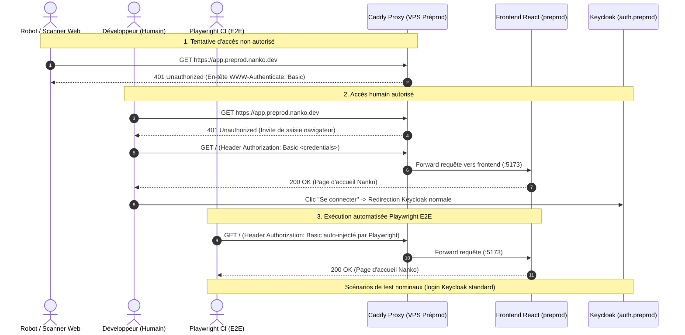

# Change : 005 - Sécurisation de l'environnement de Préproduction par Caddy HTTP Basic Auth

## Métadonnées
* **Domaine concerné :** `.specs/current/domains/platform/`
* **Type de changement :** `Évolution` / `Sécurité`
* **Cible :** `Fullstack` (`infra`, `tests-e2e`)

---

## 1. Intention & Contexte (Le « Why » du Delta)
* **Problème résolu / Besoin :** L'environnement de préproduction (`*.preprod.nanko.dev`) est actuellement accessible publiquement sur Internet. Les moteurs de recherche, robots d'indexation, scanners de vulnérabilités et curieux peuvent librement explorer l'interface de staging. Il est nécessaire d'ériger un sas de sécurité étanche (HTTP Basic Auth au niveau du Reverse Proxy Caddy) tout en garantissant que :
  1. Les développeurs et testeurs humains peuvent y accéder simplement via leur navigateur en saisissant leurs identifiants une seule fois.
  2. Les suites de tests automatisés E2E Playwright exécutées en CI passent ce sas de manière 100% transparente sans dénaturer le parcours utilisateur testé (notamment le flux d'authentification Keycloak).
* **Impact utilisateur :** 
  - **Public / Robots :** Reçoivent une réponse HTTP `401 Unauthorized` immédiate sans accès aux ressources ni au code frontend/backend.
  - **Développeurs / QA :** Une invite d'authentification native du navigateur s'affiche à la première visite. Une fois validée, la navigation est fluide et standard.
  - **Tests E2E CI :** Aucune modification des scénarios applicatifs existants ; les identifiants HTTP Basic Auth sont injectés nativement par Playwright.
* **In Scope (Ce qui est ajouté/modifié) :**
  - Configuration de `caddy.basic_auth` via labels Docker sur le conteneur `frontend` dans `infra/preprod/compose.yaml`.
  - Configuration de `caddy.basic_auth` sur le conteneur `backend` (`api.preprod.nanko.dev`) dans `infra/preprod/compose.yaml`.
  - Extension du schéma de variables d'environnement E2E (`tests-e2e/config/env.ts`) pour intégrer optionnellement `PREPROD_HTTP_USER` et `PREPROD_HTTP_PASSWORD`.
  - Mise à jour de la configuration Playwright (`playwright.config.ts`) pour activer `httpCredentials` dès que ces variables sont présentes.
  - Mise à jour du workflow CI (`.github/workflows/e2e.yml` ou workflow PR) pour transmettre ces secrets lors de l'exécution contre la préproduction.
* **Out of Scope (Exclusions strictes) :**
  - Pas d'authentification Basic Auth en local (`infra/local/`).
  - Pas d'authentification Basic Auth sur l'environnement de production (`infra/prod/` - l'application de prod est publique pour les utilisateurs).
  - Pas de modification de l'authentification applicative Keycloak (les tokens OIDC, sessions Keycloak et vérifications JWT restent inchangés).

---

## 2. Flux & Architecture (Diff)



---

## 3. Delta Modèle de données & Base de données
* **Aucune modification :** Ce changement relève exclusivement de l'infrastructure réseau (Caddy), des variables d'environnement et de la configuration des tests E2E. Aucune table ni migration n'est requise.

---

## 4. Delta Contrats d'API & Protocoles

### 4.1. Protocole HTTP Basic Auth (RFC 7617)
* **En-tête de challenge :** `WWW-Authenticate: Basic realm="Nanko Preproduction"`
* **En-tête de requête attendu :** `Authorization: Basic <base64(user:password)>`
* **Comportement en cas d'absence d'en-tête :**
  - **Code retour :** `401 Unauthorized`
  - **Body :** Page d'erreur textuelle / HTML Caddy par défaut.
* **Comportement en cas de succès :**
  - **Code retour :** Le code retour du service sous-jacent (`200 OK`, etc.).

---

## 5. Configuration Réseau, Prérequis DNS & Sécurisation des Endpoints

### 5.1. Labels Docker Caddy Proxy (`infra/preprod/compose.yaml`)

#### Frontend (`app.preprod.nanko.dev`) :
```yaml
    labels:
      com.centurylinklabs.watchtower.enable: "true"
      caddy: app.preprod.nanko.dev
      caddy.encode: gzip
      caddy.basic_auth: "/*"
      caddy.basic_auth.${PREPROD_HTTP_USER:-nanko}: "${PREPROD_HTTP_HASH}"
      caddy.reverse_proxy: "{{upstreams 5173}}"
      caddy.header.Strict-Transport-Security: "max-age=31536000; includeSubDomains; preload"
      caddy.header.X-Content-Type-Options: nosniff
      caddy.header.X-Frame-Options: DENY
      caddy.header.X-Robots-Tag: "noindex, nofollow"
```

#### Backend API (`api.preprod.nanko.dev`) :
```yaml
    labels:
      com.centurylinklabs.watchtower.enable: "true"
      caddy: api.preprod.nanko.dev
      caddy.encode: gzip
      caddy.basic_auth: "/*"
      caddy.basic_auth.${PREPROD_HTTP_USER:-nanko}: "${PREPROD_HTTP_HASH}"
      caddy.reverse_proxy: "{{upstreams 80}}"
      caddy.header.Strict-Transport-Security: "max-age=31536000; includeSubDomains; preload"
      caddy.header.X-Content-Type-Options: nosniff
      caddy.header.X-Frame-Options: DENY
```

> [!IMPORTANT]
> `caddy.header.X-Robots-Tag: "noindex, nofollow"` est ajouté systématiquement sur tous les services de préproduction pour empêcher tout référencement par les moteurs de recherche même si une session est ouverte.

---

## 6. Maquettes & Interface UI

### 6.1. Invite de connexion navigateur (Rendu natif OS / Browser)

```text
+-------------------------------------------------------------+
|  Connexion requise                                      [X] |
|                                                             |
|  Le site https://app.preprod.nanko.dev demande un nom       |
|  d'utilisateur et un mot de passe.                          |
|                                                             |
|  Nom d'utilisateur : [ nanko                              ] |
|  Mot de passe      : [ •••••••••••••••••                  ] |
|                                                             |
|  [ Annuler ]                                  [ Connexion ] |
+-------------------------------------------------------------+
```

### 6.2. Matrice des 5 états UI (Accès Préproduction)

| État UI | Déclencheur | Affichage / Comportement |
|---|---|---|
| **Non authentifié (401)** | Requête sans header `Authorization: Basic` | Pop-up native du navigateur demandant les identifiants. |
| **Identifiants invalides** | Saisie d'un mot de passe incorrect | Réaffichage immédiat de la pop-up avec vibration / invite de correction. |
| **Succès (Authentifié)** | Identifiants valides transmis | Chargement immédiat de l'application Nanko (page d'accueil). |
| **Chargement (Pending)** | Échange initial TLS + Handshake HTTP | Spinner natif du navigateur sur l'onglet. |
| **Authentifié en CI** | Requête Playwright avec `httpCredentials` | Accès transparent direct sans aucune pop-up visible. |

---

## 7. Delta Spécifications Client & Tests E2E

### 7.1. Schéma Zod des variables d'environnement E2E (`tests-e2e/config/env.ts`)
```typescript
const envSchema = z.object({
  // ... variables existantes ...
  PREPROD_HTTP_USER: z.string().optional(),
  PREPROD_HTTP_PASSWORD: z.string().optional(),
})
```

### 7.2. Configuration Playwright (`tests-e2e/playwright.config.ts`)
```typescript
import { defineConfig } from '@playwright/test'
import { env } from './config/env'

export default defineConfig({
  use: {
    // Injecte automatiquement l'en-tête Authorization: Basic sur toutes les requêtes si les variables sont définies
    ...(env.preprodHttpUser && env.preprodHttpPassword
      ? {
          httpCredentials: {
            username: env.preprodHttpUser,
            password: env.preprodHttpPassword,
          },
        }
      : {}),
  },
  // ... reste de la configuration
})
```

---

## 8. Invariants & Cas Limites (Edge Cases)

* **Invariant 1 (Isolation stricte des environnements) :** La configuration `basic_auth` ne s'applique qu'au fichier `infra/preprod/compose.yaml`. En local et en production, aucun Basic Auth n'est configuré.
* **Invariant 2 (Zéro impact sur les tests Keycloak) :** Les tests E2E exécutés contre la préproduction testent le parcours nominal complet (connexion via Keycloak, saisie utilisateur/mdp Keycloak, token exchange OIDC). Le Basic Auth est transparentement géré par le protocole HTTP sous-jacent.
* **Invariant 3 (Format de mot de passe haché Caddy) :** Caddy exige des mots de passe hachés en Bcrypt (`caddy hash-password`). La variable `${PREPROD_HTTP_HASH}` contient le hash Bcrypt sur le serveur, tandis que `PREPROD_HTTP_PASSWORD` en clair est uniquement fourni dans les secrets GitHub Actions pour Playwright.

---

## 9. Plan d'exécution séquentiel (Phases avec DoD)

### Phase 1 : Configuration des Tests E2E Playwright
* Étendre `tests-e2e/config/env.ts` avec le schéma Zod pour `PREPROD_HTTP_USER` et `PREPROD_HTTP_PASSWORD`.
* Valider `tests-e2e/config/env.test.ts` avec les tests unitaires du schéma.
* Configurer `httpCredentials` conditionnel dans `tests-e2e/playwright.config.ts`.
* **DoD Phase 1 :** `npm test` dans `tests-e2e/` passe à 100%. Les tests locaux continuent de fonctionner sans ces variables.

### Phase 2 : Configuration Caddy Proxy en Préproduction
* Ajouter les labels `caddy.basic_auth` et `caddy.header.X-Robots-Tag` sur `frontend` et `backend` dans `infra/preprod/compose.yaml`.
* Documenter la génération du hash de mot de passe (`caddy hash-password`) dans le guide d'infrastructure.
* **DoD Phase 2 :** `docker compose config` sur `infra/preprod/compose.yaml` est valide.

### Phase 3 : Validation CI / CD
* Mettre à jour le workflow de CI pour injecter les secrets `PREPROD_HTTP_USER` et `PREPROD_HTTP_PASSWORD` dans le step de test E2E.
* **DoD Phase 3 :** La suite E2E Playwright s'exécute avec succès sur une préproduction protégée par Basic Auth.

---

## 10. Scénarios de validation Gherkin & Commandes de test

### Scénario 1 : Blocage des requêtes anonymes en préproduction
```gherkin
Fonctionnalité: Protection de la préproduction par HTTP Basic Auth
  Scénario: Une requête sans identifiants est rejetée par le proxy
    Étant donné un client HTTP non authentifié
    Quand il effectue une requête GET vers "https://app.preprod.nanko.dev"
    Alors le code de statut de la réponse doit être 401
    Et l'en-tête "WWW-Authenticate" doit être présent
    Et le corps de la réponse ne doit pas contenir le code de l'application
```

### Scénario 2 : Accès réussi avec identifiants Basic Auth
```gherkin
  Scénario: Une requête avec identifiants valides accède à l'application
    Étant donné un client HTTP fournissant les identifiants Basic Auth valides
    Quand il effectue une requête GET vers "https://app.preprod.nanko.dev"
    Alors le code de statut de la réponse doit être 200
    Et le titre de la page doit contenir "Nanko"
```

### Commandes de test & validation
```bash
# 1. Validation des tests unitaires du schéma d'environnement E2E
cd tests-e2e && npm test

# 2. Validation de la syntaxe compose préproduction
docker compose -f infra/preprod/compose.yaml config

# 3. Exécution locale des tests E2E pour vérifier la non-régression
make test-e2e
```
