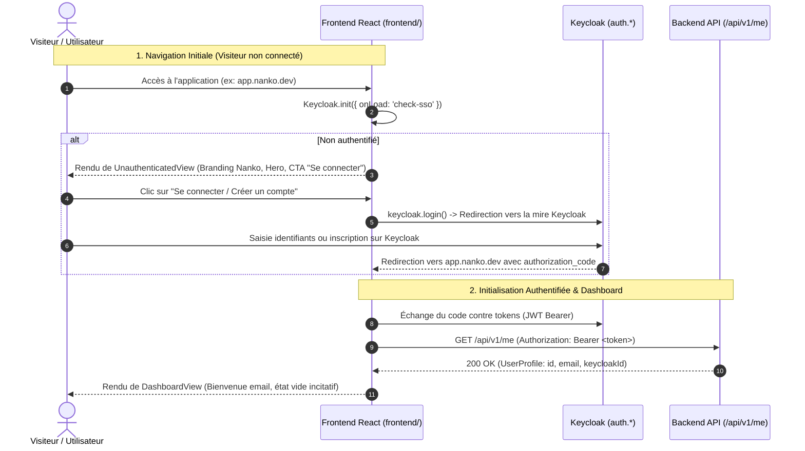

# Change : 006 - Identité de Marque Nanko & Portail d'Accueil Authentifié / Non Connecté

## Métadonnées
* **Domaine concerné :** `.specs/current/domains/auth-and-identity/`
* **Type de changement :** `Évolution` | `Refonte UI`
* **Cible :** `frontend` | `tests-e2e`

---

## 1. Intention & Contexte (Le « Why » du Delta)
* **Problème résolu / Besoin :** L'application web React (`frontend/`) affiche encore le template de démonstration par défaut de Vite (logos React/Vite, compteur HMR « Count is », liens communautaires Discord/Bluesky de Vite). L'application n'est pas présentable aux utilisateurs et ne reflète ni la marque Nanko ni sa proposition de valeur. De plus, lorsqu'un utilisateur arrive sur l'application sans être authentifié, il ne bénéficie pas d'un accueil engageant l'invitant clairement à se connecter ou rejoindre Nanko.
* **Impact utilisateur :** 
  * Un visiteur non connecté accède à un portail de présentation soigné aux couleurs de Nanko (palette officielle `--brand` #2C4A3B / #5EEAD4, typographies IBM Plex / Archivo, logo officiel vectoriel, aperçu du format `.nanko`) avec un appel clair et direct à l'action (« Se connecter / Créer un compte » redirigeant vers Keycloak).
  * Un utilisateur connecté accède à un espace de travail épuré et fonctionnel : barre de navigation cohérente avec statut du profil, bascule de thème clair/sombre, et tableau de bord d'accueil invitant à initialiser ou importer son premier document d'architecture `.nanko`.
  * Élimination complète de tous les éléments résiduels Vite / React (images, textes, styles ad-hoc).
* **In Scope (Ce qui est ajouté/modifié) :**
  * **Intégration du Design System Nanko dans le frontend :**
    * Import des polices Google Fonts officielles (`Archivo`, `IBM Plex Sans`, `IBM Plex Mono`, `Poppins`).
    * Implémentation des tokens CSS (thème clair `#F7F4EF` et thème sombre `#04141A`) alignés avec `landing/styles.css`.
    * Sélecteur de thème persistant (`light`, `system`, `dark`) synchronisé avec `localStorage` (`nanko-theme`).
    * Composant vectoriel du logo officiel Nanko (`BrandLogo`).
  * **Écran d'Accueil Non Connecté (`UnauthenticatedView`) :**
    * En-tête avec marque Nanko, baseline « ARCHITECTURE DE CODE » et bouton de connexion rapide.
    * Hero épuré avec proposition de valeur (« Vos diagrammes d'architecture, écrits comme du code »).
    * Carte d'action d'authentification invitant à se connecter ou créer son compte, déclenchant la redirection standard vers Keycloak.
    * Bloc interactif de prévisualisation syntaxique `.nanko` démontrant la philosophie « diagrams-as-code ».
  * **Tableau de Bord Accueil Connecté (`DashboardView`) :**
    * Message de bienvenue personnalisé avec email/identifiant de l'utilisateur issu de `GET /api/v1/me`.
    * État vide structurant et incitatif : invitation à créer un premier document ou importer un `.nanko`.
    * Rappel des principes clés (modèle immuable, navigation multi-layer, rendu déterministe).
  * **Nettoyage & Remplacement des assets :**
    * Suppression de `hero.png`, `react.svg`, `vite.svg` dans `frontend/src/assets/`.
    * Refonte complète de `frontend/src/App.tsx`, `frontend/src/App.css` et `frontend/src/index.css`.
  * **Mise en place de l'outillage de Tests Unitaires & Intégration Frontend :**
    * Installation et configuration de **Vitest** + **React Testing Library** + **jsdom** dans `frontend/`.
    * Ajout du script npm `"test": "vitest run"` dans `frontend/package.json`.
    * Tests unitaires des composants atomiques : rendu SVG et accessibilité de `BrandLogo`, logique de bascule et stockage du `ThemeSwitch`, validation Zod de `userProfileSchema`.
    * Tests d'intégration UI des vues : affichage du portail visiteur sans trace de Vite et déclenchement de connexion (`UnauthenticatedView`), rendu du dashboard d'accueil avec profil injecté (`DashboardView`).
* **Out of Scope (Exclusions strictes) :**
  * Éditeur graphique interactif complet de canvas 2D (relève des évolutions du domaine `platform`).
  * Moteur de parsing complet et validation lexicale en direct de `.nanko` côté client.
  * Formulaire local de saisie de mot de passe (interdit par l'invariant Zero Trust et la délégation totale à Keycloak).

---

## 2. Flux & Architecture (Diff)



---

## 3. Delta Modèle de données & Base de données

### 3.1. Diagramme Entité-Relation
*Aucune modification du modèle de données de base de données.* Le schéma PostgreSQL reste strictement inchangé. L'entité `app_user` et la persistance DBAL existantes (`Version20260905000001.php`) sont réutilisées sans altération.

---

## 4. Delta Contrats d'API (Symfony)

### Endpoint sollicité : `GET /api/v1/me` (Existant)
* **Authentification requise :** `ROLE_USER` (Jeton Bearer JWT émis par Keycloak)
* **Headers :** `Authorization: Bearer <access_token>`
* **Réponse 200 OK consommée par le Dashboard :**
```json
{
  "id": "0191c280-496a-7312-bf91-a1b2c3d4e5f6",
  "keycloakId": "3fa85f64-5717-4562-b3fc-2c963f66afa6",
  "email": "user@nanko.dev",
  "createdAt": "2026-09-05T08:00:00.000Z"
}
```

---

## 5. Configuration Réseau, Prérequis DNS & Sécurisation des Endpoints

### 5.1. Prérequis DNS Externes (Registrar / Zone DNS)
*Aucun nouvel enregistrement requis.* Les domaines existants restent en vigueur :
* `app.nanko.dev` / `app.preprod.nanko.dev` (SPA Frontend)
* `api.nanko.dev` / `api.preprod.nanko.dev` (API Symfony)
* `auth.nanko.dev` / `auth.preprod.nanko.dev` (Keycloak IAM)

### 5.2. Matrice d'Exposition et Sécurisation des Endpoints

| Surface / Endpoint | Exposition | Authentification | Mesures de mitigation |
|---|---|---|---|
| SPA Nanko (`/`) | Publique | Aucune pour la vue vitrine d'accueil ; JWT requis pour les vues internes | CSP stricte, HTTPS/TLS forcé par Caddy |
| API `/api/v1/me` | Publique (Resource Server) | Bearer Token JWT Keycloak (RS256) | Validation JWKS, Rate limiting 60 req/min, CORS restreint aux domaines `*.nanko.dev` |
| Mire Keycloak OIDC | Publique | Gérée par Keycloak | PKCE S256 obligatoire, redirect_uri whitelistées |

### 5.3. Variables d'Environnement
*Aucune nouvelle variable d'environnement nécessaire.* Réutilisation des variables existantes :
* `VITE_KEYCLOAK_URL`
* `VITE_KEYCLOAK_REALM`
* `VITE_KEYCLOAK_CLIENT_ID`

---

## 6. Delta Maquettes & Layout UI

### 6.1. Référence visuelle & Charte graphique
* **Thème Clair :** Fond `--bg: #F7F4EF`, cartes `--surface: #FFFFFF`, bordures `--border: #E3DED4`, primaire `--brand: #2C4A3B`, accent `--accent: #C0472B`.
* **Thème Sombre :** Fond `--bg: #04141A`, cartes `--surface: #061A1F`, bordures `--border: #123039`, primaire `--brand: #5EEAD4`, accent `--accent: #FFC46B`.
* **Typographies :** Titres en `Archivo`, texte courant en `IBM Plex Sans`, code en `IBM Plex Mono`, logo en `Poppins`.

### 6.2. Wireframes conceptuels (ASCII Layout)

#### Vue Non Connecté (Desktop ≥ 1024px)
```text
+---------------------------------------------------------------------------------------------+
|  [Logo Nanko] NANKO  ARCHITECTURE DE CODE              [Thème ☼/☾]   [Se connecter]        |
+---------------------------------------------------------------------------------------------+
|                                                                                             |
|   DIAGRAMMES C4 · DSL VERSIONNÉ                                                             |
|   Vos diagrammes d'architecture, écrits comme du code.                                      |
|                                                                                             |
|   +---------------------------------------+  +--------------------------------------------+ |
|   |  ACCÈS À LA PLATEFORME                |  |  nanko-platform.nanko                      | |
|   |                                       |  |  ----------------------------------------- | |
|   |  Concevez, versionnez et naviguez     |  |  @id platform-overview                     | |
|   |  dans vos architectures logicielles   |  |  @version app:1.2.0                        | |
|   |  avec la base de données comme        |  |  @satisfies infra:^2.0                     | |
|   |  source de vérité.                    |  |                                            | |
|   |                                       |  |  rectangle webapp                          | |
|   |  [ Se connecter / Créer un compte -> ]|  |  rectangle api                             | |
|   |                                       |  |  connector webapp api                      | |
|   |  Authentification sécurisée Keycloak  |  |  !LAYOUT ... !END                          | |
|   +---------------------------------------+  +--------------------------------------------+ |
|                                                                                             |
|   [✓ Base de données source de vérité]  [✓ Rendu déterministe]  [✓ Navigation multi-layer]  |
+---------------------------------------------------------------------------------------------+
|  © 2026 NANKO · Architecture de code                                                        |
+---------------------------------------------------------------------------------------------+
```

#### Vue Connecté (Desktop ≥ 1024px)
```text
+---------------------------------------------------------------------------------------------+
|  [Logo Nanko] NANKO  [Projets]  [Organisations]         [Thème]  [ (U) user@nanko.dev | Déco ]|
+---------------------------------------------------------------------------------------------+
|                                                                                             |
|   BIENVENUE, user@nanko.dev                                                                 |
|   Espace de travail actif · Prêt pour la modélisation                                      |
|                                                                                             |
|   +-------------------------------------------------------------------------------------+   |
|   |                                                                                     |   |
|   |   [ Icône Schéma Document ]                                                         |   |
|   |   Aucun document d'architecture pour le moment                                      |   |
|   |   Commencez par créer votre premier document ou importer un fichier .nanko existant.|   |
|   |                                                                                     |   |
|   |   [ + Nouveau Document ]              [ ↑ Importer un .nanko ]                      |   |
|   |                                                                                     |   |
|   +-------------------------------------------------------------------------------------+   |
|                                                                                             |
|   RAPPEL SYNTAXIQUE RAPIDE :                                                                |
|   @id [nom] | @version [layer:semver] | @satisfies [layer:range] | rectangle | connector    |
+---------------------------------------------------------------------------------------------+
```

#### Vue Mobile (< 768px)
```text
+-------------------------------------------------------+
|  [Logo] NANKO                        [Thème] [Connexion]
+-------------------------------------------------------+
|                                                       |
|  Vos diagrammes d'architecture,                       |
|  écrits comme du code.                                |
|                                                       |
|  +-------------------------------------------------+  |
|  |  ACCÈS À LA PLATEFORME                          |  |
|  |  [ Se connecter / Créer un compte -> ]          |  |
|  +-------------------------------------------------+  |
|                                                       |
|  +-------------------------------------------------+  |
|  |  Aperçu DSL .nanko                              |  |
|  |  @id platform-overview                          |  |
|  |  rectangle webapp                               |  |
|  +-------------------------------------------------+  |
|                                                       |
+-------------------------------------------------------+
```

### 6.3. Squelette & Arborescence Frontend

```text
frontend/
├── src/
│   ├── assets/                  # Suppression de hero.png, react.svg, vite.svg
│   ├── auth/                    # Client Keycloak & contextes existants
│   │   ├── schemas.ts           # Validation Zod du profil utilisateur
│   │   └── schemas.test.ts      # Tests unitaires des schémas Zod
│   ├── components/
│   │   ├── BrandLogo.tsx        # Logo vectoriel officiel Nanko (SVG paramétrable)
│   │   ├── BrandLogo.test.tsx   # Test unitaire : rendu SVG & accessibilité
│   │   ├── ThemeSwitch.tsx      # Basculeur de thème Light / Dark / System
│   │   ├── ThemeSwitch.test.tsx # Test unitaire : bascule de thème & localStorage
│   │   ├── UserMenu.tsx         # Menu utilisateur épuré avec avatar et bouton déconnexion
│   │   └── UserMenu.test.tsx    # Test unitaire : états loading, login, authenticated
│   ├── views/
│   │   ├── UnauthenticatedView.tsx      # Page d'accueil visiteur invitant à la connexion
│   │   ├── UnauthenticatedView.test.tsx # Test d'intégration : rendu Nanko, absence Vite, CTA login
│   │   ├── DashboardView.tsx            # Dashboard d'accueil utilisateur connecté
│   │   └── DashboardView.test.tsx       # Test d'intégration : affichage profil & état vide
│   ├── test/
│   │   └── setup.ts             # Configuration globale Vitest / Testing Library (@testing-library/jest-dom)
│   ├── App.css                  # Styles spécifiques de mise en page Nanko
│   ├── index.css                # Variables de thème et typographie globale
│   ├── App.tsx                  # Bascule fluide UnauthenticatedView <-> DashboardView
│   └── main.tsx
├── package.json                 # Ajout scripts vitest et dépendances dev
└── vite.config.ts               # Configuration de test: { environment: 'jsdom', setupFiles: './src/test/setup.ts' }
```

---

## 7. Delta Spécifications UI & Logique Client (React)

### Schéma de validation Zod (`frontend/src/auth/schemas.ts`)
```typescript
import { z } from 'zod';

export const userProfileSchema = z.object({
  id: z.string().uuid(),
  keycloakId: z.string().min(1),
  email: z.string().email(),
  createdAt: z.string().datetime(),
});

export type ValidatedUserProfile = z.infer<typeof userProfileSchema>;
```

### Matrice des 5 états UI

| État UI | Déclencheur | Rendu visuel & Comportement |
|---|---|---|
| **Loading** | Initialisation Keycloak (`isLoading: true`) | Écran de chargement épuré avec logo Nanko subtilement animé et indicateur discret (« Initialisation de la session... »). Aucun clignotement ni flash de contenu. |
| **Unauthenticated (Idle)** | `isAuthenticated: false` | Affichage du portail d'accueil Nanko. Présentation de la mission, extrait de code `.nanko` avec mise en valeur syntaxique, et bouton d'action principal « Se connecter / Créer un compte ». |
| **Redirecting** | Clic sur « Se connecter / Créer un compte » | Désactivation du bouton avec indicateur visuel de chargement pendant la redirection vers le serveur Keycloak. |
| **Authenticated (Idle)** | `isAuthenticated: true` & profil chargé | Navbar applicative avec logo Nanko, statut utilisateur, commutateur de thème, et `DashboardView` accueillant invitant à créer/importer un document. |
| **Error (Profil non résolu)** | Échec réseau vers `/api/v1/me` | L'utilisateur reste connecté via son token Keycloak (`sub` / `email` extraits du JWT en fallback) avec une bannière d'information non bloquante. |

---

## 8. Invariants & Cas limites (*Edge cases*)
1. **Zéro régression d'authentification :** Le flux OAuth 2.0 PKCE (`keycloak-js`) reste strictement opérationnel en local (`localhost:45173`) et en préproduction/production (`app.*.nanko.dev`).
2. **Prévention du Flash de Thème (FOUC) :** Le thème est appliqué immédiatement dès le montage via une lecture synchrone de `localStorage` ou de `prefers-color-scheme`.
3. **Nettoyage strict :** Aucune référence à Vite, React starter, ni lien externe non désiré ne doit subsister dans le bundle final.
4. **Accessibilité :** Contrastes conformes WCAG AA sur les palettes claire et sombre, navigation au clavier et attributs `aria-label` sur le thème et les boutons d'action.

---

## 9. Plan d'exécution séquentiel

- [ ] **Phase 1 : Socle de Tests Frontend & Configuration (`frontend/`)**
  - [ ] 1. Installer `vitest`, `@testing-library/react`, `@testing-library/jest-dom`, `@testing-library/user-event`, `jsdom`.
  - [ ] 2. Configurer `vite.config.ts` (section `test: { globals: true, environment: 'jsdom', setupFiles: './src/test/setup.ts' }`) et `frontend/src/test/setup.ts`.
  - [ ] 3. Ajouter le script `"test": "vitest run"` et `"test:watch": "vitest"` dans `frontend/package.json`.

- [ ] **Phase 2 : Design Tokens & Assets Nanko (`frontend/`)**
  - [ ] 1. Supprimer les assets obsolètes : `frontend/src/assets/hero.png`, `frontend/src/assets/react.svg`, `frontend/src/assets/vite.svg`.
  - [ ] 2. Configurer `index.html` pour charger les typographies officielles (`Archivo`, `IBM Plex Sans`, `IBM Plex Mono`, `Poppins`).
  - [ ] 3. Intégrer les variables de thème (clair/sombre) dans `frontend/src/index.css`.

- [ ] **Phase 3 : Composants Partagés & Tests Unitaires (`frontend/src/components/`)**
  - [ ] 1. Créer le composant vectoriel `BrandLogo.tsx` et son test unitaire `BrandLogo.test.tsx`.
  - [ ] 2. Créer le composant `ThemeSwitch.tsx` et son test unitaire `ThemeSwitch.test.tsx` (validation des thèmes light/system/dark et persistance `localStorage`).
  - [ ] 3. Mettre à jour `UserMenu.tsx` avec le style épuré Nanko et son test unitaire `UserMenu.test.tsx`.
  - [ ] 4. Créer le schéma de validation Zod `frontend/src/auth/schemas.ts` et son test unitaire `schemas.test.ts`.

- [ ] **Phase 4 : Vues Principales & Tests d'Intégration UI (`frontend/src/views/`)**
  - [ ] 1. Développer `UnauthenticatedView.tsx` et son test d'intégration `UnauthenticatedView.test.tsx` (validation du branding Nanko, absence de reliquats Vite, appel au login).
  - [ ] 2. Développer `DashboardView.tsx` et son test d'intégration `DashboardView.test.tsx` (validation de l'affichage du profil et de l'état vide pour les documents).
  - [ ] 3. Refactoriser `frontend/src/App.tsx` pour orchestrer le rendu selon l'état d'authentification.

- [ ] **Phase 5 : Validation Qualité, Tests Unitaires & E2E**
  - [ ] 1. Valider le typage strict TypeScript : `pnpm --filter frontend typecheck`.
  - [ ] 2. Valider le linting : `pnpm --filter frontend lint`.
  - [ ] 3. Exécuter l'ensemble des tests unitaires et d'intégration : `pnpm --filter frontend test`.
  - [ ] 4. Exécuter les tests E2E Playwright : `pnpm --filter tests-e2e exec playwright test`.

- [ ] **Phase 6 : Synchronisation documentaire (via `/sync-current`)**
  - [ ] 1. Mettre à jour `.specs/current/domains/auth-and-identity/behavior.md` avec les détails du portail d'accueil.
  - [ ] 2. Archiver cette spécification sous `.specs/changes/archive/006-nanko-branding-and-auth-portal.md`.

---

## 10. Definition of Done & Stratégie de tests

### 10.1. Scénarios de validation (Format Gherkin avec tags)

```gherkin
# ==============================================================================
# TESTS FRONTEND - UNITAIRES & INTÉGRATION (frontend/ - Vitest + Testing Library)
# ==============================================================================

@web @unit
Fonctionnalité: Validation des Schémas et Composants Atomiques

  Scénario: Validation Zod d'un profil utilisateur valide
    Quand un objet UserProfile conforme est validé via userProfileSchema
    Alors la validation réussit et les données typées sont retournées

  Scénario: Rejet Zod d'un profil utilisateur invalide
    Quand un objet avec un email invalide ou un ID non UUID est validé
    Alors une erreur de validation Zod est levée

  Scénario: Rendu du logo de marque Nanko
    Quand le composant <BrandLogo /> est rendu
    Alors le SVG contient les branches d'architecture Nanko et le texte de marque associé

  Scénario: Bascule de thème via ThemeSwitch
    Étant donné le composant <ThemeSwitch /> rendu en thème par défaut
    Quand l'utilisateur clique sur le choix "dark"
    Alors l'attribut "data-theme" de l'élément racine document passe à "dark"
    Et la préférence "dark" est enregistrée dans localStorage sous la clé "nanko-theme"

@web @integration
Fonctionnalité: Vues Principales Nanko

  Scénario: Rendu du portail non connecté (UnauthenticatedView)
    Étant donné le composant <UnauthenticatedView /> rendu avec un mock de connexion
    Alors le slogan "Vos diagrammes d'architecture, écrits comme du code" est affiché
    Et l'extrait de code ".nanko" est visible
    Et aucun élément ou texte relatif à Vite ou React n'est présent dans le DOM
    Quand l'utilisateur clique sur "Se connecter / Créer un compte"
    Alors la fonction login du contexte d'authentification est invoquée

  Scénario: Rendu du tableau de bord d'accueil connecté (DashboardView)
    Étant donné le composant <DashboardView /> rendu avec un profil mocké "architect@nanko.dev"
    Alors le message de bienvenue affiche "architect@nanko.dev"
    Et l'état vide invitant à créer un nouveau document est affiché
    Et les boutons d'action "Nouveau Document" et "Importer un .nanko" sont présents

# ==============================================================================
# TESTS E2E (tests-e2e/ - Playwright)
# ==============================================================================

@e2e @web
Fonctionnalité: Accueil et Identité Visuelle Nanko en conditions réelles

  Scénario: Affichage du portail Nanko pour un utilisateur non connecté
    Étant donné que le visiteur accède à l'application sans session active
    Alors la marque "Nanko" et le logo d'architecture sont visibles
    Et le bouton "Se connecter / Créer un compte" est visible
    Et aucun logo ou texte de démonstration Vite n'est présent

  Scénario: Parcours complet d'authentification et affichage du Dashboard
    Étant donné que le visiteur clique sur "Se connecter / Créer un compte"
    Quand il s'authentifie sur la mire Keycloak
    Alors il est redirigé vers l'application
    Et son profil et son email sont visibles dans le menu utilisateur et sur le Dashboard
```

### 10.2. Commandes de validation automatisée

```bash
# 1. Tests Unitaires & Intégration Frontend (Vitest)
pnpm --filter frontend test

# 2. Vérification Frontend (Typage & Lint)
pnpm --filter frontend typecheck
pnpm --filter frontend lint

# 3. Build de production Frontend
pnpm --filter frontend build

# 4. Tests E2E Playwright
pnpm --filter tests-e2e exec playwright test
```
