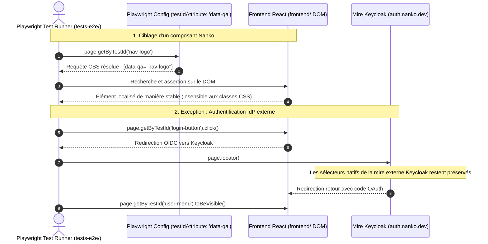

# Change : 007 - Standardisation des Sélecteurs E2E via data-qa

## Métadonnées
* **Domaine concerné :** `.specs/current/domains/platform/`
* **Type de changement :** `Évolution` | `Standardisation`
* **Cible :** `tests-e2e` | `frontend`

---

## 1. Intention & Contexte (Le « Why » du Delta)
* **Problème résolu / Besoin :** Les tests end-to-end Playwright actuels (`tests-e2e/`) s'appuient sur un mélange hétérogène de sélecteurs : classes CSS fragiles (`.nav-logo`), attributs par défaut `data-testid` (`login-button`, `user-menu`, `user-email`) et sélecteurs d'identifiants HTML. L'utilisation de classes CSS pour cibler des éléments dans les tests E2E crée un fort couplage avec le styling et expose les tests à des régressions silencieuses lors des refontes graphiques. De plus, l'absence de convention unifiée affaiblit la maintenabilité du harnais de test.
* **Impact utilisateur :** 
  * Aucun impact visuel ou fonctionnel direct pour l'utilisateur final.
  * Découplage complet entre le style visuel (CSS/Tailwind) et les tests automatisés : les refontes UI ne brisent plus les scénarios de test.
  * Robustesse et stabilité accrues des pipelines de préproduction et des Quality Gates CI/CD.
* **In Scope (Ce qui est ajouté/modifié) :**
  * **Configuration Playwright (`tests-e2e/playwright.config.ts`) :**
    * Configuration explicite de `testIdAttribute: 'data-qa'` dans l'objet `use`, permettant à l'API standard Playwright `page.getByTestId('...')` de cibler nativement les balises `[data-qa="..."]`.
  * **Balisage Frontend (`frontend/src/`) :**
    * Migration de tous les attributs existants `data-testid` vers `data-qa` dans `frontend/src/components/UserMenu.tsx` (`user-menu-loading`, `login-button`, `user-menu`, `user-email`, `logout-button`).
    * Ajout d'attributs `data-qa` sur les éléments fonctionnels ciblés par les tests dans `frontend/src/App.tsx` (ex: `data-qa="nav-logo"`).
    * Établissement de la convention de nommage `data-qa` (kebab-case fonctionnel et descriptif : `[contexte]-[élément]-[action/état]`).
  * **Refactorisation des Tests E2E (`tests-e2e/tests/app/`) :**
    * Refactorisation de `tests-e2e/tests/app/telemetry.spec.ts` pour remplacer les sélecteurs de classe (`page.locator('.nav-logo')`) par des sélecteurs stables `page.getByTestId('nav-logo')`.
    * Refactorisation de `tests-e2e/tests/app/auth.spec.ts` pour exploiter la résolution native de `getByTestId` pointant sur `data-qa`.
    * Documentation explicite de l'exception pour la mire Keycloak : les formulaires de l'IdP externe (`#username`, `#password`, `#kc-login`) conservent leurs sélecteurs natifs.
  * **Documentation et Invariants de Test :**
    * Mise à jour de la documentation du domaine `platform` (`.specs/current/domains/platform/tech.md`) et du guide `tests-e2e/README.md`.
* **Out of Scope (Exclusions strictes) :**
  * Modification du thème natif Keycloak ou injection de `data-qa` dans les formulaires hébergés par Keycloak.
  * Modification des contrats d'API REST ou du backend Symfony.
  * Modification de la base de données PostgreSQL ou des schémas DBAL.

---

## 2. Flux & Architecture (Diff)



---

## 3. Delta Modèle de données & Base de données

### 3.1. Diagramme Entité-Relation (ERD)
*Aucune modification de base de données. Ce changement concerne exclusivement le harnais de test E2E et les attributs d'instrumentation DOM côté client.*

### 3.2. Modifications de tables
*Aucune table modifiée ou créée. Pas d'impact Doctrine / DBAL.*

### 3.3. Règles de migration & Intégrité
*Aucun script de migration SQL requis.*

---

## 4. Delta Contrats d'API (Symfony)

*Aucune modification d'endpoint REST ni de contrôleur Symfony. Les contrats d'API existants demeurent inchangés.*

---

## 5. Configuration Réseau, Prérequis DNS & Sécurisation des Endpoints

| Paramètre | Spécification |
|---|---|
| **Entrées DNS & Domaines** | Aucun changement DNS. `app.nanko.dev`, `api.nanko.dev`, `auth.nanko.dev`, `app.preprod.nanko.dev`. |
| **Exposition réseau** | Les attributs `data-qa` sont des attributs HTML standard présents dans le bundle client, sans risque d'exposition ni fuite d'informations sensibles. |
| **CORS & Sécurité** | Inchangés. |
| **Secrets & Identifiants** | Aucun nouveau secret. Les identifiants E2E continuent d'être lus via `tests-e2e/config/env.ts`. |

---

## 6. Wireframes & Spécifications UI

### 6.1. Convention de Balisage DOM `data-qa`

Les attributs `data-qa` doivent respecter la convention :
* Format : `kebab-case`.
* Structure : `[contexte]-[element]` ou `[element]` pour les éléments uniques globaux.
* Règle d'or : Tout élément interactif ou asserté par un test E2E **doit** comporter un `data-qa`. Aucune assertion E2E ne doit cibler une classe CSS (ex: `.nav-logo`) ou un sélecteur de balise générique.

### 6.2. Mapping des Composants Frontend

#### Composant : `frontend/src/App.tsx`
```tsx
// Avant :
<a href="/" className="nav-logo">NANKO</a>

// Après :
<a href="/" className="nav-logo" data-qa="nav-logo">NANKO</a>
```

#### Composant : `frontend/src/components/UserMenu.tsx`
```tsx
// Avant (data-testid) :
<div className="user-menu-loading" data-testid="user-menu-loading">...</div>
<button className="login-button" data-testid="login-button">...</button>
<div className="user-menu-authenticated" data-testid="user-menu">...</div>
<span className="user-email" data-testid="user-email">...</span>
<button className="logout-button" data-testid="logout-button">...</button>

// Après (data-qa) :
<div className="user-menu-loading" data-qa="user-menu-loading">...</div>
<button className="login-button" data-qa="login-button">...</button>
<div className="user-menu-authenticated" data-qa="user-menu">...</div>
<span className="user-email" data-qa="user-email">...</span>
<button className="logout-button" data-qa="logout-button">...</button>
```

### 6.3. Schéma Zod & Matrice des 5 états UI
*Le composant `UserMenu` conserve sa logique existante d'affichage selon les états d'authentification.*

| État UI | Attribut `data-qa` visible | Comportement attendu |
|---|---|---|
| **Chargement initial** | `[data-qa="user-menu-loading"]` | Indicateur textuel ou spinner de chargement de session. |
| **Non connecté** | `[data-qa="login-button"]` | Bouton d'action permettant la redirection vers Keycloak. |
| **Connecté nominal** | `[data-qa="user-menu"]`, `[data-qa="user-email"]`, `[data-qa="logout-button"]` | Affichage du profil, email extrait du JWT/session et bouton déconnexion. |
| **Erreur de session** | `[data-qa="login-button"]` | Fallback sur l'invitation à se reconnecter. |
| **Navigation globale** | `[data-qa="nav-logo"]` | Logo de marque interactif redirigeant vers la racine. |

---

## 7. Invariants & Cas limites (Edge cases)

### Invariants Techniques
1. **Invariant `data-qa` exclusif pour les tests E2E Nanko :** Aucun test Playwright dans `tests-e2e/tests/` ciblant du code Nanko ne doit utiliser de sélecteur basé sur une classe CSS (`.classe`) ou un ID HTML (`#id`).
2. **Résolution native Playwright :** La propriété `testIdAttribute: 'data-qa'` doit être déclarée au niveau racine de `playwright.config.ts` sous `use: {}`, garantissant que tout appel `page.getByTestId(...)` résout `[data-qa="..."]`.
3. **Exception IdP externe isolée :** Seuls les formulaires générés par un service tiers externe (la mire de login Keycloak OIDC) sont autorisés à utiliser des sélecteurs natifs (`#username`, `#password`, `#kc-login`), documentés comme exceptions tierces.
4. **Non-régression des tests unitaires Frontend :** Les tests Vitest / React Testing Library (`frontend/`) doivent continuer de fonctionner sans régression (RTL supportant nativement ou configurable pour `data-qa`).

---

## 8. Plan d'exécution séquentiel (Phasé avec DoD)

- [ ] **Phase 1 : Configuration Playwright (`tests-e2e/`)**
  - [ ] 1. Mettre à jour `tests-e2e/playwright.config.ts` avec `testIdAttribute: 'data-qa'` dans la section `use`.
  - [ ] 2. Documenter la convention `data-qa` dans `tests-e2e/README.md`.
  - [ ] **DoD :** Playwright compile et résout `page.getByTestId` vers `data-qa`.

- [ ] **Phase 2 : Instrumentation du Frontend (`frontend/src/`)**
  - [ ] 1. Remplacer tous les attributs `data-testid` par `data-qa` dans `frontend/src/components/UserMenu.tsx`.
  - [ ] 2. Ajouter l'attribut `data-qa="nav-logo"` sur le logo de navigation dans `frontend/src/App.tsx`.
  - [ ] 3. Vérifier que les linters et le typage TypeScript passent : `pnpm --filter frontend typecheck && pnpm --filter frontend lint`.
  - [ ] **DoD :** Aucun attribut `data-testid` résiduel dans le code source de `frontend/src/`.

- [ ] **Phase 3 : Refactorisation des Spécifications E2E (`tests-e2e/tests/app/`)**
  - [ ] 1. Refactoriser `tests-e2e/tests/app/telemetry.spec.ts` pour remplacer `page.locator('.nav-logo')` par `page.getByTestId('nav-logo')`.
  - [ ] 2. Vérifier `tests-e2e/tests/app/auth.spec.ts` : confirmer le fonctionnement des appels `page.getByTestId('login-button')`, `page.getByTestId('user-menu')`, `page.getByTestId('user-email')` avec le nouvel attribut `data-qa`.
  - [ ] **DoD :** Aucun sélecteur de classe CSS résiduel dans `tests-e2e/tests/app/`.

- [ ] **Phase 4 : Validation des Quality Gates & Exécution**
  - [ ] 1. Exécuter la suite complète de tests E2E Playwright : `pnpm --filter tests-e2e exec playwright test`.
  - [ ] 2. Vérifier l'absence de régression globale : `make test-backend`, `pnpm --filter frontend typecheck`.
  - [ ] **DoD :** 100% des tests Playwright passent au vert contre l'environnement local.

---

## 9. Scénarios de validation Gherkin & Commandes de test

### Scénario 1 : Résolution des éléments de navigation via `data-qa`
```gherkin
Fonctionnalité: Résolution des sélecteurs E2E via data-qa

  Scénario: Ciblage du logo de navigation avec getByTestId('nav-logo')
    Étant donné un navigateur naviguant sur la page d'accueil "/"
    Quand Playwright recherche l'élément via page.getByTestId('nav-logo')
    Alors l'élément est visible dans le DOM
    Et l'élément possède l'attribut data-qa="nav-logo"
    Et aucun sélecteur basé sur la classe CSS ".nav-logo" n'est utilisé
```

### Scénario 2 : Parcours d'authentification avec convention data-qa et exception IdP
```gherkin
Fonctionnalité: Parcours d'authentification E2E

  Scénario: Connexion réussie et contrôle du profil utilisateur
    Étant donné un utilisateur non authentifié sur "/"
    Quand il clique sur le bouton ciblé par page.getByTestId('login-button')
    Alors il est redirigé vers la mire Keycloak
    Et il renseigne les champs IdP "#username" et "#password" puis valide via "#kc-login"
    Et il est redirigé vers l'application Nanko
    Alors le menu utilisateur ciblé par page.getByTestId('user-menu') est visible
    Et l'email utilisateur ciblé par page.getByTestId('user-email') contient son adresse
```

### Commandes de test & Quality Gates

```bash
# 1. Vérification statique : absence de sélecteurs de classe CSS dans les tests E2E Nanko
! grep -rn "page.locator('\." tests-e2e/tests/

# 2. Vérification statique : absence de data-testid dans frontend/src
! grep -rn "data-testid" frontend/src/

# 3. Typage et Lint frontend
pnpm --filter frontend typecheck
pnpm --filter frontend lint

# 4. Exécution des tests E2E Playwright
pnpm --filter tests-e2e exec playwright test
```
