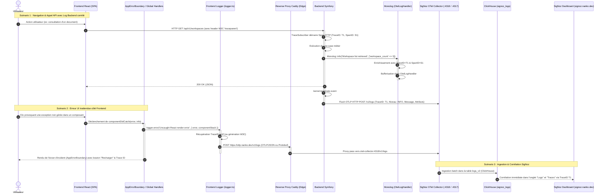

# Change : 008 - Remontée et Centralisation des Logs Applicatifs Fullstack (OpenTelemetry & SigNoz)

## Métadonnées
* **Domaine concerné :** `.specs/current/domains/platform/`
* **Type de changement :** `Nouveau module` / `Évolution technique`
* **Cible :** `Fullstack` (Backend Symfony, Frontend React, Tests E2E, Observabilité SigNoz)

---

## 1. Intention & Contexte (Le « Why » du Delta)

* **Problème résolu / Besoin :**
  Actuellement, l'observabilité de Nanko est limitée aux traces distribuées OpenTelemetry (mise en place dans la spec 004). Les logs applicatifs restent cloisonnés :
  - Côté Backend, Monolog écrit sur `php://stderr` en format JSON brut pour Docker, mais aucun flux n'est transmis à la stack SigNoz ni corrélé avec les `trace_id` et `span_id` des requêtes HTTP. L'analyse d'incidents nécessite de fouiller manuellement les logs des conteneurs sans pouvoir naviguer depuis une trace lente ou en erreur vers les messages de logs associés.
  - Côté Frontend, les erreurs JavaScript non interceptées, les rejets de promesses et les messages `console.error` sont cantonnés à la console locale du navigateur de l'utilisateur. L'équipe d'ingénierie n'a aucune visibilité sur les crashs clients ou erreurs API survenant en préproduction ou production.

* **Impact utilisateur & développeur :**
  - **Diagnostic en un clic dans SigNoz :** Chaque trace d'erreur ou de latence dans l'interface SigNoz est directement reliée à ses logs contextuels grâce à la corrélation W3C (`trace_id`, `span_id`).
  - **Résilience et transparence utilisateur :** En cas d'erreur inattendue de rendu dans le frontend React, un composant `AppErrorBoundary` intercepte le crash, affiche un écran d'aide élégant avec l'identifiant d'incident (Trace ID) et remonte immédiatement les détails de la pile d'exécution vers SigNoz sans laisser l'utilisateur face à un écran blanc bloqué.
  - **Contrôle du bruit réseau :** Les logs Frontend remontés au collecteur OTLP sont filtrés au seuil `WARN` et `ERROR` pour préserver la bande passante, tandis que le Backend transmet les logs dès le niveau `INFO`.
  - **Fail-Open absolu :** Tout dysfonctionnement ou indisponibilité du collecteur OpenTelemetry n'impacte en rien l'exécution de l'application (pas d'exception levée, pas de blocage des requêtes).

* **In Scope (Ce qui est ajouté/modifié) :**
  - **Backend Symfony (`backend/`) :**
    - Création de l'adaptateur `App\Adapter\Driver\Http\OpenTelemetry\OtelLogHandler` pour Monolog, convertissant les enregistrements Monolog en `LogRecord` OpenTelemetry.
    - Processeur/Enrichisseur automatique injectant le `trace_id` et le `span_id` du span actif extrait via le SDK OpenTelemetry dans chaque ligne de log.
    - Configuration de `backend/config/packages/monolog.php` pour chaîner le stream local `php://stderr` (existant) et le nouveau handler OTLP conditionné à la présence de l'endpoint OTel.
    - Flush systématique du buffer de logs lors de `kernel.terminate` pour garantir l'acheminement des logs avant la fin du cycle de vie du processus PHP-FPM / CLI.
    - Filtrage de niveau configurable (par défaut `INFO` et supérieur en préprod/prod).
  - **Frontend React (`frontend/`) :**
    - Module unifié `frontend/src/config/logger.ts` exposant l'interface typée `logger.info`, `logger.warn`, `logger.error`, `logger.debug`.
    - Exporteur OTLP HTTP pour les logs ciblant l'endpoint `/v1/logs` (soit explicitement via `VITE_OTEL_LOGS_EXPORTER_URL`, soit par dérivation automatique depuis `VITE_OTEL_EXPORTER_URL`).
    - Capture automatique des erreurs globales du navigateur via `window.addEventListener('error')` et `window.addEventListener('unhandledrejection')`.
    - Composant d'interface `AppErrorBoundary` enveloppant l'application pour capturer les plantages de l'arbre de composants React et les transmettre au collecteur OTLP.
    - Filtrage côté navigateur : envoi vers SigNoz restreint aux niveaux `WARN` et `ERROR` avec déduplication/rate-limiting local anti-flood, tout en maintenant l'affichage intégral en console locale en environnement de développement.
    - Injection automatique du `trace_id` actif dans le payload du log frontend.
    - Extension du schéma Zod dans `frontend/src/config/env.ts` avec `VITE_OTEL_LOGS_EXPORTER_URL` et `VITE_LOG_LEVEL`.
  - **Tests & Validation (`tests-e2e/`, `backend/tests/`, `frontend/tests/`) :**
    - Tests unitaires et d'intégration validant le formattage des logs OTLP et la transmission du `trace_id`.
    - Test E2E validant la capture des erreurs frontend et le non-blocage fail-open.

* **Out of Scope (Exclusions strictes) :**
  - Aucune modification du schéma PostgreSQL (stockage ClickHouse dédié `signoz_logs` déjà provisionné dans SigNoz).
  - Traçage et logs de la Landing page statique.
  - Modification de la configuration interne du conteneur Keycloak (géré de façon autonome).

---

## 2. Flux & Architecture (Diff)



---

## 3. Delta Modèle de données & Base de données

### 3.1. Impact sur la base relationnelle applicative (`nanko`)
* **Aucune modification :** Conformément à l'ADR-0007, PostgreSQL reste réservé au stockage exclusif des données métier.
* **ClickHouse (SigNoz) :** Les logs sont ingérés directement par le pipeline OTel collector dans le schéma ClickHouse `signoz_logs` (géré par les migrations automatiques de SigNoz Schema Migrator).

### 3.2. Attributs sémantiques des LogRecords OpenTelemetry
Les logs émis par le Backend et le Frontend respectent la spécification OpenTelemetry Log Data Model :

| Attribut OTel | Source Backend | Source Frontend | Description |
|---|---|---|---|
| `Timestamp` | Microsecondes actuelles | Millisecondes actuelles | Horodatage précis de l'événement |
| `SeverityNumber` | Mappé depuis le niveau RFC 5424 Monolog (1..24) | Mappé depuis le niveau du logger (DEBUG: 5, INFO: 9, WARN: 13, ERROR: 17) | Sévérité numérique normalisée OTel |
| `SeverityText` | `INFO`, `WARNING`, `ERROR`, `CRITICAL`... | `DEBUG`, `INFO`, `WARN`, `ERROR` | Libellé textuel de sévérité |
| `Body` | Message Monolog | Message passé au logger ou `error.message` | Contenu textuel principal du log |
| `trace_id` | Span actif extrait du contexte OpenTelemetry | Span actif extrait de `@opentelemetry/api` | Identifiant W3C 128-bit de la trace parente |
| `span_id` | Span actif extrait du contexte OpenTelemetry | Span actif extrait de `@opentelemetry/api` | Identifiant W3C 64-bit du span actif |
| `service.name` | `nanko-backend` | `nanko-frontend` | Nom de la ressource émettrice |
| `deployment.environment` | `local` / `preprod` / `prod` | `local` / `preprod` / `prod` | Environnement d'exécution pour filtrage SigNoz |
| `attributes` | Contexte additionnel Monolog (`context` + `extra`) | Métadonnées additionnelles (`componentStack`, `url`, `userAgent`) | Paires clé-valeur de diagnostic |

---

## 4. Delta Contrats d'API & Protocoles

### 4.1. Protocole d'Ingestion OTLP/HTTP Logs
* **Endpoint Collecteur :** `POST /v1/logs`
* **Content-Type :** `application/json` ou `application/x-protobuf`
* **Spécification :** OpenTelemetry OTLP/HTTP v1.
* **Format Payload Exemple (JSON) :**
  ```json
  {
    "resourceLogs": [
      {
        "resource": {
          "attributes": [
            { "key": "service.name", "value": { "stringValue": "nanko-frontend" } },
            { "key": "deployment.environment", "value": { "stringValue": "preprod" } }
          ]
        },
        "scopeLogs": [
          {
            "scope": { "name": "nanko-frontend-logger", "version": "1.0.0" },
            "logRecords": [
              {
                "timeUnixNano": "1757109600000000000",
                "severityNumber": 17,
                "severityText": "ERROR",
                "body": { "stringValue": "Uncaught TypeError: Cannot read properties of undefined" },
                "traceId": "4bf92f3577b34da6a3ce929d0e0e4736",
                "spanId": "00f067aa0ba902b7",
                "attributes": [
                  { "key": "url", "value": { "stringValue": "https://app.preprod.nanko.dev/workspaces" } },
                  { "key": "error.stack", "value": { "stringValue": "TypeError: ... at AppErrorBoundary.tsx:25" } }
                ]
              }
            ]
          }
        ]
      }
    ]
  }
  ```

---

## 5. Configuration Réseau, Prérequis DNS & Sécurisation des Endpoints

### 5.1. Prérequis DNS Externes (Registrar / Zone DNS)
Aucun nouvel enregistrement DNS requis. L'infrastructure existante déployée en spec 004 couvre déjà l'ingestion OTLP :

| Sous-domaine / Hôte | Type DNS | Cible | Rôle & Disponibilité |
|---|---|---|---|
| `otlp.nanko.dev` | `CNAME` / `A` | `<IP_PUBLIQUE_VPS>` | **Déjà actif.** Endpoint d'ingestion OTLP HTTPS unifié pour traces et logs |

### 5.2. Matrice d'Exposition et Sécurisation des Endpoints

| Endpoint / Service | Exposition | Authentification & Contrôle | Mesures de mitigation & Sécurité |
|---|---|---|---|
| `https://otlp.nanko.dev/v1/logs` | `Publique` (Caddy vers `:4318`) | Aucune (Endpoint d'ingestion télémétrique) | CORS permissif (`*`), Rate-limit Caddy, payload max 1 Mo, fail-open client |
| `http://signoz-otel-collector:4318/v1/logs` | `Interne Docker` | Réseau privé `edge` | Communication inter-conteneurs, aucun port exposé publiquement |

### 5.3. Variables d'Environnement Requises

| Variable | Composant | Environnement | Description & Valeur par défaut |
|---|---|---|---|
| `OTEL_EXPORTER_OTLP_ENDPOINT` | `backend` | Tous | Endpoint de base OTLP (ex: `http://signoz-otel-collector:4318` ou vide en local) |
| `OTEL_LOGS_LEVEL` | `backend` | Tous | Niveau minimal de log transmis à OTLP (`info`, `notice`, `warning`, `error`, default: `info`) |
| `VITE_OTEL_LOGS_EXPORTER_URL` | `frontend` | Tous | URL d'ingestion logs OTLP (défaut : auto-dérivé de `VITE_OTEL_EXPORTER_URL` en remplaçant `/v1/traces` par `/v1/logs`) |
| `VITE_LOG_LEVEL` | `frontend` | Tous | Seuil minimal d'envoi vers OTLP (`warn` ou `error`, default: `warn`) |

---

## 6. Delta Maquettes & Layout UI (AppErrorBoundary)

### 6.1. Référence Visuelle & Intention UX
Lorsqu'une exception React non interceptée fait planter l'interface, l'utilisateur ne doit pas rester devant une page blanche inerte.
Un écran de repli (*Fallback UI*) moderne, sobre et rassurant est affiché, respectant le design system sombre/slate de Nanko.

### 6.2. Wireframes ASCII

#### Vue Desktop & Mobile
```text
+-----------------------------------------------------------------------+
|                                                                       |
|                     [Logo Nanko / Icône Alerte]                       |
|                                                                       |
|               Une anomalie inattendue est survenue                    |
|       Notre équipe technique a été automatiquement notifiée.          |
|                                                                       |
|   +---------------------------------------------------------------+   |
|   | Référence d'incident (Trace ID) :                             |   |
|   | 01955f24-7b3b-7c99-b1d5-2a1d2f34e567                          |   |
|   +---------------------------------------------------------------+   |
|                                                                       |
|            [ Recharger la page ]      [ Retour à l'accueil ]          |
|                                                                       |
+-----------------------------------------------------------------------+
```

### 6.3. Squelette JSX (`frontend/src/components/AppErrorBoundary.tsx`)

```tsx
import React, { Component, type ReactNode } from 'react'
import { logger } from '../config/logger'

interface Props {
  children: ReactNode
}

interface State {
  hasError: boolean
  errorId: string | null
}

export class AppErrorBoundary extends Component<Props, State> {
  constructor(props: Props) {
    super(props)
    this.state = { hasError: false, errorId: null }
  }

  static getDerivedStateFromError(): State {
    return { hasError: true, errorId: null }
  }

  componentDidCatch(error: Error, errorInfo: React.ErrorInfo): void {
    const errorId = logger.error('Uncaught React exception in AppErrorBoundary', {
      error: error.message,
      stack: error.stack,
      componentStack: errorInfo.componentStack,
    })
    this.setState({ errorId })
  }

  handleReload = (): void => {
    window.location.reload()
  }

  handleHome = (): void => {
    window.location.href = '/'
  }

  render(): ReactNode {
    if (this.state.hasError) {
      return (
        <div
          data-testid="error-boundary-fallback"
          className="min-h-screen flex items-center justify-center bg-slate-950 text-slate-100 p-6"
        >
          <div className="max-w-md w-full bg-slate-900 border border-slate-800 rounded-xl p-8 text-center space-y-6 shadow-2xl">
            <div className="w-12 h-12 rounded-full bg-amber-500/10 border border-amber-500/20 text-amber-400 flex items-center justify-center mx-auto text-xl font-bold">
              !
            </div>
            <div className="space-y-2">
              <h1 className="text-xl font-semibold tracking-tight">Une anomalie inattendue est survenue</h1>
              <p className="text-sm text-slate-400">
                L'erreur a été enregistrée automatiquement pour analyse.
              </p>
            </div>
            {this.state.errorId && (
              <div className="p-3 bg-slate-950/60 rounded-lg border border-slate-800/80 font-mono text-xs text-slate-400 text-left">
                <span className="block text-[10px] text-slate-500 uppercase tracking-wider mb-1">Identifiant d'incident :</span>
                <span className="select-all text-slate-300 break-all">{this.state.errorId}</span>
              </div>
            )}
            <div className="flex gap-3 justify-center pt-2">
              <button
                type="button"
                onClick={this.handleReload}
                className="px-4 py-2 bg-indigo-600 hover:bg-indigo-500 text-white text-sm font-medium rounded-lg transition-colors"
              >
                Recharger l'application
              </button>
              <button
                type="button"
                onClick={this.handleHome}
                className="px-4 py-2 bg-slate-800 hover:bg-slate-700 text-slate-300 text-sm font-medium rounded-lg transition-colors"
              >
                Retour à l'accueil
              </button>
            </div>
          </div>
        </div>
      )
    }

    return this.props.children
  }
}
```

---

## 7. Delta Spécifications UI & Logique Client

### 7.1. Schéma Zod étendu (`frontend/src/config/env.ts`)
```typescript
export const frontendEnvSchema = z.object({
  // ... champs existants ...
  VITE_OTEL_EXPORTER_URL: z.string().url().optional().or(z.literal('')).default(''),
  VITE_OTEL_LOGS_EXPORTER_URL: z.string().url().optional().or(z.literal('')).default(''),
  VITE_LOG_LEVEL: z.enum(['debug', 'info', 'warn', 'error']).default('warn'),
  VITE_OTEL_SERVICE_NAME: z.string().min(1).default('nanko-frontend'),
  VITE_APP_ENV: z.string().min(1).default('local'),
})
```

### 7.2. Matrice des 5 États d'Interface de l'ErrorBoundary

| État | Déclencheur | Rendu visuel & Comportement |
|---|---|---|
| **Idle (Nominal)** | Fonctionnement standard de l'application | Rendu transparent des enfants (`children`), zéro impact visuel. |
| **Error Caught** | Exception non capturée dans un composant React enfant | Interception par `componentDidCatch`, affichage de la carte d'incident avec l'identifiant de trace. |
| **Log Shipped** | Logger transmet le payload OTLP au collecteur | Envoi asynchrone non-bloquant en tâche de fond. |
| **Reloading** | Clic sur le bouton « Recharger l'application » | Rechargement complet de la fenêtre (`window.location.reload()`). |
| **Fail-Open Fallback** | Indisponibilité réseau ou échec de l'exporteur OTLP | L'écran de secours reste stable et fonctionnel, l'échec réseau est étouffé silencieusement. |

---

## 8. Invariants & Cas limites (*Edge cases*)

1. **Fail-Open Absolu :**
   Aucune défaillance du réseau, du collecteur SigNoz ou de l'exporteur OTLP ne doit bloquer une requête HTTP Symfony ni empêcher le rendu ou l'interaction dans le frontend React.
2. **Protection contre les boucles récursives de log :**
   Si l'envoi d'un log vers l'exporteur OTLP déclenche une erreur réseau (ex: `fetch` rejeté), cette erreur interne ne doit **jamais** être repassée à `logger.error` pour éviter toute tempête de logs en boucle infinie (*infinite logging recursion*).
3. **Anti-Flood & Rate Limiting Client :**
   Un filtre déduplique les erreurs répétitives identiques sur une fenêtre glissante (ex: max 10 logs par minute pour une même signature d'erreur) pour protéger la bande passante client et l'ingestion ClickHouse.
4. **Sanitization des Données Sensibles (PII / Secrets) :**
   Les attributs de log ne doivent jamais contenir de tokens JWT en clair, de mots de passe ou d'en-têtes d'autorisation `Authorization: Bearer ...`. Les en-têtes et payloads sensibles sont automatiquement tronqués ou caviardés (`[REDACTED]`).
5. **Flush en fin de cycle de vie (Graceful Shutdown) :**
   - Sur Symfony, les logs en mémoire tampon sont flushés à l'événement `kernel.terminate`.
   - Sur le Frontend, un écouteur `window.addEventListener('beforeunload')` déclenche un flush immédiat si des logs sont en file d'attente.

---

## 9. Plan d'exécution séquentiel

- [ ] **Phase 1 : Backend Symfony (`backend/`)**
  - [ ] 1. Créer le handler Monolog `App\Adapter\Driver\Http\OpenTelemetry\OtelLogHandler` :
    - Conversion des enregistrements Monolog en structure OTLP LogRecord.
    - Extraction automatique de `trace_id` et `span_id` depuis le `TracerProvider` actif.
    - Transmission HTTP batch vers `/v1/logs` du collecteur.
  - [ ] 2. Mettre à jour `backend/config/packages/monolog.php` pour ajouter le handler `otel` chaîné au handler `main` (`stream`), avec le niveau défini par `OTEL_LOGS_LEVEL`.
  - [ ] 3. Intégrer le flush des logs dans `TraceSubscriber::onKernelTerminate` ou écouteur dédié.
  - [ ] **Validation Architecture & Tests Backend :**
    - `make deptrac`
    - `make static-analysis`
    - `make test-backend`

- [ ] **Phase 2 : Frontend React (`frontend/`)**
  - [ ] 1. Mettre à jour `frontend/src/config/env.ts` avec `VITE_OTEL_LOGS_EXPORTER_URL` et `VITE_LOG_LEVEL`.
  - [ ] 2. Créer le module `frontend/src/config/logger.ts` :
    - Interface unifiée `logger.info`, `logger.warn`, `logger.error`, `logger.debug`.
    - Exporteur fail-open vers `otlp.nanko.dev/v1/logs`.
    - Injection du `trace_id` actif.
    - Anti-boucle et déduplication des erreurs fréquentes.
  - [ ] 3. Ajouter les écouteurs globaux d'erreurs non gérées (`window.onerror`, `window.onunhandledrejection`) dans `main.tsx`.
  - [ ] 4. Créer le composant `frontend/src/components/AppErrorBoundary.tsx` et encapsuler l'arborescence racine dans `main.tsx`.
  - [ ] **Validation Frontend :**
    - `pnpm --filter frontend typecheck`
    - `pnpm --filter frontend lint`

- [ ] **Phase 3 : Tests E2E & Validation d'Intégration (`tests-e2e/`)**
  - [ ] 1. Créer un test `tests-e2e/tests/app/logging.spec.ts` validant :
    - L'interception d'une erreur React par `AppErrorBoundary` et l'affichage de l'identifiant d'incident.
    - La transmission sans blocage du log vers le endpoint OTLP mocké ou intercepté.
    - Le comportement fail-open en cas d'indisponibilité du endpoint OTLP.
  - [ ] **Validation E2E :**
    - `pnpm --filter tests-e2e exec playwright test`

- [ ] **Phase 4 : Synchronisation documentaire (Automatisable via `/sync-current`)**
  - [ ] 1. Mettre à jour `.specs/current/domains/platform/tech.md` et `behavior.md` avec l'architecture de centralisation des logs.
  - [ ] 2. Archiver cette spécification dans `.specs/changes/archive/008-centralized-logging.md`.

---

## 10. Definition of Done & Stratégie de tests

### 10.1. Scénarios de validation (Format Gherkin)

```gherkin
# ==============================================================================
# TESTS E2E (tests-e2e/ - Validation du comportement dans le navigateur)
# ==============================================================================

@e2e @logging
Fonctionnalité: Remontée des logs et gestion des erreurs Frontend

  Scénario: Interception d'un crash UI par l'ErrorBoundary et affichage du Trace ID
    Étant donné que l'utilisateur est authentifié sur l'application
    Quand une exception inattendue est levée dans l'arborescence des composants React
    Alors le composant "AppErrorBoundary" intercepte l'erreur
    Et l'écran d'incident s'affiche avec la mention "Une anomalie inattendue est survenue"
    Et un identifiant d'incident est visible à l'écran
    Et une requête OTLP "POST /v1/logs" contenant le message et la pile d'exécution est émise

  Scénario: Résilience fail-open lorsque le collecteur OTLP est indisponible
    Étant donné que le serveur OTLP distant renvoie une erreur HTTP 503 ou un timeout
    Quand le frontend ou le backend génère des logs applicatifs
    Alors aucune exception bloquante n'est propagée à l'utilisateur
    Et le parcours applicatif continue sans interruption perceptible

# ==============================================================================
# TESTS BACKEND (backend/ - Validation de l'OtelLogHandler Monolog)
# ==============================================================================

@api @unit @logging
Fonctionnalité: Enrichissement et transmission des logs Symfony via OpenTelemetry

  Scénario: Corrélation automatique du TraceID et SpanID dans les enregistrements Monolog
    Étant donné qu'une requête HTTP est en cours avec un span OpenTelemetry actif
    Quand un service métier appelle le logger Monolog avec le message "Action exécutée"
    Alors l'enregistrement envoyé à l'OtelLogHandler contient le trace_id et le span_id du span actif
    Et le niveau de sévérité OTLP correspond au niveau Monolog

  Scénario: Filtrage des logs selon le niveau configuré
    Étant donné que le niveau minimal configuré dans "OTEL_LOGS_LEVEL" est "warning"
    Quand un log de niveau "info" est émis
    Alors il est consigné dans la sortie locale "php://stderr"
    Mais il n'est pas transmis au buffer OTLP distant

# ==============================================================================
# TESTS FRONTEND (frontend/ - Logger unifié et ErrorBoundary)
# ==============================================================================

@web @unit @logging
Fonctionnalité: Module Logger Frontend et ErrorBoundary

  Scénario: Filtrage des logs en fonction du niveau de sévérité
    Étant donné un logger frontend configuré avec un seuil "warn"
    Quand la méthode "logger.info('Navigation')" est invoquée
    Alors le message apparaît dans la console locale du navigateur
    Mais aucune requête réseau vers "/v1/logs" n'est déclenchée

  Scénario: Transmission d'une erreur critique vers l'endpoint OTLP
    Étant donné un logger frontend configuré
    Quand la méthode "logger.error('API failure', { status: 500 })" est invoquée
    Alors un payload conforme à la spécification OTLP LogRecord est envoyé vers "/v1/logs"
    Et le payload contient les attributs "service.name" et "deployment.environment"
```

### 10.2. Commandes de validation automatisée

```bash
# 1. Architecture, Base de données & Backend (backend/)
make deptrac
make test-backend
make static-analysis
make lint

# 2. Frontend (frontend/)
pnpm --filter frontend typecheck
pnpm --filter frontend lint

# 3. End-to-End (tests-e2e/)
pnpm --filter tests-e2e exec playwright test
```
