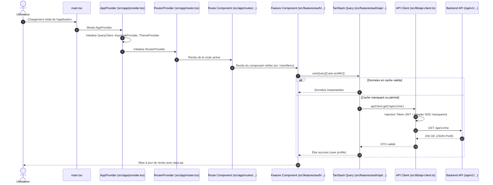

# Change : 009 - Restructuration Architecture Frontend selon Bulletproof React

## Métadonnées
* **Domaine concerné :** `.specs/current/domains/platform/` (avec déclinaison sur `auth-and-identity`)
* **Type de changement :** `Refonte` | `Standardisation Architecture Frontend`
* **Cible :** `frontend` | `tests-e2e`

---

## 1. Intention & Contexte (Le « Why » du Delta)

* **Problème résolu / Besoin :**
  L'application frontend React actuelle (`frontend/src/`) présente une organisation de code plate et hétérogène :
  - L'authentification est isolée dans un dossier `src/auth/` sans convention modulaire unifiée.
  - Les composants UI sont regroupés sans distinction entre composants génériques réutilisables (UI Kit) et composants à responsabilité métier.
  - Il n'existe pas de standard pour le data fetching : aucune couche TanStack Query n'est instanciée pour gérer le cache serveur, les invalidations ou les états de chargement/erreur asynchrones (bien que mentionné dans `.specs/architecture.md`).
  - Il n'y a pas de routeur déclaratif permettant d'évoluer vers une navigation multi-pages avec layouts imbriqués, pages d'erreurs dédiées et lazy-loading.
  - Les chemins d'importation reposent sur des chemins relatifs fragiles (`../..`) faute d'alias TypeScript/Vite (`@/*`).
  - L'absence de frontières de modules étanches expose le code à des dépendances circulaires et à des fuites d'abstraction au fur et à mesure que les domaines métier (espaces de travail, canvas `.nanko`) se développent.

* **Impact utilisateur & développeur :**
  - **Pour l'utilisateur :** Amélioration des temps de réponse grâce au cache TanStack Query, élimination des flashs d'écran lors des transitions de navigation grâce au routeur React Router, et meilleure résilience globale en cas d'erreur de rendu via des Error Boundaries contextualisées.
  - **Pour l'équipe d'ingénierie :** Alignement strict sur le standard industriel de référence [Bulletproof React](https://github.com/alan2207/bulletproof-react) (par Alan Rosario). Chaque domaine fonctionnel devient une « feature » autonome, modulaire, testable en isolation et exposée uniquement par son barrel export (`index.ts`).

* **In Scope (Ce qui est ajouté/modifié) :**
  - **Configuration des Alias de Chemins (@/*) :**
    - Configuration de `@/*` pointant sur `frontend/src/*` dans `frontend/tsconfig.app.json`, `frontend/tsconfig.json` et `frontend/vite.config.ts`.
  - **Intégration des Dépendances Clés :**
    - Ajout de `react-router` (v7) pour le routage déclaratif, la hiérarchie de layouts et la gestion des routes publiques/protégées.
    - Ajout de `@tanstack/react-query` pour la gestion standardisée du cache serveur, des requêtes et mutations.
  - **Topologie Bulletproof React sous `frontend/src/` :**
    - `src/app/` :
      - `provider.tsx` (`AppProvider`) : Composition hiérarchique de l'ensemble des providers globaux (`ErrorBoundary`, `QueryClientProvider`, `KeycloakProvider`, `ThemeProvider`).
      - `router.tsx` ou `routes/` : Déclaration centralisée de l'arbre de routage avec `createBrowserRouter` / `RouterProvider`.
      - `App.tsx` : Point d'entrée de niveau application montant `AppProvider` et le routeur.
    - `src/features/` : Architecture pilotée par les fonctionnalités (*feature-based*).
      - Migration de `src/auth/` vers `src/features/auth/` avec la structure standard :
        - `api/` : Requêtes API typées et hooks React Query (ex: `getUserProfileQuery` consommant `/api/v1/me`).
        - `components/` : Composants dédiés au domaine auth (`UserMenu.tsx`, `LoginForm.tsx`, `ProtectedRoute.tsx`).
        - `hooks/` : Hooks propres à la feature (`useAuth.ts`).
        - `types/` : Types TypeScript et interfaces du domaine auth.
        - `index.ts` : **Barrel export strict** exposant l'API publique de la feature. Interdiction d'importer des fichiers internes depuis l'extérieur de `features/auth/`.
    - `src/components/` : Composants UI génériques et partagés, indépendants de tout domaine métier :
      - `ui/` : Éléments atomiques réutilisables (`Button.tsx`, `Spinner.tsx`, `Card.tsx`, etc.).
      - `layout/` : Layouts transverses (`MainLayout.tsx`, `Header.tsx`, `Footer.tsx`).
    - `src/lib/` : Abstractions et instances de bibliothèques tierces préconfigurées :
      - `api-client.ts` : Client HTTP unifié encapsulant `fetch`, l'injection automatique du token JWT Bearer, la propagation du contexte W3C `traceparent` (OpenTelemetry), et la transformation normalisée des erreurs API (`422`, `401`, `403`, `500`).
      - `react-query.ts` : Configuration centralisée de l'instance `QueryClient` avec options par défaut optimisées (retry backoff, staleTime, gcTime).
    - `src/types/` : Types TypeScript génériques transversaux (`api.ts` pour `ApiResponse<T>`, `ApiError`, etc.).
    - `src/utils/` : Fonctions utilitaires pures partagées (`cn.ts` pour concaténation de classes, helpers de formatage).
    - `src/testing/` : Utilitaires de tests UI (`test-utils.tsx`) exportant une fonction `render` personnalisée enveloppant les composants dans les providers de test (`AppTestProvider`).
  - **Préservation des Invariants & Sélecteurs :**
    - Maintien strict de la conformité avec la spec 007 (`data-qa` sur tous les composants interactifs).
    - Maintien de l'intégration OpenTelemetry et logs (specs 004 et 008).

* **Out of Scope (Exclusions strictes) :**
  - Modification de l'API Backend Symfony ou du schéma de base de données PostgreSQL (aucun impact backend).
  - Modification de `landing/` ou `library/`.
  - Implémentation du moteur de rendu complet de canvas de schéma `.nanko` (objet d'une spec dédiée ultérieure).

---

## 2. Flux & Architecture (Diff)

### 2.1. Topologie des Dossiers Avant / Après

```text
AVANT (Structure plate / hétérogène) :
frontend/src/
├── assets/
├── auth/                      # Non isolé, pas de barrel file
│   ├── KeycloakProvider.tsx
│   ├── ProtectedRoute.tsx
│   ├── httpClient.ts          # Client HTTP mélangé à l'auth
│   ├── keycloak.ts
│   └── ...
├── components/                # Pas de distinction UI vs Métier
│   └── UserMenu.tsx
├── config/
│   ├── env.ts
│   └── telemetry.ts
├── App.css
├── App.tsx                    # Composant monolithique mélangeant vues et navigation
├── index.css
└── main.tsx

APRÈS (Bulletproof React Standard) :
frontend/src/
├── app/                       # Racine applicative, providers et routage
│   ├── routes/                # Déclaration des routes et layouts
│   │   ├── app/               # Routes authentifiées (/ et sous-pages)
│   │   ├── auth/              # Routes publiques / callbacks
│   │   └── not-found.tsx      # Vue 404
│   ├── provider.tsx           # AppProvider (ErrorBoundary, QueryClient, Auth, Theme)
│   ├── router.tsx             # createBrowserRouter
│   └── App.tsx                # Racine de l'arbre de composants
├── assets/                    # Assets statiques globaux (logos, icônes)
├── components/                # Composants UI partagés, purs et réutilisables
│   ├── ui/                    # Boutons, spinners, conteneurs, alertes
│   └── layout/                # Layouts structurels réutilisables
├── config/                    # Configuration globale validée par Zod
│   ├── env.ts                 # Schema Zod d'environnement
│   └── telemetry.ts           # Initialisation OpenTelemetry
├── features/                  # Modules métier étanches (Bounded Contexts frontend)
│   └── auth/                  # Feature d'authentification et profil
│       ├── api/               # Hooks React Query & requêtes API
│       │   └── getUser.ts
│       ├── components/        # Composants de la feature
│       │   ├── UserMenu.tsx
│       │   └── ProtectedRoute.tsx
│       ├── hooks/             # Hooks dédiés (useAuth)
│       ├── types/             # Types spécifiques à l'auth
│       └── index.ts           # Seul point d'entrée public de la feature
├── lib/                       # Singletons et wrappers de librairies tierces
│   ├── api-client.ts          # Client API fetch universel avec JWT & OTel
│   ├── keycloak.ts            # Client Keycloak JS
│   └── react-query.ts         # QueryClient et utilitaires TanStack Query
├── testing/                   # Harnais de test et wrappers RTL
│   └── test-utils.tsx         # renderWithProviders custom
├── types/                     # Types transverses partagés (API, pagination)
├── utils/                     # Helpers purs (cn, formatage)
├── index.css                  # Design tokens & styles globaux
└── main.tsx                   # Point d'entrée du bundler Vite
```

### 2.2. Diagramme de Flux de Données & Orchestration



---

## 3. Delta Modèle de données & Base de données

> [!NOTE]
> Cette évolution est une **refonte purement structurelle et architecturale du client React (`frontend/`)**. Aucun modèle de données, aucune table SQL PostgreSQL, aucune entité Doctrine DBAL et aucune migration backend ne sont ajoutés ou modifiés.

### 3.1. Diagramme Entité-Relation
*Aucune modification de base de données.*

### 3.2. Modifications de tables
*Aucune modification de table.*

### 3.3. Règles de migration & Intégrité
*Aucune migration de base de données requise.*

---

## 4. Delta Contrats d'API (Symfony)

> [!NOTE]
> Aucun nouvel endpoint n'est introduit côté Backend Symfony. Le client API unifié (`src/lib/api-client.ts`) et les hooks TanStack Query consomment les endpoints existants selon des contrats TypeScript et des schémas Zod stricts.

### Endpoints consommés via `src/lib/api-client.ts`

| Méthode | Endpoint | Authentification | Consommateur Frontend | Schéma de Réponse Zod |
|---|---|---|---|---|
| `GET` | `/api/v1/version` | `PUBLIC_ACCESS` | `src/features/system/api/getVersion.ts` | `versionResponseSchema` |
| `GET` | `/api/v1/me` | `ROLE_USER` (Bearer JWT) | `src/features/auth/api/getUser.ts` | `userProfileSchema` |

#### Typage client normalisé des erreurs API (`src/types/api.ts`) :
```typescript
export interface ApiValidationError {
  violations: Array<{
    propertyPath: string;
    title: string;
  }>;
}

export interface ApiBusinessError {
  code: string;
  message: string;
}

export type ApiErrorResponse = ApiValidationError | ApiBusinessError;

export class ApiError extends Error {
  constructor(
    public status: number,
    public data?: ApiErrorResponse,
    message?: string
  ) {
    super(message ?? `HTTP Error ${status}`);
    this.name = 'ApiError';
  }
}
```

---

## 5. Configuration Réseau, Prérequis DNS & Sécurisation des Endpoints

### 5.1. Prérequis DNS Externes
*Aucun nouvel enregistrement DNS requis. L'application reste déployée sur `app.preprod.nanko.dev` et `app.nanko.dev`.*

### 5.2. Matrice d'Exposition et Sécurisation des Endpoints

| Endpoint / Service | Exposition | Authentification | Mesures de mitigation client |
|---|---|---|---|
| `app.nanko.dev` | Publique | N/A (SPA statique servie par Caddy) | HSTS, CSP, Cache-Control adapté |
| `GET /api/v1/me` | Restreinte | Bearer Token JWT (Keycloak) | Injection automatique du Bearer token dans `src/lib/api-client.ts`, rafraîchissement transparent via `keycloak.updateToken` sur 401 |
| Collecteur OTLP | Publique / Interne | Optionnel / Ouvert aux origines Nanko | Injection de W3C `traceparent` via `src/lib/api-client.ts` avec résilience fail-open |

### 5.3. Variables d'Environnement & Secrets requis
*Les variables d'environnement validées par Zod dans `src/config/env.ts` demeurent inchangées :*

| Variable | Composant | Environnement | Description |
|---|---|---|---|
| `VITE_API_BASE_URL` | `frontend` | Tous | URL de base de l'API Symfony (défaut : `http://localhost:8000`) |
| `VITE_KEYCLOAK_URL` | `frontend` | Tous | URL du serveur Keycloak (défaut : `http://localhost:8080`) |
| `VITE_KEYCLOAK_REALM` | `frontend` | Tous | Nom du Realm Keycloak (`nanko`) |
| `VITE_KEYCLOAK_CLIENT_ID` | `frontend` | Tous | Client ID OAuth2 (`nanko-app`) |
| `VITE_OTEL_EXPORTER_URL` | `frontend` | Préprod / Prod | URL d'ingestion OTLP HTTP (ex : `https://otlp.nanko.dev/v1/traces`) |

---

## 6. Delta Maquettes & Layout UI

### 6.1. Référence Visuelle
* **Cohérence :** Préservation intégrale de l'interface visuelle existante et des maquettes définies dans la spec 006 (Palette Nanko `#2C4A3B` / `#5EEAD4`, typographies IBM Plex / Archivo).
* **Bénéfice :** Cette refonte découple la logique de mise en page dans `src/components/layout/` et `src/app/routes/` sans modifier le rendu visuel perçu par l'utilisateur.

### 6.2. Wireframes Conceptuels & Arborescence des Routes

#### Hiérarchie de Routage (`src/app/routes/`)
```text
/ (App Layout)
├── / (Home / Dashboard) ──> [DashboardRoute] (si authentifié) ou [LandingRoute] (si anonyme)
├── /auth/callback ───────> [AuthCallbackRoute] (gestion retour SSO)
└── * ─────────────────────> [NotFoundRoute] (page 404 soignée Nanko)
```

#### Vue Desktop Structurelle (Layout imbriqué)
```text
+-----------------------------------------------------------------------+
|  [Header / BrandLogo]               [NavLinks]    [ThemeSwitch] [User] |
+-----------------------------------------------------------------------+
|                                                                       |
|  <Outlet />                                                           |
|  (Zone de contenu dynamique pilotée par React Router)                 |
|                                                                       |
+-----------------------------------------------------------------------+
|  [Footer / Version info / Liens légaux]                               |
+-----------------------------------------------------------------------+
```

### 6.3. Squelette JSX & Arborescence attendue

```tsx
// src/app/provider.tsx
import * as React from 'react';
import { QueryClientProvider } from '@tanstack/react-query';
import { queryClient } from '@/lib/react-query';
import { KeycloakProvider } from '@/features/auth';
import { AppErrorBoundary } from '@/components/ui/error-boundary';

interface AppProviderProps {
  children: React.ReactNode;
}

export function AppProvider({ children }: AppProviderProps) {
  return (
    <AppErrorBoundary>
      <QueryClientProvider client={queryClient}>
        <KeycloakProvider>
          {children}
        </KeycloakProvider>
      </QueryClientProvider>
    </AppErrorBoundary>
  );
}
```

```tsx
// src/app/router.tsx
import { createBrowserRouter, RouterProvider } from 'react-router';
import { AppLayout } from '@/components/layout/AppLayout';
import { HomePage } from './routes/app/home';
import { NotFoundPage } from './routes/not-found';

export const router = createBrowserRouter([
  {
    path: '/',
    element: <AppLayout />,
    children: [
      {
        index: true,
        element: <HomePage />,
      },
      {
        path: '*',
        element: <NotFoundPage />,
      },
    ],
  },
]);

export function AppRouter() {
  return <RouterProvider router={router} />;
}
```

---

## 7. Delta Spécifications UI & Logique Client (React)

### 7.1. Schéma de Client HTTP Centralisé (`src/lib/api-client.ts`)

```typescript
import { env } from '@/config/env';
import { keycloak } from './keycloak';
import { injectTraceContext } from '@/config/telemetry';
import { ApiError } from '@/types/api';

interface RequestOptions extends RequestInit {
  params?: Record<string, string>;
}

export async function apiClient<T>(endpoint: string, options: RequestOptions = {}): Promise<T> {
  const { params, headers: customHeaders, ...restOptions } = options;
  
  // 1. Construction URL avec query parameters
  const url = new URL(endpoint.startsWith('http') ? endpoint : `${env.apiBaseUrl}${endpoint}`);
  if (params) {
    Object.entries(params).forEach(([key, val]) => url.searchParams.append(key, val));
  }

  // 2. Gestion du Bearer Token Keycloak avec refresh préventif
  const headers = new Headers(customHeaders);
  headers.set('Content-Type', 'application/json');
  headers.set('Accept', 'application/json');

  if (keycloak.authenticated && keycloak.token) {
    try {
      await keycloak.updateToken(30);
    } catch {
      // Échec de refresh silencieux, la requête tentera avec le token actuel
    }
    headers.set('Authorization', `Bearer ${keycloak.token}`);
  }

  // 3. Injection OpenTelemetry W3C Trace Context
  const headersObj = Object.fromEntries(headers.entries());
  const tracedHeaders = injectTraceContext(headersObj);

  // 4. Exécution de la requête
  const response = await fetch(url.toString(), {
    ...restOptions,
    headers: tracedHeaders,
  });

  // 5. Gestion standardisée des retours d'erreur
  if (!response.ok) {
    let errorData: any;
    try {
      errorData = await response.json();
    } catch {
      errorData = { message: response.statusText };
    }
    throw new ApiError(response.status, errorData);
  }

  // 6. Parsing JSON du payload de succès
  if (response.status === 204) {
    return {} as T;
  }
  return response.json() as Promise<T>;
}
```

### 7.2. Hook Feature TanStack Query (`src/features/auth/api/getUser.ts`)

```typescript
import { useQuery } from '@tanstack/react-query';
import { apiClient } from '@/lib/api-client';
import { userProfileSchema, type UserProfile } from '../types';

export const userProfileQueryKey = ['auth', 'user-profile'] as const;

export async function fetchUserProfile(): Promise<UserProfile> {
  const data = await apiClient<unknown>('/api/v1/me');
  return userProfileSchema.parse(data);
}

export function useUserProfile(enabled = true) {
  return useQuery({
    queryKey: userProfileQueryKey,
    queryFn: fetchUserProfile,
    enabled,
    staleTime: 5 * 60 * 1000, // 5 minutes de validité
  });
}
```

### 7.3. Matrice des 5 États UI (Bulletproof React)

Pour tout composant de feature dépendant de données asynchrones (ex. `UserMenu`, `UserProfileCard`) :

| État | Déclencheur | Rendu visuel & Comportement |
|---|---|---|
| **Idle** | Composant non activé ou condition d'activation non satisfaite | Rendu neutre ou rien (ex. utilisateur non connecté). |
| **Loading** | Requête en vol (`isLoading === true`) | Skeleton loader ou `Spinner` accessible (`data-qa="*-loading"`). |
| **Error** | Rejet de la promesse (`isError === true`) | Message d'erreur discret ou bouton de réessai (`refetch()`). |
| **Empty** | Données retournées mais vides (`[]` ou null) | État vide explicite invitant à l'action. |
| **Success** | Données disponibles et validées par Zod | Affichage fluide des données avec attributs `data-qa` dédiés. |

---

## 8. Invariants & Cas limites (*Edge cases*)

1. **Règle d'or de l'Encapsulation des Features (Feature Boundaries) :**
   - Aucune partie de l'application (qu'il s'agisse d'une autre feature ou d'un composant de `app/`) n'est autorisée à importer un fichier depuis l'intérieur d'une feature (`import { ... } from '@/features/auth/components/UserMenu'`).
   - Tout import doit passer **strictement** par le barrel file racine de la feature : `import { UserMenu, useAuth } from '@/features/auth'`.
   - Les features ne doivent pas dépendre les unes des autres de façon circulaire. Si un composant ou un hook est partagé par deux features, il doit être extrait dans `src/components/`, `src/hooks/` ou `src/utils/`.

2. **Résilience et Expiration de Token (Gestion 401) :**
   - Lorsque `apiClient` reçoit une réponse HTTP 401, il tente de déclencher le rafraîchissement du jeton Keycloak. Si le rafraîchissement échoue définitivement, l'état d'authentification bascule proprement vers la déconnexion avec nettoyage du cache TanStack Query (`queryClient.clear()`).

3. **Stabilité des Sélecteurs E2E `data-qa` :**
   - Tous les sélecteurs normalisés dans la spec 007 (`data-qa="user-menu"`, `data-qa="login-button"`, `data-qa="logout-button"`, `data-qa="nav-logo"`) doivent être rigoureusement conservés dans les nouveaux composants réorganisés sous `src/features/auth/` et `src/components/layout/`.
   - Aucun test Playwright dans `tests-e2e/` ne doit être modifié ou cassé par la restructuration des dossiers.

4. **Compatibilité stricte TypeScript & Bundler :**
   - La résolution des alias `@/*` doit être déclarée à la fois dans `tsconfig.app.json` (pour `tsc -b` / Oxlint) et dans `vite.config.ts` (pour Vite dev server et rollup build).

---

## 9. Plan d'exécution séquentiel

- [ ] **Phase 1 : Outillage, Dépendances & Alias de Chemins**
  - [ ] 1. Installer `react-router` (v7) et `@tanstack/react-query` dans `frontend/`.
  - [ ] 2. Configurer l'alias `@/*` dans `frontend/tsconfig.app.json` et `frontend/tsconfig.json` (`baseUrl: "."`, `paths: { "@/*": ["src/*"] }`).
  - [ ] 3. Configurer l'alias `@/*` dans `frontend/vite.config.ts` via `node:path` / `fileURLToPath`.
  - [ ] 4. Valider la compilation avec `pnpm --filter frontend typecheck`.

- [ ] **Phase 2 : Fondations Lib & Types Partagés (`frontend/src/lib/`, `frontend/src/types/`, `frontend/src/utils/`)**
  - [ ] 1. Créer `src/types/api.ts` (types génériques d'erreurs et réponses API).
  - [ ] 2. Créer `src/utils/cn.ts` (helper de concaténation de classes).
  - [ ] 3. Créer `src/lib/react-query.ts` (instance `queryClient` configurée avec defaults stricts).
  - [ ] 4. Créer `src/lib/api-client.ts` (client universel fetch avec JWT, Trace Context OTel et gestion d'erreurs).
  - [ ] 5. Déplacer et renommer `src/auth/keycloak.ts` dans `src/lib/keycloak.ts`.

- [ ] **Phase 3 : Migration Feature Auth (`frontend/src/features/auth/`)**
  - [ ] 1. Déplacer les composants d'authentification sous `src/features/auth/components/` (`UserMenu.tsx`, `ProtectedRoute.tsx`).
  - [ ] 2. Déplacer `KeycloakProvider.tsx`, `context.ts`, `useAuth.ts` sous `src/features/auth/hooks/` et `src/features/auth/components/`.
  - [ ] 3. Créer `src/features/auth/api/getUser.ts` avec hook `useUserProfile` basé sur TanStack Query.
  - [ ] 4. Créer `src/features/auth/types/index.ts` avec les définitions et schémas Zod.
  - [ ] 5. Créer `src/features/auth/index.ts` (barrel export exportant uniquement l'API publique de la feature).

- [ ] **Phase 4 : Composants UI Partagés & Layouts (`frontend/src/components/`)**
  - [ ] 1. Créer `src/components/ui/` (composants atomiques `Spinner.tsx`, `Button.tsx`, `ErrorBoundary.tsx`).
  - [ ] 2. Créer `src/components/layout/` (`AppLayout.tsx`, `Navbar.tsx`, `Footer.tsx`) en préservant tous les sélecteurs `data-qa`.

- [ ] **Phase 5 : Couche Applicative & Routage Déclaratif (`frontend/src/app/`)**
  - [ ] 1. Créer `src/app/provider.tsx` (`AppProvider` composant `QueryClientProvider`, `KeycloakProvider`, etc.).
  - [ ] 2. Créer `src/app/routes/` avec `home.tsx` et `not-found.tsx`.
  - [ ] 3. Créer `src/app/router.tsx` avec `createBrowserRouter`.
  - [ ] 4. Refactoriser `src/app/App.tsx` pour monter `AppProvider` et `AppRouter`.
  - [ ] 5. Nettoyer les anciens fichiers orphelins (`src/auth/`, ancien `src/components/UserMenu.tsx`, ancien `src/App.css` si rendu obsolète).

- [ ] **Phase 6 : Harnais de Test UI (`frontend/src/testing/`)**
  - [ ] 1. Créer `src/testing/test-utils.tsx` (méthode `renderWithProviders` encapsulant les providers TanStack Query et router).
  - [ ] 2. Ajouter un test unitaire validant le client API et le barrel file de la feature auth.

- [ ] **Phase 7 : Validation des Quality Gates & Non-Régression**
  - [ ] 1. Exécuter `pnpm --filter frontend typecheck` pour valider l'absence d'erreurs TypeScript.
  - [ ] 2. Exécuter `pnpm --filter frontend lint` pour valider l'absence d'erreurs Oxlint.
  - [ ] 3. Exécuter `pnpm --filter frontend build` pour vérifier le bundling Vite de production.
  - [ ] 4. Exécuter la suite de tests E2E `pnpm --filter tests-e2e exec playwright test` pour confirmer l'absence absolue de régression fonctionnelle.

- [ ] **Phase 8 : Synchronisation Documentaire (via `/sync-current`)**
  - [ ] 1. Mettre à jour `.specs/current/domains/platform/tech.md` pour acter la topologie Bulletproof React.
  - [ ] 2. Déplacer cette spec dans `.specs/changes/archive/009-bulletproof-react-architecture.md`.

---

## 10. Definition of Done & Stratégie de tests

### 10.1. Scénarios de validation (Format Gherkin avec tags)

```gherkin
# ==============================================================================
# TESTS E2E (tests-e2e/ - Non-régression complète du portail et des sélecteurs)
# ==============================================================================

@e2e @platform
Fonctionnalité: Non-régression de l'application sous architecture Bulletproof React

  Scénario: Rendu nominal de l'application restructurée avec layout et navbar
    Étant donné que l'utilisateur navigue sur l'URL d'accueil "/"
    Alors la barre de navigation est visible avec le sélecteur '[data-qa="nav-logo"]'
    Et le menu utilisateur affiche l'état d'authentification approprié

  Scénario: Préservation des sélecteurs data-qa lors de la connexion Keycloak
    Étant donné que l'utilisateur clique sur '[data-qa="login-button"]'
    Alors il est redirigé vers la page de connexion de l'identité
    Et après authentification, le composant '[data-qa="user-menu"]' s'affiche avec son email

# ==============================================================================
# TESTS FRONTEND (frontend/ - Unitaires & Intégration UI)
# ==============================================================================

@web @unit
Fonctionnalité: Résolution des alias et encapsulation des modules

  Scénario: Résolution correcte de l'alias de chemin @/*
    Quand un composant importe depuis "@/lib/react-query" ou "@/features/auth"
    Alors le compilateur TypeScript résout le module sans erreur

  Scénario: Encapsulation stricte de la feature auth via barrel file
    Quand la racine de l'application consomme la feature "auth"
    Alors seuls les symboles explicitement exportés par "@/features/auth/index.ts" sont accessibles

@web @unit
Fonctionnalité: Client API centralisé et intercepteur HTTP

  Scénario: apiClient injecte le header Authorization en présence d'un token valide
    Étant donné une session Keycloak authentifiée avec un token "valid-jwt-token"
    Quand une requête est émise via "apiClient('/api/v1/me')"
    Alors l'en-tête "Authorization" contient "Bearer valid-jwt-token"
    Et l'en-tête de trace "traceparent" est présent

  Scénario: apiClient convertit les erreurs HTTP en instances d'ApiError
    Étant donné un appel réseau renvoyant un statut HTTP 422 avec un payload de violations
    Quand "apiClient" est invoqué
    Alors la promesse est rejetée avec une instance de "ApiError" contenant le statut 422
```

### 10.2. Commandes de validation automatisée

```bash
# 1. Vérification TypeScript strict avec alias @/*
pnpm --filter frontend typecheck

# 2. Linting et analyse statique Oxlint
pnpm --filter frontend lint

# 3. Build de production Vite
pnpm --filter frontend build

# 4. Exécution de la suite de tests E2E Playwright
pnpm --filter tests-e2e exec playwright test
```
