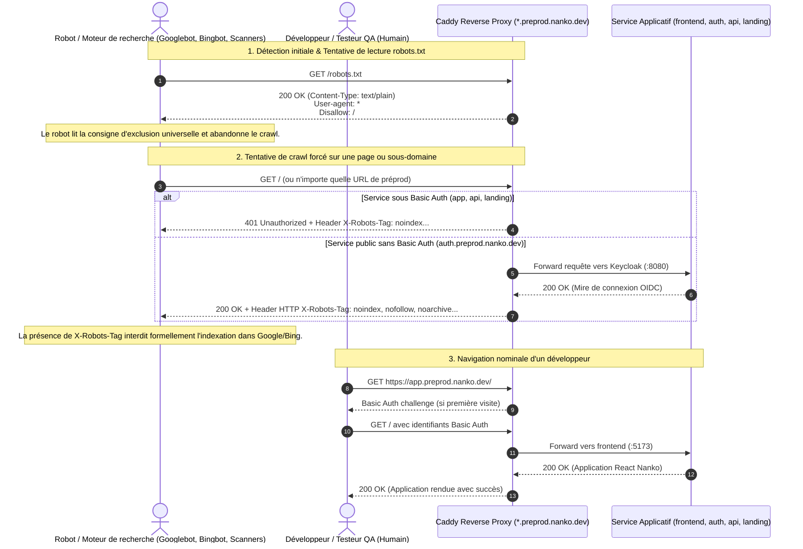

# Change : 010 - Protection Anti-Indexation et Blocage des Robots en Préproduction

## Métadonnées
* **Domaine concerné :** `.specs/current/domains/platform/`
* **Type de changement :** `Évolution` / `Sécurité & Infrastructure`
* **Cible :** `Fullstack` (`infra`, `tests-e2e`)

---

## 1. Intention & Contexte (Le « Why » du Delta)

* **Problème résolu / Besoin :**
  Dès l'émission des certificats TLS Let's Encrypt pour les sous-domaines de préproduction (`*.preprod.nanko.dev`, `signoz.nanko.dev`), ces derniers sont automatiquement et publiquement enregistrés dans les journaux mondiaux de transparence des certificats (*Certificate Transparency logs* ou CT logs). Des robots d'exploration (Googlebot, Bingbot, Yandex, scrapers de vulnérabilités, bots IA) surveillent en continu ces flux CT pour découvrir et indexer immédiatement de nouvelles URLs.
  Actuellement :
  - Bien que `frontend`, `landing` et `backend` disposent d'un label `X-Robots-Tag: "noindex, nofollow"`, le service `keycloak` (`auth.preprod.nanko.dev`) en est totalement dépourvu. Les mires d'authentification et pages de connexion de staging risquent donc d'être indexées par les moteurs de recherche.
  - La directive `noindex, nofollow` existante est minimale et ne bloque ni les snippets, ni l'archivage en cache, ni l'indexation d'images.
  - Aucun endpoint `/robots.txt` n'est servi sur les sous-domaines de préproduction : une requête vers `/robots.txt` renvoie soit un `401 Unauthorized` (derrière Basic Auth), soit une page d'erreur `404 Not Found` HTML Keycloak. Or, le standard RFC 9309 prescrit qu'un robot recevant une réponse ambiguë (ou 401) peut tenter d'explorer les pages sous-jacentes.
  - La stack d'observabilité SigNoz (`signoz.nanko.dev`) ne renvoie pas non plus de directive d'anti-indexation.

* **Impact utilisateur & développeur :**
  - **Pour la marque Nanko :** Garantie absolue qu'aucun résultat de préproduction, aucune mire de staging et aucun contenu dupliqué n'apparaîtra dans les résultats de recherche Google ou Bing (préservation du référencement SEO du site officiel `www.nanko.dev`).
  - **Pour la sécurité :** Élimination de la visibilité des environnements de test et des pages d'authentification Keycloak de préproduction auprès des scanners automatisés.
  - **Pour les robots d'exploration :** Réponse immédiate `200 OK` sur `/robots.txt` avec la directive stricte `User-agent: *\nDisallow: /` sans exigence d'authentification, couplée à un en-tête de réponse HTTP `X-Robots-Tag: noindex, nofollow, noarchive, nosnippet, notranslate, noimageindex` sur toutes les requêtes.

* **In Scope (Ce qui est ajouté/modifié) :**
  - **Durcissement des en-têtes HTTP de réponse Caddy (`infra/preprod/compose.yaml`) :**
    - Ajout/Mise à jour de `caddy.header.X-Robots-Tag: "noindex, nofollow, noarchive, nosnippet, notranslate, noimageindex"` sur TOUS les services exposés en préproduction :
      - `backend` (`api.preprod.nanko.dev`)
      - `frontend` (`app.preprod.nanko.dev`)
      - `landing` (`www.preprod.nanko.dev`)
      - `keycloak` (`auth.preprod.nanko.dev`)
  - **Protection de la Stack Observabilité (`infra/signoz/compose.yaml`) :**
    - Ajout de `caddy.header.X-Robots-Tag: "noindex, nofollow, noarchive, nosnippet, notranslate, noimageindex"` sur `signoz-frontend` (`signoz.nanko.dev`).
  - **Interception native Caddy de `/robots.txt` (Exclusion Globale RFC 9309) :**
    - Configuration de matchers et de réponses Caddy sans authentification pour `/robots.txt` renvoyant le corps textuel standardisé :
      ```text
      User-agent: *
      Disallow: /
      ```
    - Cette réponse `200 OK` est servie directement au niveau du reverse-proxy pour `app.preprod.nanko.dev`, `auth.preprod.nanko.dev`, `www.preprod.nanko.dev` et `api.preprod.nanko.dev`, permettant aux robots de lire immédiatement l'interdiction de crawl sans être bloqués par le challenge HTTP Basic Auth.
  - **Harnais de Validation E2E Automatisé (`tests-e2e/tests/app/robots.spec.ts`) :**
    - Test Playwright validant l'en-tête HTTP `X-Robots-Tag` complet sur les requêtes frontend et navigation.
    - Test Playwright validant l'accessibilité et le contenu de `/robots.txt`.

* **Out of Scope (Exclusions strictes) :**
  - Pas d'application de `noindex` sur l'environnement de production (`infra/prod/compose.yaml`) : le site vitrine `www.nanko.dev` doit demeurer pleinement indexable.
  - Pas de modification de la logique applicative Symfony ou des tokens JWT Keycloak.

---

## 2. Flux & Architecture (Diff)



---

## 3. Delta Modèle de données & Base de données

> [!NOTE]
> Cette évolution est une **configuration purement infrastructure et protocolaire HTTP**. Aucun modèle de données, aucune table SQL PostgreSQL, aucune entité Doctrine DBAL et aucune migration ne sont créés ou modifiés.

### 3.1. Diagramme Entité-Relation
*Aucune modification de base de données.*

### 3.2. Modifications de tables
*Aucune modification de table.*

### 3.3. Règles de migration & Intégrité
*Aucune migration de base de données requise.*

---

## 4. Delta Contrats d'API (Symfony)

> [!NOTE]
> Aucun nouvel endpoint Symfony n'est créé. Les en-têtes HTTP d'anti-indexation sont gérés et injectés nativement par le Reverse Proxy Caddy en amont de tous les services.

### En-tête HTTP normalisé ajouté sur toutes les réponses de préproduction

```http
HTTP/1.1 200 OK
Content-Type: text/html; charset=utf-8
Strict-Transport-Security: max-age=31536000; includeSubDomains; preload
X-Content-Type-Options: nosniff
X-Frame-Options: DENY
X-Robots-Tag: noindex, nofollow, noarchive, nosnippet, notranslate, noimageindex
```

### Contrat de réponse : `GET /robots.txt`

* **Authentification requise :** `PUBLIC_ACCESS` (Exemption explicite de Basic Auth pour permettre aux crawlers de lire le refus sans friction).
* **Headers :** `Content-Type: text/plain; charset=utf-8`
* **Corps de réponse :**
  ```text
  User-agent: *
  Disallow: /
  ```

---

## 5. Configuration Réseau, Prérequis DNS & Sécurisation des Endpoints

### 5.1. Prérequis DNS Externes (Registrar / Zone DNS)
*Les enregistrements DNS existants sous `*.preprod.nanko.dev` et `signoz.nanko.dev` restent inchangés.*

### 5.2. Matrice d'Exposition et Sécurisation des Endpoints

| Hôte / Service | Exposition | Sas d'accès | Directives Anti-Indexation Caddy | Rôle & Justification |
|---|---|---|---|---|
| `app.preprod.nanko.dev` | Restreinte | HTTP Basic Auth | `X-Robots-Tag` + `/robots.txt` public | SPA React de préproduction : protection double barrière |
| `www.preprod.nanko.dev` | Restreinte | HTTP Basic Auth | `X-Robots-Tag` + `/robots.txt` public | Site vitrine de préproduction : pas de concurrence SEO avec prod |
| `api.preprod.nanko.dev` | Restreinte | HTTP Basic Auth | `X-Robots-Tag` + `/robots.txt` public | API Symfony : interdiction d'indexation des réponses JSON/OpenAPI |
| `auth.preprod.nanko.dev` | Publique | Mire OIDC Keycloak | `X-Robots-Tag` + `/robots.txt` public | Serveur IAM : exempt de Basic Auth pour les redirections, impérativement protégé par `X-Robots-Tag` et `robots.txt` |
| `signoz.nanko.dev` | Restreinte | HTTP Basic Auth | `X-Robots-Tag` | Dashboard d'observabilité : proscription du référencement |

### 5.3. Configuration des Labels Caddy Docker Proxy

#### Dans `infra/preprod/compose.yaml` :

Pour chaque service (`frontend`, `landing`, `backend`, `keycloak`) :
```yaml
# En-tête X-Robots-Tag durci
caddy.header.X-Robots-Tag: "noindex, nofollow, noarchive, nosnippet, notranslate, noimageindex"

# Interception et réponse native pour /robots.txt (avant toute règle de basic_auth)
caddy.@robots: "path /robots.txt"
caddy.respond.@robots: |
  "User-agent: *
  Disallow: /" 200
caddy.header.@robots.Content-Type: "text/plain; charset=utf-8"
```

Pour le service `frontend` (`app.preprod.nanko.dev`) en exemple concret :
```yaml
  frontend:
    image: ghcr.io/ngdo-pro/nanko-frontend:preprod
    labels:
      caddy: app.preprod.nanko.dev
      caddy.encode: gzip
      # Matcher d'exclusion pour /robots.txt
      caddy.@robots: "path /robots.txt"
      caddy.respond.@robots: "User-agent: *\nDisallow: /\n" 200
      caddy.header.@robots.Content-Type: "text/plain; charset=utf-8"
      # Basic Auth sur toutes les autres routes (hors robots.txt)
      caddy.@protected: "not path /robots.txt"
      caddy.basic_auth.@protected: "/*"
      caddy.basic_auth.@protected.${PREPROD_HTTP_USER:-nanko}: "${PREPROD_HTTP_HASH}"
      caddy.reverse_proxy: "{{upstreams 8080}}"
      caddy.header.X-Robots-Tag: "noindex, nofollow, noarchive, nosnippet, notranslate, noimageindex"
```

---

## 6. Delta Maquettes & Layout UI

### 6.1. Référence visuelle
*Aucun impact visuel sur l'interface graphique.* Les utilisateurs humains autorisés continuent d'utiliser l'application et le portail Nanko exactement de la même manière.

### 6.2. Wireframes conceptuels (Réponse /robots.txt)
```text
GET /robots.txt HTTP/2
Host: app.preprod.nanko.dev

HTTP/2 200 OK
content-type: text/plain; charset=utf-8
x-robots-tag: noindex, nofollow, noarchive, nosnippet, notranslate, noimageindex

User-agent: *
Disallow: /
```

---

## 7. Delta Spécifications UI & Logique Client (React)

### Matrice des 5 états de réponse HTTP

| État | Déclencheur | Comportement Réseau & Entêtes |
|---|---|---|
| **Robots.txt Request** | Requête `GET /robots.txt` | Réponse immédiate `200 OK` (plain text `User-agent: *\nDisallow: /`), aucune invite Basic Auth. |
| **Unauthorized Visitor** | Requête `GET /` sans Basic Auth | Réponse `401 Unauthorized` avec challenge `WWW-Authenticate: Basic` + en-tête `X-Robots-Tag`. |
| **Authenticated Visitor** | Requête `GET /` avec Basic Auth | Réponse `200 OK` servant l'application React + en-tête `X-Robots-Tag`. |
| **Keycloak Public Route** | Requête `GET /realms/nanko/...` | Réponse `200 OK` servant la mire Keycloak + en-tête `X-Robots-Tag`. |
| **API Request** | Requête `GET /api/v1/version` | Réponse `200 OK` JSON + en-tête `X-Robots-Tag`. |

---

## 8. Invariants & Cas limites (*Edge cases*)

1. **Priorité absolue de `X-Robots-Tag` :**
   - Selon les spécifications officielles de Google Search Central, l'en-tête HTTP `X-Robots-Tag` s'applique à tous les types de contenus (HTML, JSON, scripts JS, feuilles CSS, images, polices) et prime sur les balises HTML `<meta>`.
2. **Exemption de Basic Auth sur `/robots.txt` :**
   - Si `/robots.txt` exigeait une authentification Basic Auth (`401`), la plupart des moteurs de recherche interpréteraient cette indisponibilité comme temporaire et réessaieraient périodiquement, ou pourraient tenter d'indexer les URLs découvertes via les CT logs. La réponse `200 OK` avec `Disallow: /` donne une consigne limpide et définitive.
3. **Étanchéité stricte Préproduction vs Production :**
   - La directive `noindex` et la réponse `Disallow: /` ne doivent sous aucun prétexte être appliquées sur `infra/prod/compose.yaml`. Le site de production `www.nanko.dev` doit pouvoir être exploré et indexé pour assurer l'acquisition organique de Nanko.
4. **Non-régression des Tests E2E Playwright :**
   - Le contournement ou l'exécution des tests E2E via `httpCredentials` doit continuer à fonctionner de manière transparente.

---

## 9. Plan d'exécution séquentiel

- [x] **Phase 1 : Durcissement Infrastructure Préproduction (`infra/`)**
  - [x] 1. Mettre à jour `infra/preprod/compose.yaml` :
    - Configurer `caddy.header.X-Robots-Tag: "noindex, nofollow, noarchive, nosnippet, notranslate, noimageindex"` sur `backend`, `frontend`, `landing`, et `keycloak`.
    - Configurer l'interception native de `/robots.txt` renvoyant `User-agent: *\nDisallow: /\n` avec statut 200 sur `frontend`, `landing`, `backend` et `keycloak`.
    - Ajuster le matcher `caddy.basic_auth` pour exempter le chemin `/robots.txt` sur les services protégés.
  - [x] 2. Mettre à jour `infra/signoz/compose.yaml` :
    - Ajouter `caddy.header.X-Robots-Tag: "noindex, nofollow, noarchive, nosnippet, notranslate, noimageindex"` sur `signoz-frontend`.
  - [x] 3. Valider la syntaxe des fichiers Compose : `docker compose -f infra/preprod/compose.yaml config` et `docker compose -f infra/signoz/compose.yaml config`.

- [x] **Phase 2 : Tests E2E de Validation Anti-Indexation (`tests-e2e/`)**
  - [x] 1. Créer le scénario Playwright `tests-e2e/tests/app/robots.spec.ts` validant :
    - La présence de l'en-tête HTTP `X-Robots-Tag` contenant `noindex` et `nofollow` sur l'application.
    - L'accès à `/robots.txt` et la présence de la directive `Disallow: /`.
  - [x] 2. Exécuter la suite de tests E2E locale : `pnpm --filter tests-e2e test`.

- [x] **Phase 3 : Validation des Quality Gates & Non-Régression**
  - [x] 1. Exécuter l'ensemble des quality gates : `make deptrac`, `make test-backend`, `make static-analysis`, `make lint`.
  - [x] 2. Exécuter les tests frontend : `pnpm --filter frontend test`, `pnpm --filter frontend typecheck`, `pnpm --filter frontend lint`.
  - [x] 3. Exécuter les tests Playwright complets : `make test-e2e`.

- [ ] **Phase 4 : Synchronisation documentaire (via `/sync-current 010`)**
  - [ ] 1. Mettre à jour `.specs/current/domains/platform/behavior.md` (Règle 12 enrichie).
  - [ ] 2. Mettre à jour `.specs/current/domains/platform/tech.md` (Configuration Caddy anti-indexation).
  - [ ] 3. Archiver cette spécification sous `.specs/changes/archive/010-preprod-anti-indexing-robots-protection.md`.

---

## 10. Definition of Done & Stratégie de tests

### 10.1. Scénarios de validation (Format Gherkin avec tags)

```gherkin
# ==============================================================================
# TESTS E2E (tests-e2e/ - Validation de la réponse HTTP et de l'exclusion robots)
# ==============================================================================

@e2e @preprod @security
Fonctionnalité: Protection anti-indexation et directives robots en préproduction

  Scénario: Présence obligatoire de l'en-tête X-Robots-Tag sur l'application web
    Quand le client émet une requête HTTP GET vers l'application de préproduction
    Alors la réponse HTTP contient l'en-tête "X-Robots-Tag"
    Et la valeur contient au minimum "noindex" et "nofollow"

  Scénario: Consultation de robots.txt sans authentification préalable
    Quand un robot ou un client émet une requête HTTP GET vers "/robots.txt"
    Alors le code de statut HTTP est 200
    Et le header "Content-Type" contient "text/plain"
    Et le corps de la réponse contient "User-agent: *"
    Et le corps de la réponse contient "Disallow: /"

  Scénario: Présence de l'en-tête X-Robots-Tag sur la mire Keycloak de préproduction
    Quand une requête HTTP GET est émise vers "https://auth.preprod.nanko.dev/realms/nanko/protocol/openid-connect/auth"
    Alors la réponse contient l'en-tête "X-Robots-Tag" avec "noindex"
```

### 10.2. Commandes de validation automatisée

```bash
# 1. Validation de la syntaxe des configurations Docker Compose
docker compose -f infra/preprod/compose.yaml config
docker compose -f infra/signoz/compose.yaml config

# 2. Exécution de la suite de tests E2E Playwright
pnpm --filter tests-e2e exec playwright test tests/app/robots.spec.ts

# 3. Validation complète des Quality Gates
make test-e2e
```
