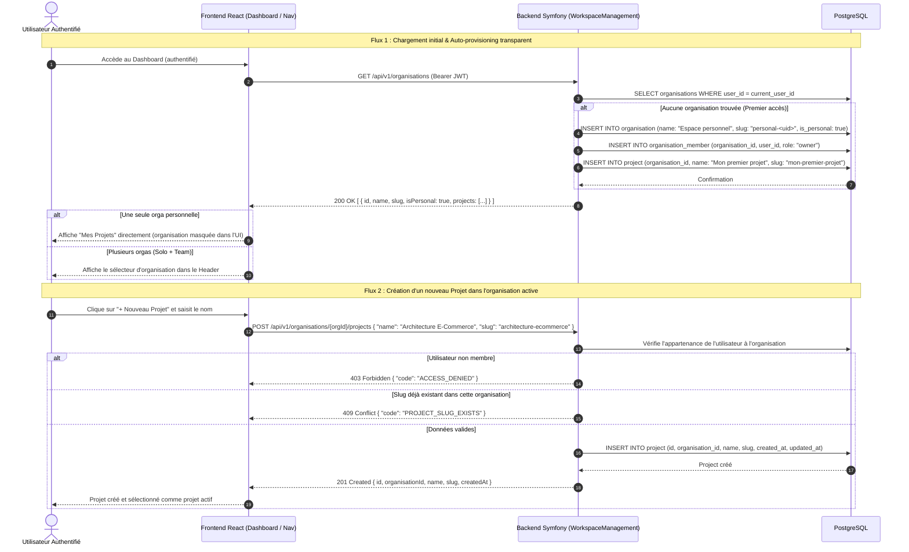
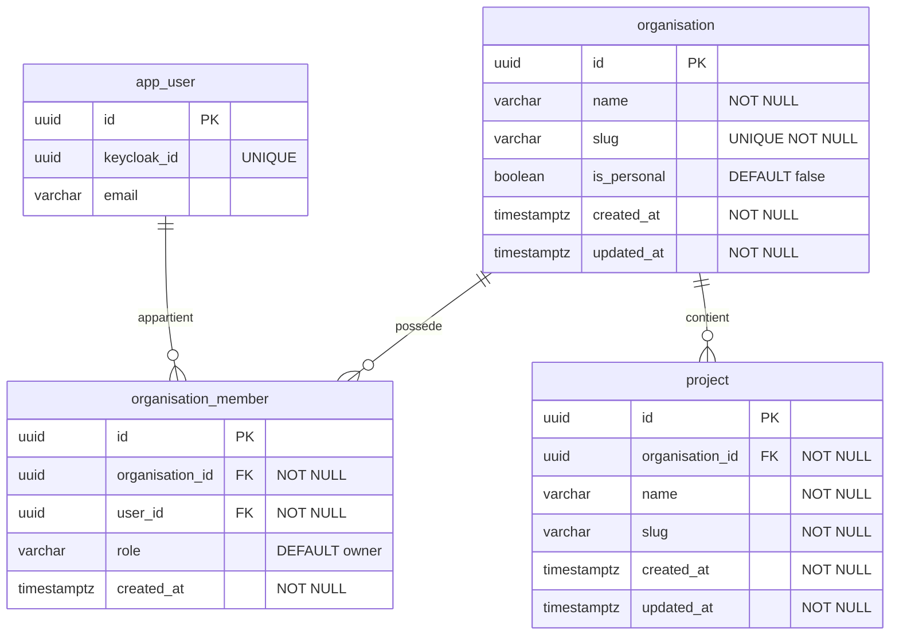

# Change : 012 - Gestion des Organisations et des Projets (WorkspaceManagement)

## Métadonnées
* **Domaine concerné :** `.specs/current/domains/workspace-management/`
* **Type de changement :** `Nouveau module`
* **Cible :** `Fullstack`

---

## 1. Intention & Contexte (Le « Why » du Delta)
* **Problème résolu / Besoin :** Actuellement, aucun conteneur métier n'existe en base de données ni dans l'application une fois l'utilisateur authentifié. L'utilisateur connecté arrive sur un tableau de bord vide avec des boutons fictifs. Dans le modèle métier Nanko, tout document d'architecture `.nanko` doit obligatoirement résider dans un `Project`, lui-même possédé par une `Organisation`.
* **Décision Produit & Modèle d'accès :** 
  * Tout utilisateur dispose automatiquement d'une **Organisation personnelle implicite** (`is_personal = true`) générée en arrière-plan à sa première connexion.
  * **Pas de création d'organisation en libre-service** : la création d'organisations d'équipe (*team* / *company*) est administrée sur demande / discussion directe.
  * **Expérience utilisateur adaptée** :
    * En mode solo (cas par défaut) : l'organisation est invisible pour l'utilisateur. L'interface affiche directement ses projets (« Mes Projets », création de projet, sélection de projet actif) avec zéro friction managériale.
    * Si l'utilisateur est rattaché à une ou plusieurs organisations d'équipe (provisionnées administrativement) : un sélecteur d'organisation s'active dans la barre supérieure pour basculer entre son *Espace personnel* et ses organisations d'équipe.
* **In Scope (Ce qui est ajouté/modifié) :**
  * **Backend (`backend/src/WorkspaceManagement/`)** :
    * Bounded Context modulaire selon l'ADR-002 (`Core/Domain`, `Core/Port`, `Core/UseCase`, `Adapter/Driven`, `Adapter/Driver`).
    * Modèle de données & tables PostgreSQL : `organisation` (avec colonne `is_personal: boolean`), `organisation_member`, `project` avec clés primaires UUIDv7.
    * Service / UseCase d'auto-provisioning transparent lors du premier appel si l'utilisateur n'a aucune organisation personnelle.
    * Endpoints REST :
      * `GET /api/v1/organisations` : Liste des organisations dont l'utilisateur est membre (avec auto-provisioning initial de l'orga personnelle si première visite).
      * `GET /api/v1/organisations/{organisationId}/projects` : Liste des projets d'une organisation accessible.
      * `POST /api/v1/organisations/{organisationId}/projects` : Création d'un projet au sein de l'organisation active.
    * Sécurisation des accès : vérification stricte de l'appartenance à l'Organisation.
  * **Frontend (`frontend/src/`)** :
    * Module `features/workspaces` (schémas Zod, hooks TanStack Query).
    * Gestion de l'organisation active et du projet actif.
    * Header adaptatif : masqué en mode solo (1 seule orga personnelle), sélecteur visible uniquement si présence d'organisations d'équipe.
    * Tableau de bord (`DashboardView`) actualisé : affichage des projets de l'utilisateur, bouton `+ Nouveau Projet` avec modale fonctionnelle, gestion du projet actif.
  * **Tests E2E (`tests-e2e/`)** :
    * Parcours utilisateur complet : premier accès solo transparent, affichage de l'espace, création d'un projet, persistance de la sélection.
* **Out of Scope (Exclusions strictes) :**
  * Création d'organisations en libre-service par les utilisateurs finals (création réservée à l'administration).
  * Système complet d'invitations par email en self-service.
  * Édition et rendu de schémas `.nanko` et `Document` (prévu pour la spec 013).

---

## 2. Flux & Architecture (Diff)



---

## 3. Delta Modèle de données & Base de données

### 3.1. Diagramme Entité-Relation (ERD)



### 3.2. Modifications de tables

#### Table : `organisation` (`Création`)
* **Entité Core :** `backend/src/WorkspaceManagement/Core/Domain/Organisation/Organisation.php`
* **Port Repository :** `backend/src/WorkspaceManagement/Core/Port/Organisation/Repository.php`
* **Adapter Persistence :** `backend/src/WorkspaceManagement/Adapter/Driven/Persistence/Organisation/DoctrineRepository.php`

| Action | Champ | Type SQL / DBAL | Nullable | Contraintes & Index | Description métier |
|---|---|---|---|---|---|
| `Ajout` | `id` | `uuid` (v7) | Non | `PRIMARY KEY` | Identifiant unique de l'organisation. |
| `Ajout` | `name` | `varchar(255)` | Non | - | Nom d'affichage de l'organisation. |
| `Ajout` | `slug` | `varchar(100)` | Non | `UNIQUE INDEX uniq_organisation_slug` | Identifiant d'URL unique en minuscules. |
| `Ajout` | `is_personal` | `boolean` | Non | `DEFAULT false` | Indique s'il s'agit de l'espace solo par défaut. |
| `Ajout` | `created_at` | `timestamp with time zone` | Non | - | Horodatage de création. |
| `Ajout` | `updated_at` | `timestamp with time zone` | Non | - | Horodatage de mise à jour. |

#### Table : `organisation_member` (`Création`)
* **Entité Core :** `backend/src/WorkspaceManagement/Core/Domain/OrganisationMember/OrganisationMember.php`
* **Port Repository :** `backend/src/WorkspaceManagement/Core/Port/OrganisationMember/Repository.php`
* **Adapter Persistence :** `backend/src/WorkspaceManagement/Adapter/Driven/Persistence/OrganisationMember/DoctrineRepository.php`

| Action | Champ | Type SQL / DBAL | Nullable | Contraintes & Index | Description métier |
|---|---|---|---|---|---|
| `Ajout` | `id` | `uuid` (v7) | Non | `PRIMARY KEY` | Identifiant unique de l'adhésion. |
| `Ajout` | `organisation_id` | `uuid` | Non | `FOREIGN KEY REFERENCES organisation(id) ON DELETE CASCADE` | Référence de l'organisation. |
| `Ajout` | `user_id` | `uuid` | Non | `FOREIGN KEY REFERENCES app_user(id) ON DELETE CASCADE` | Référence de l'utilisateur. |
| `Ajout` | `role` | `varchar(50)` | Non | `DEFAULT 'owner'` | Rôle du membre (`owner`, `member`). |
| `Ajout` | `created_at` | `timestamp with time zone` | Non | - | Horodatage d'adhésion. |
| `Contrainte` | `(organisation_id, user_id)` | - | Non | `UNIQUE INDEX uniq_org_member` | Unicité membre par organisation. |

#### Table : `project` (`Création`)
* **Entité Core :** `backend/src/WorkspaceManagement/Core/Domain/Project/Project.php`
* **Port Repository :** `backend/src/WorkspaceManagement/Core/Port/Project/Repository.php`
* **Adapter Persistence :** `backend/src/WorkspaceManagement/Adapter/Driven/Persistence/Project/DoctrineRepository.php`

| Action | Champ | Type SQL / DBAL | Nullable | Contraintes & Index | Description métier |
|---|---|---|---|---|---|
| `Ajout` | `id` | `uuid` (v7) | Non | `PRIMARY KEY` | Identifiant unique du projet. |
| `Ajout` | `organisation_id` | `uuid` | Non | `FOREIGN KEY REFERENCES organisation(id) ON DELETE CASCADE` | Organisation de rattachement. |
| `Ajout` | `name` | `varchar(255)` | Non | - | Nom d'affichage du projet. |
| `Ajout` | `slug` | `varchar(100)` | Non | - | Identifiant technique lisible. |
| `Ajout` | `created_at` | `timestamp with time zone` | Non | - | Horodatage de création. |
| `Ajout` | `updated_at` | `timestamp with time zone` | Non | - | Horodatage de mise à jour. |
| `Contrainte` | `(organisation_id, slug)` | - | Non | `UNIQUE INDEX uniq_project_org_slug` | Unicité du slug de projet par organisation. |

### 3.3. Règles de migration & Intégrité
* **Fichier de migration :** `backend/migrations/Version20260906000001.php`.
* UUIDv7 systématique généré côté applicatif (`Symfony\Component\Uid\Uuid::v7()`).

---

## 4. Delta Contrats d'API (Symfony)

### Endpoint 1 : `GET /api/v1/organisations` (`Nouveau`)
* **Authentification requise :** `ROLE_USER`
* **Headers :** `Authorization: Bearer <token>`
* **Description :** Retourne la liste des organisations dont l'utilisateur est membre avec leurs projets associés. Si l'utilisateur n'a aucune organisation personnelle, elle est provisionnée automatiquement avec son projet initial lors de la première requête.

#### Responses
* `200 OK` :
  ```json
  [
    {
      "id": "0191c0a1-7b3b-7c99-b1d5-2a1d2f34e567",
      "name": "Espace personnel",
      "slug": "personal-0191c0a1",
      "isPersonal": true,
      "role": "owner",
      "createdAt": "2026-09-06T12:00:00Z",
      "projects": [
        {
          "id": "0191c0a1-9a1c-7f88-82bc-3e2c1d45f678",
          "organisationId": "0191c0a1-7b3b-7c99-b1d5-2a1d2f34e567",
          "name": "Mon premier projet",
          "slug": "mon-premier-projet",
          "createdAt": "2026-09-06T12:00:00Z"
        }
      ]
    }
  ]
  ```

---

### Endpoint 2 : `GET /api/v1/organisations/{organisationId}/projects` (`Nouveau`)
* **Authentification requise :** `ROLE_USER`
* **Description :** Liste tous les projets de l'organisation indiquée (réservé aux membres de l'organisation).

#### Responses
* `200 OK` :
  ```json
  [
    {
      "id": "0191c0a1-9a1c-7f88-82bc-3e2c1d45f678",
      "organisationId": "0191c0a1-7b3b-7c99-b1d5-2a1d2f34e567",
      "name": "Mon premier projet",
      "slug": "mon-premier-projet",
      "createdAt": "2026-09-06T12:00:00Z"
    }
  ]
  ```
* `403 Forbidden` : `{"code": "ACCESS_DENIED", "message": "Vous n'avez pas accès à cette organisation."}`
* `404 Not Found` : `{"code": "ORGANISATION_NOT_FOUND", "message": "Organisation introuvable."}`

---

### Endpoint 3 : `POST /api/v1/organisations/{organisationId}/projects` (`Nouveau`)
* **Authentification requise :** `ROLE_USER`
* **Headers :** `Content-Type: application/json`, `Authorization: Bearer <token>`
* **Description :** Création d'un nouveau projet au sein de l'organisation.

#### Request (`CreateProjectInput`)
```json
{
  "name": "Architecture E-Commerce",
  "slug": "architecture-ecommerce"
}
```

#### Responses
* `201 Created` :
  ```json
  {
    "id": "0191c0b3-2222-7f88-82bc-3e2c1d45f678",
    "organisationId": "0191c0a1-7b3b-7c99-b1d5-2a1d2f34e567",
    "name": "Architecture E-Commerce",
    "slug": "architecture-ecommerce",
    "createdAt": "2026-09-06T12:10:00Z"
  }
  ```
* `403 Forbidden` : `{"code": "ACCESS_DENIED", "message": "Action non autorisée sur cette organisation."}`
* `409 Conflict` : `{"code": "PROJECT_SLUG_EXISTS", "message": "Un projet avec ce slug existe déjà dans cette organisation."}`
* `422 Unprocessable Entity` : `{"violations": [{"propertyPath": "name", "title": "Le nom doit comporter au moins 2 caractères."}]}`

---

## 5. Configuration Réseau & Sécurité

* **Exposition :** Endpoints servis sous `/api/v1/` sans nouvelle règle de routage externe.
* **Sécurité :** Authentification obligatoire via JWT Bearer (`ROLE_USER`). Contrôle d'appartenance systématique via `organisation_member` avant toute lecture ou écriture sur un projet.

---

## 6. Delta Maquettes & Layout UI

### 6.1. Wireframes conceptuels (ASCII Layout)

#### Cas A : Mode Solo (Utilisateur avec son Espace personnel uniquement)
```text
+---------------------------------------------------------------------------------------------------+
|  [NANKO Logo]   [ Projet actif : Mon premier projet v ]                             | [user@...]  |
+---------------------------------------------------------------------------------------------------+
|                                                                                                   |
|   MES PROJETS                                                            [ + Nouveau Projet ]     |
|   ---------------------------------------------------------------------------------------------   |
|   - [x] Mon premier projet (actif)                                                                |
|   - [ ] Plateforme API                                                                            |
|                                                                                                   |
|   +-------------------------------------------------------------------------------------------+   |
|   |  Projet actif : Mon premier projet                                                        |   |
|   |  +-------------------------------------------------------------------------------------+  |   |
|   |  |                                [ Icône Schéma ]                                     |  |   |
|   |  |                     Aucun document d'architecture pour le moment                    |  |   |
|   |  |            Commencez par créer votre premier schéma .nanko dans ce projet.          |  |   |
|   |  |                                                                                     |  |   |
|   |  |                     [ + Nouveau Document ]   [ ^ Importer .nanko ]                  |  |   |
|   |  +-------------------------------------------------------------------------------------+  |   |
|   +-------------------------------------------------------------------------------------------+   |
+---------------------------------------------------------------------------------------------------+
```

#### Cas B : Mode Multi-Organisation (Utilisateur rattaché à une Team / Company)
```text
+---------------------------------------------------------------------------------------------------+
|  [NANKO Logo]   [ Org: Acme Corp (Team) v ]  /  [ Projet: Microservices v ]         | [user@...]  |
+---------------------------------------------------------------------------------------------------+
|   (Le sélecteur d'organisation apparaît pour choisir entre "Espace personnel" et "Acme Corp")    |
+---------------------------------------------------------------------------------------------------+
```

### 6.2. Squelette JSX & Arborescence attendue

```text
frontend/src/features/workspaces/
├── api/
│   ├── getOrganisations.ts
│   ├── getProjects.ts
│   └── createProject.ts
├── components/
│   ├── OrganisationSwitcher.tsx   # Affiché uniquement si plusieurs organisations
│   ├── ProjectSwitcher.tsx        # Sélecteur de projet actif
│   └── CreateProjectModal.tsx     # Modale de création d'un projet
├── context/
│   └── WorkspaceContext.tsx       # Fournit activeOrganisation, activeProject, switchProject
├── types/
│   └── index.ts
└── schemas.ts
```

---

## 7. Delta Spécifications UI & Logique Client (React)

### Schéma de validation Zod (`features/workspaces/schemas.ts`)
```typescript
import { z } from 'zod'

export const createProjectSchema = z.object({
  name: z.string().trim().min(2, 'Le nom doit comporter au moins 2 caractères').max(100, 'Nom trop long'),
  slug: z.string().trim().regex(/^[a-z0-9-]+$/, 'Le slug ne peut contenir que des minuscules, chiffres et tirets')
})

export type CreateProjectInput = z.infer<typeof createProjectSchema>
```

### Matrice des états d'interface

| État | Déclencheur | Rendu visuel & Comportement |
|---|---|---|
| **Chargement initial** | Arrivée sur l'app | Spinner central « Chargement de votre espace... ». |
| **Solo actif (Défaut)** | 1 orga personnelle | Pas de sélecteur d'organisation dans le header ; affichage direct des projets et du projet actif. |
| **Multi-orga actif** | ≥ 2 orgas | Sélecteur d'organisation visible dans le header avec libellé clair (ex. « Espace personnel » vs nom de la Team). |
| **Création de projet** | Clic sur `+ Nouveau Projet` | Fenêtre modale avec saisie du nom, génération automatique du slug éditable. |
| **Erreur de soumission** | Erreur 409 ou 422 | Message explicite dans la modale sans rechargement. |
| **Succès création** | Réponse 201 | Modale fermée, nouveau projet automatiquement sélectionné comme actif. |

---

## 8. Invariants & Cas limites (*Edge cases*)
1. **Unicité de l'espace personnel :** Un utilisateur ne peut posséder qu'une seule organisation personnelle (`is_personal: true`).
2. **Pas de création d'organisation ouverte :** Aucun formulaire de création d'organisation n'est exposé à l'utilisateur dans l'interface v1 (modèle sur discussion / administration directe).
3. **Persistance locale :** L'identifiant du projet actif sélectionné est conservé dans `localStorage` pour préserver l'état lors des rafraîchissements de page.
4. **Lexique strict :** Interdiction d'employer les termes « Tenant » ou « Workspace » dans le code métier, les tables ou l'UI. Utiliser exclusivement `Organisation` et `Project`.

---

## 9. Plan d'exécution séquentiel

- [x] **Phase 1 : Base de données & Migration (`backend/`)**
  - [x] 1. Créer la migration `backend/migrations/Version20260906000001.php` avec les tables `organisation` (avec `is_personal`), `organisation_member`, `project`.
  - [x] 2. Exécuter la migration et valider le schéma PostgreSQL.

- [x] **Phase 2 : Backend Hexagonal (`backend/src/WorkspaceManagement/`)**
  - [x] 1. **Domain & Ports** : Définir `Organisation`, `OrganisationMember`, `Project`, les Value Objects et ports `Repository`.
  - [x] 2. **UseCases** :
    - `GetOrCreatePersonalOrganisationUseCase` (auto-provisioning idempotent de l'orga solo).
    - `ListProjectsUseCase`.
    - `CreateProjectUseCase`.
  - [x] 3. **Persistence (DBAL)** : Implémenter les repositories DBAL sous `Adapter/Driven/Persistence/`.
  - [x] 4. **Contrôleurs HTTP** : Contrôleurs sous `Adapter/Driver/Http/Controller/` avec validation Symfony.
  - [x] 5. **Vérifications de Qualité** :
    - Exécuter `make deptrac` (validation de l'isolation hexagonale).
    - Exécuter `make test-backend` et `make static-analysis`.

- [x] **Phase 3 : Frontend (`frontend/src/features/workspaces/`)**
  - [x] 1. Schémas Zod, types et fonctions API TanStack Query.
  - [x] 2. `WorkspaceContext` avec détection automatique du mode solo vs multi-orga.
  - [x] 3. Composants `ProjectSwitcher` et `CreateProjectModal`.
  - [x] 4. Mise à jour de `DashboardView` pour manipuler les vrais projets de l'utilisateur.
  - [x] 5. Valider `pnpm --filter frontend typecheck` et `pnpm --filter frontend lint`.

- [x] **Phase 4 : Tests E2E (`tests-e2e/`)**
  - [x] 1. Test Playwright `tests-e2e/tests/workspace-management.spec.ts` (première connexion solo, création d'un second projet, sélection du projet actif).
  - [x] 2. Valider avec `pnpm --filter tests-e2e exec playwright test`.

- [ ] **Phase 5 : Synchronisation documentaire (`/sync-current`)**
  - [ ] 1. Répercuter le delta dans `.specs/current/domains/workspace-management/`.
  - [ ] 2. Archiver la spec dans `.specs/changes/archive/012-workspace-management-organisation-and-project.md`.

---

## 10. Definition of Done & Stratégie de tests

### 10.1. Scénarios de validation (Format Gherkin)

```gherkin
# ==============================================================================
# TESTS E2E (tests-e2e/)
# ==============================================================================

@e2e @preprod
Fonctionnalité: Gestion des Espaces de Travail Solo & Projets

  Scénario: Première connexion solo transparente
    Étant donné un nouvel utilisateur qui se connecte pour la première fois
    Quand il accède à l'application "/"
    Alors son espace personnel et son premier projet sont initialisés en arrière-plan
    Et l'interface affiche "Mon premier projet" comme projet actif
    Et aucun sélecteur d'organisation encombrant n'est visible

  Scénario: Création d'un nouveau projet
    Étant donné un utilisateur sur son tableau de bord
    Quand il clique sur "+ Nouveau Projet"
    Et qu'il saisit le nom "Microservices Core"
    Et qu'il valide la modale
    Alors le projet "Microservices Core" apparaît dans la liste
    Et devient le projet actif sélectionné

# ==============================================================================
# TESTS BACKEND (backend/)
# ==============================================================================

@api @integration
Fonctionnalité: Auto-provisioning et gestion des projets

  Scénario: Auto-provisioning idempotent de l'orga personnelle
    Quand un utilisateur sans organisation appelle "GET /api/v1/organisations"
    Alors le code de réponse HTTP est 200
    Et le résultat contient une organisation avec "isPersonal: true"
    Et un second appel identique renvoie la même organisation sans doublon

  @api @integration
  Scénario: Création de projet dans l'organisation de l'utilisateur
    Quand un utilisateur appelle "POST /api/v1/organisations/{id}/projects" avec des données valides
    Alors le code de réponse HTTP est 201
    Et le projet est persisté en base rattaché à cette organisation
```

### 10.2. Commandes de validation automatisée

```bash
# 1. Architecture, Base de données & Backend (backend/)
make deptrac
make test-backend
make static-analysis
make lint

# 2. Frontend (frontend/)
pnpm --filter frontend typecheck
pnpm --filter frontend lint

# 3. End-to-End (tests-e2e/)
pnpm --filter tests-e2e exec playwright test
```
