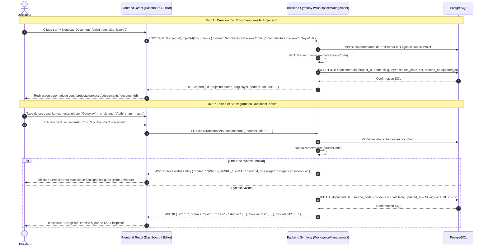
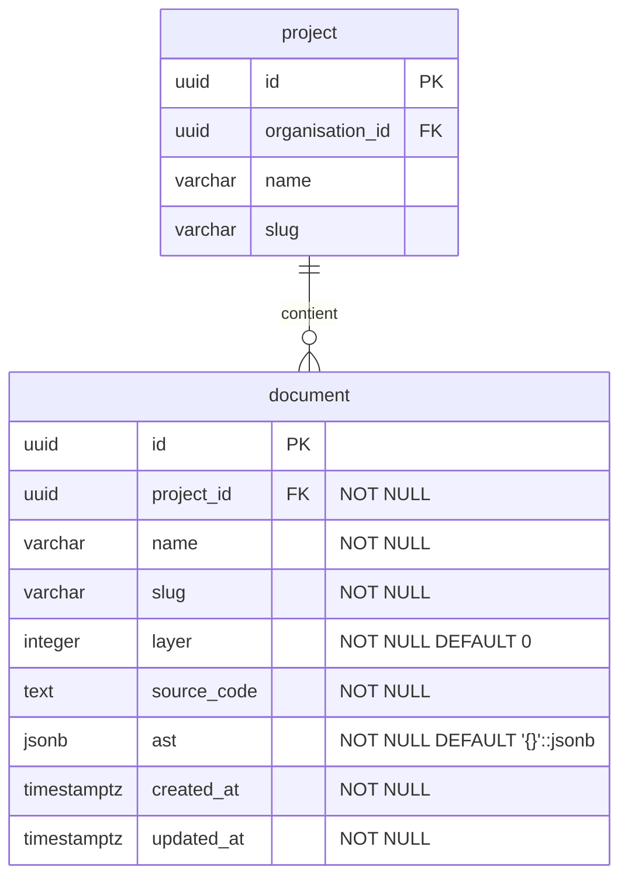

# Change : 014 - Gestion du Document et Édition du Code Source .nanko

## Métadonnées
* **Domaine concerné :** `.specs/current/domains/workspace-management/`
* **Type de changement :** `Évolution`
* **Cible :** `Fullstack`

---

## 1. Intention & Contexte (Le « Why » du Delta)
* **Problème résolu / Besoin :**
  Actuellement, l'application s'arrête à la gestion des Organisations et des Projets (spec 012). Lorsqu'un utilisateur sélectionne un projet sur le Dashboard, il fait face à un conteneur vide sans possibilité de créer ou manipuler des schémas réels. Selon `CONTEXT.md` et `.specs/vision.md`, le cœur métier de Nanko est le **`Document`** : un schéma positionné sur un **`Layer`** (profondeur / z-index) dont le contenu est piloté par un format texte versionné (`.nanko`).
* **Impact utilisateur :**
  L'utilisateur peut créer des documents au sein de son projet actif, définir leur profondeur (`Layer`), accéder à une vue d'édition de code source `.nanko` dédiée, saisir des déclarations de `Shape` et de `Connector`, et sauvegarder directement son Document dont la structure syntaxique est analysée et persistée.
* **In Scope (Ce qui est ajouté/modifié) :**
  * **Backend (`backend/src/WorkspaceManagement/`)** :
    * Modèle relationnel & table PostgreSQL `document` : porte directement l'identité (`name`, `slug`, `layer`) et le contenu (`source_code: text`, `ast: jsonb`).
    * Migration Doctrine `backend/migrations/Version20260907000001.php`.
    * Parseur syntaxique du format `.nanko` (`NankoParser`) : analyse lexicale des blocs d'en-tête (`@id`, `@layer`), des déclarations de `Shape` (`rectangle`, `circle`, `text`), des `Connector` logiques (`A -> B`) et de la section `!LAYOUT ... !END`.
    * Entités Domain, Value Objects, Ports et UseCases hexagonaux :
      * `CreateDocumentUseCase` : création du document avec code source initial template.
      * `ListDocumentsUseCase` : listing des documents d'un projet avec vérification d'appartenance.
      * `GetDocumentUseCase` : récupération des détails d'un document (avec code source et AST).
      * `UpdateDocumentUseCase` : sauvegarde du code source `.nanko`, validation syntaxique et extraction de l'AST JSONB.
    * Contrôleurs REST sous `/api/v1/` :
      * `GET /api/v1/projects/{projectId}/documents`
      * `POST /api/v1/projects/{projectId}/documents`
      * `GET /api/v1/documents/{documentId}`
      * `PUT /api/v1/documents/{documentId}`
  * **Frontend (`frontend/src/`)** :
    * Module `features/documents/` (schémas Zod, hooks TanStack Query).
    * Modale `CreateDocumentModal` accessible depuis le Dashboard (`+ Nouveau Document`).
    * Remplacement de l'état vide sur le Dashboard par la grille des documents du projet actif.
    * Route et vue d'édition `DocumentEditorView` (`/projects/:projectId/documents/:documentId`) :
      * Éditeur de texte dark theme pour le code source `.nanko`.
      * Volet d'inspection affichant les entités extraites (liste des `Shape`, des `Connector` et statut de syntaxe).
      * Bouton d'enregistrement avec raccourci clavier (`Cmd+S` / `Ctrl+S`) et indicateur d'état (sauvegardé / modifications en cours).
  * **Tests E2E (`tests-e2e/`)** :
    * Scénario Playwright complet : création d'un document dans le projet actif, navigation vers l'éditeur, saisie de code `.nanko`, sauvegarde et persistance au rechargement.
* **Out of Scope (Exclusions strictes) :**
  * Rendu graphique interactif sur Canvas/SVG (zoom, pan, drag & drop de positions - planifié pour la spec 015).
  * Système de publication de versions figées immuables (`Version` / `layer:semver`) (planifié pour une spec ultérieure).
  * Analyse de compatibilité inter-layer `@satisfies`.

---

## 2. Flux & Architecture (Diff)



---

## 3. Delta Modèle de données & Base de données

### 3.1. Diagramme Entité-Relation (ERD)



### 3.2. Modifications de tables

#### Table : `document` (`Création`)
* **Entité Core :** `backend/src/WorkspaceManagement/Core/Domain/Document/Document.php`
* **Port Repository :** `backend/src/WorkspaceManagement/Core/Port/Document/Repository.php`
* **Adapter Persistence :** `backend/src/WorkspaceManagement/Adapter/Driven/Persistence/Document/DoctrineRepository.php`

| Action | Champ | Type SQL / DBAL | Nullable | Contraintes & Index | Description métier |
|---|---|---|---|---|---|
| `Ajout` | `id` | `uuid` (v7) | Non | `PRIMARY KEY` | Identifiant unique du document. |
| `Ajout` | `project_id` | `uuid` | Non | `FOREIGN KEY REFERENCES project(id) ON DELETE CASCADE` | Projet propriétaire. |
| `Ajout` | `name` | `varchar(255)` | Non | - | Nom lisible du document. |
| `Ajout` | `slug` | `varchar(100)` | Non | - | Slug technique d'URL. |
| `Ajout` | `layer` | `integer` | Non | `DEFAULT 0` | Attribut de profondeur du Document au sein du Projet (z-index). |
| `Ajout` | `source_code` | `text` | Non | - | Code source textuel brut au format `.nanko`. |
| `Ajout` | `ast` | `jsonb` | Non | `DEFAULT '{}'::jsonb` | Représentation dénormalisée de l'arbre syntaxique (shapes, connectors, layout). |
| `Ajout` | `created_at` | `timestamp with time zone` | Non | - | Date de création. |
| `Ajout` | `updated_at` | `timestamp with time zone` | Non | - | Date de dernière mise à jour. |
| `Contrainte` | `(project_id, slug)` | - | Non | `UNIQUE INDEX uniq_document_project_slug` | Unicité du slug de document par projet. |
| `Index` | `project_id` | `uuid` | Non | `INDEX idx_document_project_id` | Index d'accélération des listings de documents par projet. |

### 3.3. Règles de migration & Intégrité
* **Fichier de migration :** `backend/migrations/Version20260907000001.php`.
* Suppression en cascade configurée : la suppression d'un `project` supprime automatiquement ses `document`.
* Identifiants générés en UUIDv7 applicatif (`Symfony\Component\Uid\Uuid::v7()`).

---

## 4. Delta Contrats d'API (Symfony)

### Endpoint 1 : `GET /api/v1/projects/{projectId}/documents` (`Nouveau`)
* **Authentification requise :** `ROLE_USER`
* **Headers :** `Authorization: Bearer <token>`
* **Description :** Liste tous les documents contenus dans le projet indiqué (avec métadonnées et résumé de l'AST).

#### Responses
* `200 OK` :
  ```json
  [
    {
      "id": "0191c0a1-7b3b-7c99-b1d5-2a1d2f34e567",
      "projectId": "0191c0a1-9a1c-7f88-82bc-3e2c1d45f678",
      "name": "Architecture Globale",
      "slug": "architecture-globale",
      "layer": 0,
      "shapesCount": 3,
      "connectorsCount": 2,
      "createdAt": "2026-09-07T10:00:00Z",
      "updatedAt": "2026-09-07T10:30:00Z"
    }
  ]
  ```
* `403 Forbidden` : `{"code": "ACCESS_DENIED", "message": "Accès refusé à ce projet."}`
* `404 Not Found` : `{"code": "PROJECT_NOT_FOUND", "message": "Projet introuvable."}`

---

### Endpoint 2 : `POST /api/v1/projects/{projectId}/documents` (`Nouveau`)
* **Authentification requise :** `ROLE_USER`
* **Headers :** `Content-Type: application/json`, `Authorization: Bearer <token>`
* **Description :** Crée un nouveau document dans le projet avec un code source initial template `.nanko`.

#### Request (`CreateDocumentInput`)
```php
final readonly class CreateDocumentInput
{
    public function __construct(
        #[Assert\NotBlank(message: 'Le nom du document est obligatoire.')]
        #[Assert\Length(min: 2, max: 255, minMessage: 'Le nom doit comporter au moins 2 caractères.')]
        public string $name,

        #[Assert\NotBlank(message: 'Le slug est obligatoire.')]
        #[Assert\Length(min: 2, max: 100)]
        #[Assert\Regex(pattern: '/^[a-z0-9-]+$/', message: 'Le slug ne peut contenir que des minuscules, chiffres et tirets.')]
        public string $slug,

        #[Assert\NotNull(message: 'Le layer est obligatoire.')]
        #[Assert\Type(type: 'integer', message: 'Le layer doit être un entier.')]
        public int $layer = 0,
    ) {}
}
```

#### Responses
* `201 Created` :
  ```json
  {
    "id": "0191d011-7b3b-7c99-b1d5-2a1d2f34e567",
    "projectId": "0191c0a1-9a1c-7f88-82bc-3e2c1d45f678",
    "name": "Architecture Globale",
    "slug": "architecture-globale",
    "layer": 0,
    "sourceCode": "@id architecture-globale\n@layer 0\n\nrectangle app \"Application\"\n",
    "ast": {
      "shapes": [{ "id": "app", "type": "rectangle", "label": "Application" }],
      "connectors": []
    },
    "createdAt": "2026-09-07T10:00:00Z",
    "updatedAt": "2026-09-07T10:00:00Z"
  }
  ```
* `403 Forbidden` : `{"code": "ACCESS_DENIED", "message": "Action non autorisée sur ce projet."}`
* `409 Conflict` : `{"code": "DOCUMENT_SLUG_EXISTS", "message": "Un document avec ce slug existe déjà dans ce projet."}`
* `422 Unprocessable Entity` : format standard des violations Symfony.

---

### Endpoint 3 : `GET /api/v1/documents/{documentId}` (`Nouveau`)
* **Authentification requise :** `ROLE_USER`
* **Headers :** `Authorization: Bearer <token>`
* **Description :** Retourne le document complet avec son code source `.nanko` et son AST dénormalisé.

#### Responses
* `200 OK` :
  ```json
  {
    "id": "0191d011-7b3b-7c99-b1d5-2a1d2f34e567",
    "projectId": "0191c0a1-9a1c-7f88-82bc-3e2c1d45f678",
    "organisationId": "0191c0a1-1111-7c99-b1d5-2a1d2f34e567",
    "name": "Architecture Globale",
    "slug": "architecture-globale",
    "layer": 0,
    "sourceCode": "@id architecture-globale\n@layer 0\n\nrectangle app \"Application\"\n",
    "ast": {
      "shapes": [{ "id": "app", "type": "rectangle", "label": "Application" }],
      "connectors": []
    },
    "createdAt": "2026-09-07T10:00:00Z",
    "updatedAt": "2026-09-07T10:30:00Z"
  }
  ```
* `403 Forbidden` : `{"code": "ACCESS_DENIED", "message": "Accès refusé à ce document."}`
* `404 Not Found` : `{"code": "DOCUMENT_NOT_FOUND", "message": "Document introuvable."}`

---

### Endpoint 4 : `PUT /api/v1/documents/{documentId}` (`Nouveau`)
* **Authentification requise :** `ROLE_USER`
* **Headers :** `Content-Type: application/json`, `Authorization: Bearer <token>`
* **Description :** Met à jour le code source `.nanko` du document, exécute le parseur syntaxique, extrait l'AST dénormalisé et sauvegarde le document.

#### Request (`UpdateDocumentInput`)
```php
final readonly class UpdateDocumentInput
{
    public function __construct(
        #[Assert\NotNull(message: 'Le code source ne peut pas être nul.')]
        public string $sourceCode,
    ) {}
}
```

#### Responses
* `200 OK` :
  ```json
  {
    "id": "0191d011-7b3b-7c99-b1d5-2a1d2f34e567",
    "projectId": "0191c0a1-9a1c-7f88-82bc-3e2c1d45f678",
    "name": "Architecture Globale",
    "slug": "architecture-globale",
    "layer": 0,
    "sourceCode": "@id architecture-globale\n@layer 0\n\nrectangle app \"Application\"\ncircle db \"Database\"\napp -> db \"requêtes SQL\"\n",
    "ast": {
      "shapes": [
        { "id": "app", "type": "rectangle", "label": "Application" },
        { "id": "db", "type": "circle", "label": "Database" }
      ],
      "connectors": [
        { "source": "app", "target": "db", "label": "requêtes SQL" }
      ],
      "layout": {}
    },
    "updatedAt": "2026-09-07T10:35:00Z"
  }
  ```
* `422 Unprocessable Entity` :
  ```json
  {
    "code": "INVALID_NANKO_SYNTAX",
    "message": "Erreur de syntaxe à la ligne 4 : connecteur 'app -> inconnue' référence une Shape inexistante.",
    "line": 4
  }
  ```
* `403 Forbidden` : `{"code": "ACCESS_DENIED", "message": "Action non autorisée sur ce document."}`

---

## 5. Configuration Réseau, Prérequis DNS & Sécurisation des Endpoints

### 5.1. Prérequis DNS Externes
Aucun nouveau nom de domaine ou sous-domaine requis. Tous les nouveaux endpoints sont servis sous les routes existantes de l'API (`api.nanko.dev` et `api.preprod.nanko.dev`).

### 5.2. Matrice d'Exposition et Sécurisation des Endpoints

| Endpoint / Service | Exposition | Authentification & Contrôle d'accès | Mesures de mitigation |
|---|---|---|---|
| `GET /api/v1/projects/{id}/documents` | Publique (HTTPS) | Bearer Token JWT (`ROLE_USER`) + appartenance Organisation | CORS restreint, Caddy Bearer auth exempté |
| `POST /api/v1/projects/{id}/documents` | Publique (HTTPS) | Bearer Token JWT (`ROLE_USER`) + rôle `owner`/`member` | Payload max 64 Ko, validation DTO Symfony |
| `GET /api/v1/documents/{id}` | Publique (HTTPS) | Bearer Token JWT (`ROLE_USER`) + appartenance Organisation | CORS restreint |
| `PUT /api/v1/documents/{id}` | Publique (HTTPS) | Bearer Token JWT (`ROLE_USER`) + appartenance Organisation | Payload max 2 Mo, validation syntaxique stricte |

### 5.3. Variables d'Environnement & Secrets
Aucun nouveau secret ni variable d'environnement n'est requis pour ce changement.

---

## 6. Delta Maquettes & Layout UI

### 6.1. Wireframes conceptuels (ASCII Layout)

#### Vue 1 : Dashboard du Projet avec Documents (Remplace l'état vide)
```text
+---------------------------------------------------------------------------------------------------+
|  [NANKO Logo]   [ Org: Espace personnel v ]  /  [ Projet: Mon premier projet v ]   | [user@...]   |
+---------------------------------------------------------------------------------------------------+
|                                                                                                   |
|   MES DOCUMENTS                                                           [ + Nouveau Document ]  |
|   ---------------------------------------------------------------------------------------------   |
|   +--------------------------+  +--------------------------+                                      |
|   | Architecture Globale     |  | Modèle de Données Auth   |                                      |
|   | Layer: 0                 |  | Layer: 1                 |                                      |
|   | 3 Shapes · 2 Connectors  |  | 5 Shapes · 4 Connectors  |                                      |
|   | Modifié il y a 5 min     |  | Modifié il y a 2 h       |                                      |
|   | [ Ouvrir l'éditeur -> ]  |  | [ Ouvrir l'éditeur -> ]  |                                      |
|   +--------------------------+  +--------------------------+                                      |
+---------------------------------------------------------------------------------------------------+
```

#### Vue 2 : Éditeur de Document (`/projects/:projectId/documents/:documentId`)
```text
+---------------------------------------------------------------------------------------------------+
|  [ <- Retour Projet ]   Architecture Globale (Layer: 0)     [ Sauvegardé ✓ ]  [ Enregistrer (Cmd+S) ]
+---------------------------------------------------------------------------------------------------+
|  ÉDITEUR SOURCE (.nanko)                          |  INSPECTEUR D'AST (Dénormalisé)               |
|                                                   |                                               |
|  1 | @id architecture-globale                     |  SHAPES (2)                                   |
|  2 | @layer 0                                     |  - [rectangle] app "Application Frontend"    |
|  3 |                                              |  - [circle] db "PostgreSQL"                   |
|  4 | rectangle app "Application Frontend"         |                                               |
|  5 | circle db "PostgreSQL"                       |  CONNECTORS (1)                               |
|  6 |                                              |  - app -> db ("requêtes SQL")                 |
|  7 | app -> db "requêtes SQL"                     |                                               |
|  8 |                                              |  SYNTAXE                                      |
|                                                   |  ✓ Syntaxe Nanko valide                       |
+---------------------------------------------------------------------------------------------------+
```

### 6.2. Squelette JSX & Arborescence attendue

```text
frontend/src/features/documents/
├── api/
│   ├── getDocuments.ts
│   ├── getDocument.ts
│   ├── createDocument.ts
│   └── updateDocument.ts
├── components/
│   ├── CreateDocumentModal.tsx
│   ├── DocumentCard.tsx
│   ├── DocumentList.tsx
│   ├── SourceCodeEditor.tsx
│   └── AstInspector.tsx
├── hooks/
│   ├── useDocuments.ts
│   └── useDocument.ts
├── schemas.ts
└── types/
    └── index.ts
```

```tsx
// Page d'édition de Document (DocumentEditorView.tsx)
<div className="flex h-screen flex-col bg-slate-950 text-slate-100">
  <DocumentEditorHeader
    document={document}
    isSaving={isSaving}
    hasUnsavedChanges={hasChanges}
    onSave={handleSave}
  />
  <div className="grid flex-1 grid-cols-12 overflow-hidden">
    <div className="col-span-8 border-r border-slate-800 p-4">
      <SourceCodeEditor
        value={code}
        onChange={setCode}
        onSaveShortcut={handleSave}
      />
    </div>
    <div className="col-span-4 bg-slate-900 p-4 overflow-y-auto">
      <AstInspector ast={ast} syntaxError={syntaxError} />
    </div>
  </div>
</div>
```

---

## 7. Delta Spécifications UI & Logique Client (React)

### Schéma de validation Zod (`features/documents/schemas.ts`)
```typescript
import { z } from 'zod';

export const nankoAstShapeSchema = z.object({
  id: z.string(),
  type: z.enum(['rectangle', 'circle', 'text']),
  label: z.string(),
});

export const nankoAstConnectorSchema = z.object({
  source: z.string(),
  target: z.string(),
  label: z.string().optional(),
});

export const nankoAstSchema = z.object({
  shapes: z.array(nankoAstShapeSchema),
  connectors: z.array(nankoAstConnectorSchema),
  layout: z.record(z.any()).optional(),
});

export const documentListItemSchema = z.object({
  id: z.string().uuid(),
  projectId: z.string().uuid(),
  name: z.string().min(2),
  slug: z.string().regex(/^[a-z0-9-]+$/),
  layer: z.number().int(),
  shapesCount: z.number().int().nonnegative().optional(),
  connectorsCount: z.number().int().nonnegative().optional(),
  createdAt: z.string(),
  updatedAt: z.string(),
});

export const documentDetailSchema = z.object({
  id: z.string().uuid(),
  projectId: z.string().uuid(),
  organisationId: z.string().uuid().optional(),
  name: z.string().min(2),
  slug: z.string().regex(/^[a-z0-9-]+$/),
  layer: z.number().int(),
  sourceCode: z.string(),
  ast: nankoAstSchema,
  createdAt: z.string(),
  updatedAt: z.string(),
});

export const createDocumentSchema = z.object({
  name: z.string().trim().min(2, 'Le nom doit comporter au moins 2 caractères').max(255),
  slug: z.string().trim().min(2, 'Le slug doit comporter au moins 2 caractères').max(100).regex(/^[a-z0-9-]+$/, 'Minuscules, chiffres et tirets uniquement'),
  layer: z.coerce.number().int('Le layer doit être un entier'),
});

export const updateDocumentSchema = z.object({
  sourceCode: z.string(),
});

export type DocumentListItem = z.infer<typeof documentListItemSchema>;
export type DocumentDetail = z.infer<typeof documentDetailSchema>;
export type CreateDocumentInput = z.infer<typeof createDocumentSchema>;
export type UpdateDocumentInput = z.infer<typeof updateDocumentSchema>;
```

### Matrice des états d'interface

| État | Déclencheur | Rendu visuel & Comportement |
|---|---|---|
| **Chargement document** | Accès à la route `/projects/:pId/documents/:dId` | Spinner pleine page « Chargement du document... ». |
| **Édition normale (Prêt)** | Données chargées | Code affiché dans l'éditeur, AST synchronisé dans le panneau droit, badge « Enregistré ». |
| **Modifié non sauvegardé** | Touche frappée dans l'éditeur | Badge passe à « Non enregistré », bouton de sauvegarde activé en surbrillance. |
| **Sauvegarde en cours** | Clic sur Enregistrer ou `Cmd+S` | Bouton en `disabled`, spinner animé (« Sauvegarde... »). |
| **Erreur de syntaxe** | Réponse 422 `INVALID_NANKO_SYNTAX` | Panneau d'erreur rouge avec numéro de ligne et descriptif, code préservé dans l'éditeur. |
| **Erreur d'accès (403/404)** | Document inaccessible | Écran d'alerte avec bouton de retour vers le Dashboard du projet. |

---

## 8. Invariants & Cas limites (*Edge cases*)

1. **Intégrité du Document :** Le Document porte son contenu (`source_code`, `ast`) comme état de vérité direct en runtime.
2. **Cohérence `@id` et `@layer` :** Si les métadonnées `@id` ou `@layer` sont présentes dans le code texte `.nanko`, le parseur s'assure qu'elles ne contredisent pas l'attribut de profondeur du Document.
3. **Validation référentielle des Connectors :** Un connecteur ne peut être valide que si sa `source` et sa `target` correspondent à des `Shape` déclarées dans le même document.
4. **Préservation du code invalide :** En cas d'erreur de syntaxe, l'utilisateur est notifié sans jamais perdre son code source saisi dans l'éditeur.
5. **Prévention des pertes de données à la fermeture :** Si l'utilisateur quitte la page avec des modifications non enregistrées, un prompt de confirmation standard de navigation navigateur (`beforeunload`) est déclenché.

---

## 9. Plan d'exécution séquentiel

- [x] **Phase 1 : Base de données & Migration (`backend/`)**
  - [x] 1. Migration `backend/migrations/Version20260907000001.php` avec la table `document` (colonnes `id`, `project_id`, `name`, `slug`, `layer`, `source_code`, `ast`, `created_at`, `updated_at`).
  - [x] 2. Exécuter la migration en local et valider le schéma relationnel.

- [x] **Phase 2 : Backend Hexagonal (`backend/src/WorkspaceManagement/`)**
  - [x] 1. **Domaine pur & Parser** :
    - Entité `Document` et Value Objects `Id`, `Layer`.
    - Service `NankoParser` analysant le format texte (Shapes, Connectors, Layout) et produisant l'AST.
  - [x] 2. **Ports & Persistence** :
    - Interface `Document\Repository`.
    - Implémentation DBAL sous `Adapter/Driven/Persistence/Document/DoctrineRepository.php`.
  - [x] 3. **UseCases** :
    - `CreateDocumentUseCase`
    - `ListDocumentsUseCase`
    - `GetDocumentUseCase`
    - `UpdateDocumentUseCase`
  - [x] 4. **Contrôleurs HTTP & DTOs** :
    - `ListDocuments`, `CreateDocument`, `GetDocument`, `UpdateDocument`.
    - DTOs validés par `symfony/validator`.
  - [x] **Quality Gates Backend :** `make deptrac`, `make test-backend`, `make static-analysis`, `make lint`.

- [x] **Phase 3 : Frontend (`frontend/src/features/documents/`)**
  - [x] 1. Schémas Zod et fonctions API TanStack Query.
  - [x] 2. Composant `CreateDocumentModal` et intégration dans `DashboardView` (remplacement de l'état vide par `DocumentList`).
  - [x] 3. Vue `DocumentEditorView` avec éditeur source et inspecteur AST en temps réel.
  - [x] 4. Gestion des raccourcis clavier (`Cmd+S`), de l'état d'enregistrement et du prompt `beforeunload`.
  - [x] **Quality Gates Frontend :** `pnpm --filter frontend typecheck` et `pnpm --filter frontend lint`.

- [x] **Phase 4 : Tests E2E Playwright (`tests-e2e/`)**
  - [x] 1. Scénario `document-management.spec.ts` validant la création d'un document, la saisie de code `.nanko` et la persistance du document après rechargement.
  - [x] 2. Exécution locale et validation préprod.

- [ ] **Phase 5 : Synchronisation documentaire & Archivage**
  - [ ] 1. Répercuter le delta dans `.specs/current/domains/workspace-management/`.
  - [ ] 2. Déplacer vers `.specs/changes/archive/014-document-management-and-nanko-edition.md`.

---

## 10. Definition of Done & Stratégie de tests

### 10.1. Scénarios de validation (Format Gherkin complet)

```gherkin
# ==============================================================================
# TESTS E2E (tests-e2e/ - Playwright contre l'application complète)
# ==============================================================================

@e2e @preprod
Fonctionnalité: Gestion des Documents et Édition du Code Source .nanko

  Scénario: Création nominale d'un document et persistance du code source .nanko
    Étant donné un utilisateur connecté sur le Dashboard avec un projet actif
    Quand il clique sur "+ Nouveau Document"
    Et qu'il saisit le nom "Architecture E-Commerce", le slug "architecture-ecommerce" et le layer 0
    Et qu'il valide la modale
    Alors le document est créé et l'utilisateur est redirigé vers l'éditeur "/projects/{projectId}/documents/{documentId}"
    Quand il saisit le code source suivant dans l'éditeur :
      """
      rectangle front "Storefront Next.js"
      circle api "Catalogue API"
      front -> api "fetch products"
      """
    Et qu'il déclenche l'enregistrement (Cmd+S ou bouton "Enregistrer")
    Alors le badge d'état indique "Enregistré"
    Et le volet d'inspection affiche 2 Shapes ("front", "api") et 1 Connector ("front -> api")
    Quand l'utilisateur rafraîchit la page
    Alors le code source saisi et l'AST inspecté sont strictement identiques

  @e2e @preprod
  Scénario: Détection et affichage d'une erreur de syntaxe .nanko dans l'éditeur
    Étant donné un utilisateur sur l'éditeur d'un document existant
    Quand il ajoute la ligne invalide "front -> unknown_service" (shape cible non déclarée)
    Et qu'il déclenche l'enregistrement
    Alors une bannière d'erreur de syntaxe s'affiche indiquant la référence non résolue
    Et le code source reste intact dans l'éditeur sans perte de saisie

  @e2e @preprod
  Scénario: Rejet de slug de document en doublon au sein du même projet
    Étant donné un document existant avec le slug "architecture-ecommerce" dans le projet actif
    Quand l'utilisateur clique sur "+ Nouveau Document"
    Et qu'il saisit le nom "Architecture E-Commerce" avec le même slug "architecture-ecommerce"
    Et qu'il valide la modale
    Alors un message d'erreur 409 "Un document avec ce slug existe déjà dans ce projet." apparaît dans la modale
    Et l'utilisateur n'est pas redirigé

  @e2e @preprod
  Scénario: Consultation des documents sur le Dashboard et navigation
    Étant donné un projet contenant 2 documents ("Architecture Frontend", "Architecture Backend")
    Quand l'utilisateur accède au Dashboard avec ce projet sélectionné
    Alors la liste des documents s'affiche avec leurs noms, layers et métadonnées
    Quand il clique sur la carte "Architecture Backend"
    Alors il est redirigé directement vers l'éditeur de ce document

# ==============================================================================
# TESTS BACKEND (backend/tests/ - Unitaires, Intégration & Contrôleurs)
# ==============================================================================

@backend @unit
Fonctionnalité: Parseur Syntaxique Nanko (NankoParser)

  Scénario: Parsing nominal d'un document .nanko complet
    Quand le NankoParser analyse un contenu avec métadonnées (@id, @layer), 3 shapes (rectangle, circle, text) et 2 connectors
    Alors l'AST généré contient exactement les 3 shapes typées et les 2 connectors avec leurs labels
    Et aucune exception syntaxique n'est levée

  @backend @unit
  Scénario: Rejet d'un connecteur pointant vers une Shape non déclarée
    Quand le NankoParser analyse "rectangle app \"App\"\napp -> database" sans déclaration de "database"
    Alors une InvalidNankoSyntaxException est levée avec la ligne exacte de l'erreur

  @backend @unit
  Scénario: Tolérance aux lignes vides, espaces superflus et commentaires
    Quand le NankoParser analyse un texte comportant des commentaires et lignes vides
    Alors les commentaires et lignes vides sont ignorés et l'AST reste valide

@backend @integration
Fonctionnalité: UseCases de gestion des Documents

  Scénario: Création de document avec template initial
    Quand CreateDocumentUseCase est exécuté avec un nom et un slug valides
    Alors le document est persisté avec son code template initial et son AST parsé
    Et son identifiant est un UUIDv7 valide

  @backend @integration
  Scénario: Rejet d'accès pour un utilisateur non membre de l'organisation
    Étant donné un utilisateur authentifié non rattaché à l'organisation du projet
    Quand il tente d'accéder ou de modifier un document de ce projet
    Alors une AccessDeniedException (403) est levée

  @backend @integration
  Scénario: Mise à jour et recalcul de l'AST
    Quand UpdateDocumentUseCase reçoit un nouveau code source valide
    Alors le code source et la colonne JSONB ast sont mis à jour en base de données
    Et le timestamp updated_at est actualisé

@backend @functional
Fonctionnalité: Contrôleurs HTTP REST sous /api/v1/

  Scénario: Validation des DTOs d'entrée CreateDocumentInput (422)
    Quand une requête "POST /api/v1/projects/{id}/documents" est envoyée avec un nom de 1 caractère ou un slug avec majuscules
    Alors la réponse est un code 422 avec les violations Symfony détaillées

  Scénario: Mise à jour réussie du document (PUT 200)
    Quand une requête "PUT /api/v1/documents/{id}" est envoyée avec un code source valide
    Alors le code de réponse est 200
    Et le JSON de retour contient le document à jour avec l'AST recalculé

# ==============================================================================
# TESTS FRONTEND (frontend/src/ - Unitaires Vitest & Intégration RTL)
# ==============================================================================

@frontend @unit
Fonctionnalité: Schémas Zod et validation des contrats API

  Scénario: Validation du schéma createDocumentSchema
    Quand un objet avec slug invalide (espaces ou caractères accentués) est passé
    Alors la validation Zod échoue avec le message explicatif

  Scénario: Validation du schéma nankoAstSchema
    Quand un payload AST JSON renvoyé par l'API est validé par nankoAstSchema
    Alors la structure shapes/connectors est validée et typée rigoureusement

@frontend @integration
Fonctionnalité: Composants d'édition et gestion des interactions

  Scénario: Déclenchement de la sauvegarde via raccourci clavier Cmd+S / Ctrl+S
    Étant donné l'éditeur de document affiché avec des modifications en cours
    Quand l'utilisateur appuie sur "Cmd+S" (ou "Ctrl+S")
    Alors la mutation de mise à jour est appelée avec le code source courant

  Scénario: Avertissement de navigation avant perte de saisie (beforeunload)
    Étant donné un document modifié mais non encore sauvegardé
    Quand l'utilisateur tente de fermer l'onglet ou de naviguer
    Alors l'événement beforeunload est intercepté pour empêcher la perte accidentelle
```

### 10.2. Commandes de validation automatisée

```bash
# 1. Backend & Architecture
make deptrac
make test-backend
make static-analysis
make lint

# 2. Frontend
pnpm --filter frontend typecheck
pnpm --filter frontend lint
pnpm --filter frontend test

# 3. End-to-End
pnpm --filter tests-e2e test
```
