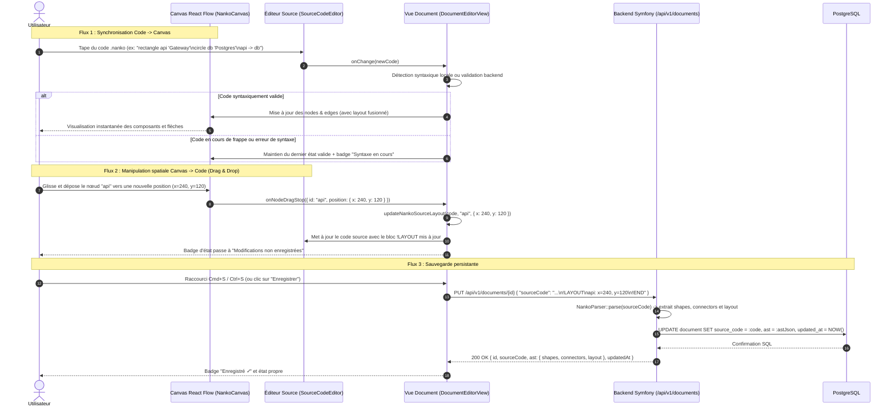
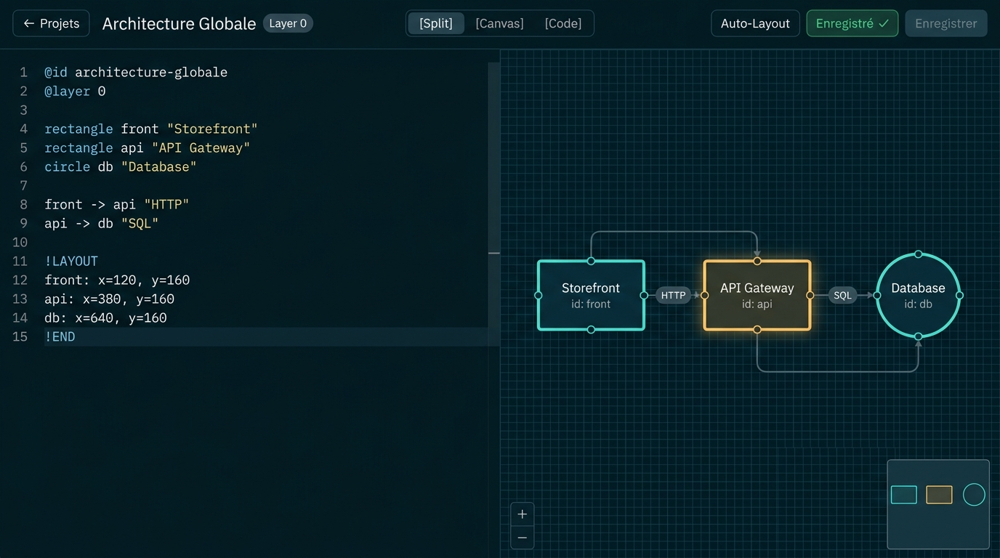
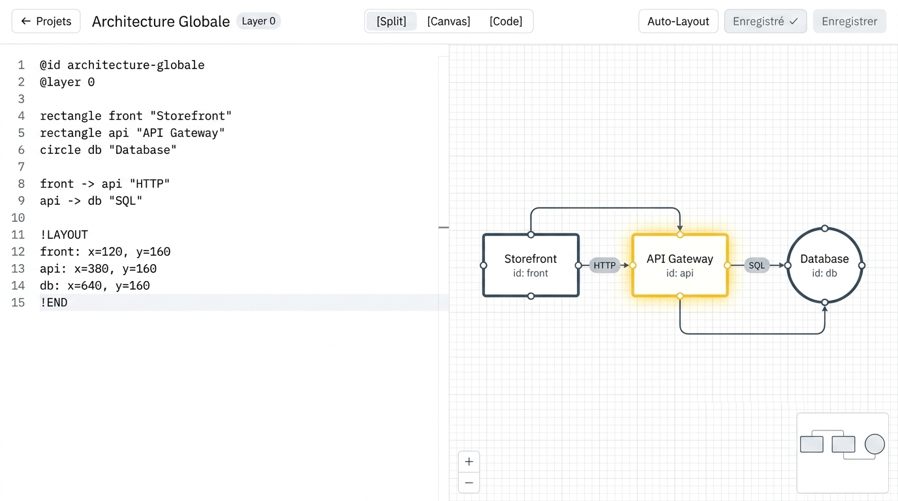

# Change : 015 - Visualisation Graphique en Canvas Interactif avec React Flow

## Métadonnées
* **Domaine concerné :** `.specs/current/domains/workspace-management/`
* **Type de changement :** `Évolution`
* **Cible :** `Fullstack` (principalement `frontend/` avec validation de compatibilité `backend/` et tests `tests-e2e/`)

---

## 1. Intention & Contexte (Le « Why » du Delta)
* **Problème résolu / Besoin :**
  Actuellement (spec 014), l'utilisateur dispose d'un éditeur textuel de code source `.nanko` et d'un inspecteur d'AST textuel listant à plat les shapes et connectors. Nanko a pour mission fondamentale d'être une plateforme visuelle d'architecture logicielle selon l'approche *diagrams-as-code*. Sans représentation graphique interactive, l'utilisateur ne peut ni apprécier visuellement la topologie de ses systèmes, ni spatialiser intuitivement ses composants d'architecture.
* **Impact utilisateur :**
  L'utilisateur dispose désormais d'un canvas graphique interactif intégré dans la vue d'édition (`DocumentEditorView`), motorisé par React Flow (`@xyflow/react`).
  * Il peut choisir son agencement de travail préféré grâce à un sélecteur de mode situé dans l'en-tête : **Vue Divisée (Split)** [code à gauche, canvas à droite], **Plein Écran Canvas**, ou **Plein Écran Code**.
  * Les déclarations du code source `.nanko` sont automatiquement matérialisées en nœuds graphiques stylisés (`rectangle`, `circle`, `text`) et en arêtes directionnelles (`connectors`).
  * Si aucune coordonnée spatiale n'est définie, un algorithme d'**auto-layout** (Dagre) organise automatiquement le graphe.
  * L'utilisateur peut déplacer librement les nœuds sur le canvas (*drag & drop*) : à la fin du mouvement, les nouvelles coordonnées `(x, y)` sont répercutées directement dans la section `!LAYOUT ... !END` du code source `.nanko`, déclenchant l'état « Non enregistré » prêt à être persisté via le raccourci `Cmd+S` / `Ctrl+S`.
* **In Scope (Ce qui est ajouté/modifié) :**
  * **Frontend (`frontend/src/`)** :
    * Ajout des dépendances `@xyflow/react` et `@dagrejs/dagre` (ou équivalent TypeScript pur).
    * Composants personnalisés de nœuds (`RectangleNode`, `CircleNode`, `TextNode`) respectant l'esthétique dark theme de Nanko (bordures subtiles, typographie soignée, badges d'ID, ports handles d'ancrage haut/bas/gauche/droite).
    * Composant d'arête personnalisée (`NankoEdge`) avec flèche de direction et label lisible contrasté.
    * Contrôles de Canvas : MiniMap intégrée escamotable, barre de contrôles de zoom/pan, grille d'arrière-plan de type dots sombre (`colorMode="dark"`).
    * Bouton d'action « Réorganiser (Auto-Layout) » calculant un agencement hiérarchique optimisé et actualisant le bloc `!LAYOUT`.
    * Sélecteur de mode dans `DocumentEditorHeader` :
      * `split` : éditeur de code à gauche (50%), canvas interactif à droite (50%).
      * `canvas` : canvas plein écran avec bouton d'accès rapide au code.
      * `code` : éditeur de code plein écran avec inspecteur d'AST escamotable.
    * Synchronisation bidirectionnelle robuste :
      * Sens **Code -> Canvas** : l'édition du code recalcule l'AST ; les nœuds et arêtes du canvas s'ajustent en temps réel tout en préservant le viewport courant. En cas d'erreur de syntaxe, le canvas reste stable et affiche un badge discret signalant que le rendu est gelé sur le dernier état valide.
      * Sens **Canvas -> Code** : à l'événement `onNodeDragStop`, une fonction utilitaire pure (`updateNankoSourceLayout`) injecte ou met à jour la section `!LAYOUT\n<id>: x=<x>, y=<y>\n!END` dans le code source de l'éditeur sans altérer le reste du document.
  * **Backend (`backend/src/WorkspaceManagement/`)** :
    * Validation et garantie que `NankoParser` extrait fidèlement le dictionnaire `layout: array<string, array{x: int, y: int}>` et que `UpdateDocumentUseCase` persiste l'AST JSONB complet sans régression.
  * **Tests E2E (`tests-e2e/`)** :
    * Scénarios Playwright couvrant :
      1. Rendu nominal des nœuds et arêtes sur le canvas à l'ouverture d'un document.
      2. Basculement entre les modes Split, Canvas et Code.
      3. Déplacement d'un nœud par glisser-déposer et vérification de l'apparition/mise à jour du bloc `!LAYOUT` dans l'éditeur de code.
      4. Sauvegarde persistante (`Cmd+S`) et rechargement de page confirmant la conservation des positions déplacées.
* **Out of Scope (Exclusions strictes) :**
  * Création visuelle de shapes ou de connecteurs par glisser-déposer depuis une boîte à outils graphique (la source déclarative primaire de création reste le code `.nanko`).
  * Édition textuelle de labels directement par double-clic sur le nœud du canvas.
  * Regroupement visuel en conteneurs parents/enfants (*groups / subgraphs*).
  * Superposition 3D ou gestion multi-couches simultanée sur le même viewport canvas.

---

## 2. Flux & Architecture (Diff)



---

## 3. Delta Modèle de données & Base de données

### 3.1. Structure du Modèle Relationnel
Aucune modification de structure relationnelle n'est requise. La table PostgreSQL `document` (créée en spec 014) stocke déjà nativement :
* `source_code` (`text`) : contient les instructions déclaratives ainsi que le bloc `!LAYOUT`.
* `ast` (`jsonb`) : contient l'objet sérialisé `{ "shapes": [...], "connectors": [...], "layout": { "nodeId": { "x": 100, "y": 200 } } }`.

### 3.2. Format canonique de la section `!LAYOUT` dans `.nanko`
La section `!LAYOUT` est délimitée par `!LAYOUT` et `!END`. Chaque ligne associe un identifiant de shape à ses coordonnées entières :
```text
@id architecture-systeme
@layer 0

rectangle front "Frontend Store"
rectangle api "API Gateway"
circle db "Database"

front -> api "HTTP"
api -> db "SQL"

!LAYOUT
front: x=100, y=150
api: x=350, y=150
db: x=600, y=150
!END
```

---

## 4. Delta Contrats d'API (Symfony)

Les contrats HTTP existants restent stables et compatibles :
* `GET /api/v1/documents/{documentId}`
  * Retourne déjà l'AST avec la clé `layout` :
    ```json
    {
      "id": "0191d011-7b3b-7c99-b1d5-2a1d2f34e567",
      "projectId": "0191c0a1-9a1c-7f88-82bc-3e2c1d45f678",
      "name": "Architecture Globale",
      "slug": "architecture-globale",
      "layer": 0,
      "sourceCode": "@id architecture-globale\n@layer 0\n\nrectangle front \"Frontend\"\nrectangle api \"API\"\nfront -> api\n\n!LAYOUT\nfront: x=100, y=100\napi: x=300, y=100\n!END\n",
      "ast": {
        "shapes": [
          { "id": "front", "type": "rectangle", "label": "Frontend" },
          { "id": "api", "type": "rectangle", "label": "API" }
        ],
        "connectors": [
          { "source": "front", "target": "api", "label": null }
        ],
        "layout": {
          "front": { "x": 100, "y": 100 },
          "api": { "x": 300, "y": 100 }
        }
      },
      "createdAt": "2026-09-07T10:00:00Z",
      "updatedAt": "2026-09-07T10:30:00Z"
    }
    ```
* `PUT /api/v1/documents/{documentId}`
  * Payload : `{ "sourceCode": "string" }`
  * Le backend exécute `NankoParser::parse($sourceCode)` et renvoie le document actualisé avec le champ `layout` mis à jour.

---

## 5. Configuration Réseau, Prérequis DNS & Sécurisation des Endpoints

### 5.1. Prérequis DNS Externes
Aucun nouveau nom de domaine ou sous-domaine requis.

### 5.2. Matrice d'Exposition et Sécurisation des Endpoints
Tous les flux réseau utilisent les endpoints documentaires existants sous `/api/v1/documents/` protégés par JWT Bearer RS256.

### 5.3. Dépendances Frontend ajoutées
| Paquet | Type | Usage | Justification |
|---|---|---|---|
| `@xyflow/react` | Dépendance de production | Moteur de Canvas React Flow v12 | Standard pour React 19, support complet zoom/pan, nœuds custom et gestion des événements de drag. |
| `@dagrejs/dagre` | Dépendance de production | Algorithme d'auto-layout directed graph | Permet de positionner automatiquement les nœuds sans calcul manuel quand `!LAYOUT` est absent ou sur clic de réorganisation. |
| `@types/dagre` | Dépendance de développement | Typages TypeScript pour Dagre | Respect strict de TypeScript sans usage de `any`. |

---

## 6. Delta Maquettes & Layout UI

### 6.1. Référence visuelle (Mockups Haute Fidélité)

#### Mode Sombre (Dark Theme - Référence « Palette 4A » & Esthétique Blueprint)
* **Fichier mockup :** `../../mockups/015-canvas-visualization-react-flow.png`
* **Aperçu Dark Mode :**
  
* **Grammaire & Tokens officiels Nanko « Palette 4A » :**
  * **Fond Canvas (`--canvas`) :** `#04141A` (vert nuit / deep blueprint dark teal).
  * **Surfaces & Panneaux (`--surface`) :** `#08191F` avec bordures `#123039` et `#1C4750`.
  * **Structure (`--structure`) :** `#5EEAD4` (cyan électrique — « Cyan pour la structure » : containers, nœuds, liaisons principales).
  * **Ancre & Sélection (`--anchor`) :** `#FFC46B` (ambre chaud — « Ambre pour les personnes, les ports et la sélection »).
  * **Éléments externes (`--external`) :** `#94B2BE` (ardoise neutre pour le hors-périmètre).
  * **Angles vifs (`--radius: 0`) :** Coins rigoureusement droits pour les containers et panneaux d'architecture (pas de coins arrondis sur les nœuds, esprit schéma d'ingénierie / blueprint).
  * **Ports de connexion (`--port`) :** Petits carrés de `7px` avec débordement de `3,5px` sur les bordures des containers (pleins si connectés, contours si libres).
  * **Trame de grille (`--grid`) :** Grille orthogonale de `26px` avec lignes directrices fines.
  * **Typographie technique (`--font`) :** `'IBM Plex Mono', monospace` comme voix technique exclusive pour tous les éléments, labels, ports et code.


#### Mode Clair (Light Theme - Équivalent Blueprint Fond Blanc)
* **Fichier mockup :** `../../mockups/015-canvas-visualization-react-flow-light.png`
* **Aperçu Light Mode :**
  
* **Grammaire & Tokens Light Mode Blueprint :**
  * **Fond Canvas & Général (`--bg`) :** `#FFFFFF` (blanc pur net et lumineux).
  * **Surfaces & Panneaux (`--surface`) :** `#FFFFFF` avec séparateurs fins `#E2E8F0` et `#CBD5E1`.
  * **Structure (`--structure`) :** `#1C382E` / `#2C4A3B` (vert forêt / pin sombre — lignes structurelles nettes pour les containers et les liaisons).
  * **Ancre, sélection & ports (`--anchor`) :** `#F59E0B` / `#FBBF24` (jaune solaire / or éclatant lumineux pour le composant sélectionné `API` et les ports actifs, sans aucune nuance marronasse, avec intérieur de carte blanc pur `#FFFFFF`).
  * **Hors périmètre (`--external`) :** `#64748B` (ardoise claire).


  * **Angles vifs (`--radius: 0`) :** Coins strictement droits et orthogonaux pour l'ensemble des containers, nœuds et panneaux (identité blueprint conservée à l'identique du Dark Mode).
  * **Ports de connexion (`--port`) :** Petits carrés de `7px` débordant de `3,5px` sur les bordures des containers.
  * **Trame de grille (`--grid`) :** Lignes de trame orthogonale technique gris très clair (`rgba(15, 23, 42, 0.05)`).
  * **Typographie technique (`--font`) :** `'IBM Plex Mono', monospace` comme voix technique pour l'ensemble du canevas, nœuds, ports, métadonnées et code source.


### 6.2. Wireframes conceptuels (ASCII Layout)

#### Vue 1 : Mode Split (Par défaut - 50% Éditeur / 50% Canvas)

```text
+-------------------------------------------------------------------------------------------------------------------------+
| [<- Projet]  Architecture Globale (Layer: 0)  |  [ Split ] [ Canvas ] [ Code ]  |  [Réorganiser] [ Sauvegardé ✓ ] [Enregistrer] |
+----------------------------------------------------+--------------------------------------------------------------------+
| ÉDITEUR SOURCE (.nanko)                            | CANVAS INTERACTIF (React Flow)                     [MiniMap [x]]   |
|                                                    |                                                                    |
| 1 | @id architecture-globale                       |    +-------------------+           +-------------------+           |
| 2 | @layer 0                                       |    | front [rectangle] | --------> |  api [rectangle]  |           |
| 3 |                                                |    | "Frontend Web"    |   HTTP    |  "API Gateway"    |           |
| 4 | rectangle front "Frontend Web"                 |    +-------------------+           +-------------------+           |
| 5 | rectangle api "API Gateway"                    |                                              |                     |
| 6 | circle db "PostgreSQL"                         |                                              | SQL                 |
| 7 | front -> api "HTTP"                            |                                              v                     |
| 8 | api -> db "SQL"                                |                                     (( db [circle] ))              |
| 9 |                                                |                                     (( "PostgreSQL" ))             |
| 10| !LAYOUT                                        |                                                                    |
| 11| front: x=100, y=120                            |                                                                    |
| 12| api: x=360, y=120                              |                                                                    |
| 13| db: x=360, y=280                               |  [ + ] [ - ] [ Fit ]                                                |
| 14| !END                                           |                                                                    |
+----------------------------------------------------+--------------------------------------------------------------------+
```

#### Vue 2 : Mode Plein Écran Canvas
```text
+-------------------------------------------------------------------------------------------------------------------------+
| [<- Projet]  Architecture Globale (Layer: 0)  |  [ Split ] [ Canvas (Actif) ] [ Code ]  | [Réorganiser] [ Sauvegardé ✓ ] [Enregistrer] |
+-------------------------------------------------------------------------------------------------------------------------+
|                                                                                                           [MiniMap [x]] |
|                                                                                                                         |
|             +-------------------+                         +-------------------+                                         |
|             | front [rectangle] | ----------------------> |  api [rectangle]  |                                         |
|             | "Frontend Web"    |          HTTP           |  "API Gateway"    |                                         |
|             +-------------------+                         +-------------------+                                         |
|                                                                     |                                                   |
|                                                                     | SQL                                               |
|                                                                     v                                                   |
|                                                            (( db [circle] ))                                            |
|                                                            (( "PostgreSQL" ))                                           |
|                                                                                                                         |
|  [ + ] [ - ] [ [ ] Fit View ]                                                                                           |
+-------------------------------------------------------------------------------------------------------------------------+
```

### 6.3. Squelette JSX & Arborescence attendue

```text
frontend/src/features/documents/
├── components/
│   ├── CreateDocumentModal.tsx
│   ├── DocumentCard.tsx
│   ├── DocumentList.tsx
│   ├── SourceCodeEditor.tsx
│   ├── AstInspector.tsx
│   └── canvas/
│       ├── NankoCanvas.tsx               # Wrapper ReactFlowProvider & instance ReactFlow
│       ├── CanvasControls.tsx            # Barre d'outils zoom, fit, auto-layout
│       ├── LayoutSelector.tsx            # Sélecteur de mode (split, canvas, code)
│       ├── nodes/
│       │   ├── RectangleNode.tsx         # Rendu Shape rectangle dark-theme
│       │   ├── CircleNode.tsx            # Rendu Shape circle
│       │   └── TextNode.tsx              # Rendu Shape text / note
│       ├── edges/
│       │   └── NankoEdge.tsx             # Arête avec flèche et label stylisé
│       └── utils/
│           ├── dagreLayout.ts            # Calcul des positions auto-layout via Dagre
│           └── syncLayoutToSource.ts     # Mise à jour pure du bloc !LAYOUT dans le code .nanko
```

---

## 7. Delta Spécifications UI & Logique Client (React)

### 7.1. Typages & Schémas Zod (`features/documents/schemas.ts`)
Garantie de typage explicite pour le dictionnaire de layout dans l'AST :

```typescript
export const nodeCoordinatesSchema = z.object({
  x: z.number(),
  y: z.number(),
});

export const nankoAstLayoutSchema = z.record(z.string(), nodeCoordinatesSchema);

// nankoAstSchema mis à jour :
export const nankoAstSchema = z.object({
  shapes: z.array(nankoAstShapeSchema),
  connectors: z.array(nankoAstConnectorSchema),
  layout: nankoAstLayoutSchema.optional().default({}),
});
```

### 7.2. Logique de manipulation du Layout (`syncLayoutToSource.ts`)
Fonction pure et déterministe manipulant les blocs `!LAYOUT` et `!END` dans une chaîne de code source `.nanko` :
```typescript
/**
 * Met à jour ou insère les coordonnées d'un nœud dans la section !LAYOUT ... !END du code .nanko
 */
export function updateNankoSourceLayout(
  sourceCode: string,
  nodeId: string,
  position: { x: number; y: number }
): string {
  const roundedX = Math.round(position.x);
  const roundedY = Math.round(position.y);
  const layoutEntry = `${nodeId}: x=${roundedX}, y=${roundedY}`;

  const layoutRegex = /!LAYOUT([\s\S]*?)!END/;
  const match = sourceCode.match(layoutRegex);

  if (!match) {
    // Si la section !LAYOUT n'existe pas, on l'ajoute à la fin
    const trimmed = sourceCode.trimEnd();
    return `${trimmed}\n\n!LAYOUT\n${layoutEntry}\n!END\n`;
  }

  const layoutBody = match[1];
  const nodeLineRegex = new RegExp(`^\\s*${nodeId}\\s*:\\s*.*$`, 'm');

  let newLayoutBody: string;
  if (nodeLineRegex.test(layoutBody)) {
    newLayoutBody = layoutBody.replace(nodeLineRegex, layoutEntry);
  } else {
    newLayoutBody = `${layoutBody.trimEnd()}\n${layoutEntry}\n`;
  }

  return sourceCode.replace(layoutRegex, `!LAYOUT\n${newLayoutBody.trim()}\n!END`);
}
```

### 7.3. Matrice des 5 états UI

| État | Déclencheur | Rendu visuel & Comportement |
|---|---|---|
| **Chargement** | Ouverture d'un document (`/projects/:pId/documents/:dId`) | Spinner dark-theme centré (« Chargement du document et du schéma... »). |
| **Prêt (Synchrone)** | AST chargé et positions initialisées | Éditeur à gauche, Canvas React Flow à droite avec nœuds et connecteurs affichés, badge « Enregistré ✓ ». |
| **Modification Code** | Frappe dans l'éditeur de code source | L'AST se met à jour, le canvas répercute les nouveaux nœuds/connecteurs en temps réel sans réinitialiser le zoom ni la position des nœuds existants. Badge « Non enregistré ». |
| **Déplacement Canvas (Drag)** | Déplacement d'un nœud sur le canvas (`onNodeDragStop`) | Le nœud se repositionne, le code `.nanko` reçoit la nouvelle coordonnée dans le bloc `!LAYOUT`, badge passe à « Non enregistré ». |
| **Erreur de Syntaxe** | Erreur de frappe dans le code source | Le canvas conserve le dernier état visuel valide avec un badge d'avertissement en surimpression (« Syntaxe en cours d'édition - Canvas en pause »), la bannière d'erreur 422 s'affiche dans l'éditeur. |

---

## 8. Invariants & Cas limites (*Edge cases*)

1. **Stabilité du Viewport lors de l'édition :** L'utilisateur qui tape du texte dans l'éditeur ne doit pas voir son Canvas réinitialiser son niveau de zoom ni son centre de vue (conservation stricte des états `zoom` et `pan`).
2. **Priorité des coordonnées :** Si un nœud est renseigné dans `!LAYOUT`, ses coordonnées manuelles prévalent. Si un nœud n'a pas de position (nouveau rectangle ajouté dans le texte), l'auto-layout Dagre calcule sa position sans modifier les nœuds déjà positionnés manuellement.
3. **Nettoyage automatique du Layout :** Si une shape est supprimée du code texte, son entrée résiduelle dans `!LAYOUT` est soit tolérée par le parseur, soit nettoyée sans provoquer d'erreur.
4. **Performance de rendu (React 19) :** Mémorisation (`useMemo`, `useCallback`) des `nodeTypes` et `edgeTypes` pour éviter les re-renders intempestifs du composant React Flow lors de chaque frappe de clavier dans l'éditeur.
5. **Prévention des pertes de données :** Le hook `beforeunload` configuré en spec 014 continue de protéger les modifications déclenchées via le Canvas contre toute fermeture accidentelle du navigateur.

---

## 9. Plan d'exécution séquentiel

- [ ] **Phase 1 : Dépendances & Algorithmes de Layout (`frontend/`)**
  - [ ] 1. Installer `@xyflow/react`, `@dagrejs/dagre` et `@types/dagre` dans `frontend/package.json`.
  - [ ] 2. Implémenter et tester unitairement `syncLayoutToSource.ts` (injection et mise à jour de `!LAYOUT` dans le code source).
  - [ ] 3. Implémenter et tester unitairement `dagreLayout.ts` (calcul automatique des coordonnées pour les shapes sans position).

- [ ] **Phase 2 : Nœuds, Arêtes & Composants React Flow (`frontend/src/features/documents/components/canvas/`)**
  - [ ] 1. Créer les composants de nœuds personnalisés (`RectangleNode`, `CircleNode`, `TextNode`) avec handles de connexion et classes Tailwind dark-theme.
  - [ ] 2. Créer le composant d'arête personnalisée (`NankoEdge`) avec flèche de direction et label lisible.
  - [ ] 3. Assembler le composant principal `NankoCanvas` avec `ReactFlowProvider`, `Background` (dots), `Controls` et `MiniMap`.

- [ ] **Phase 3 : Intégration dans `DocumentEditorView` & Agencement (`frontend/src/views/`)**
  - [ ] 1. Ajouter le sélecteur de disposition (`Split`, `Canvas`, `Code`) dans `DocumentEditorHeader`.
  - [ ] 2. Intégrer `NankoCanvas` dans la vue d'édition en remplacement ou en complément de l'inspecteur d'AST textuel.
  - [ ] 3. Brancher l'événement `onNodeDragStop` sur `updateNankoSourceLayout` pour mettre à jour l'état du code source et marquer le document comme non enregistré.
  - [ ] 4. Ajouter le bouton d'action « Auto-Layout » permettant de recalculer l'agencement global d'un clic.
  - [ ] **Quality Gates Frontend :** `pnpm --filter frontend typecheck`, `pnpm --filter frontend lint` et `pnpm --filter frontend test`.

- [ ] **Phase 4 : Tests E2E Playwright (`tests-e2e/`)**
  - [ ] 1. Écrire le scénario `tests/app/canvas-visualization.spec.ts` :
    - Vérification du rendu visuel des nœuds React Flow.
    - Basculement entre les modes Split, Canvas plein écran et Code.
    - Déplacement d'un nœud via glisser-déposer sur le Canvas.
    - Vérification de la mise à jour de la section `!LAYOUT` dans l'éditeur.
    - Sauvegarde via `Cmd+S` et persistance confirmée après rechargement de la page.
  - [ ] **Quality Gates E2E :** Exécution réussie des tests Playwright.

- [ ] **Phase 5 : Synchronisation documentaire & Archivage**
  - [ ] 1. Répercuter le delta dans `.specs/current/domains/workspace-management/`.
  - [ ] 2. Archiver ce fichier vers `.specs/changes/archive/015-canvas-visualization-react-flow.md`.

---

## 10. Definition of Done & Stratégie de tests

### 10.1. Scénarios de validation (Format Gherkin complet)

```gherkin
# ==============================================================================
# TESTS E2E (tests-e2e/ - Playwright)
# ==============================================================================

@e2e @preprod
Fonctionnalité: Visualisation Graphique en Canvas Interactif avec React Flow

  Scénario: Rendu nominal du schéma sur le Canvas en vue partagée Split
    Étant donné un document existant contenant 2 shapes ("app", "db") et 1 connector ("app -> db")
    Quand l'utilisateur accède à la page d'édition du document
    Alors l'éditeur de code source est affiché sur la moitié gauche
    Et le canvas React Flow est affiché sur la moitié droite
    Et 2 nœuds graphiques portant les labels "app" et "db" sont visibles sur le canvas
    Et une arête directionnelle relie "app" à "db"

  @e2e @preprod
  Scénario: Basculement des modes d'affichage (Split, Canvas, Code)
    Étant donné l'éditeur de document affiché en mode "Split"
    Quand l'utilisateur clique sur le bouton de mode "Canvas"
    Alors le canvas occupe 100% de la largeur de l'écran et l'éditeur de code est masqué
    Quand l'utilisateur clique sur le bouton de mode "Code"
    Alors l'éditeur de code occupe 100% de la largeur et le canvas est masqué
    Quand l'utilisateur reclique sur "Split"
    Alors les deux panneaux réapparaissent côte-à-côte à 50% chacun

  @e2e @preprod
  Scénario: Déplacement d'un nœud sur le Canvas et mise à jour de la section !LAYOUT
    Étant donné l'éditeur de document en mode "Split"
    Quand l'utilisateur glisse et dépose le nœud "app" de 150px vers la droite
    Alors la section "!LAYOUT" dans l'éditeur de code source est immédiatement mise à jour avec les nouvelles coordonnées de "app"
    Et le badge d'état passe à "Modifications non enregistrées"
    Quand l'utilisateur appuie sur "Cmd+S" (ou clique sur "Enregistrer")
    Alors la notification "Sauvegardé ✓" s'affiche
    Quand l'utilisateur recharge la page
    Alors le nœud "app" apparaît à sa nouvelle position sauvegardée

  @e2e @preprod
  Scénario: Réorganisation automatique du graphe (Auto-Layout)
    Étant donné un document comportant plusieurs nœuds sans coordonnées définies
    Quand l'utilisateur clique sur le bouton "Réorganiser (Auto-Layout)"
    Alors les nœuds sont repositionnés de manière hiérarchique lisible sans chevauchement
    Et la section "!LAYOUT" est injectée dans le code source avec l'ensemble des coordonnées calculées

# ==============================================================================
# TESTS FRONTEND (frontend/src/ - Vitest & Testing Library)
# ==============================================================================

@frontend @unit
Fonctionnalité: Utilitaire de synchronisation du layout texte (updateNankoSourceLayout)

  Scénario: Insertion de la section !LAYOUT sur un code qui en est dépourvu
    Quand updateNankoSourceLayout reçoit un code source sans bloc !LAYOUT et la position de "node1" { x: 120, y: 80 }
    Alors le code résultant contient la section "!LAYOUT\nnode1: x=120, y=80\n!END"

  Scénario: Mise à jour d'un nœud existant dans un bloc !LAYOUT préexistant
    Quand updateNankoSourceLayout reçoit un code contenant déjà "node1: x=50, y=50" et une nouvelle position { x: 200, y: 300 }
    Alors seule la ligne de "node1" est remplacée par "node1: x=200, y=300" et les autres lignes restent intactes

@frontend @integration
Fonctionnalité: Composant NankoCanvas

  Scénario: Rendu des nœuds typés selon la shape
    Quand NankoCanvas reçoit un AST avec 1 rectangle, 1 circle et 1 text
    Alors 3 nœuds personnalisés avec leurs styles CSS respectifs sont rendus dans le viewport
```

### 10.2. Commandes de validation automatisée

```bash
# 1. Frontend
pnpm --filter frontend typecheck
pnpm --filter frontend lint
pnpm --filter frontend test

# 2. Backend (Garantie de non-régression)
make deptrac
make test-backend

# 3. End-to-End
pnpm --filter tests-e2e test
```
