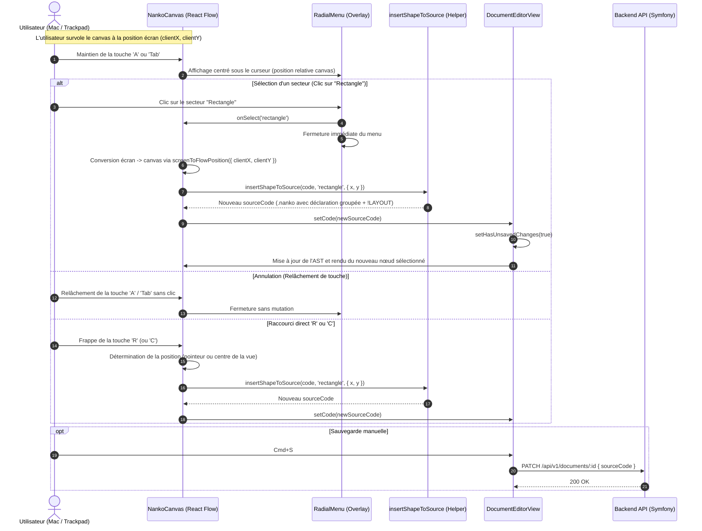

# Change : 017 - Création Visuelle d'Éléments sur le Canvas par Roue Radiale et Raccourcis

## Métadonnées
* **Domaine concerné :** `.specs/current/domains/workspace-management/`
* **Type de changement :** `Évolution`
* **Cible :** `frontend` (avec validation d'intégration `tests-e2e/`)

---

## 1. Intention & Contexte (Le « Why » du Delta)
* **Problème résolu / Besoin :**
  Actuellement, l'utilisateur du Studio Nanko dispose d'un espace de travail immersif en pleine largeur (livré dans la spec 016), mais le canvas React Flow reste **purement passif pour la création** : toute insertion de Shape nécessite de basculer en mode Split ou Code et de rédiger manuellement la syntaxe DSL `.nanko`. Cette friction brise la fluidité de modélisation visuelle, en particulier pour les architectes travaillant sur Mac avec trackpad.
* **Impact utilisateur :**
  * L'utilisateur peut désormais créer instantanément des Shapes directement sur la grille du Board sans toucher au code source :
    1. **Roue Radiale d'outils (*Pie Menu*) sous le curseur :** En maintenant la touche `A` (*Add*) ou `Tab` enfoncée au-dessus du canvas, une roue circulaire ergonomique apparaît instantanément centrée sous le pointeur de la souris.
    2. **Dépôt gestuel fluide (Geste de marquage / Relâchement) :** En maintenant la touche `A` ou `Tab`, déplacer le curseur vers un secteur met en surbrillance la forme (`Rectangle` ou `Circle`). Relâcher la touche (`keyup`) dépose immédiatement la forme à l'emplacement exact et referme la roue en un geste fluide ultra-rapide (sans nécessiter de clic supplémentaire). Le clic direct sur un secteur reste également supporté. Si la touche est relâchée alors que le curseur est dans la pastille centrale ou hors des secteurs, la roue se referme simplement sans création.
    3. **Raccourcis de frappe rapide :** Frapper les touches `R` (Rectangle) ou `C` (Circle) dépose immédiatement la forme sous le curseur (ou au centre du viewport si le pointeur est hors canvas).
    4. **Regroupement sémantique propre dans le code `.nanko` :** Les shapes sont toujours injectées en bloc regroupé avec les shapes existantes au-dessus des connecteurs, préservant une organisation DSL rigoureuse.
    5. **Synchronisation bidirectionnelle immédiate :** L'élément inséré est injecté dans le code source `.nanko` (déclaration sémantique + coordonnées initiales dans le bloc `!LAYOUT`), l'élément est automatiquement sélectionné, et l'état de modification non enregistrée (*unsaved changes*) est activé pour une sauvegarde via `Cmd+S`.
* **In Scope (Ce qui est ajouté/modifié) :**
  * **Composant UI `RadialMenu.tsx` (`frontend/src/features/documents/components/canvas/radial/`) :**
    * Roue circulaire stylisée Blueprint Nanko (fond sombre translucide `backdrop-filter: blur(12px)`, lueurs et bordures fines émeraudes/cyan).
    * 2 demi-disques symétriques et continus fermant parfaitement le cercle complet (180° chacun sans interruption de gap) avec icônes vectorielles et libellés : `Rectangle` [R] (gauche, 180° à 360°) et `Circle` [C] (droite, 0° à 180°).
    * Détection du secteur survolé, retour visuel et fermeture instantanée.
  * **Moteur d'insertion de Shape et synchronisation DSL (`frontend/src/features/documents/components/canvas/utils/insertShapeToSource.ts`) :**
    * Calcul automatique d'un identifiant unique incrémental (`rect_1`, `circle_1`) non encore utilisé dans le document.
    * Injection de la déclaration sémantique regroupée avec les shapes existantes, en amont des connecteurs (`source -> target`).
    * Injection ou mise à jour de la coordonnée `(x, y)` calculée dans le bloc `!LAYOUT ... !END`.
  * **Gestion des événements clavier & conversion spatiale dans `NankoCanvas.tsx` :**
    * Détection des touches `A` / `Tab` maintenues (`keydown` / `keyup`), avec neutralisation stricte lorsque le focus se trouve dans un champ de saisie texte ou dans l'éditeur Monaco.
    * Conversion précise de la position du pointeur à l'écran vers les coordonnées spatiales du canvas via `reactFlowInstance.screenToFlowPosition`.
    * Raccourcis directs `R` et `C`.
  * **Tests unitaires et E2E :**
    * Tests unitaires Vitest pour `insertShapeToSource.ts` (unicité des IDs, regroupement avec les shapes existantes avant les connecteurs, gestion `!LAYOUT`) et `RadialMenu.tsx`.
    * Scénario E2E Playwright validant l'apparition de la roue au clavier, la création d'un rectangle et la répercussion dans le code source.
* **Out of Scope (Exclusions strictes) :**
  * Tracé visuel libre et magnétisme des connecteurs (objet de la spec 018).
  * Édition in-place au double-clic et popover contextuelle d'élément (objet de la spec 019).
  * Volet latéral escamotable (*Sidebar Drawer*) par glisser-déposer (lot ultérieur).
  * Aucune modification du backend Symfony ni de la base de données PostgreSQL : le document continue d'être persisté via le champ existant `sourceCode` via `PATCH /api/v1/documents/:id`.

---

## 2. Flux & Architecture (Diff)



---

## 3. Delta Modèle de données & Base de données

### 3.1. Diagramme Entité-Relation (ERD)
*Aucun changement de modèle de données.*  
L'entité `Document` existante (`backend/src/WorkspaceManagement/Core/Domain/Document/Document.php`) contient déjà le champ textuel `sourceCode` qui stocke fidèlement la syntaxe DSL `.nanko` et le bloc de coordonnées `!LAYOUT`.

### 3.2. Modifications de tables
*Aucune modification de table SQL requise.*

### 3.3. Règles de migration & Intégrité
*Aucun fichier de migration Doctrine nécessaire.*

---

## 4. Delta Contrats d'API (Symfony)

*Aucun nouveau contrat d'API.*  
L'application s'appuie sur le contrat existant pour la mise à jour des documents :
* **Endpoint :** `PATCH /api/v1/documents/{documentId}`
* **Authentification :** `Bearer Token JWT` (Capabilité d'édition sur le projet/document)
* **Payload existant :**
  ```json
  {
    "sourceCode": "rectangle rect_1 \"Mon Rectangle\"\ncircle circle_1 \"Base DB\"\n\n!LAYOUT\nrect_1 : x=100, y=150\ncircle_1 : x=250, y=150\n!END"
  }
  ```
* **Réponse :** `200 OK` (DocumentResponseDto).

---

## 5. Configuration Réseau, Prérequis DNS & Sécurisation des Endpoints

### 5.1. Prérequis DNS Externes
*Aucun nouvel hôte ni enregistrement DNS.*

### 5.2. Matrice d'Exposition et Sécurisation des Endpoints
*Inchangée par rapport à l'état courant.*

### 5.3. Variables d'Environnement & Secrets requis
*Aucune nouvelle variable d'environnement.*

---

## 6. Delta Maquettes & Layout UI

### 6.1. Référence visuelle (Design Blueprint & Roue Radiale)
* **Composant :** `RadialMenu` affiché en surimpression absolue (`z-index: 50`) au-dessus de la surface React Flow.
* **Aspect :** Disque circulaire à découpe radiale (diamètre ~180px), fond sombre translucide `rgba(15, 23, 42, 0.85)` avec `backdrop-filter: blur(12px)`, délimité par une bordure fine `rgba(94, 234, 212, 0.3)`.
* **Secteurs :** 2 demi-disques symétriques :
  * Secteur Gauche : **Rectangle** (Icône SVG rectangle + label "Rectangle [R]")
  * Secteur Droit : **Circle** (Icône SVG cercle + label "Circle [C]")
* **Centre :** Pastille centrale d'échappement / point de visée avec micro-indicateur `×`.

### 6.2. Wireframes conceptuels (ASCII Layout)

#### Roue radiale déployée au curseur de la souris (2 secteurs)
```text
                     +---------------------------------------+
                     |         React Flow Canvas             |
                     |                                       |
                     |                 [A / Tab]             |
                     |                     v                 |
                     |             .---''''''---.            |
                     |           /        |       \          |
                     |          / [---]   |  (O)   \         |
                     |         | Rectangle| Circle  |        |
                     |         |   [R]    +   [C]   |        |
                     |         |      (Pointeur)    |        |
                     |          \         |        /         |
                     |           \        |       /          |
                     |             '---......---'            |
                     |                                       |
                     +---------------------------------------+
```

### 6.3. Squelette JSX & Arborescence attendue

```text
frontend/src/features/documents/components/canvas/
├── radial/
│   ├── RadialMenu.tsx           # Composant de roue radiale sous curseur (2 secteurs)
│   ├── RadialMenu.test.tsx      # Tests d'interaction et d'affichage
│   └── radialMenuTypes.ts       # Types des secteurs et événements
├── utils/
│   ├── insertShapeToSource.ts   # Helper pur d'insertion et regroupement des shapes
│   ├── insertShapeToSource.test.ts # Tests unitaires de génération et regroupement
│   └── ... (nankoParser, syncLayoutToSource déjà existants)
└── NankoCanvas.tsx              # Intégration des listeners clavier (A/Tab, R, C) et overlay
```

```tsx
// Structure conceptuelle de l'intégration dans NankoCanvas.tsx
<div className="nanko-canvas-container" onPointerMove={handlePointerMove}>
  <ReactFlow ...>
    <Background ... />
    <CanvasControls ... />
    {radialMenuState.isOpen && (
      <RadialMenu
        x={radialMenuState.screenX}
        y={radialMenuState.screenY}
        onSelect={(shapeType) => handleCreateShape(shapeType, radialMenuState.screenPos)}
        onClose={closeRadialMenu}
      />
    )}
  </ReactFlow>
</div>
```

---

## 7. Delta Spécifications UI & Logique Client (React)

### 7.1. Logique du helper sémantique `insertShapeToSource.ts`

```typescript
export type ShapePrimitiveType = 'rectangle' | 'circle' | 'text'

export interface InsertShapeOptions {
  type: ShapePrimitiveType
  position: { x: number; y: number }
  label?: string
}

/**
 * Insère une nouvelle Shape dans le code source .nanko existant :
 * 1. Détermine un identifiant unique (ex: `rect_1`, `circle_1`).
 * 2. Regroupe la nouvelle forme avec les shapes existantes :
 *    - Si des shapes existent : insère immédiatement après la dernière shape.
 *    - Si des connecteurs existent : insère au-dessus du premier connecteur.
 * 3. Ajoute ou met à jour la ligne dans le bloc !LAYOUT ... !END.
 */
export function insertShapeToSource(
  sourceCode: string,
  options: InsertShapeOptions
): { newSourceCode: string; newShapeId: string }
```

### 7.2. Matrice des états d'interface pour la création visuelle

| État | Déclencheur | Rendu visuel & Comportement |
|---|---|---|
| **Idle** | Pointeur sur le canvas, aucune touche enfoncée | Canvas React Flow standard, navigation et sélection normales. |
| **Radial Menu Active** | Maintien prolongé de `A` ou `Tab` sur le canvas | Affichage immédiat de la roue centrée sur la souris. Le curseur est capturé par les 2 secteurs. |
| **Sector Hovered** | Pointeur sur le secteur Rectangle ou Circle | Le secteur s'illumine en cyan/émeraude (`scale(1.04)`), icône en surbrillance, mémorisé comme actif. |
| **Shape Created (Relâchement)** | Relâchement de `A`/`Tab` pendant le survol d'un secteur | Dépôt instantané de la forme sous le pointeur, fermeture de la roue, `hasUnsavedChanges = true`. |
| **Shape Created (Clic / Raccourci)** | Clic sur un secteur OU frappe de `R`/`C` | Fermeture immédiate de la roue. La Shape apparaît aux coordonnées cibles, regroupée dans l'AST, `hasUnsavedChanges = true`. |
| **Radial Menu Dismissed** | Touche `A`/`Tab` relâchée sans secteur survolé OU `Échap` | Fermeture immédiate et transparente sans altérer le document. |

---

## 8. Invariants & Cas limites (*Edge cases*)

1. **Isolation des champs de saisie (Focus Guard) :**  
   Si l'utilisateur est en train de taper dans un champ de texte (par exemple dans le volet Monaco de gauche en mode Split, dans la barre de recherche ou dans une modale), les touches `A`, `Tab`, `R`, `C` ne doivent **en aucun cas** ouvrir la roue radiale ni insérer de Shape. L'événement est ignoré si `event.target instanceof HTMLInputElement || HTMLTextAreaElement` ou si l'éditeur Monaco a le focus.
2. **Geste de marquage fluide (Release-to-Create) :**  
   Si l'utilisateur relâche la touche `A` ou `Tab` alors que son pointeur survole un secteur valide (`Rectangle` ou `Circle`), l'élément est immédiatement créé aux coordonnées du pointeur sans nécessiter de clic physique. Si la touche est relâchée dans la zone centrale (pastille `×`) ou hors des secteurs, aucune création n'a lieu.
3. **Regroupement des déclarations de Shapes :**  
   Toute insertion visuelle maintient l'intégrité de la structure du fichier `.nanko` : les déclarations `rectangle` et `circle` restent groupées en un bloc homogène, distinct des connecteurs `source -> target`.
4. **Gestion de l'unicité des identifiants (`@id` / shape ID) :**  
   La fonction `insertShapeToSource` analyse les déclarations existantes dans l'AST `.nanko` pour garantir que l'ID généré (ex: `rect_2`) n'existe pas déjà, empêchant toute erreur de syntaxe à l'insertion.
5. **Pointeur hors canvas lors d'un raccourci direct (`R`, `C`) :**  
   Si le pointeur n'est pas au-dessus du canvas lors de l'appui sur un raccourci direct, la nouvelle Shape est créée au centre exact du viewport visible actuel calculé via `screenToFlowPosition({ x: containerWidth / 2, y: containerHeight / 2 })`.
6. **Gestion du bloc `!LAYOUT` absent :**  
   Si le document édité ne possède pas encore de bloc `!LAYOUT`, la fonction d'insertion ajoute proprement la déclaration `!LAYOUT\n<id> : x=<x>, y=<y>\n!END` à la fin du document.
7. **Perte de focus de la fenêtre (*Window Blur*) :**  
   Si la fenêtre perd le focus (`window.onblur`) pendant que `A` ou `Tab` est enfoncée, la roue radiale se referme automatiquement pour éviter de rester bloquée ouverte.

---

## 9. Plan d'exécution séquentiel

- [x] **Phase 1 : Moteur de manipulation syntaxique DSL (`frontend/`)**
  - [x] 1. Créer `frontend/src/features/documents/components/canvas/utils/insertShapeToSource.ts` pour générer un ID unique, injecter la shape en respectant le regroupement au-dessus des connecteurs, et synchroniser le bloc `!LAYOUT`.
  - [x] 2. Créer les tests unitaires complets dans `frontend/src/features/documents/components/canvas/utils/insertShapeToSource.test.ts` (cas nominal, regroupement des shapes, ID incrémental, document sans `!LAYOUT`).
  - [x] **Validation Unitaire :** Exécuter `pnpm --filter frontend test`.

- [x] **Phase 2 : Composant Roue Radiale & Style Blueprint (`frontend/`)**
  - [x] 1. Créer le composant `RadialMenu.tsx` avec ses 2 secteurs vectoriels (`Rectangle`, `Circle`), sa pastille centrale et ses attributs `data-qa`.
  - [x] 2. Définir les styles CSS dans `App.css` (effets de flou glassmorphism, lueurs au survol, animations douces d'apparition/disparition).
  - [x] 3. Créer les tests unitaires du composant `RadialMenu.test.tsx` (clics secteurs, absence de l'outil texte).

- [x] **Phase 3 : Intégration Canvas & Raccourcis Clavier (`frontend/`)**
  - [x] 1. Intégrer la capture des raccourcis clavier (`A`, `Tab`, `R`, `C`, `Échap`) dans `NankoCanvas.tsx` avec protection contre le focus d'inputs.
  - [x] 2. Connecter `screenToFlowPosition` pour calculer les coordonnées spatiales exactes sous le curseur.
  - [x] 3. Brancher l'insertion de la nouvelle Shape sur `DocumentEditorView.tsx` pour mettre à jour le code source et marquer l'état modifié.
  - [x] **Validation Lint & Types :** Exécuter `pnpm --filter frontend typecheck` et `pnpm --filter frontend lint`.

- [x] **Phase 4 : Validation End-to-End (`tests-e2e/`)**
  - [x] 1. Créer le scénario Playwright dans `tests-e2e/tests/app/canvas-visual-creation.spec.ts` :
    * Ouverture d'un document dans le Studio.
    * Maintien de la touche `A` pour faire apparaître la roue radiale `[data-qa="radial-menu"]`.
    * Clic sur le secteur `[data-qa="radial-item-rectangle"]`.
    * Vérification de l'apparition du nouveau nœud rectangle sur le canvas et dans le code `.nanko`.
    * Test de frappe directe `C` pour insérer un cercle regroupé avec le rectangle.
  - [x] **Validation E2E :** Exécuter `pnpm --filter tests-e2e exec playwright test`.

- [ ] **Phase 5 : Synchronisation documentaire (via `/sync-current`)**
  - [ ] 1. Répercuter les modifications dans `.specs/current/domains/workspace-management/behavior.md` et `tech.md`.
  - [ ] 2. Archiver la spec dans `.specs/changes/archive/017-canvas-visual-creation-radial-menu.md`.

---

## 10. Definition of Done & Stratégie de tests

### 10.1. Scénarios de validation (Format Gherkin avec tags)

```gherkin
# ==============================================================================
# TESTS E2E (tests-e2e/ - Exécutés contre l'environnement cible)
# ==============================================================================

@e2e @preprod
Fonctionnalité: Création visuelle d'éléments sur le Board

  Scénario: Création d'une Shape Rectangle via la Roue Radiale
    Étant donné que l'utilisateur est sur la vue Studio d'un document en mode "canvas"
    Quand il maintient la touche "A" enfoncée au-dessus du canvas
    Alors la roue radiale "[data-qa='radial-menu']" devient visible sous le curseur avec 2 secteurs
    Quand il clique sur le secteur "[data-qa='radial-item-rectangle']"
    Alors la roue radiale se referme
    Et une nouvelle Shape de type "rectangle" apparaît sur le canvas aux coordonnées du pointeur
    Et le code source du document contient la nouvelle déclaration "rectangle" et ses coordonnées "!LAYOUT"
    Et l'indicateur de modifications non enregistrées est affiché

  @e2e @preprod
  Scénario: Création rapide d'un Cercle via raccourci direct clavier
    Étant donné que l'utilisateur est sur la vue Studio au-dessus du canvas
    Quand il appuie sur la touche "C"
    Alors un nouveau nœud de type "circle" apparaît directement sous le pointeur
    Et le code source est enrichi de la déclaration correspondante regroupée avec les shapes existantes

  @e2e @preprod
  Scénario: Neutralisation des raccourcis de création lors de la saisie de texte
    Étant donné que l'utilisateur édite du texte dans l'éditeur de code
    Quand il tape la lettre "A" ou "R" dans le texte
    Alors la roue radiale ne s'affiche pas
    Et aucune Shape n'est ajoutée sur le canvas

# ==============================================================================
# TESTS FRONTEND (frontend/ - Unitaires & Intégration UI)
# ==============================================================================

@web @unit
Fonctionnalité: Helper insertShapeToSource

  Scénario: Regroupement strict des shapes au-dessus des connecteurs
    Étant donné un code source avec des shapes et des connecteurs "app -> db"
    Quand une nouvelle shape "circle" est insérée
    Alors la déclaration est insérée immédiatement avec les shapes existantes
    Et elle précède le bloc des connecteurs

  Scénario: Création du bloc !LAYOUT si absent du code source initial
    Étant donné un code source sans bloc "!LAYOUT"
    Quand une nouvelle shape "circle" est insérée
    Alors un bloc "!LAYOUT\n... !END" est créé en fin de document avec les coordonnées correspondantes

@web @unit
Fonctionnalité: Composant RadialMenu et Géométrie Circulaire

  Scénario: Roue fermée à 360° sans hiatus angulaire
    Étant donné la configuration des secteurs de la roue radiale
    Alors il y a exactement 2 secteurs (Rectangle et Circle)
    Et le secteur Circle couvre un arc de 0° à 180°
    Et le secteur Rectangle couvre un arc de 180° à 360°
    Et la somme des amplitudes angulaires est égale à 360°
    Et les tracés SVG associés sont continus et clos (M ... Z)

  Scénario: Survol de secteur et réinitialisation sur la pastille centrale
    Étant donné la roue radiale affichée
    Quand le pointeur entre sur le secteur Rectangle
    Alors le callback de survol transmet "rectangle"
    Quand le pointeur entre sur la pastille centrale d'annulation
    Alors le callback de survol transmet null

@web @ui
Fonctionnalité: Geste Marking Menu sur le Canvas

  Scénario: Création immédiate par relâchement de touche au survol d'un secteur (Release-to-create)
    Étant donné la roue radiale ouverte suite au maintien de la touche "A"
    Quand le pointeur survole le secteur "rectangle"
    Et que l'utilisateur relâche la touche "A"
    Alors la forme "rectangle" est créée immédiatement aux coordonnées du pointeur
    Et la roue radiale se referme sans nécessiter de clic supplémentaire
```

### 10.2. Commandes de validation automatisée

```bash
# 1. Tests unitaires et d'intégration frontend
pnpm --filter frontend test

# 2. Vérification des types et linting
pnpm --filter frontend typecheck
pnpm --filter frontend lint

# 3. Validation End-to-End Playwright
pnpm --filter tests-e2e exec playwright test
```
