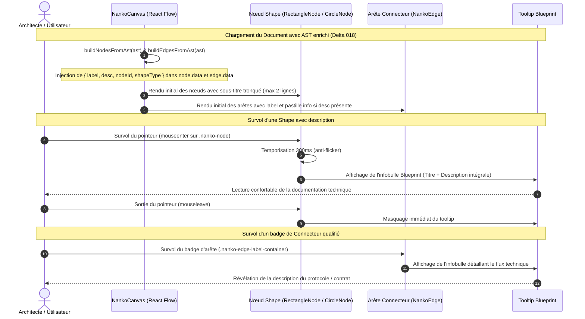

# Change : 019 - Rendu Visuel des Attributs Sémantiques (label, desc) et Tooltips sur le Canvas

## Métadonnées
* **Domaine concerné :** `.specs/current/domains/workspace-management/`
* **Type de changement :** `Évolution`
* **Cible :** `frontend` (React Flow, composants Canvas, CSS Blueprint) + `tests-e2e` (Playwright)

---

## 1. Intention & Contexte (Le « Why » du Delta)
* **Problème résolu / Besoin :**
  Le Delta 018 a introduit le socle grammatical, le tokenizer d'attributs clé-valeur (`key="valeur"`) et la persistance du champ `desc` dans l'AST dénormalisé (`NankoAst.php`, `schemas.ts`). Cependant, sur le canvas interactif React Flow (`NankoCanvas`), les composants graphiques de nœuds (`RectangleNode`, `CircleNode`, `TextNode`) et d'arêtes (`NankoEdge`) ignorent encore complètement l'attribut `desc`.
  Actuellement, l'architecte ne peut consulter la description d'une entité ou d'une relation que dans l'inspecteur textuel d'AST ou dans l'éditeur de code, ce qui nuit à l'expressivité visuelle de la cartographie d'architecture et empêche de comprendre les flux techniques au premier coup d'œil.
* **Impact utilisateur :**
  * Sur le canvas, chaque forme (`RectangleNode`, `CircleNode`, `TextNode`) portant un attribut `desc` affiche un sous-titre textuel stylisé sous son libellé principal (`label`).
  * La description visible sur la forme est automatiquement tronquée à **2 lignes maximum** avec ellipse (`ellipsis`) pour préserver les dimensions compactes des nœuds et la clarté du graphe sans débordement.
  * Au survol prolongé d'une shape (> 300 ms), une infobulle (*Tooltip*) Blueprint soignée apparaît au-dessus de l'élément, affichant son type, son identifiant, son `label` et l'intégralité de sa `desc`. Si la description est longue et nécessite un ascenseur, un indicateur d'ancrage visuel (inspiré de *Total War: Warhammer*) signale à l'utilisateur qu'il peut déplacer son curseur dans la tooltip pour faire défiler le texte. Un délai de grâce de 250 ms permet le survol interactif et fluide de l'infobulle sans fermeture intempestive lors du trajet du pointeur.
  * Sur chaque connecteur (`NankoEdge`), le badge central affiche exclusivement le `label` du flux lorsqu'il est renseigné (sans préfixe technique `source -> target`), pour un rendu visuel épuré. Si une `desc` est présente, un micro-indicateur discret s'affiche sur le badge, et le survol du badge révèle une infobulle Blueprint détaillant le flux technique.
  * Les shapes sans `desc` et les connecteurs sans `label` conservent leur rendu épuré sans zone vide ni espacement superflu.
* **In Scope (Ce qui est ajouté/modifié) :**
  * **Transmission des données dans `NankoCanvas.tsx` :**
    * Injection de `desc: shape.desc` dans le `data` de chaque nœud React Flow.
    * Injection de `desc: connector.desc` dans le `data` de chaque arête React Flow.
  * **Composants Nœuds (`RectangleNode.tsx`, `CircleNode.tsx`, `TextNode.tsx`) :**
    * Enrichissement de l'interface `NankoNodeData` avec `desc?: string | null`.
    * Affichage d'un bloc `.nanko-node-desc` sous le `.nanko-node-label`.
    * Intégration d'une infobulle Blueprint accessible (`role="tooltip"`, `data-qa="node-tooltip-{id}"`) apparaissant au survol de la shape.
  * **Composant Arête (`NankoEdge.tsx`) :**
    * Détection de `desc` dans `data`.
    * Suppression du libellé verbeux `source -> target` sur le badge central pour n'afficher que le `label` du flux et l'indicateur de description.
    * Badge de connecteur enrichi d'un indicateur de détail et d'un tooltip Blueprint au survol (`data-qa="edge-tooltip-{source}-{target}"`).
  * **Design System & Styles (`App.css`) :**
    * Définition des règles CSS de sous-titre : typographie secondaire (`0.75rem`), couleur atténuée (`var(--text-muted)` / `#94A3B8`), interligne 1.25.
    * Troncature multi-ligne standardisée : `-webkit-line-clamp: 2`, `display: -webkit-box`, `-webkit-box-orient: vertical`, `overflow: hidden`, `text-overflow: ellipsis`.
    * Style de l'infobulle Blueprint adapté aux thèmes sombre et clair : fond sombre translucide en mode dark (`rgba(1, 28, 37, 0.96)`) et fond blanc translucide en mode light (`rgba(255, 255, 255, 0.98)`), bordure technique (`var(--brand)`), typographies adaptatives (`var(--heading)`, `var(--body-text)`), flou d'arrière-plan (`backdrop-filter: blur(8px)`), ombres portées calibrées et flèche indicatrice.
  * **Tests Unitaires & E2E :**
    * Tests unitaires sur le rendu des nœuds et arêtes avec et sans `desc` (`RectangleNode.test.tsx`, `CircleNode.test.tsx`, `NankoEdge.test.tsx`, `NankoCanvas.test.tsx`).
    * Scénario E2E Playwright dans `canvas-visualization.spec.ts` validant le sous-titre tronqué et l'affichage du tooltip au survol.
* **Out of Scope (Exclusions strictes) :**
  * Édition contextuelle directe sur le canvas (double-clic in-place sur le `label`, popover d'édition de la `desc`) : objet du **Delta 020**.
  * Rendu Markdown riche ou interprétation de balises HTML dans la description : texte brut multiligne uniquement.
  * Modification du modèle de données SQL, de l'API backend Symfony ou du tokenizer DSL (déjà livrés en Spec 018).

---

## 2. Flux & Architecture (Diff)



---

## 3. Delta Modèle de données & Base de données

### 3.1. Structure du Modèle
Aucune modification du schéma relationnel ni de la persistance n'est nécessaire. L'arbre syntaxique dénormalisé `document.ast` (stocké en `jsonb`) fournit déjà les champs `label` et `desc` depuis le Delta 018 :

```json
{
  "dslVersion": 1,
  "shapes": [
    {
      "id": "gateway",
      "type": "rectangle",
      "label": "API Gateway",
      "desc": "Point d'entrée HTTPS public avec terminaison TLS et rate limiting"
    }
  ],
  "connectors": [
    {
      "source": "gateway",
      "target": "auth",
      "label": "JWT",
      "desc": "Validation asynchrone des signatures de jetons"
    }
  ],
  "layout": {
    "gateway": { "x": 100, "y": 150 }
  }
}
```

---

## 4. Delta Contrats d'API (Symfony)

Aucun nouvel endpoint ni modification de contrat d'API n'est introduit. Le frontend exploite les endpoints existants (`GET /api/v1/documents/:id`) dont l'AST renvoie déjà les propriétés requises.

---

## 5. Configuration Réseau, Prérequis DNS & Variables d'Environnement

* **Prérequis DNS :** Aucun.
* **Sécurisation :** Inchangée (JWT Bearer Token Keycloak).
* **Variables d'environnement :** Aucune nouvelle variable d'environnement n'est nécessaire.

---

## 6. Delta Maquettes & Layout UI

### 6.1. Rendu Visuel des Nœuds & Infobulles

```text
+-------------------------------------------------------------+
| CANVAS REACT FLOW                                           |
|                                                             |
|   +--------------------------+                              |
|   | RECTANGLE       gateway  |                              |
|   +--------------------------+                              |
|   | API Gateway              |                              |
|   | Point d'entrée HTTPS...  | <-- desc tronquée à 2 lignes |
|   +--------------------------+                              |
|                 |                                           |
|                 |                                           |
|                 v                                           |
|       [ HTTP • ]                                            |
|                 |                                           |
|                 |                                           |
|                 v                                           |
|         /---------------\                                   |
|        /  CIRCLE   auth  \                                  |
|       |   Auth Service    |                                 |
|       |   Validation...   | <-- desc tronquée               |
|        \                 /                                  |
|         \---------------/                                   |
|                                                             |
|   AU SURVOL DE "gateway" :                                  |
|   +-----------------------------------------------------+   |
|   | [rectangle] gateway : API Gateway                   |   |
|   | Point d'entrée HTTPS public avec terminaison TLS    |   |
|   | et rate limiting sur les requêtes entrantes.        |   |
|   +-----------------------------------------------------+   |
+-------------------------------------------------------------+
```

### 6.2. Arborescence des Fichiers Modifiés & Nouveaux

```text
frontend/src/features/documents/
├── components/canvas/
│   ├── NankoCanvas.tsx                           # Injection de desc dans node.data et edge.data
│   ├── nodes/
│   │   ├── RectangleNode.tsx                     # Rendu de desc (2 lignes) + Tooltip Blueprint
│   │   ├── RectangleNode.test.tsx                # Tests unitaires du nœud rectangle avec desc
│   │   ├── CircleNode.tsx                        # Rendu de desc circulaire + Tooltip Blueprint
│   │   ├── CircleNode.test.tsx                   # Tests unitaires du nœud circle avec desc
│   │   ├── TextNode.tsx                          # Rendu de desc textuel + Tooltip Blueprint
│   │   └── TextNode.test.tsx                     # Tests unitaires du nœud text avec desc
│   ├── edges/
│   │   ├── NankoEdge.tsx                         # Indicateur de description + Tooltip Blueprint
│   │   └── NankoEdge.test.tsx                    # Tests unitaires de l'arête avec desc
│   └── tooltip/
│       ├── BlueprintTooltip.tsx                  # Composant infobulle Blueprint réutilisable
│       └── BlueprintTooltip.test.tsx
└── App.css                                       # Styles Blueprint pour desc, troncature et tooltips

tests-e2e/tests/app/
└── canvas-visualization.spec.ts                  # Test E2E Playwright de restitution visuelle et tooltip
```

---

## 7. Delta Spécifications UI & Logique Client (React)

### 7.1. Typage des données de nœud (`NankoNodeData`)
```typescript
export interface NankoNodeData {
  label: string
  desc?: string | null
  shapeType?: string
  nodeId?: string
  [key: string]: unknown
}
```

### 7.2. Spécification CSS de la Troncature et du Sous-titre
```css
/* Sous-titre descriptif dans la shape */
.nanko-node-desc {
  font-size: 0.75rem;
  line-height: 1.25;
  color: var(--text-muted, #94A3B8);
  margin-top: 4px;
  display: -webkit-box;
  -webkit-line-clamp: 2;
  -webkit-box-orient: vertical;
  overflow: hidden;
  text-overflow: ellipsis;
  word-break: break-word;
  pointer-events: none;
}

/* Infobulle Blueprint (Tooltip) */
.nanko-blueprint-tooltip {
  position: absolute;
  z-index: 1000;
  bottom: calc(100% + 8px);
  left: 50%;
  transform: translateX(-50%);
  background: rgba(1, 28, 37, 0.96);
  border: 1px solid var(--structure, #5EEAD4);
  box-shadow: 0 10px 25px -5px rgba(0, 0, 0, 0.7), 0 0 12px rgba(94, 234, 212, 0.2);
  border-radius: 4px;
  padding: 8px 12px;
  min-width: 180px;
  max-width: 320px;
  pointer-events: none;
  backdrop-filter: blur(8px);
  animation: nanko-tooltip-fade-in 0.15s ease-out;
}

.nanko-blueprint-tooltip-header {
  display: flex;
  align-items: center;
  gap: 6px;
  font-size: 0.7rem;
  font-family: var(--font-mono, monospace);
  color: var(--structure, #5EEAD4);
  margin-bottom: 4px;
  border-bottom: 1px solid rgba(94, 234, 212, 0.2);
  padding-bottom: 2px;
}

.nanko-blueprint-tooltip-title {
  font-size: 0.85rem;
  font-weight: 600;
  color: #F8FAFC;
  margin-bottom: 4px;
}

.nanko-blueprint-tooltip-desc {
  font-size: 0.75rem;
  line-height: 1.35;
  color: #CBD5E1;
  white-space: pre-wrap;
  word-break: break-word;
  max-height: 160px;
  overflow-y: auto;
}
```

### 7.3. Matrice des États d'Interface

| Composant | Données reçues | Rendu visuel | Comportement au survol |
|---|---|---|---|
| **Shape (`RectangleNode` / `CircleNode`)** | `label: "App"`, `desc: null` | Titre centré opérationnel uniquement. | Aucun tooltip affiché. |
| **Shape avec `desc` courte (<= 2 lignes)** | `label: "API"`, `desc: "Passerelle HTTP"` | Titre semi-bold + sous-titre gris visible en totalité. | Tooltip Blueprint complet affiché après 300 ms. |
| **Shape avec `desc` longue (> 2 lignes)** | `label: "DB"`, `desc: "PostgreSQL 16 cluster multi-région..."` | Titre semi-bold + 2 premières lignes avec ellipse (`...`). | Tooltip Blueprint complet sans troncature révélant l'ensemble du texte. |
| **Arête (`NankoEdge`) sans `desc`** | `label: "SQL"`, `desc: null` | Badge compact standard affichant `"SQL"`. | Aucun tooltip. |
| **Arête avec `desc`** | `label: "SQL"`, `desc: "Port 5432 via PgBouncer"` | Badge affichant `"SQL"` accompagné d'une puce discrète `•`. | Tooltip Blueprint ancré au badge affichant la description du flux. |

---

## 8. Invariants & Cas Limites (*Edge Cases*)

1. **Préservation des dimensions de layout :**
   * L'apparition de la description ne doit pas déformer de manière incontrôlée les formes. Pour `RectangleNode`, la hauteur s'adapte avec souplesse dans la limite des 2 lignes de troncature. Pour `CircleNode` (taille fixe 130px × 130px), le contenu textuel est centré dans `.nanko-circle-inner` et la description est bridée à 2 lignes avec typographie compacte (taille `0.7rem`).
2. **Gestion du survol, délai anti-scintillement (*Hover Delay*) et ancrage interactif :**
   * L'infobulle ne doit pas clignoter lors d'un survol accidentel rapide en traversant le canvas. Un délai d'activation de 300 ms est appliqué sur `mouseenter`.
   * Si la description est longue et scrollable, un indicateur visuel de défilement (jauge animée et invite `↕ Défilement disponible`) apparaît.
   * Un délai de grâce de 250 ms sur `mouseleave` permet au pointeur de transiter de la forme/arête vers l'infobulle sans fermeture intempestive.
   * Une fois le curseur dans l'infobulle, celle-ci reste interactive (`pointer-events: auto`) et verrouillée tant que le pointeur y séjourne, permettant le défilement fluide du texte.
   * La sortie complète du pointeur de la zone combinée referme l'infobulle après expiration du délai de grâce.
3. **Protection contre le débordement d'écran :**
   * Le tooltip est positionné au-dessus de l'élément par défaut. Si l'élément est situé en haut extrême du canvas, le tooltip bascule élégamment sous l'élément ou s'adapte sans être coupé.
4. **Indépendance des modes d'affichage :**
   * Le rendu enrichi et les tooltips sont actifs en mode `Split` et en mode `Canvas`. En mode `Code`, le canvas n'étant pas affiché, l'inspecteur textuel `AstInspector` continue d'exposer `desc`.

---

## 9. Plan d'exécution séquentiel

- [x] **Phase 1 : Frontend Canvas & Composants Graphiques (`frontend/src/features/documents/`)**
  - [x] 1. Mettre à jour `NankoCanvas.tsx` pour injecter `desc: shape.desc` dans `rawNodes` et `desc: connector.desc` dans `buildEdgesFromAst`.
  - [x] 2. Créer le composant `BlueprintTooltip.tsx` gérant le positionnement flottant et l'affichage stylisé de l'en-tête, du libellé et de la description.
  - [x] 3. Adapter `RectangleNode.tsx` pour afficher `.nanko-node-desc` (tronqué à 2 lignes) et déclencher le `BlueprintTooltip` au survol avec délai de 300 ms.
  - [x] 4. Adapter `CircleNode.tsx` pour afficher le sous-titre de description et le tooltip en respectant la géométrie circulaire.
  - [x] 5. Adapter `TextNode.tsx` pour intégrer la description et le tooltip.
  - [x] 6. Adapter `NankoEdge.tsx` pour afficher un indicateur visuel de détail sur le badge et ouvrir le tooltip au survol.
  - [x] 7. Ajouter les styles Blueprint associés dans `App.css` (troncature multi-lignes, infobulles, animations d'apparition, scrollbar).

- [x] **Phase 2 : Tests Unitaires Frontend (`frontend/`)**
  - [x] 1. Créer les tests unitaires pour `BlueprintTooltip.test.tsx`.
  - [x] 2. Mettre à jour / créer les tests unitaires pour `RectangleNode.test.tsx`, `CircleNode.test.tsx`, `TextNode.test.tsx` vérifiant :
    - Présence du libellé seul quand `desc` est absente.
    - Présence du sous-titre descriptif avec classe de troncature quand `desc` est fournie.
    - Rendu du tooltip lors de la simulation de survol.
  - [x] 3. Créer les tests unitaires pour `NankoEdge.test.tsx` vérifiant le badge et le tooltip.
  - [x] 4. Valider l'ensemble de la suite frontend : `pnpm --filter frontend typecheck`, `pnpm --filter frontend lint`, `pnpm --filter frontend test`.

- [x] **Phase 3 : End-to-End (`tests-e2e/`)**
  - [x] 1. Enrichir `canvas-visualization.spec.ts` pour tester :
    - L'affichage d'un document doté de shapes et connecteurs avec `desc`.
    - La visibilité du sous-titre descriptif tronqué sur le nœud rectangulaire.
    - Le déclenchement du tooltip Blueprint au survol d'un nœud et la présence de la description complète.
    - Le déclenchement du tooltip Blueprint au survol du badge d'arête.
  - [x] 2. Valider la suite complète : `make test-e2e`.

- [ ] **Phase 4 : Synchronisation documentaire (Automatisable via `/sync-current`)**
  - [ ] 1. Mettre à jour `.specs/current/domains/workspace-management/behavior.md` (Parcours 7 décrivant les sous-titres et tooltips).
  - [ ] 2. Mettre à jour `.specs/current/domains/workspace-management/tech.md` (composants de rendu de nœuds et tooltips).
  - [ ] 3. Déplacer ce fichier dans `.specs/changes/archive/019-board-visual-rendering-label-desc.md`.
  - [ ] 4. Mettre à jour la Target `.specs/targets/active/dsl-attributes-label-desc.md` pour cocher le Delta 2.

---

## 10. Definition of Done & Stratégie de tests

### 10.1. Scénarios de validation (Format Gherkin avec tags)

```gherkin
# ==============================================================================
# TESTS FRONTEND (frontend/ - Unitaires & Composants React)
# ==============================================================================

@web @unit
Fonctionnalité: Rendu visuel des attributs sémantiques et tooltips Blueprint
  Scénario: Rendu d'une shape sans description
    Étant donné un RectangleNode initialisé avec le label "Auth" et desc null
    Alors le libellé "Auth" est visible
    Et aucun élément de sous-titre de description n'est rendu

  @web @unit
  Scénario: Rendu d'une shape avec description et troncature
    Étant donné un RectangleNode initialisé avec le label "API Gateway" et desc "Passerelle publique sécurisée"
    Alors le libellé "API Gateway" est rendu
    Et un élément descriptif contenant "Passerelle publique sécurisée" est présent avec la classe de troncature

  @web @unit
  Scénario: Déclenchement de l'infobulle Blueprint au survol d'une shape
    Étant donné un RectangleNode avec desc "Architecture distribuée haute disponibilité"
    Quand l'utilisateur survole la shape avec le pointeur
    Alors après le délai de temporisation, l'infobulle Blueprint devient visible avec le texte intégral

  @web @unit
  Scénario: Rendu d'un connecteur avec description et tooltip
    Étant donné une NankoEdge avec le label "SQL" et la desc "Connexion PgBouncer port 5432"
    Quand l'utilisateur survole le badge du connecteur
    Alors l'infobulle de connecteur s'affiche avec la description détaillée du flux

# ==============================================================================
# TESTS E2E (tests-e2e/ - Validation du rendu sur le Canvas interactif)
# ==============================================================================

@e2e @preprod
Fonctionnalité: Visualisation des descriptions et infobulles sur le Board
  Scénario: Affichage des sous-titres et déclenchement des tooltips sur le canvas
    Étant donné que l'utilisateur édite un document avec le code:
      """
      @id arch-doc
      @dsl-version 1
      @layer 0
      rectangle api label="API Gateway" desc="Passerelle publique HTTPS sécurisée avec TLS"
      circle db label="PostgreSQL" desc="Cluster primaire de données"
      api -> db label="SQL" desc="Pool PgBouncer sur le port 5432"
      """
    Quand l'utilisateur bascule en vue Canvas ou Split
    Alors le nœud "api" affiche le titre "API Gateway" et le sous-titre "Passerelle publique HTTPS..."
    Et le nœud "db" affiche le titre "PostgreSQL" et le sous-titre "Cluster primaire..."
    Quand l'utilisateur survole le nœud "api"
    Alors le tooltip Blueprint "node-tooltip-api" s'affiche avec la description complète
    Quand l'utilisateur survole le badge du connecteur "api -> db"
    Alors le tooltip Blueprint du connecteur s'affiche avec la description du flux
```

### 10.2. Commandes de validation automatisée

```bash
# 1. Validation Frontend (Typecheck, Lint, Tests unitaires)
pnpm --filter frontend typecheck
pnpm --filter frontend lint
pnpm --filter frontend test

# 2. Validation End-to-End Playwright
make test-e2e
```
