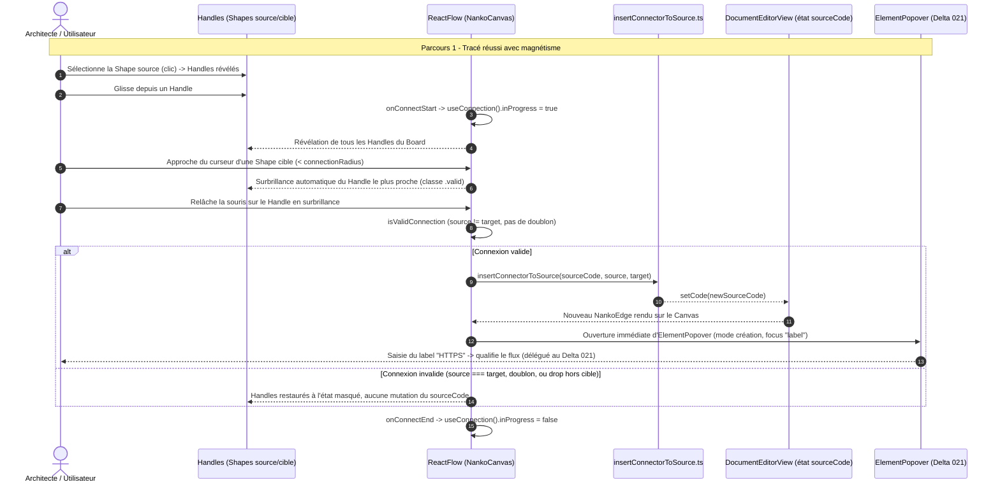

# Change : 022 - Tracé de Connecteur par Glisser & Magnétisme Automatique

## Métadonnées
* **Domaine concerné :** `.specs/current/domains/workspace-management/`
* **Type de changement :** `Évolution`
* **Cible :** `frontend` (React Flow, Handles, Canvas) + `tests-e2e` (Playwright)
* **Dépendance :** Requiert la livraison préalable (ou simultanée) du **Delta 021** (`.specs/changes/active/021-studio-inplace-and-popover-editing.md`), dont le composant `ElementPopover` est réutilisé ici en mode « qualification immédiate » post-création.

---

## 1. Intention & Contexte (Le « Why » du Delta)

* **Problème résolu / Besoin :**
  Le PDR-004 (validé) et la Target `studio-board.md` (§3.1) posent le tracé libre de connecteur avec magnétisme comme pilier de l'expérience Studio, au même titre que la roue radiale déjà livrée (Delta 017) pour les Shapes. Aujourd'hui, un connecteur ne peut **toujours** être créé qu'en tapant `source -> target` dans l'éditeur de code — la modélisation visuelle reste donc incomplète : on peut placer des Shapes visuellement mais pas les relier.
  De plus, l'état actuel s'écarte déjà de la décision PDR-004 : les poignées d'ancrage (`.nanko-handle`) sont **actuellement toujours visibles** sur chaque Shape (aucune règle de masquage au repos dans `NankoCanvas.module.css`), ce qui pollue visuellement le schéma alors que la décision validée prévoit des poignées masquées au repos, visibles uniquement à la sélection ou à l'approche d'un tracé.
* **Impact utilisateur :**
  * Au repos, les poignées d'ancrage sont invisibles sur toutes les Shapes non sélectionnées.
  * Sélectionner une Shape (clic simple) révèle ses 4 poignées.
  * Démarrer un tracé depuis une poignée (glisser la souris) révèle **toutes** les poignées de destination potentielles sur le Board, avec surbrillance automatique de la poignée la plus proche du curseur dès qu'elle entre dans le rayon de magnétisme.
  * Relâcher la souris au-dessus d'une poignée valide crée immédiatement le `Connector` correspondant dans le `.nanko` et ouvre la popover `ElementPopover` (Delta 021) directement en mode édition du `label`, pour qualifier le flux sans changer d'outil.
  * Relâcher la souris dans le vide (aucune Shape cible), sur la Shape source elle-même, ou sur une paire déjà reliée annule le tracé sans effet.
* **In Scope (Ce qui est ajouté/modifié) :**
  * **Masquage des Handles au repos** : `.nanko-handle` invisible par défaut, visible si la Shape parente est `selected`, ou si une connexion est en cours n'importe où sur le Board (`useConnection().inProgress`).
  * **Surbrillance magnétique** de la poignée cible la plus proche pendant le tracé (styles ciblant les classes internes React Flow `.connectingfrom` / `.valid` / `.connectionindicator` posées automatiquement sur les Handles par `@xyflow/react` dans le rayon `connectionRadius`).
  * **Câblage `onConnect` / `onConnectStart` / `onConnectEnd` / `isValidConnection`** sur `<ReactFlow>` (`NankoCanvas.tsx`) : validation (pas d'auto-connexion source === target, pas de doublon `source -> target` déjà existant), création du connecteur, ouverture immédiate d'`ElementPopover` en mode édition du `label` sur le nouveau connecteur.
  * **Nouvel utilitaire** `frontend/src/features/documents/components/canvas/utils/insertConnectorToSource.ts` : `insertConnectorToSource(sourceCode, source, target)`, insertion de la ligne `source -> target` regroupée avec les connecteurs existants (après le bloc de Shapes), à l'image d'`insertShapeToSource.ts`.
  * **Nouveau callback** `onConnectorCreated?: (source: string, target: string) => void` sur `NankoCanvas`, câblé dans `DocumentEditorView.tsx` (`handleConnectorCreated`, miroir de `handleCreateShape`).
  * **Réutilisation d'`ElementPopover`** (Delta 021) en mode création : ouverture automatique post-`onConnect`, focus initial sur le champ `label`, sans nécessiter de clic supplémentaire de l'utilisateur.
  * **Tests unitaires & E2E** du tracé magnétique (drag valide, drag invalide, auto-connexion, doublon).
* **Out of Scope (Exclusions strictes) :**
  * **Suppression en cascade des connecteurs** liés à une Shape supprimée (§3.3 de la target `studio-board`) : delta distinct, non cadré ici.
  * **Outil Connecteur dans la roue radiale** (secteur dédié dans `radialMenuConfig.ts`) : la roue radiale reste dédiée à la création de Shapes (Delta 017) ; le tracé de connecteur démarre exclusivement par glisser depuis un Handle existant (mécanisme natif React Flow), pas via un mode d'outil activé au clavier.
  * **Guides d'alignement dynamiques (Smart Guides)** et **conteneurs/groupes** (§2.3 et §3.4 de la target) : deltas ultérieurs distincts.
  * **Modification du backend, du schéma SQL ou du contrat `PUT /api/v1/documents/{documentId}`** : réutilisation stricte de l'existant, le connecteur créé visuellement suit le même circuit de sauvegarde `Cmd+S` que le reste du Studio.
  * **Renversement du sens d'un connecteur existant** et **désélection/suppression via la popover** : actions listées dans la target `studio-board.md` §3.2 mais hors périmètre du Delta 021 dont dépend ce delta — restent pour un delta ultérieur.

---

## 2. Flux & Architecture (Diff)



---

## 3. Delta Modèle de données & Base de données

Aucune modification du schéma relationnel, de la persistance ni de l'AST dénormalisé n'est nécessaire. Le `Connector` (`source`, `target`, `label` nullable, `desc` nullable) existe déjà depuis les Deltas 001/018. Ce delta ne fait que régénérer le `sourceCode` texte côté client par glisser-déposer, qui suit ensuite le circuit de sauvegarde existant (`PUT /api/v1/documents/{documentId}` → `NankoParser` → AST re-normalisé).

---

## 4. Delta Contrats d'API (Symfony)

Aucun nouvel endpoint ni modification de contrat. La création visuelle de connecteur mute uniquement l'état local `sourceCode` (`DocumentEditorView.tsx`) ; la persistance continue de transiter par `PUT /api/v1/documents/{documentId}` déjà documenté dans `.specs/current/domains/workspace-management/contracts.md`, déclenchée par le raccourci `Cmd+S` / `Ctrl+S` existant.

---

## 5. Configuration Réseau, Prérequis DNS & Variables d'Environnement

* **Prérequis DNS :** Aucun.
* **Sécurisation :** Inchangée (JWT Bearer Token Keycloak sur `PUT /api/v1/documents/{documentId}`).
* **Variables d'environnement :** Aucune nouvelle variable.

---

## 6. Delta Maquettes & Layout UI

### 6.1. Masquage au Repos vs Révélation Contextuelle

```text
AU REPOS (aucune sélection)          SHAPE SÉLECTIONNÉE            TRACÉ EN COURS
+--------------------------+        +--------------------------+   +--------------------------+
| RECTANGLE       gateway  |        |[RECTANGLE       gateway ]|   | RECTANGLE       gateway  |
+--------------------------+        +--------------------------+   ○--------------------------○  <- Handles révélés
| API Gateway              |        |○ API Gateway            ○|   | API Gateway              |    partout sur le Board
+--------------------------+        +--------------------------+   +--------------------------+
   (poignées invisibles)               (poignées visibles)              ...tracé en cours...
                                                                     +--------------------------+
                                                                     |◉ CIRCLE          auth    |  <- Handle en surbrillance
                                                                     +--------------------------+     (magnétisme actif,
                                                                                                        < connectionRadius)
```

### 6.2. Qualification Immédiate Post-Création

```text
                +-----------------------------------------+
                |  Label                                   |
                |  [ |                                   ]  |  <- focus auto (ElementPopover, Delta 021)
                |                                           |
                |  Description                             |
                |  [                                      ]  |
                +-----------------------------------------+
                                     ^ (flèche d'ancrage sur le badge du nouveau connecteur)
                  gateway ────────●────────> auth
```

### 6.3. Arborescence des Fichiers Modifiés & Nouveaux

```text
frontend/src/features/documents/
├── components/canvas/
│   ├── NankoCanvas.tsx                         # onConnect/onConnectStart/onConnectEnd/isValidConnection, useConnection()
│   ├── NankoCanvas.module.css                  # Masquage .nanko-handle au repos + révélation sélection/connexion
│   ├── nodes/
│   │   ├── RectangleNode.tsx                    # isConnectable, classe conditionnelle selon selected
│   │   ├── RectangleNode.test.tsx
│   │   ├── CircleNode.tsx
│   │   ├── CircleNode.test.tsx
│   │   ├── TextNode.tsx
│   │   └── TextNode.test.tsx
│   └── utils/
│       ├── insertConnectorToSource.ts           # Nouveau : sérialisation "source -> target"
│       └── insertConnectorToSource.test.ts
frontend/src/views/
└── DocumentEditorView.tsx                       # handleConnectorCreated (miroir de handleCreateShape) + ouverture ElementPopover

tests-e2e/tests/app/
└── canvas-connector-drawing.spec.ts             # Nouveau : parcours drag & drop de connecteur, cas invalides
```

---

## 7. Delta Spécifications UI & Logique Client (React)

### 7.1. Signature de l'utilitaire de sérialisation (`insertConnectorToSource.ts`)

```typescript
export interface InsertConnectorResult {
  newSourceCode: string
  alreadyExists: boolean
}

/**
 * Insère une nouvelle ligne de Connecteur "source -> target" dans le corps sémantique du .nanko,
 * regroupée avec les connecteurs existants (après le bloc de Shapes). No-op si le couple existe déjà.
 */
export function insertConnectorToSource(
  sourceCode: string,
  source: string,
  target: string,
): InsertConnectorResult
```

### 7.2. Câblage React Flow (`NankoCanvas.tsx`)

```typescript
const connection = useConnection() // { inProgress, fromNode, fromHandle }

const isValidConnection: IsValidConnection = useCallback((connectionOrEdge) => {
  const { source, target } = connectionOrEdge
  if (!source || !target || source === target) return false
  return !edges.some((e) => e.source === source && e.target === target)
}, [edges])

const handleConnect: OnConnect = useCallback((connection) => {
  if (!connection.source || !connection.target) return
  onConnectorCreated?.(connection.source, connection.target)
}, [onConnectorCreated])
```

* `<ReactFlow ... onConnect={handleConnect} isValidConnection={isValidConnection} connectionRadius={32} />` (rayon aligné sur la taille des Handles Blueprint 7px + marge de confort).
* La classe `nanko-canvas-connecting` est posée sur le conteneur du Canvas tant que `connection.inProgress` est vrai, pilotant la règle CSS de révélation globale des Handles.

### 7.3. Règle CSS de Masquage/Révélation

```css
.nanko-handle {
  opacity: 0;
  pointer-events: none;
  transition: opacity 0.12s ease;
}

/* Révélation : Shape sélectionnée */
.nodeRectangle.isSelected .nanko-handle,
.nodeCircle.isSelected .nanko-handle,
.nodeText.isSelected .nanko-handle {
  opacity: 1;
  pointer-events: all;
}

/* Révélation : tracé de connexion en cours n'importe où sur le Board */
.nanko-canvas-connecting .nanko-handle {
  opacity: 0.55;
  pointer-events: all;
}

/* Surbrillance magnétique de la cible valide la plus proche (posée par @xyflow/react) */
.nanko-canvas-connecting .nanko-handle.valid {
  opacity: 1;
  transform: scale(1.5);
  background-color: var(--brand) !important;
}
```

### 7.4. Matrice des États d'Interface

| État | Déclencheur | Rendu visuel & Comportement |
|---|---|---|
| **Repos** | Aucune sélection, aucun tracé en cours | Tous les Handles invisibles (`opacity: 0`), aucune pollution visuelle du schéma. |
| **Shape sélectionnée** | Clic simple sur une Shape | Les 4 Handles de cette Shape deviennent visibles et interactifs. |
| **Tracé en cours** | Glisser depuis un Handle | Tous les Handles du Board deviennent semi-visibles (`opacity: 0.55`) ; ligne de connexion React Flow suit le curseur. |
| **Approche magnétique** | Curseur à moins de `connectionRadius` (32px) d'un Handle valide | Le Handle concerné passe en pleine opacité, s'agrandit (`scale(1.5)`) et se colore en `--brand` (indicateur de verrouillage imminent). |
| **Drop invalide** | Relâchement hors cible, sur la Shape source, ou sur un couple déjà connecté | Aucune mutation du `sourceCode`, les Handles reviennent à l'état masqué, aucune notification bloquante (le tracé est simplement abandonné). |

---

## 8. Invariants & Cas limites (*Edge cases*)

1. **Interdiction de l'auto-connexion :** `isValidConnection` rejette tout couple où `source === target` ; le Handle de la Shape source elle-même n'est jamais mis en surbrillance « valide » pendant son propre tracé.
2. **Interdiction du doublon strict :** Si un connecteur `source -> target` existe déjà (comparaison exacte du couple, le sens inverse `target -> source` reste autorisé et distinct), le drop est traité comme invalide et aucune ligne n'est ajoutée — cohérent avec le fait que le format `.nanko` ne définit aucune contrainte d'unicité mais qu'un doublon visuel serait trompeur.
3. **Référence à des Shapes existantes uniquement :** Le mécanisme de drag ne peut techniquement cibler qu'un Handle appartenant à un nœud déjà rendu sur le Canvas (donc déjà déclaré dans l'AST) — aucun risque de connecteur orphelin créé par ce parcours (cohérent avec l'invariant backend d'intégrité référentielle).
4. **Résilience aux erreurs de syntaxe globales :** Si le `sourceCode` est dans un état syntaxiquement invalide (canvas en pause), le tracé de connecteur est désactivé (`isConnectable={false}` sur les nœuds) pour ne pas créer un connecteur sur un AST potentiellement obsolète.
5. **Dépendance au Delta 021 :** L'ouverture immédiate d'`ElementPopover` en mode création suppose que ce composant est livré. Si ce delta est implémenté avant que 021 ne le soit, le connecteur est tout de même créé dans le `.nanko` (sans `label`/`desc`) mais aucune popover ne s'ouvre automatiquement — l'utilisateur qualifie alors le connecteur via le double-clic ou clic simple une fois 021 disponible. Ce comportement dégradé est acceptable mais **021 doit être livrée avant ou en même temps que 022** pour l'expérience complète.
6. **Concurrence Multi-Handles :** Si deux Handles valides sont équidistants du curseur, la priorité de surbrillance suit le comportement natif de `@xyflow/react` (premier Handle détecté dans le rayon), sans logique de départage additionnelle dans ce delta.
7. **Mode non-éditable :** Le comportement est identique pour tout utilisateur ayant accès en écriture au document (aucune Capability `viewer`/`editor` n'existe encore, cf. Delta 021 §Out of Scope).

---

## 9. Plan d'exécution séquentiel

- [ ] **Phase 0 : Prérequis**
  - [ ] 1. Vérifier que le Delta 021 (`ElementPopover`) est livré ou en cours de livraison conjointe avant d'activer l'ouverture automatique post-création.

- [ ] **Phase 1 : Frontend Canvas & Composants Graphiques (`frontend/src/features/documents/`)**
  - [ ] 1. Créer `insertConnectorToSource.ts` (insertion regroupée avec les connecteurs existants, détection de doublon).
  - [ ] 2. Ajouter la règle CSS de masquage/révélation des `.nanko-handle` (repos, sélection, tracé en cours, surbrillance magnétique) dans `NankoCanvas.module.css`.
  - [ ] 3. Câbler `onConnect`, `onConnectStart`, `onConnectEnd`, `isValidConnection`, `connectionRadius={32}` sur `<ReactFlow>` dans `NankoCanvas.tsx`, avec `useConnection()` pour piloter la classe `nanko-canvas-connecting`.
  - [ ] 4. Ajouter le callback `onConnectorCreated` sur `NankoCanvas` et le câbler dans `DocumentEditorView.tsx` (`handleConnectorCreated`), déclenchant l'ouverture d'`ElementPopover` en mode création sur le nouveau connecteur.
  - [ ] 5. Désactiver `isConnectable` sur les nœuds lorsque `syntaxError` est actif (canvas en pause).

- [ ] **Phase 2 : Tests Unitaires Frontend (`frontend/`)**
  - [ ] 1. `insertConnectorToSource.test.ts` : insertion nominale, regroupement après les Shapes, no-op sur doublon.
  - [ ] 2. Tests unitaires `NankoCanvas.test.tsx` : `isValidConnection` rejette l'auto-connexion et le doublon ; `onConnect` valide déclenche `onConnectorCreated`.
  - [ ] 3. Valider la suite complète : `pnpm --filter frontend typecheck`, `pnpm --filter frontend lint`, `pnpm --filter frontend test`.

- [ ] **Phase 3 : End-to-End (`tests-e2e/`)**
  - [ ] 1. Créer `canvas-connector-drawing.spec.ts` : sélection d'une Shape, glisser depuis un Handle vers une autre Shape, vérification de la ligne `source -> target` dans le code après sauvegarde, ouverture de la popover de qualification, tentative d'auto-connexion et de doublon (aucun effet).
  - [ ] 2. Valider la suite complète : `make test-e2e`.

- [ ] **Phase 4 : Synchronisation documentaire (Automatisable via `/sync-current`)**
  - [ ] 1. Mettre à jour `.specs/current/domains/workspace-management/behavior.md` (nouveau Parcours décrivant le tracé magnétique).
  - [ ] 2. Mettre à jour `.specs/current/domains/workspace-management/tech.md` (`insertConnectorToSource.ts`, `useConnection`, règles CSS de Handles).
  - [ ] 3. Déplacer ce fichier dans `.specs/changes/archive/022-magnetic-connector-drawing.md`.
  - [ ] 4. Mettre à jour la Target `.specs/targets/active/studio-board.md` (§3.1) pour refléter la livraison du tracé magnétique.

---

## 10. Definition of Done & Stratégie de tests

### 10.1. Scénarios de validation (Format Gherkin avec tags)

```gherkin
# ==============================================================================
# TESTS FRONTEND (frontend/ - Unitaires & Composants React)
# ==============================================================================

@web @unit
Fonctionnalité: Tracé de connecteur par glisser avec magnétisme

  Scénario: Les Handles sont masqués au repos
    Étant donné un RectangleNode non sélectionné sur le Canvas
    Alors ses Handles ont une opacité de 0 et ne sont pas interactifs

  @web @unit
  Scénario: La sélection révèle les Handles
    Étant donné un RectangleNode non sélectionné
    Quand l'utilisateur clique dessus pour le sélectionner
    Alors ses Handles deviennent visibles et interactifs

  @web @unit
  Scénario: Rejet de l'auto-connexion
    Quand "isValidConnection" est appelé avec une connexion où source et target sont identiques
    Alors la connexion est jugée invalide

  @web @unit
  Scénario: Rejet d'un connecteur en doublon
    Étant donné un connecteur existant "gateway -> auth"
    Quand "isValidConnection" est appelé avec une nouvelle connexion "gateway -> auth"
    Alors la connexion est jugée invalide

  @web @unit
  Scénario: Création d'un connecteur valide déclenche le callback
    Quand "onConnect" est appelé avec une connexion valide "gateway -> auth"
    Alors "onConnectorCreated" est invoqué avec "gateway" et "auth"

  @web @unit
  Scénario: Insertion d'un connecteur dans le code source
    Quand "insertConnectorToSource" est appelé avec un sourceCode contenant les shapes "gateway" et "auth"
    Alors la ligne "gateway -> auth" est ajoutée regroupée avec les connecteurs existants

  @web @unit
  Scénario: No-op sur connecteur déjà existant
    Étant donné un sourceCode contenant déjà la ligne "gateway -> auth"
    Quand "insertConnectorToSource" est appelé avec "gateway" et "auth"
    Alors le sourceCode retourné est strictement identique et "alreadyExists" vaut vrai

# ==============================================================================
# TESTS E2E (tests-e2e/ - Parcours complet sur le Canvas interactif)
# ==============================================================================

@e2e @preprod
Fonctionnalité: Tracé visuel de connecteur sur le Board

  Scénario: Tracé réussi d'un connecteur par glisser-déposer
    Étant donné que l'utilisateur édite un document contenant les shapes "gateway" et "auth" sans connecteur
    Quand il sélectionne la shape "gateway" puis glisse depuis son Handle droit jusqu'au Handle gauche de "auth"
    Et qu'il relâche la souris sur le Handle en surbrillance
    Alors une popover de qualification s'ouvre automatiquement avec le focus sur le champ Label
    Quand il saisit "HTTPS" et valide
    Et qu'il sauvegarde via "Cmd+S"
    Alors le code source contient la ligne 'gateway -> auth label="HTTPS"'

  Scénario: Abandon du tracé sur une cible invalide
    Étant donné que l'utilisateur édite un document contenant la shape "gateway" seule
    Quand il glisse depuis un Handle de "gateway" et relâche la souris dans une zone vide du Canvas
    Alors aucun connecteur n'est ajouté au code source et aucune popover ne s'ouvre
```

### 10.2. Commandes de validation automatisée

```bash
# 1. Validation Frontend (Typecheck, Lint, Tests unitaires)
pnpm --filter frontend typecheck
pnpm --filter frontend lint
pnpm --filter frontend test

# 2. Validation End-to-End Playwright
make test-e2e
```
