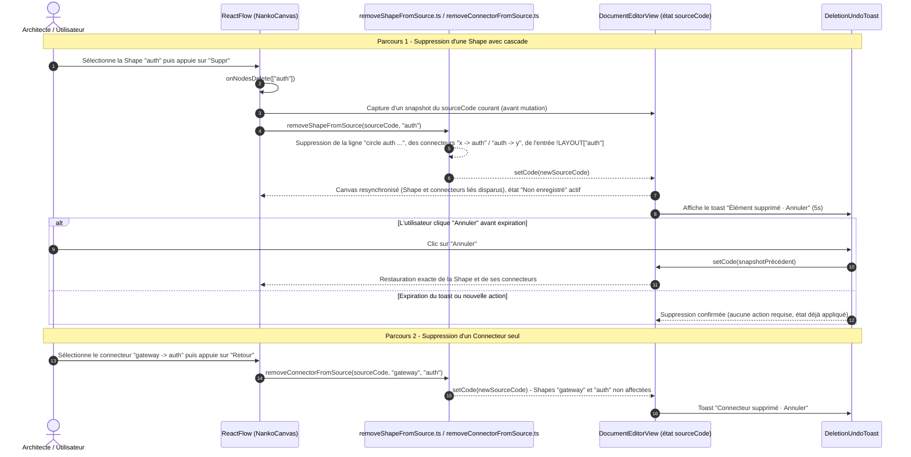

# Change : 023 - Suppression Visuelle de Shapes & Connecteurs avec Cascade d'Intégrité

## Métadonnées
* **Domaine concerné :** `.specs/current/domains/workspace-management/`
* **Type de changement :** `Évolution`
* **Cible :** `frontend` (React Flow, Canvas) + `tests-e2e` (Playwright)

---

## 1. Intention & Contexte (Le « Why » du Delta)

* **Problème résolu / Besoin :**
  À ce jour, **aucun mécanisme de suppression visuelle n'existe** sur le Board : le code du Canvas (`NankoCanvas.tsx`) ne câble ni `onNodesDelete`, ni `onEdgesDelete`, ni de raccourci `deleteKeyCode` propagé vers le `sourceCode`. Un utilisateur qui sélectionne une Shape et appuie sur `Suppr` la voit disparaître localement dans React Flow (comportement par défaut de la librairie), **sans que le `.nanko` ne soit modifié** — la Shape réapparaît dès que l'AST est recalculé (déplacement d'un autre nœud, auto-layout, etc.), ce qui constitue un bug latent autant qu'un manque fonctionnel. La seule façon fiable de supprimer un élément aujourd'hui est d'éditer le texte source.
* **Impact utilisateur :**
  * Sélectionner une Shape et appuyer sur `Suppr` / `Retour` (Backspace) la supprime réellement du `.nanko`, ainsi que **tous les connecteurs entrants et sortants qui la référencent** et son entrée dans le bloc `!LAYOUT`.
  * Sélectionner un Connecteur et appuyer sur `Suppr` / `Retour` supprime uniquement ce connecteur, sans impacter les Shapes reliées.
  * Conformément au principe directeur « Non-destructivité par défaut » (`.specs/vision.md` §2 : *toute suppression d'élément structurant exige une confirmation explicite*), la suppression déclenche un **toast transitoire « Élément supprimé · Annuler »** (5 secondes) permettant de restaurer instantanément l'état exact du `.nanko` précédent en un clic — sans attendre la pile Undo/Redo unifiée prévue plus tard par la Target `studio-board` (§5.3, non livrée).
  * Comme pour toute autre mutation visuelle du Studio, la suppression active l'état « Non enregistré », la persistance réelle restant gouvernée par `Cmd+S` / `Ctrl+S`.
* **In Scope (Ce qui est ajouté/modifié) :**
  * **Câblage `onNodesDelete` / `onEdgesDelete` / `deleteKeyCode`** sur `<ReactFlow>` (`NankoCanvas.tsx`), en respectant le raccourci standard `Suppr` / `Retour` déjà annoncé par la Target `studio-board.md` (§6.2).
  * **Nouveaux utilitaires** `frontend/src/features/documents/components/canvas/utils/removeShapeFromSource.ts` (suppression de la déclaration de Shape + cascade des connecteurs liés + nettoyage `!LAYOUT`) et `removeConnectorFromSource.ts` (suppression d'une seule ligne connecteur).
  * **Nouveaux callbacks** `onShapesDeleted?: (shapeIds: string[]) => void` et `onConnectorsDeleted?: (pairs: { source: string; target: string }[]) => void` sur `NankoCanvas`, câblés dans `DocumentEditorView.tsx`.
  * **Toast de restauration** `DeletionUndoToast` (composant léger, snapshot du `sourceCode` précédent restauré en un clic, expiration automatique à 5s).
  * **Tests unitaires & E2E** de la cascade, du nettoyage `!LAYOUT`, et du toast d'annulation.
* **Out of Scope (Exclusions strictes) :**
  * **Suppression via la popover contextuelle** (`ElementPopover`, action « Supprimer » listée en §3.2 de la target `studio-board`) : ce delta ne couvre que le raccourci clavier `Suppr`/`Retour` sur sélection ; l'ajout d'un bouton de suppression dans la popover est reporté à un delta ultérieur qui viendra étendre le Delta 021.
  * **Pile Undo/Redo unifiée** (§5.3 de la target) : le toast de restauration de ce delta est une solution locale et transitoire dédiée à la suppression, pas une pile d'annulation générale couvrant toutes les actions du Studio.
  * **Confirmation modale bloquante :** conformément à l'esprit « Feedback immédiat, zéro friction » (`.specs/vision.md`), le choix de conception est un **toast d'annulation post-action** plutôt qu'une boîte de dialogue de confirmation préalable qui interromprait le flux de modélisation — cf. Invariant 1 ci-dessous pour la justification.
  * **Suppression multiple de Shapes non contiguës via marquee-select** : le comportement de sélection multiple de React Flow est conservé tel quel (out of scope l'ajout d'UX dédiée), seule la cascade de suppression est traitée pour chaque Shape sélectionnée.
  * **Modification du backend, du schéma SQL ou du contrat `PUT /api/v1/documents/{documentId}`** : réutilisation stricte de l'existant.

---

## 2. Flux & Architecture (Diff)



---

## 3. Delta Modèle de données & Base de données

Aucune modification du schéma relationnel, de la persistance ni de l'AST dénormalisé n'est nécessaire. Ce delta ne fait que régénérer le `sourceCode` texte côté client par suppression ciblée de lignes, qui suit ensuite le circuit de sauvegarde existant (`PUT /api/v1/documents/{documentId}` → `NankoParser` → AST re-normalisé).

---

## 4. Delta Contrats d'API (Symfony)

Aucun nouvel endpoint ni modification de contrat. La suppression visuelle mute uniquement l'état local `sourceCode` (`DocumentEditorView.tsx`) ; la persistance continue de transiter par `PUT /api/v1/documents/{documentId}` déjà documenté dans `.specs/current/domains/workspace-management/contracts.md`, déclenchée par `Cmd+S` / `Ctrl+S`.

---

## 5. Configuration Réseau, Prérequis DNS & Variables d'Environnement

* **Prérequis DNS :** Aucun.
* **Sécurisation :** Inchangée (JWT Bearer Token Keycloak sur `PUT /api/v1/documents/{documentId}`).
* **Variables d'environnement :** Aucune nouvelle variable.

---

## 6. Delta Maquettes & Layout UI

### 6.1. Suppression avec Cascade et Toast d'Annulation

```text
AVANT SUPPRESSION                          APRÈS "Suppr" SUR "auth"
+------------------+                       +------------------+
| RECTANGLE gateway|                       | RECTANGLE gateway|
+------------------+                       +------------------+
        |  gRPC                                  (connecteur supprimé
        v                                          en cascade)
 /-----------------\
|  CIRCLE     auth  |    (sélectionnée)     (Shape supprimée)
 \-----------------/
        |  SQL
        v
+------------------+                       +------------------+
| RECTANGLE   db   |                       | RECTANGLE   db   |
+------------------+                       +------------------+
                                                    (connecteur "auth -> db"
                                                     supprimé en cascade)

                          +-----------------------------------------+
                          |  Élément supprimé          [ Annuler ]  |
                          +-----------------------------------------+
                                  (toast bas de Canvas, 5s)
```

### 6.2. Arborescence des Fichiers Modifiés & Nouveaux

```text
frontend/src/features/documents/
├── components/canvas/
│   ├── NankoCanvas.tsx                          # onNodesDelete/onEdgesDelete, deleteKeyCode, snapshot pré-suppression
│   ├── utils/
│   │   ├── removeShapeFromSource.ts             # Nouveau : suppression Shape + cascade connecteurs + nettoyage !LAYOUT
│   │   ├── removeShapeFromSource.test.ts
│   │   ├── removeConnectorFromSource.ts         # Nouveau : suppression d'une seule ligne connecteur
│   │   └── removeConnectorFromSource.test.ts
│   └── toast/
│       ├── DeletionUndoToast.tsx                # Nouveau : toast d'annulation 5s
│       ├── DeletionUndoToast.module.css
│       └── DeletionUndoToast.test.tsx
frontend/src/views/
└── DocumentEditorView.tsx                        # handleShapesDeleted / handleConnectorsDeleted, gestion du snapshot et du toast

tests-e2e/tests/app/
└── canvas-deletion-cascade.spec.ts               # Nouveau : suppression Shape + cascade, suppression Connecteur seul, annulation via toast
```

---

## 7. Delta Spécifications UI & Logique Client (React)

### 7.1. Signatures des utilitaires de sérialisation

```typescript
export interface RemoveShapeResult {
  newSourceCode: string
  removedConnectorIds: string[] // ex: ["gateway->auth", "auth->db"]
}

/**
 * Supprime la déclaration d'une Shape, tous les Connecteurs entrants/sortants qui la référencent
 * et son entrée dans le bloc !LAYOUT. No-op si l'identifiant est introuvable.
 */
export function removeShapeFromSource(sourceCode: string, shapeId: string): RemoveShapeResult

/**
 * Supprime la ligne d'un Connecteur "source -> target" (avec ses attributs) sans impacter les Shapes.
 * No-op si le couple est introuvable.
 */
export function removeConnectorFromSource(sourceCode: string, source: string, target: string): string
```

### 7.2. Câblage React Flow (`NankoCanvas.tsx`)

```typescript
<ReactFlow
  // ...
  deleteKeyCode={['Backspace', 'Delete']}
  onNodesDelete={(deletedNodes) => onShapesDeleted?.(deletedNodes.map((n) => n.id))}
  onEdgesDelete={(deletedEdges) => onConnectorsDeleted?.(
    deletedEdges.map((e) => ({ source: e.source, target: e.target })),
  )}
/>
```

### 7.3. Matrice des États d'Interface

| État | Déclencheur | Rendu visuel & Comportement |
|---|---|---|
| **Sélectionné** | Clic sur une Shape ou un Connecteur | Élément mis en surbrillance, prêt à être supprimé par `Suppr`/`Retour`. |
| **Suppression en cascade** | `Suppr`/`Retour` sur une Shape sélectionnée | La Shape et tous ses connecteurs liés disparaissent instantanément du Canvas ; `sourceCode` régénéré ; badge « Non enregistré » activé. |
| **Suppression simple** | `Suppr`/`Retour` sur un Connecteur sélectionné | Seul le connecteur disparaît ; les Shapes reliées restent inchangées. |
| **Toast actif** | Juste après une suppression | Toast bas de Canvas « Élément supprimé · Annuler » visible 5s, cliquable. |
| **Restauré** | Clic sur « Annuler » avant expiration | `sourceCode` restauré exactement à l'état pré-suppression (Shape, connecteurs et coordonnées `!LAYOUT` inclus), toast disparaît immédiatement. |

---

## 8. Invariants & Cas limites (*Edge cases*)

1. **Justification du choix « toast post-action » plutôt que confirmation préalable :** Conformément au principe directeur « Feedback immédiat & Transparence » et « Simplicité & Zéro friction » de `.specs/vision.md`, une boîte de dialogue bloquante avant chaque suppression casserait le flux de modélisation rapide (la Target `studio-board.md` promeut justement un dépôt/suppression fluide « en un geste »). Le toast d'annulation de 5s satisfait l'exigence de non-destructivité du même document vision (restauration explicite possible) sans friction préalable.
2. **Cascade stricte et atomique :** La suppression d'une Shape et de tous ses connecteurs liés est traitée comme **une seule mutation** du `sourceCode` (un seul appel à `setCode`), de sorte qu'un seul toast et une seule restauration couvrent l'ensemble de l'opération — pas de désynchronisation partielle possible.
3. **Nettoyage du bloc `!LAYOUT` :** L'entrée de coordonnées `shapeId: x=..., y=...` est systématiquement retirée du bloc `!LAYOUT ... !END` lors de la suppression d'une Shape, pour ne pas laisser de référence orpheline.
4. **Suppression multiple (sélection groupée) :** Si plusieurs Shapes et/ou Connecteurs sont sélectionnés simultanément (sélection multiple native React Flow), `onNodesDelete`/`onEdgesDelete` reçoivent la liste complète en un seul événement ; la mutation du `sourceCode` reste néanmoins unique et atomique, avec un seul toast récapitulatif (« 3 éléments supprimés · Annuler »).
5. **Suppression d'un Connecteur déjà cascadé :** Si un Connecteur a déjà été supprimé par la cascade d'une Shape dans la même opération, l'éventuel événement `onEdgesDelete` redondant pour ce même connecteur est ignoré (déduplication par couple `source/target`) pour éviter une double mutation.
6. **Élément introuvable au moment de la suppression :** Si l'identifiant a déjà disparu du `sourceCode` (état désynchronisé), les fonctions de suppression sont no-op et ne lèvent aucune exception.
7. **Résilience aux erreurs de syntaxe globales :** Si le `sourceCode` est dans un état syntaxiquement invalide (canvas en pause), la suppression est désactivée (`deleteKeyCode={null}` dynamiquement) pour ne pas produire une mutation sur un AST potentiellement obsolète.
8. **Expiration du toast pendant une nouvelle suppression :** Si l'utilisateur déclenche une nouvelle suppression avant l'expiration du toast précédent, celui-ci est immédiatement remplacé par le nouveau toast ; la restauration ne concerne alors que la suppression la plus récente (pas de pile d'annulations empilées, cohérent avec l'exclusion explicite de la pile Undo/Redo unifiée).

---

## 9. Plan d'exécution séquentiel

- [ ] **Phase 1 : Frontend Canvas & Composants Graphiques (`frontend/src/features/documents/`)**
  - [ ] 1. Créer `removeShapeFromSource.ts` (suppression de la déclaration, cascade des connecteurs référençant l'id en `source` ou `target`, nettoyage de l'entrée `!LAYOUT`).
  - [ ] 2. Créer `removeConnectorFromSource.ts` (suppression ciblée d'une seule ligne `source -> target`).
  - [ ] 3. Créer `DeletionUndoToast.tsx` (affichage 5s, bouton « Annuler », auto-expiration, déduplication si nouvelle suppression survient).
  - [ ] 4. Câbler `deleteKeyCode`, `onNodesDelete`, `onEdgesDelete` sur `<ReactFlow>` dans `NankoCanvas.tsx`, avec désactivation dynamique si `syntaxError` actif.
  - [ ] 5. Ajouter les callbacks `onShapesDeleted` / `onConnectorsDeleted` sur `NankoCanvas` et les câbler dans `DocumentEditorView.tsx` (capture du snapshot pré-suppression, restauration au clic sur « Annuler »).

- [ ] **Phase 2 : Tests Unitaires Frontend (`frontend/`)**
  - [ ] 1. `removeShapeFromSource.test.ts` : cascade sur connecteurs entrants/sortants, nettoyage `!LAYOUT`, no-op sur id introuvable.
  - [ ] 2. `removeConnectorFromSource.test.ts` : suppression ciblée sans impact sur les Shapes.
  - [ ] 3. `DeletionUndoToast.test.tsx` : affichage, clic « Annuler », expiration automatique.
  - [ ] 4. Valider la suite complète : `pnpm --filter frontend typecheck`, `pnpm --filter frontend lint`, `pnpm --filter frontend test`.

- [ ] **Phase 3 : End-to-End (`tests-e2e/`)**
  - [ ] 1. Créer `canvas-deletion-cascade.spec.ts` : suppression d'une Shape reliée à deux connecteurs (vérification de la disparition des trois lignes après `Cmd+S`), suppression d'un Connecteur seul (Shapes intactes), clic sur « Annuler » restaurant l'état exact avant expiration du toast.
  - [ ] 2. Valider la suite complète : `make test-e2e`.

- [ ] **Phase 4 : Synchronisation documentaire (Automatisable via `/sync-current`)**
  - [ ] 1. Mettre à jour `.specs/current/domains/workspace-management/behavior.md` (nouveau Parcours décrivant la suppression et le toast d'annulation).
  - [ ] 2. Mettre à jour `.specs/current/domains/workspace-management/tech.md` (`removeShapeFromSource.ts`, `removeConnectorFromSource.ts`, `DeletionUndoToast`).
  - [ ] 3. Déplacer ce fichier dans `.specs/changes/archive/023-shape-connector-deletion-cascade.md`.
  - [ ] 4. Mettre à jour la Target `.specs/targets/active/studio-board.md` (§3.3) pour refléter la livraison de la suppression en cascade.

---

## 10. Definition of Done & Stratégie de tests

### 10.1. Scénarios de validation (Format Gherkin avec tags)

```gherkin
# ==============================================================================
# TESTS FRONTEND (frontend/ - Unitaires & Composants React)
# ==============================================================================

@web @unit
Fonctionnalité: Suppression de Shapes et Connecteurs avec cascade d'intégrité

  Scénario: Suppression d'une Shape supprime ses connecteurs liés
    Étant donné un sourceCode avec les shapes "gateway", "auth" et les connecteurs "gateway -> auth" et "auth -> db"
    Quand "removeShapeFromSource" est appelé avec "auth"
    Alors la déclaration de "auth" est retirée
    Et les connecteurs "gateway -> auth" et "auth -> db" sont retirés
    Et l'entrée "auth" du bloc !LAYOUT est retirée

  @web @unit
  Scénario: Suppression d'un Connecteur seul préserve les Shapes
    Étant donné un sourceCode avec le connecteur "gateway -> auth"
    Quand "removeConnectorFromSource" est appelé avec "gateway" et "auth"
    Alors la ligne du connecteur est retirée
    Et les déclarations de "gateway" et "auth" restent inchangées

  @web @unit
  Scénario: No-op sur identifiant introuvable
    Quand "removeShapeFromSource" est appelé avec un shapeId absent du sourceCode
    Alors le sourceCode retourné est strictement identique à l'original

  @web @unit
  Scénario: Le toast d'annulation restaure l'état précédent
    Étant donné un DeletionUndoToast affiché avec un snapshot du sourceCode avant suppression
    Quand l'utilisateur clique sur "Annuler"
    Alors le callback de restauration est appelé avec le snapshot exact

  @web @unit
  Scénario: Expiration automatique du toast
    Étant donné un DeletionUndoToast affiché
    Quand 5 secondes s'écoulent sans interaction
    Alors le toast disparaît et aucune restauration n'est déclenchée

# ==============================================================================
# TESTS E2E (tests-e2e/ - Parcours complet sur le Canvas interactif)
# ==============================================================================

@e2e @preprod
Fonctionnalité: Suppression visuelle avec cascade sur le Board

  Scénario: Suppression d'une Shape en cascade puis sauvegarde
    Étant donné que l'utilisateur édite un document avec les shapes "gateway", "auth" reliées par "gateway -> auth"
    Quand il sélectionne la shape "auth" et appuie sur "Suppr"
    Et qu'il sauvegarde via "Cmd+S"
    Alors le code source ne contient plus "auth" ni le connecteur "gateway -> auth"

  Scénario: Annulation d'une suppression via le toast
    Étant donné que l'utilisateur vient de supprimer la shape "auth" par "Suppr"
    Quand il clique sur "Annuler" dans le toast avant son expiration
    Alors la shape "auth" et son connecteur "gateway -> auth" réapparaissent sur le Canvas
```

### 10.2. Commandes de validation automatisée

```bash
# 1. Validation Frontend (Typecheck, Lint, Tests unitaires)
pnpm --filter frontend typecheck
pnpm --filter frontend lint
pnpm --filter frontend test

# 2. Validation End-to-End Playwright
make test-e2e
```
