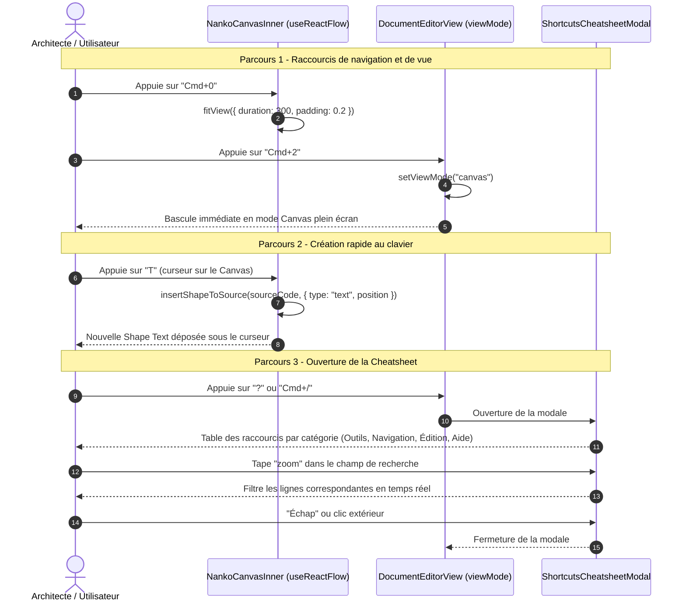

# Change : 024 - Complétion des Raccourcis Clavier, Secteur Texte & Cheatsheet Modal

## Métadonnées
* **Domaine concerné :** `.specs/current/domains/workspace-management/`
* **Type de changement :** `Évolution`
* **Cible :** `frontend` (Canvas, Raccourcis clavier, Modale) + `tests-e2e` (Playwright)
* **Ordre de livraison recommandé :** Après les Deltas 021, 022 et 023, pour que la Cheatsheet documente un jeu de raccourcis déjà complet et fonctionnel (dépendance **documentaire uniquement** — le composant modal lui-même n'appelle aucun code de ces deltas).

---

## 1. Intention & Contexte (Le « Why » du Delta)

* **Problème résolu / Besoin :**
  L'audit du code actuel (`NankoCanvas.tsx`, `CanvasControls.tsx`, `LayoutSelector.tsx`, `SourceCodeEditor.tsx`) montre que seuls **5 raccourcis** sont réellement câblés aujourd'hui : `A`/`Tab` (roue radiale), `R` (Rectangle), `C` (Cercle), `Échap` (fermeture de la roue) et `Cmd+S`/`Ctrl+S` (sauvegarde). Toutes les autres actions déjà exposées visuellement — zoom avant/arrière, recentrage (*Fit View*), bascule de vue Split/Canvas/Code, création de Shape `Text` — ne sont accessibles qu'à la souris via les boutons de `CanvasControls` et `LayoutSelector`. Aucune modale d'aide ne recense ces raccourcis. Cela freine la vélocité de modélisation clavier-first visée par le PDR-004 et la Target `studio-board.md` (§6).
* **Impact utilisateur :**
  * Un raccourci `T` dépose une Shape `Text` sous le curseur, et un 3ᵉ secteur « Text » apparaît dans la roue radiale (`A`/`Tab`).
  * `Cmd+0` / `Ctrl+0` recentre la vue (*Fit View*) ; `Cmd+=` / `Cmd+-` (`Ctrl+=` / `Ctrl+-`) zooment avant/arrière.
  * `Cmd+1` / `Cmd+2` / `Cmd+3` (`Ctrl+1/2/3`) basculent respectivement en vue Split, Canvas et Code.
  * `Échap`, en dehors de toute roue radiale ouverte, désélectionne l'élément actuellement sélectionné sur le Canvas.
  * `?` ou `Cmd+/` / `Ctrl+/` ouvre une **Cheatsheet Modale** recensant l'intégralité des raccourcis réellement actifs, organisée par catégories (Outils, Navigation, Édition, Aide), avec un bouton d'aide discret `?` intégré à la barre d'outils flottante.
* **In Scope (Ce qui est ajouté/modifié) :**
  * **3ᵉ secteur « Text »** dans la roue radiale (`radialMenuConfig.ts`, recalcul des 3 secteurs à 120° chacun) et raccourci direct `T` (`NankoCanvas.tsx`, réutilisation de `insertShapeToSource` qui supporte déjà `type: 'text'`).
  * **Raccourcis de navigation** `Cmd+0`/`Ctrl+0` (Fit View), `Cmd+=`/`Cmd+-` (`Ctrl+=`/`Ctrl+-`) (Zoom avant/arrière), réutilisant `zoomIn`/`zoomOut`/`fitView` de `useReactFlow()` déjà disponibles dans `NankoCanvasInner`.
  * **Raccourcis de bascule de vue** `Cmd+1`/`Cmd+2`/`Cmd+3` (`Ctrl+1/2/3`) pour Split/Canvas/Code, câblés dans `DocumentEditorView.tsx` (là où vit l'état `viewMode`).
  * **Désélection par `Échap`** hors contexte roue radiale (appel à `useReactFlow().setNodes`/`setEdges` pour retirer `selected: true`, ou API `unselectAll` équivalente).
  * **Modale `ShortcutsCheatsheetModal`** déclenchée par `?` / `Cmd+/` / `Ctrl+/` ou un bouton `?` dans `CanvasControls`, présentant un tableau des raccourcis actifs par catégorie avec recherche texte simple.
  * **Mise à jour des `title` (tooltips natifs)** des boutons existants de `CanvasControls` pour afficher le raccourci associé (ex: `"Recentrer la vue (Fit view) — Cmd+0"`).
  * **Tests unitaires & E2E** de chaque nouveau raccourci et de l'ouverture/fermeture/recherche de la Cheatsheet.
* **Out of Scope (Exclusions strictes) :**
  * **Raccourcis d'actions non encore implémentées** dans le Studio : `L` (outil Connecteur dédié — écarté du périmètre du Delta 022, le tracé démarre uniquement par glisser depuis un Handle), `G` (Grouper en Conteneur — feature non livrée), `Cmd+D` (Dupliquer), `Cmd+Z`/`Cmd+Shift+Z` (Undo/Redo unifié, cf. Target `studio-board.md` §5.3, non livrée). Ces lignes **n'apparaissent pas** dans la Cheatsheet tant que les fonctionnalités correspondantes ne sont pas livrées, pour ne jamais documenter un raccourci qui ne fait rien.
  * **Raccourci `Suppr`/`Retour`** (suppression) : documenté dans la Cheatsheet uniquement une fois le Delta 023 livré ; ce delta-ci n'implémente pas la suppression elle-même (cf. `.specs/changes/active/023-shape-connector-deletion-cascade.md`).
  * **Personnalisation des raccourcis** (rebind utilisateur) : non prévue, raccourcis fixes.
  * **Modification du backend, du schéma SQL ou d'un quelconque contrat d'API** : delta strictement frontend, aucune interaction serveur.

---

## 2. Flux & Architecture (Diff)



---

## 3. Delta Modèle de données & Base de données

Aucune modification du schéma relationnel, de la persistance ni de l'AST. Ce delta est strictement une couche d'interaction clavier et une modale d'aide côté client ; la création de Shape `Text` réutilise le circuit de sauvegarde existant (`PUT /api/v1/documents/{documentId}`).

---

## 4. Delta Contrats d'API (Symfony)

Aucun nouvel endpoint ni modification de contrat.

---

## 5. Configuration Réseau, Prérequis DNS & Variables d'Environnement

* **Prérequis DNS :** Aucun.
* **Sécurisation :** Inchangée.
* **Variables d'environnement :** Aucune nouvelle variable.

---

## 6. Delta Maquettes & Layout UI

### 6.1. Roue Radiale à 3 Secteurs

```text
                    ┌─────────────┐
                   ╱   Rectangle   ╲
                  ╱        R        ╲
                 │                   │
                 │        ×          │  <- pastille centrale d'échappement
                 │                   │
                  ╲   Circle    Text ╱
                   ╲    C        T  ╱
                    └─────────────┘
        (3 secteurs de 120° chacun, contre 2 secteurs de 180° actuellement)
```

### 6.2. Cheatsheet Modale

```text
+-----------------------------------------------------------------------+
|  Raccourcis clavier                                    [ Rechercher ] |
+-----------------------------------------------------------------------+
|  OUTILS                                                                |
|   A / Tab (maintenu)     Ouvrir la roue radiale d'outils              |
|   R                      Déposer un Rectangle                         |
|   C                      Déposer un Circle                            |
|   T                      Déposer un Texte                             |
|   Échap                  Désélectionner / fermer la roue              |
|                                                                        |
|  NAVIGATION                                                           |
|   Cmd/Ctrl + 0           Fit View (recentrer)                        |
|   Cmd/Ctrl + = / -       Zoom avant / arrière                        |
|   Cmd/Ctrl + 1/2/3       Vue Split / Canvas / Code                    |
|                                                                        |
|  ÉDITION                                                              |
|   Cmd/Ctrl + S           Enregistrer les modifications                |
|                                                                        |
|  AIDE                                                                 |
|   ? ou Cmd/Ctrl + /      Ouvrir cette Cheatsheet                      |
+-----------------------------------------------------------------------+
```
*(Les lignes "Suppr/Retour", "Connecteur", "Grouper", "Dupliquer", "Undo/Redo" seront ajoutées au fil de la livraison des Deltas 023 et suivants.)*

### 6.3. Arborescence des Fichiers Modifiés & Nouveaux

```text
frontend/src/features/documents/
├── components/canvas/
│   ├── NankoCanvas.tsx                              # Raccourci T, Cmd+0/Cmd+=/Cmd+-, désélection Échap
│   ├── radial/
│   │   └── radialMenuConfig.ts                      # 3ᵉ secteur "text", recalcul des angles à 120°
│   ├── CanvasControls.tsx                           # Tooltips enrichis du raccourci, bouton "?" d'aide
│   └── cheatsheet/
│       ├── ShortcutsCheatsheetModal.tsx              # Nouveau : modale catégorisée + recherche
│       ├── ShortcutsCheatsheetModal.module.css
│       ├── ShortcutsCheatsheetModal.test.tsx
│       └── shortcutsRegistry.ts                      # Nouveau : source unique de vérité des raccourcis actifs
frontend/src/views/
└── DocumentEditorView.tsx                             # Cmd+1/2/3 (viewMode), déclenchement "?"/Cmd+/ de la modale

tests-e2e/tests/app/
└── canvas-shortcuts-and-cheatsheet.spec.ts            # Nouveau : parcours raccourcis + cheatsheet
```

---

## 7. Delta Spécifications UI & Logique Client (React)

### 7.1. Registre unique des raccourcis (`shortcutsRegistry.ts`)

```typescript
export interface ShortcutEntry {
  category: 'Outils' | 'Navigation' | 'Édition' | 'Aide'
  keys: string[] // ex: ['Cmd', '0'] ou ['A'] ou ['Tab']
  description: string
}

export const SHORTCUTS_REGISTRY: ShortcutEntry[] = [
  { category: 'Outils', keys: ['A'], description: 'Ouvrir la roue radiale d\'outils (maintenu)' },
  { category: 'Outils', keys: ['Tab'], description: 'Ouvrir la roue radiale d\'outils (maintenu)' },
  { category: 'Outils', keys: ['R'], description: 'Déposer un Rectangle' },
  { category: 'Outils', keys: ['C'], description: 'Déposer un Circle' },
  { category: 'Outils', keys: ['T'], description: 'Déposer un Texte' },
  { category: 'Outils', keys: ['Échap'], description: 'Désélectionner / fermer la roue' },
  { category: 'Navigation', keys: ['Cmd', '0'], description: 'Fit View (recentrer)' },
  { category: 'Navigation', keys: ['Cmd', '='], description: 'Zoom avant' },
  { category: 'Navigation', keys: ['Cmd', '-'], description: 'Zoom arrière' },
  { category: 'Navigation', keys: ['Cmd', '1'], description: 'Vue Split' },
  { category: 'Navigation', keys: ['Cmd', '2'], description: 'Vue Canvas' },
  { category: 'Navigation', keys: ['Cmd', '3'], description: 'Vue Code' },
  { category: 'Édition', keys: ['Cmd', 'S'], description: 'Enregistrer les modifications' },
  { category: 'Aide', keys: ['?'], description: 'Ouvrir la Cheatsheet des raccourcis' },
  { category: 'Aide', keys: ['Cmd', '/'], description: 'Ouvrir la Cheatsheet des raccourcis' },
]
```
*Source unique consommée par `ShortcutsCheatsheetModal` — toute future ligne (Suppr/Retour du Delta 023, Connecteur, Grouper, Undo/Redo) s'ajoute ici au moment de sa livraison réelle, jamais en avance.*

### 7.2. Matrice des États d'Interface

| État | Déclencheur | Rendu visuel & Comportement |
|---|---|---|
| **Fermée** | État par défaut | Aucune modale visible, bouton `?` discret dans `CanvasControls`. |
| **Ouverte** | `?`, `Cmd+/`/`Ctrl+/`, ou clic sur le bouton `?` | Modale Blueprint centrée avec overlay, focus initial sur le champ de recherche. |
| **Filtrée** | Saisie dans le champ de recherche | Seules les lignes dont la description ou les touches correspondent au texte saisi restent visibles ; message « Aucun raccourci trouvé » si liste vide. |
| **Fermeture** | `Échap`, clic extérieur, ou clic sur `×` | Modale disparaît, focus restauré sur l'élément précédemment actif. |

---

## 8. Invariants & Cas limites (*Edge cases*)

1. **Neutralisation dans les zones de saisie :** Tous les nouveaux raccourcis (`T`, `Cmd+0`, `Cmd+=`/`Cmd+-`, `Cmd+1/2/3`, `?`) réutilisent le garde-fou `isInputFocused()` déjà en place dans `NankoCanvas.tsx` : aucun raccourci ne se déclenche si le focus est dans l'éditeur Monaco, un champ de recherche ou tout autre champ texte (notamment le champ de recherche de la Cheatsheet elle-même, où taper "?" ne doit pas rouvrir/fermer la modale).
2. **Priorité navigateur native :** `Cmd+0`, `Cmd+=`/`Cmd+-` interceptent par défaut respectivement le zoom navigateur natif (`e.preventDefault()` systématique) pour rester cohérents avec le comportement déjà appliqué à `Cmd+S`.
3. **Roue radiale prioritaire sur `T` :** Si la roue radiale est ouverte (touche `A`/`Tab` maintenue), la frappe de `T` sélectionne/survole le secteur Texte au lieu de déclencher le raccourci direct, à l'identique du comportement déjà défini pour `R`/`C` pendant la roue.
4. **Désélection par `Échap` non destructive :** `Échap` ne fait que retirer l'état `selected` des nœuds/arêtes ; il ne supprime, n'annule et ne ferme aucune autre modale ouverte par ailleurs (dans ce cas, `Échap` ferme d'abord la modale la plus proche du focus, cohérent avec l'empilement standard des overlays).
5. **Recherche insensible à la casse et aux accents :** Le filtre de la Cheatsheet normalise la casse et les accents pour que "echap" trouve "Échap".
6. **Absence de doublon de raccourci :** `T` ne doit jamais entrer en conflit avec un raccourci navigateur standard bloquant (vérifié manuellement en `Phase 1`) ; en cas de conflit détecté à l'usage, le raccourci direct concerné reste accessible via la roue radiale comme repli.
7. **Contenu de la Cheatsheet toujours synchronisé avec l'existant :** Le tableau `SHORTCUTS_REGISTRY` est la seule source de vérité ; ajouter un raccourci non fonctionnel dans ce fichier sans l'implémenter réellement est explicitement proscrit (revue de code obligatoire lors de tout futur delta touchant aux raccourcis).

---

## 9. Plan d'exécution séquentiel

- [ ] **Phase 1 : Frontend Canvas & Raccourcis (`frontend/src/features/documents/`)**
  - [ ] 1. Ajouter le secteur "text" dans `radialMenuConfig.ts` (recalcul des 3 arcs à 120°) et le raccourci direct `T` dans `NankoCanvas.tsx` (réutilisation de `handleDirectShortcut('text')`).
  - [ ] 2. Ajouter les raccourcis `Cmd+0`/`Ctrl+0`, `Cmd+=`/`Cmd+-` (`Ctrl+=`/`Ctrl+-`) dans le `useEffect` de gestion clavier de `NankoCanvasInner`, réutilisant `fitView`/`zoomIn`/`zoomOut` de `useReactFlow()`.
  - [ ] 3. Ajouter la désélection par `Échap` (hors roue radiale ouverte) via l'API de sélection de React Flow.
  - [ ] 4. Ajouter les raccourcis `Cmd+1/2/3` (`Ctrl+1/2/3`) dans `DocumentEditorView.tsx` pour basculer `viewMode`.
  - [ ] 5. Créer `shortcutsRegistry.ts` et `ShortcutsCheatsheetModal.tsx` (recherche, catégories, fermeture `Échap`/clic extérieur).
  - [ ] 6. Ajouter le déclenchement `?`/`Cmd+/`/`Ctrl+/` (dans `DocumentEditorView.tsx`, avec garde `isInputFocused`) et le bouton `?` dans `CanvasControls.tsx`, plus l'enrichissement des `title` existants avec leur raccourci.

- [ ] **Phase 2 : Tests Unitaires Frontend (`frontend/`)**
  - [ ] 1. Tests unitaires du 3ᵉ secteur radial et du raccourci `T`.
  - [ ] 2. Tests unitaires des raccourcis de navigation (`Cmd+0`, zoom, `Cmd+1/2/3`) et de la désélection par `Échap`.
  - [ ] 3. `ShortcutsCheatsheetModal.test.tsx` : ouverture, fermeture, filtre de recherche insensible à la casse/accents.
  - [ ] 4. Valider la suite complète : `pnpm --filter frontend typecheck`, `pnpm --filter frontend lint`, `pnpm --filter frontend test`.

- [ ] **Phase 3 : End-to-End (`tests-e2e/`)**
  - [ ] 1. Créer `canvas-shortcuts-and-cheatsheet.spec.ts` : dépôt d'un Texte par `T`, bascule de vue par `Cmd+2`/`Cmd+3`, ouverture de la Cheatsheet par `?`, recherche filtrante, fermeture par `Échap`.
  - [ ] 2. Valider la suite complète : `make test-e2e`.

- [ ] **Phase 4 : Synchronisation documentaire (Automatisable via `/sync-current`)**
  - [ ] 1. Mettre à jour `.specs/current/domains/workspace-management/behavior.md` (raccourcis complets, Cheatsheet).
  - [ ] 2. Mettre à jour `.specs/current/domains/workspace-management/tech.md` (`shortcutsRegistry.ts`, `ShortcutsCheatsheetModal`).
  - [ ] 3. Déplacer ce fichier dans `.specs/changes/archive/024-keyboard-shortcuts-completion-and-cheatsheet.md`.
  - [ ] 4. Mettre à jour la Target `.specs/targets/active/studio-board.md` (§6) pour cocher les raccourcis livrés.

---

## 10. Definition of Done & Stratégie de tests

### 10.1. Scénarios de validation (Format Gherkin avec tags)

```gherkin
# ==============================================================================
# TESTS FRONTEND (frontend/ - Unitaires & Composants React)
# ==============================================================================

@web @unit
Fonctionnalité: Complétion des raccourcis clavier et Cheatsheet

  Scénario: Le raccourci T dépose une Shape Text
    Étant donné le curseur au-dessus du Canvas
    Quand l'utilisateur appuie sur "T"
    Alors "onCreateShape" est appelé avec le type "text"

  @web @unit
  Scénario: Cmd+0 recentre la vue
    Quand l'utilisateur appuie sur "Cmd+0"
    Alors "fitView" est appelé

  @web @unit
  Scénario: Cmd+2 bascule en mode Canvas
    Quand l'utilisateur appuie sur "Cmd+2"
    Alors "viewMode" devient "canvas"

  @web @unit
  Scénario: Échap désélectionne un élément sans roue radiale ouverte
    Étant donné une Shape actuellement sélectionnée
    Quand l'utilisateur appuie sur "Échap"
    Alors la Shape n'est plus sélectionnée

  @web @unit
  Scénario: Ouverture de la Cheatsheet par Cmd+/
    Quand l'utilisateur appuie sur "Cmd+/"
    Alors la modale "ShortcutsCheatsheetModal" est visible avec les 4 catégories

  @web @unit
  Scénario: Filtre de recherche insensible aux accents
    Étant donné la Cheatsheet ouverte
    Quand l'utilisateur saisit "echap" dans le champ de recherche
    Alors la ligne "Échap" reste visible et les autres lignes sont masquées

  @web @unit
  Scénario: Neutralisation des raccourcis dans l'éditeur Monaco
    Étant donné le focus dans l'éditeur de code Monaco
    Quand l'utilisateur appuie sur "T"
    Alors aucune Shape n'est créée

# ==============================================================================
# TESTS E2E (tests-e2e/ - Parcours complet sur le Canvas interactif)
# ==============================================================================

@e2e @preprod
Fonctionnalité: Raccourcis clavier complets et aide contextuelle

  Scénario: Parcours complet raccourcis et cheatsheet
    Étant donné que l'utilisateur édite un document existant
    Quand il appuie sur "T" et dépose une Shape Texte
    Et qu'il appuie sur "Cmd+3" pour basculer en vue Code
    Et qu'il appuie sur "Cmd+2" pour revenir en vue Canvas
    Et qu'il appuie sur "Cmd+0" pour recentrer la vue
    Et qu'il ouvre la Cheatsheet via "?"
    Alors la modale affiche la liste complète des raccourcis actifs
    Quand il ferme la modale via "Échap"
    Alors la modale disparaît et le Canvas reste inchangé
```

### 10.2. Commandes de validation automatisée

```bash
# 1. Validation Frontend (Typecheck, Lint, Tests unitaires)
pnpm --filter frontend typecheck
pnpm --filter frontend lint
pnpm --filter frontend test

# 2. Validation End-to-End Playwright
make test-e2e
```
