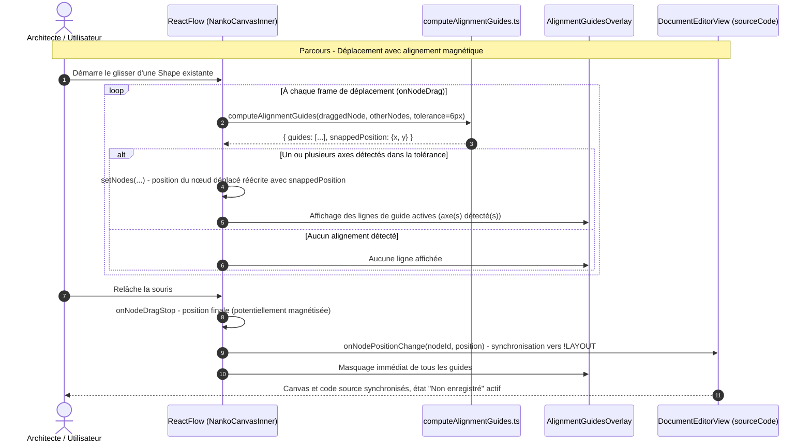

# Change : 027 - Guides d'Alignement Dynamiques (Smart Guides) & Magnétisme de Positionnement

## Métadonnées
* **Domaine concerné :** `.specs/current/domains/workspace-management/`
* **Type de changement :** `Évolution`
* **Cible :** `frontend` (Canvas React Flow, calcul géométrique, overlay SVG) + `tests-e2e` (Playwright)

---

## 1. Intention & Contexte (Le « Why » du Delta)

* **Problème résolu / Besoin :**
  Aujourd'hui, déplacer une Shape sur le Canvas (`onNodeDragStop`, déjà câblé) ne fournit aucune assistance spatiale : aligner deux Shapes sur un même axe (horizontal ou vertical) exige un ajustement au pixel près à l'œil nu. La Target `studio-board.md` (§2.3) prévoit des **guides d'alignement dynamiques** (magnétisme léger sur les centres ou les bords) pour garantir des schémas d'architecture visuellement rigoureux sans effort manuel, à l'image des outils de référence (Figma, Miro).
* **Impact utilisateur :**
  * Pendant le déplacement d'une Shape, dès que son centre ou l'un de ses bords s'approche (< 6px) du centre ou d'un bord d'une autre Shape déjà positionnée, une **ligne de guide fine cyan** (`--brand`) traverse le Canvas sur l'axe concerné.
  * Un **léger magnétisme** verrouille la position de la Shape déplacée sur cet axe tant que le curseur reste dans la tolérance de détection, sans effort d'ajustement pixel-perfect.
  * Plusieurs guides peuvent apparaître simultanément (un axe horizontal + un axe vertical) si la Shape s'aligne sur deux références différentes en même temps.
  * Les guides disparaissent instantanément dès que l'alignement n'est plus actif ou que le glisser se termine (`onNodeDragStop`) ; ils n'apparaissent jamais pendant la création (roue radiale, volet latéral) ni pendant le tracé de connecteur.
* **In Scope (Ce qui est ajouté/modifié) :**
  * **Nouvel utilitaire** `frontend/src/features/documents/components/canvas/utils/computeAlignmentGuides.ts` : calcul des axes d'alignement (centres + 4 bords) entre le nœud en cours de déplacement et tous les autres nœuds visibles, avec tolérance de détection/magnétisme de 6px.
  * **Nouveau composant `AlignmentGuidesOverlay.tsx`** (+ CSS Module) : rendu SVG des lignes de guide actives, superposé au Canvas React Flow.
  * **Câblage `onNodeDrag`** (continu, nouveau handler distinct de `onNodeDragStop`) sur `<ReactFlow>` dans `NankoCanvasInner` : calcul des guides à chaque frame de déplacement, application du magnétisme en réécrivant la position du nœud déplacé dans l'état local `nodes` (pattern « Helper Lines » officiel de `@xyflow/react`).
  * **Tests unitaires & E2E** du calcul géométrique, du magnétisme et de l'affichage/disparition des guides.
* **Out of Scope (Exclusions strictes) :**
  * **Guides pendant la création** (roue radiale Delta 017, volet latéral Delta 026) : aucun magnétisme ni guide ne s'applique au dépôt initial d'une nouvelle Shape, uniquement au déplacement d'une Shape déjà existante.
  * **Guides pendant le tracé de connecteur** (Delta 022) : le magnétisme de connecteur (accroche sur un Handle) reste un mécanisme totalement distinct, non modifié par ce delta.
  * **Guides pendant/après un Auto-Layout Dagre** : l'algorithme hiérarchique conserve son positionnement automatique propre, sans interaction avec le magnétisme manuel.
  * **Alignement de groupes/conteneurs** (§3.4 de la target, non livré) : ce delta ne traite que des nœuds individuels (Shapes), pas de futurs conteneurs.
  * **Persistance ou configuration de la tolérance** : le seuil de 6px est une constante fixe non paramétrable par l'utilisateur dans ce delta.
  * **Modification du backend, du schéma SQL ou d'un contrat d'API** : delta strictement frontend, la position finale continue de transiter par `onNodePositionChange` déjà existant vers `!LAYOUT`.

---

## 2. Flux & Architecture (Diff)



---

## 3. Delta Modèle de données & Base de données

Aucune modification du schéma relationnel, de la persistance ni de l'AST dénormalisé. Ce delta n'affecte que le comportement visuel transitoire pendant le drag ; la position finale continue d'être synchronisée vers le bloc `!LAYOUT` du `sourceCode` via le mécanisme `onNodePositionChange` déjà existant (Delta initial de manipulation spatiale).

---

## 4. Delta Contrats d'API (Symfony)

Aucun nouvel endpoint ni modification de contrat. Le comportement de sauvegarde (`PUT /api/v1/documents/{documentId}`) reste strictement inchangé.

---

## 5. Configuration Réseau, Prérequis DNS & Variables d'Environnement

* **Prérequis DNS :** Aucun.
* **Sécurisation :** Inchangée.
* **Variables d'environnement :** Aucune nouvelle variable.

---

## 6. Delta Maquettes & Layout UI

### 6.1. Guides Actifs Pendant le Déplacement

```text
                    ┊ (guide vertical - alignement des centres)
                    ┊
+------------------+┊
| RECTANGLE gateway |┊
+------------------+┊
                    ┊
                    ┊  <- Shape en cours de déplacement, verrouillée sur l'axe
       /-----------┊------\
      |   CIRCLE   ┊ auth  |
       \-----------┊------/
                    ┊
┈┈┈┈┈┈┈┈┈┈┈┈┈┈┈┈┈┈┈┈┈┈┈┈┈┈┈┈┈┈┈┈┈┈┈┈┈┈┈  <- guide horizontal (alignement d'un bord)
+------------------+
| RECTANGLE    db  |
+------------------+
```

### 6.2. Arborescence des Fichiers Modifiés & Nouveaux

```text
frontend/src/features/documents/
├── components/canvas/
│   ├── NankoCanvas.tsx                              # Nouveau handler onNodeDrag (calcul + snapping + état des guides)
│   ├── guides/
│   │   ├── AlignmentGuidesOverlay.tsx                # Nouveau : rendu SVG des lignes de guide actives
│   │   ├── AlignmentGuidesOverlay.module.css
│   │   └── AlignmentGuidesOverlay.test.tsx
│   └── utils/
│       ├── computeAlignmentGuides.ts                 # Nouveau : calcul géométrique centres/bords + tolérance
│       └── computeAlignmentGuides.test.ts

tests-e2e/tests/app/
└── canvas-alignment-guides.spec.ts                   # Nouveau : apparition/disparition des guides, magnétisme
```

---

## 7. Delta Spécifications UI & Logique Client (React)

### 7.1. Signature de l'utilitaire de calcul (`computeAlignmentGuides.ts`)

```typescript
export interface NodeBounds {
  id: string
  x: number
  y: number
  width: number
  height: number
}

export interface AlignmentGuide {
  orientation: 'vertical' | 'horizontal'
  position: number // coordonnée absolue de l'axe dans le référentiel du Canvas
  alignType: 'center' | 'edge-start' | 'edge-end'
}

export interface AlignmentResult {
  guides: AlignmentGuide[]
  snappedPosition: { x: number; y: number }
}

export const ALIGNMENT_TOLERANCE_PX = 6

/**
 * Compare le nœud en cours de déplacement (draggedNode) à tous les autres nœuds (otherNodes)
 * sur leurs centres et leurs 4 bords. Retourne les guides actifs (dans la tolérance) et la position
 * "magnétisée" du nœud déplacé (inchangée sur les axes non concernés).
 */
export function computeAlignmentGuides(
  draggedNode: NodeBounds,
  otherNodes: NodeBounds[],
  tolerance?: number,
): AlignmentResult
```

### 7.2. Câblage React Flow (`NankoCanvasInner`)

```typescript
const [activeGuides, setActiveGuides] = useState<AlignmentGuide[]>([])

const handleNodeDrag: OnNodeDrag = useCallback((_event, node) => {
  const draggedBounds = toNodeBounds(node)
  const otherBounds = nodes.filter((n) => n.id !== node.id).map(toNodeBounds)
  const { guides, snappedPosition } = computeAlignmentGuides(draggedBounds, otherBounds, ALIGNMENT_TOLERANCE_PX)

  setActiveGuides(guides)
  if (snappedPosition.x !== node.position.x || snappedPosition.y !== node.position.y) {
    setNodes((nds) => nds.map((n) => (n.id === node.id ? { ...n, position: snappedPosition } : n)))
  }
}, [nodes])

const handleNodeDragStop: OnNodeDrag = useCallback((_event, node) => {
  setActiveGuides([])
  onNodePositionChange?.(node.id, node.position)
}, [onNodePositionChange])
```

* `<ReactFlow ... onNodeDrag={handleNodeDrag} onNodeDragStop={handleNodeDragStop} />`.
* `AlignmentGuidesOverlay` est rendu en `<Panel>` (ou overlay `position: absolute` couvrant tout le pane), consommant `activeGuides` pour tracer une ligne par guide actif sur toute la largeur/hauteur visible du viewport.

### 7.3. Matrice des États d'Interface

| État | Déclencheur | Rendu visuel & Comportement |
|---|---|---|
| **Repos** | Aucun drag en cours | Aucun guide affiché. |
| **Drag sans alignement** | Déplacement d'une Shape, aucun axe dans la tolérance | Aucun guide, la Shape suit librement le curseur. |
| **Drag avec alignement simple** | Un axe (centre ou bord) dans la tolérance de 6px | Une ligne cyan traverse le Canvas sur l'axe concerné, la position de la Shape est verrouillée sur cet axe. |
| **Drag avec double alignement** | Un axe horizontal ET un axe vertical simultanément dans la tolérance | Deux lignes cyan affichées (croisement), Shape verrouillée sur les deux axes. |
| **Fin du drag** | `onNodeDragStop` | Tous les guides disparaissent immédiatement, la position finale (potentiellement magnétisée) est synchronisée vers `!LAYOUT`. |

---

## 8. Invariants & Cas limites (*Edge cases*)

1. **Exclusion du nœud lui-même :** Le nœud en cours de déplacement n'est jamais comparé à lui-même (`otherNodes` exclut explicitement son propre `id`).
2. **Dimensions réelles par type :** Le calcul utilise `node.measured?.width/height` en priorité, avec un repli sur les dimensions par défaut déjà établies par type (`220×80` rectangle générique, `130×130` circle, dimensions dédiées `database`/`queue` de la Delta 025) — cohérent avec la logique déjà en place dans `dagreLayout.ts`, pour ne pas comparer des boîtes englobantes erronées.
3. **Priorité en cas de guides multiples sur le même axe :** Si plusieurs nœuds différents produisent un guide sur des positions très proches mais non strictement identiques sur le même axe, seul le guide le plus proche (distance minimale) est retenu et affiché par orientation, pour éviter un empilement de lignes redondantes.
4. **Aucun effet sur la sélection multiple :** Si plusieurs nœuds sont sélectionnés et déplacés simultanément (sélection groupée native React Flow), le calcul d'alignement ne s'applique que sur le nœud principal du drag (`node` fourni par `onNodeDrag`) dans ce delta — l'alignement de groupe multi-nœuds n'est pas traité (limitation acceptée, cohérente avec l'absence de conteneurs/groupes à ce stade).
5. **Résilience aux erreurs de syntaxe globales :** Si le `sourceCode` est dans un état syntaxiquement invalide (canvas en pause), le drag de nœuds reste basé sur le dernier AST valide comme aujourd'hui ; les guides s'appliquent normalement sur cet état figé sans risque de mutation incohérente (le magnétisme n'altère que la position locale tant que `onNodeDragStop` n'a pas synchronisé vers le `sourceCode`).
6. **Non-interférence avec le tracé de connecteur :** Pendant un tracé de connexion (`useConnection().inProgress`, Delta 022), `onNodeDrag` n'est de toute façon pas déclenché (un tracé de connecteur ne déplace pas de nœud), donc aucun conflit d'état entre les deux mécanismes.
7. **Performance :** Le calcul est une boucle simple `O(n)` sur les nœuds visibles à chaque frame de drag ; pour la taille de schémas visée par Nanko (quelques dizaines de Shapes), aucune structure d'indexation spatiale n'est nécessaire dans ce delta.

---

## 9. Plan d'exécution séquentiel

- [ ] **Phase 1 : Frontend Canvas & Composants Graphiques (`frontend/src/features/documents/`)**
  - [ ] 1. Créer `computeAlignmentGuides.ts` (calcul des centres/bords, tolérance 6px, résolution du guide le plus proche par orientation).
  - [ ] 2. Créer `AlignmentGuidesOverlay.tsx` (+ CSS Module) : rendu SVG des lignes actives, style `--brand` pointillé fin.
  - [ ] 3. Ajouter `onNodeDrag` dans `NankoCanvasInner` (calcul, mise à jour de `activeGuides`, réécriture de la position via `setNodes`), et vider `activeGuides` dans `onNodeDragStop`.
  - [ ] 4. Intégrer `AlignmentGuidesOverlay` au rendu de `NankoCanvas.tsx`.

- [ ] **Phase 2 : Tests Unitaires Frontend (`frontend/`)**
  - [ ] 1. `computeAlignmentGuides.test.ts` : alignement de centre, alignement de bord, absence d'alignement, double alignement simultané (horizontal + vertical), résolution du guide le plus proche en cas de conflit.
  - [ ] 2. `AlignmentGuidesOverlay.test.tsx` : rendu conditionnel selon les guides actifs, absence de rendu si liste vide.
  - [ ] 3. Valider la suite complète : `pnpm --filter frontend typecheck`, `pnpm --filter frontend lint`, `pnpm --filter frontend test`.

- [ ] **Phase 3 : End-to-End (`tests-e2e/`)**
  - [ ] 1. Créer `canvas-alignment-guides.spec.ts` : déplacement d'une Shape à proximité d'une autre (apparition du guide + verrouillage de position), déplacement sans proximité (aucun guide), disparition du guide au relâchement.
  - [ ] 2. Valider la suite complète : `make test-e2e`.

- [ ] **Phase 4 : Synchronisation documentaire (Automatisable via `/sync-current`)**
  - [ ] 1. Mettre à jour `.specs/current/domains/workspace-management/behavior.md` (nouveau Parcours décrivant les guides d'alignement).
  - [ ] 2. Mettre à jour `.specs/current/domains/workspace-management/tech.md` (`computeAlignmentGuides.ts`, `AlignmentGuidesOverlay`).
  - [ ] 3. Déplacer ce fichier dans `.specs/changes/archive/027-smart-alignment-guides.md`.
  - [ ] 4. Mettre à jour la Target `.specs/targets/active/studio-board.md` (§2.3) pour cocher les Smart Guides livrés.

---

## 10. Definition of Done & Stratégie de tests

### 10.1. Scénarios de validation (Format Gherkin avec tags)

```gherkin
# ==============================================================================
# TESTS FRONTEND (frontend/ - Unitaires & Composants React)
# ==============================================================================

@web @unit
Fonctionnalité: Guides d'alignement dynamiques et magnétisme

  Scénario: Détection d'un alignement de centres verticaux
    Étant donné deux nœuds dont les centres horizontaux diffèrent de 3px (dans la tolérance de 6px)
    Quand "computeAlignmentGuides" est appelé
    Alors un guide "vertical" de type "center" est retourné
    Et la position magnétisée aligne exactement les deux centres

  @web @unit
  Scénario: Détection d'un alignement de bords
    Étant donné deux nœuds dont le bord gauche diffère de 2px
    Quand "computeAlignmentGuides" est appelé
    Alors un guide "vertical" de type "edge-start" est retourné

  @web @unit
  Scénario: Aucun guide hors tolérance
    Étant donné deux nœuds distants de 40px sur tous les axes
    Quand "computeAlignmentGuides" est appelé
    Alors la liste de guides retournée est vide et la position n'est pas modifiée

  @web @unit
  Scénario: Double alignement simultané
    Étant donné un nœud aligné à la fois en centre vertical avec un nœud A et en bord horizontal avec un nœud B
    Quand "computeAlignmentGuides" est appelé
    Alors les deux guides ("vertical" et "horizontal") sont retournés simultanément

  @web @unit
  Scénario: Résolution du guide le plus proche en cas de conflit
    Étant donné deux nœuds produisant chacun un guide vertical à des positions légèrement différentes mais toutes deux dans la tolérance
    Quand "computeAlignmentGuides" est appelé
    Alors un seul guide vertical est retourné, correspondant à la référence la plus proche

  @web @unit
  Scénario: L'overlay ne rend rien sans guide actif
    Étant donné "AlignmentGuidesOverlay" avec une liste de guides vide
    Alors aucun élément SVG de ligne n'est rendu

# ==============================================================================
# TESTS E2E (tests-e2e/ - Parcours complet sur le Canvas interactif)
# ==============================================================================

@e2e @preprod
Fonctionnalité: Alignement magnétique lors du déplacement de Shapes

  Scénario: Le guide apparaît et verrouille la position lors du déplacement
    Étant donné que l'utilisateur édite un document avec deux shapes déjà alignées verticalement
    Quand il déplace l'une des deux shapes à proximité immédiate de l'alignement de l'autre
    Alors une ligne de guide verticale apparaît sur le Canvas
    Et la position relâchée aligne exactement les deux shapes

  Scénario: Le guide disparaît au relâchement
    Étant donné qu'un guide est actif pendant un déplacement
    Quand l'utilisateur relâche la souris
    Alors aucune ligne de guide n'est visible sur le Canvas
```

### 10.2. Commandes de validation automatisée

```bash
# 1. Validation Frontend (Typecheck, Lint, Tests unitaires)
pnpm --filter frontend typecheck
pnpm --filter frontend lint
pnpm --filter frontend test

# 2. Validation End-to-End Playwright
make test-e2e
```
