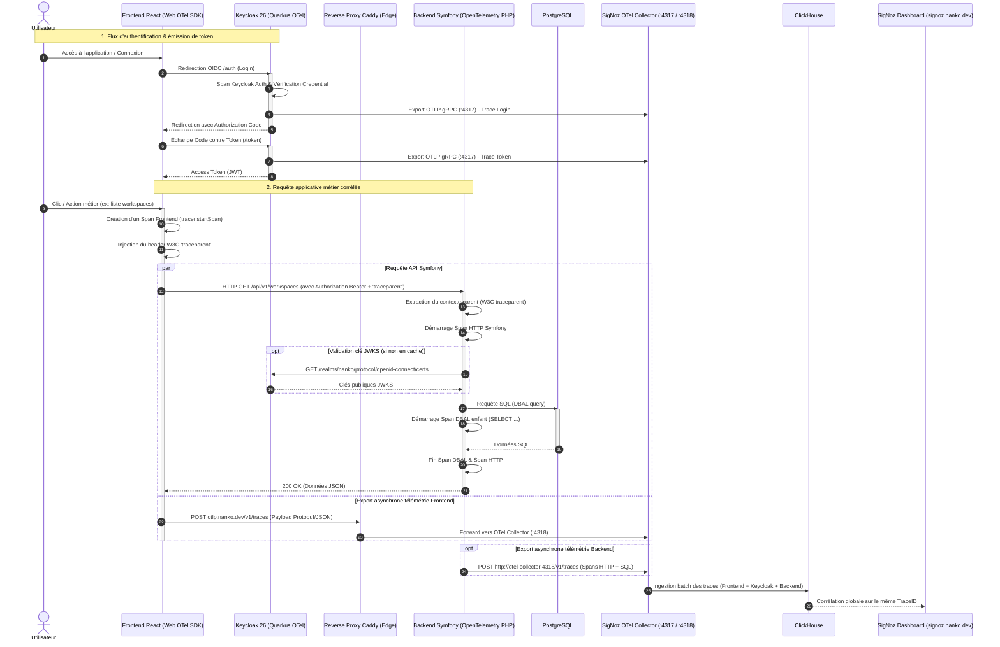

# Change : 004 - Mise en place de l'Observabilité Fullstack avec SigNoz & Keycloak (OpenTelemetry)

## Métadonnées
* **Domaine concerné :** `.specs/current/domains/platform/`
* **Type de changement :** `Nouveau module` / `Évolution technique`
* **Cible :** `Fullstack` (Infra VPS & Local, Keycloak Auth, Backend Symfony, Frontend React, Tests E2E)

---

## 1. Intention & Contexte (Le « Why » du Delta)

* **Problème résolu / Besoin :**
  Actuellement, la plateforme Nanko ne dispose d'aucune observabilité centralisée. Les analyses d'incidents, lenteurs d'API, échecs d'authentification ou anomalies en préproduction/production nécessitent d'inspecter manuellement les conteneurs Docker via `docker logs`, sans aucune corrélation entre les actions utilisateurs sur le frontend React, l'émission des tokens dans Keycloak, les requêtes HTTP traitées par Symfony et les requêtes SQL exécutées sur PostgreSQL.

* **Impact utilisateur & développeur :**
  - **Diagnostic instantané et traçabilité de bout en bout :** Chaque action utilisateur dans le frontend génère une trace OpenTelemetry W3C (`traceparent`) propagée à travers toute la chaîne : Frontend React ➔ Keycloak (SSO / OIDC) ➔ Backend Symfony ➔ PostgreSQL.
  - **Tableau de bord unique (SigNoz UI) :** Visualisation unifiée des métriques applicatives (RED metrics : Rate, Errors, Duration), des traces distribuées, des requêtes lentes, des métriques d'authentification Keycloak et des logs d'erreurs sur une interface moderne auto-hébergée.
  - **Surveillance de la sécurité (Keycloak) :** Suivi en temps réel des échecs de connexion, des rafraîchissements de jetons et des temps de réponse du serveur d'identité.
  - **Conformité architecturale (ADR-0007) :** L'instance SigNoz s'appuie sur son propre moteur ClickHouse dédié et isolé sur l'infrastructure partagée, sans impacter la base de données relationnelle PostgreSQL de l'application.

* **In Scope (Ce qui est ajouté/modifié) :**
  - **Infrastructure (`infra/`) :**
    - Configuration de la stack SigNoz auto-hébergée (SigNoz OTel Collector, ClickHouse, AlertManager, Query Service, Frontend UI).
    - Stack partagée VPS (`~/infra/signoz/` / `infra/shared/signoz/`) connectée au réseau `edge` avec labels Caddy pour le sous-domaine `signoz.nanko.dev` et l'endpoint d'ingestion OTLP/HTTP public `otlp.nanko.dev` (pour le frontend).
    - Stack locale optionnelle (`infra/local/compose.observability.yaml` ou commande Makefile dédiée `make signoz-up`) pour déboguer les traces en environnement de développement sans alourdir le démarrage standard `make dev`.
  - **Serveur d'Identité Keycloak (`infra/keycloak/` & compose stacks) :**
    - Activation de l'extension native Quarkus OpenTelemetry intégrée à Keycloak 26 via variables d'environnement (`KC_TRACING_ENABLED=true`, `KC_TRACING_ENDPOINT=http://otel-collector:4317`, `KC_METRICS_ENABLED=true`).
    - Traçage des endpoints d'authentification OIDC (login, refresh token, validation des certificats JWKS `/certs`).
    - Collecte des métriques Prometheus / Micrometer de Keycloak (taux d'échecs de connexion, sessions actives, latence DB).
  - **Backend Symfony (`backend/`) :**
    - Intégration du SDK OpenTelemetry PHP et de l'exporteur OTLP (traces HTTP et requêtes Doctrine/DBAL).
    - Extraction et propagation automatique du header W3C `traceparent` sur les requêtes entrantes.
    - Configuration CORS dans `config/packages/nelmio_cors.yaml` autorisant les headers de traçage W3C (`traceparent`, `tracestate`).
    - Variables de configuration OTel (`OTEL_EXPORTER_OTLP_ENDPOINT`, `OTEL_SERVICE_NAME=nanko-backend`, `OTEL_PHP_AUTOLOAD_ENABLED`).
  - **Frontend React (`frontend/`) :**
    - Intégration du SDK OpenTelemetry Web (`@opentelemetry/sdk-trace-web`, `@opentelemetry/instrumentation-fetch`, `@opentelemetry/exporter-trace-otlp-http`).
    - Schéma Zod étendu dans `frontend/src/config/env.ts` avec `VITE_OTEL_EXPORTER_URL` (optionnel) et `VITE_OTEL_SERVICE_NAME` (`default: 'nanko-frontend'`).
    - Module `frontend/src/config/telemetry.ts` pour l'initialisation résiliente de la télémétrie (fail-open complet : si SigNoz est indisponible ou non configuré, le frontend fonctionne normalement sans impacter l'expérience utilisateur).
    - Injection du contexte `traceparent` sur les requêtes `fetchWithAuth`.
  - **Tests & Validation (`tests-e2e/`) :**
    - Tests de non-régression validant la présence des en-têtes W3C `traceparent` dans les échanges HTTP.
    - Test de résilience garantissant le démarrage et le fonctionnement normal de l'application en cas d'indisponibilité du collecteur OTel.

* **Out of Scope (Exclusions strictes) :**
  - Aucune modification des schémas de données relationnels applicatifs PostgreSQL (stockage télémétrique ClickHouse strictement isolé).
  - Traçage de la Landing page (site vitrine statique sans authentification ni base de données).

---

## 2. Flux & Architecture (Diff)



---

## 3. Delta Modèle de données & Base de données

### 3.1. Impact sur la base relationnelle applicative (`nanko`)
* **Aucune modification :** Conformément à l'ADR-0007, PostgreSQL reste le moteur de stockage exclusif des données métier.
* **ClickHouse (SigNoz) :** Géré de façon autonome par l'image `clickhouse/clickhouse-server` au sein de la stack SigNoz avec son propre volume persistant dédié (`signoz-clickhouse-data`).

---

## 4. Delta Contrats d'API & Protocoles

### 4.1. Protocole d'ingestion OpenTelemetry (OTLP)
* **Format :** OTLP/HTTP (`v1/traces`, `v1/metrics`, `v1/logs`) ou OTLP/gRPC.
* **Ports du collecteur :**
  - `4317` : OTLP gRPC (utilisé pour les communications inter-conteneurs haute performance : Keycloak et backend interne).
  - `4318` : OTLP HTTP (utilisé par le frontend web et les clients HTTP légers).
* **Endpoint public frontend :** `https://otlp.nanko.dev/v1/traces` (routé via Caddy vers le port 4318 du collecteur).

### 4.2. Configuration OpenTelemetry Keycloak (Quarkus)
* **Variables d'environnement dans Compose :**
  ```yaml
  KC_TRACING_ENABLED: "true"
  KC_TRACING_ENDPOINT: "http://otel-collector:4317"
  KC_TRACING_RESOURCE_ATTRIBUTES: "service.name=nanko-keycloak,deployment.environment=preprod"
  KC_METRICS_ENABLED: "true"
  ```

### 4.3. En-têtes HTTP de corrélation distribuée (W3C Trace Context)
* **`traceparent` :** Format `00-{trace_id}-{parent_span_id}-{flags}` (ex: `00-4bf92f3577b34da6a3ce929d0e0e4736-00f067aa0ba902b7-01`).
* **`tracestate` :** Métadonnées spécifiques de trace.
* **CORS dans `backend/config/packages/nelmio_cors.yaml` :**
  ```yaml
  nelmio_cors:
      defaults:
          allow_credentials: true
          allow_origin: ['%env(CORS_ALLOW_ORIGIN)%']
          allow_headers:
              - 'Content-Type'
              - 'Authorization'
              - 'traceparent'
              - 'tracestate'
          expose_headers:
              - 'traceparent'
              - 'tracestate'
          allow_methods: ['GET', 'POST', 'PUT', 'PATCH', 'DELETE', 'OPTIONS']
          max_age: 3600
  ```

### 4.4. Convention Multi-Environnement (`deployment.environment`)
SigNoz intègre nativement un sélecteur d'environnement global dans son interface pour filtrer l'ensemble des écrans (Services, Traces, Logs, Dashboards, Alertes) grâce à l'attribut standard OpenTelemetry `deployment.environment`.

Chaque composant injecte cet attribut :
* **Backend Symfony :**
  ```yaml
  OTEL_RESOURCE_ATTRIBUTES: "service.name=nanko-backend,deployment.environment=preprod" # ou prod / local
  ```
* **Keycloak :**
  ```yaml
  KC_TRACING_RESOURCE_ATTRIBUTES: "service.name=nanko-keycloak,deployment.environment=preprod" # ou prod / local
  ```
* **Frontend React (`VITE_APP_ENV` dans `src/config/env.ts`) :**
  ```typescript
  new Resource({
    [ATTR_SERVICE_NAME]: env.otel.serviceName,
    'deployment.environment': env.app.environment, // 'preprod' | 'prod' | 'local'
  })
  ```
Dans l'UI SigNoz, un menu déroulant dédié permet de basculer en un clic entre `preprod` et `prod`, ou d'afficher une vue consolidée.

---

### 4.5. Configuration Réseau, Prérequis DNS & Sécurisation des Endpoints

#### 1. Prérequis DNS Externes (Registrar / Zone DNS)
Pour permettre à Caddy de générer automatiquement les certificats TLS Let's Encrypt et de router le trafic, deux noms d'hôtes doivent résoudre vers l'adresse IP publique du VPS :

| Sous-domaine | Type DNS | Cible | Rôle |
|---|---|---|---|
| `signoz.nanko.dev` | `A` (ou `CNAME`) | `<IP_PUBLIQUE_VPS>` | Accès au Dashboard d'administration SigNoz UI |
| `otlp.nanko.dev` | `A` (ou `CNAME`) | `<IP_PUBLIQUE_VPS>` | Endpoint public d'ingestion OTLP/HTTP pour le frontend web |

> [!NOTE]
> Si la zone DNS `nanko.dev` possède déjà un enregistrement wildcard `*.nanko.dev` pointant vers l'IP du VPS, aucune action manuelle n'est requise : les deux sous-domaines fonctionneront immédiatement.

---

#### 2. Matrice de Sécurisation des Endpoints

| Endpoint | Exposition | Sécurisation & Contrôle d'accès | Risque mitigé |
|---|---|---|---|
| **`signoz.nanko.dev`** (UI) | Publique avec restriction stricte | 1. **Verrou Caddy HTTP Basic Auth :** Protection au niveau passerelle Caddy (`caddy.basic_auth: "/*"`) bloquant 100% des requêtes non authentifiées avant qu'elles n'atteignent le conteneur SigNoz.<br>2. **Pré-seeding automatique de l'admin (Zero-Trust) :** Le service `signoz-provisioner` enregistre automatiquement le compte superadmin au démarrage (`POST /api/v1/register`) via variables d'environnement secrètes (`SIGNOZ_ADMIN_EMAIL`, `SIGNOZ_ADMIN_PASSWORD`), fermant définitivement la fenêtre d'onboarding public.<br>3. **TLS strict :** Forcé en HTTPS (`HSTS max-age=31536000`). | Accès non autorisé, prise de contrôle de l'instance par un tiers et exposition des métriques de production. |
| **`otlp.nanko.dev`** (Collector HTTP) | Publique (Frontend Web) | 1. **CORS strict :** Seules les origines autorisées (`app.nanko.dev`, `app.preprod.nanko.dev`, `localhost:*`) peuvent envoyer des traces.<br>2. **Rate Limiting Caddy :** Plafond à 120 requêtes / minute par IP.<br>3. **Taille maximale de payload :** Limite de `request_body max_size 2MB` pour interdire les requêtes surdimensionnées.<br>4. **Sanitization :** Le collecteur OTel filtre et supprime les headers sensibles (`Authorization`, cookies) avant stockage. | Déni de service (DDoS), saturation de ClickHouse et empoisonnement de métriques par des tiers. |
| **Flux Backend & Keycloak** (`:4317` / `:4318`) | **Strictement Interne** (Docker) | Communication directe conteneur à conteneur via le réseau Docker privé `edge` (`http://signoz-otel-collector:4317`). **Aucun port interne n'est exposé sur l'IP publique du VPS**. | Interception réseau, fuite de données et attaques externes. |

---

---

## 5. Delta Maquettes & Tableau de Bord SigNoz

### 5.1. Dashboard SigNoz (`https://signoz.nanko.dev`)
L'interface SigNoz est déployée sur le sous-domaine dédié avec authentification et offre une vue distribuée complète incluant Keycloak :

```text
+-----------------------------------------------------------------------------------------------+
| SigNoz Observability Dashboard - Services: [ nanko-frontend ] [ nanko-keycloak ] [ nanko-backend ]
+-----------------------------------------------------------------------------------------------+
| DISTRIBUTED TRACE VIEW: POST /realms/nanko/protocol/openid-connect/token & GET /api/v1/me    |
|                                                                                               |
| 0ms          15ms                 30ms                 45ms                 60ms         75ms |
| [------------ nanko-frontend: User Action / Authentication Flow ----------------------------] |
|       [------ nanko-keycloak: Quarkus OIDC Token Exchange (/token) -----]                     |
|                                     [--- nanko-backend: Symfony Kernel Request ------------]  |
|                                              [--- DBAL: SELECT u FROM user u WHERE ... ---]   |
+-----------------------------------------------------------------------------------------------+
| KEYCLOAK METRICS PANEL:                                                                       |
| - Successful Logins / min: 14                                                                 |
| - Failed Logins / min: 0                                                                      |
| - Active User Sessions: 3                                                                     |
| - Token Issuance P99: 22ms                                                                    |
+-----------------------------------------------------------------------------------------------+
```

### 5.2. Observability as Code : Provisioning Automatique (Zero-UI Config)
Pour garantir une configuration 100% déclarative sans aucune création manuelle dans l'interface graphique :

1. **Monitors & Alertes (`infra/signoz/alerts/*.yaml`) :**
   - Rôles d'alertes déclaratives au format standard Prometheus/AlertManager :
     - `ApiHigh5xxRate` : Déclenché si le taux d'erreur 5xx dépasse 2% pendant 5 min.
     - `ApiP95LatencySpike` : Déclenché si la latence P95 de Symfony dépasse 1 seconde.
     - `KeycloakLoginFailures` : Déclenché en cas de pic d'échecs de connexion OIDC.
   - Montés directement dans le conteneur AlertManager de SigNoz au démarrage.

2. **Dashboards déclaratifs & Admin Provisioning (`infra/signoz/dashboards/*.json`) :**
   - Provisioning automatique par le service `signoz-provisioner` au démarrage de la pile :
     - Appel idempotent à l'API SigNoz `POST /api/v1/register` pour créer le superadmin dès l'initialisation.
     - Import automatique des tableaux de bord déclaratifs (`POST /api/v1/dashboards`).

3. **APM Auto-généré :**
   - Tous les graphiques de base (RED metrics, requêtes DBAL, cartes de dépendances) sont créés nativement par SigNoz à partir des métadonnées OpenTelemetry sans aucun fichier supplémentaire.

---

## 6. Delta Spécifications UI & Logique Client (React)

### 6.1. Variables d'environnement & Schéma Zod (`frontend/src/config/env.ts`)
```typescript
export const frontendEnvSchema = z.object({
  VITE_API_BASE_URL: z.string().url().default('http://localhost:48000'),
  VITE_KEYCLOAK_URL: z.string().url().default('http://localhost:48080'),
  VITE_KEYCLOAK_REALM: z.string().min(1).default('nanko'),
  VITE_KEYCLOAK_CLIENT_ID: z.string().min(1).default('nanko-web'),
  // Nouveaux paramètres télémétrie (optionnels avec valeurs par défaut neutres)
  VITE_OTEL_EXPORTER_URL: z.string().url().optional().or(z.literal('')).default(''),
  VITE_OTEL_SERVICE_NAME: z.string().default('nanko-frontend'),
})
```

### 6.2. Initialisation de la Télémétrie (`frontend/src/config/telemetry.ts`)
* Si `env.otel.exporterUrl` est vide, la télémétrie s'initialise en mode no-op (aucune requête réseau émise).
* Si l'URL est configurée, `WebTracerProvider` est instancié avec `BatchSpanProcessor` vers l'exporteur OTLP HTTP.
* Enregistrement de `FetchInstrumentation` configuré pour injecter `traceparent` exclusivement sur les requêtes ciblant `VITE_API_BASE_URL`.

---

## 7. Invariants & Cas Limites (*Edge cases*)

1. **Principe de Résilience Absolue (Fail-Open) :**
   - L'indisponibilité ou le ralentissement du collecteur SigNoz ne doit **en aucun cas** impacter la disponibilité de Keycloak, de l'API Symfony ou de l'application React.
   - Les exporteurs OTel doivent fonctionner en arrière-plan asynchrone (batching) avec timeout court (ex: 2s max) et abandon silencieux en cas d'erreur réseau.
2. **Confidentialité & Sanitization des Spans :**
   - Les en-têtes d'authentification (`Authorization: Bearer ...`, `Cookie`) et les mots de passe ne doivent jamais être enregistrés en clair dans les attributs de spans.
3. **Consommation de Ressources & Local Dev :**
   - ClickHouse et SigNoz sont gourmands en mémoire (> 2-3 Go de RAM requis).
   - En environnement local de développement, SigNoz ne démarre pas par défaut dans `make dev`. Il est activable à la demande via `make signoz-up` / `docker compose -f infra/local/compose.observability.yaml up -d`.
4. **Sécurité d'accès au Dashboard SigNoz :**
   - L'interface d'administration `signoz.nanko.dev` est protégée par le système d'authentification utilisateur natif de SigNoz ou par restriction IP / Basic Auth via Caddy.

---

## 8. Plan d'exécution séquentiel

- [x] **Phase 1 : Infrastructure & Observability as Code (`infra/`)**
  - [x] 1. Créer la configuration Docker Compose SigNoz pour le VPS (`infra/shared/signoz/docker-compose.yaml` ou `infra/signoz/`) incluant `clickhouse`, `otel-collector`, `signoz-query-service` et `signoz-frontend`.
  - [x] 2. Définir les alertes et monitors "as code" dans `infra/signoz/alerts/platform-alerts.yaml`.
  - [x] 3. Définir le dashboard synthétique de plateforme dans `infra/signoz/dashboards/platform-overview.json`.
  - [x] 4. Configurer le service de provisioning automatique idempotent (`signoz-provisioner`) dans la stack Compose.
  - [x] 5. Configurer les labels Caddy pour exposer `signoz.nanko.dev` (UI) et `otlp.nanko.dev` (Collector HTTP 4318 avec CORS).
  - [x] 6. Créer la stack locale optionnelle `infra/local/compose.observability.yaml` et ajouter les cibles `signoz-up` / `signoz-down` au `Makefile`.

- [x] **Phase 2 : Instrumentation Keycloak & Backend Symfony (`infra/` & `backend/`)**
  - [x] 1. Activer OpenTelemetry sur les conteneurs Keycloak dans `infra/local/compose.yaml`, `infra/preprod/compose.yaml` et `infra/prod/compose.yaml` (`KC_TRACING_ENABLED=true`, `KC_TRACING_ENDPOINT=http://otel-collector:4317`, `KC_METRICS_ENABLED=true`).
  - [x] 2. Ajouter les dépendances Composer OpenTelemetry nécessaires (`open-telemetry/sdk`, `open-telemetry/exporter-otlp`, `open-telemetry/opentelemetry-auto-symfony` ou bundle équivalent).
  - [x] 3. Configurer les variables d'environnement dans les compose stacks (`OTEL_EXPORTER_OTLP_ENDPOINT`, `OTEL_SERVICE_NAME=nanko-backend`).
  - [x] 4. Mettre à jour `backend/config/packages/nelmio_cors.yaml` pour autoriser et exposer les en-têtes W3C `traceparent` et `tracestate`.
  - [x] 5. Valider la non-régression et les quality gates backend (`make deptrac`, `make test-backend`, `make static-analysis`, `make lint`).

- [x] **Phase 3 : Frontend React (`frontend/`)**
  - [x] 1. Installer les packages OpenTelemetry Web (`@opentelemetry/api`, `@opentelemetry/sdk-trace-web`, `@opentelemetry/instrumentation-fetch`, `@opentelemetry/exporter-trace-otlp-http`).
  - [x] 2. Étendre le schéma de configuration dans `frontend/src/config/env.ts` (`VITE_OTEL_EXPORTER_URL`, `VITE_OTEL_SERVICE_NAME`).
  - [x] 3. Créer le module d'initialisation résiliente `frontend/src/config/telemetry.ts` et l'importer dans `src/main.tsx`.
  - [x] 4. Valider le typage et le linting frontend (`pnpm --filter frontend typecheck`, `pnpm --filter frontend lint`, `pnpm --filter frontend build`).

- [x] **Phase 4 : Tests E2E & Validation de Corrélation (`tests-e2e/`)**
  - [x] 1. Écrire un test de conformité vérifiant que les requêtes émises par le frontend vers l'API portent bien le header W3C `traceparent`.
  - [x] 2. Valider le comportement fail-open : s'assurer que si `VITE_OTEL_EXPORTER_URL` est invalide ou injoignable, aucune exception n'interrompt le rendu ni les requêtes API ou l'authentification Keycloak.

---

## 9. Definition of Done & Stratégie de tests

### 9.1. Scénarios de validation (Format Gherkin)

```gherkin
# ==============================================================================
# TESTS E2E & CONFORMITÉ TÉLÉMÉTRIE (tests-e2e/)
# ==============================================================================

@e2e @telemetry
Fonctionnalité: Propagation de contexte de traçabilité distribuée

  Scénario: Injection transparente du header W3C traceparent
    Étant donné que l'utilisateur navigue sur l'application frontend
    Quand une requête API est émise vers "/api/v1/version" ou "/api/v1/me"
    Alors la requête HTTP sortante contient l'en-tête "traceparent"
    Et la réponse de l'API est reçue avec un code HTTP 200
    Et aucune erreur de télémétrie n'apparaît dans la console du navigateur

  @e2e @resilience
  Scénario: Résilience absolue en cas de collecteur injoignable (Fail-Open)
    Étant donné que l'exporteur OTel est configuré sur une URL injoignable ("http://localhost:59999")
    Quand l'application frontend démarre et émet des requêtes
    Alors l'application démarre normalement sans écran d'erreur
    Et les fonctionnalités utilisateur et l'authentification demeurent 100% opérationnelles

# ==============================================================================
# TESTS BACKEND & KEYCLOAK (backend/ & infra/)
# ==============================================================================

@api @integration @telemetry
Fonctionnalité: Extraction du contexte de traçabilité côté Backend

  Scénario: Prise en compte du header traceparent reçu
    Quand l'API reçoit une requête "GET /api/v1/version" avec le header "traceparent: 00-4bf92f3577b34da6a3ce929d0e0e4736-00f067aa0ba902b7-01"
    Alors le code de réponse HTTP est 200
    Et les en-têtes CORS autorisent "traceparent" et "tracestate"

@infra @keycloak @telemetry
Fonctionnalité: Télémétrie native Keycloak

  Scénario: Émission de métriques et traces OIDC
    Quand le conteneur Keycloak démarre avec KC_TRACING_ENABLED="true"
    Alors le endpoint métriques Keycloak expose les compteurs d'authentification
    Et les requêtes d'échange de token émettent des spans OTLP vers le port 4317
```

### 9.2. Commandes de validation automatisée

```bash
# 1. Validation de l'architecture et du backend
make deptrac
make test-backend
make static-analysis
make lint

# 2. Validation du typage et du build frontend
pnpm --filter frontend typecheck
pnpm --filter frontend lint
pnpm --filter frontend build

# 3. Validation des tests E2E et de configuration
pnpm --filter tests-e2e test:env
make test-e2e
```
