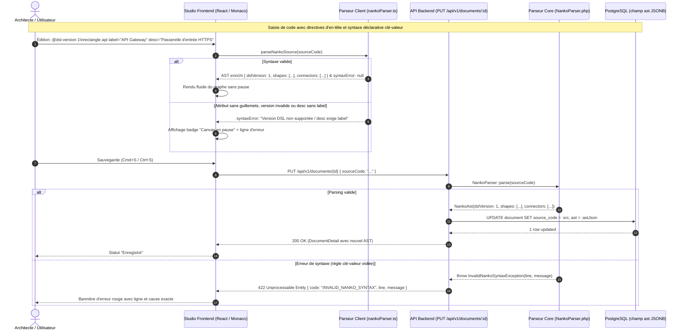
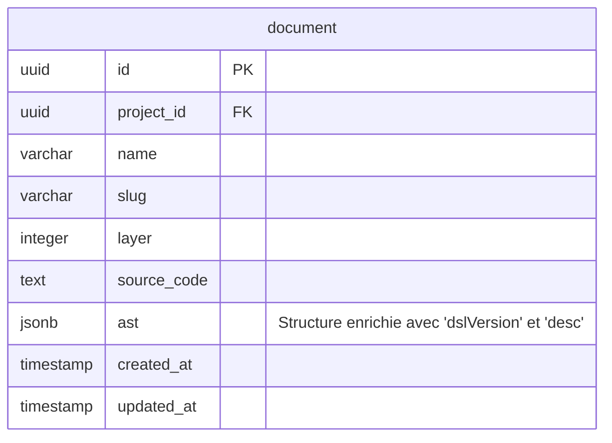

# Change : 018 - Versionnage DSL (@dsl-version), Tokenizer Clé-Valeur et Attributs Sémantiques (label, desc)

## Métadonnées
* **Domaine concerné :** `.specs/current/domains/workspace-management/`
* **Type de changement :** `Évolution`
* **Cible :** `Fullstack` (`backend` Symfony + `frontend` React + `tests-e2e` Playwright)

---

## 1. Intention & Contexte (Le « Why » du Delta)
* **Problème résolu / Besoin :**
  Actuellement, la syntaxe du langage `.nanko` repose sur un découpage positionnel rigide (`rectangle id "Label"`, `src -> tgt "Label"`). Cette approche empêche d'enrichir les entités graphiques et les flux de relations sans multiplier les arguments positionnels fragiles. Elle limite également la documentation d'une architecture à un seul libellé court sans pouvoir y associer d'explications techniques ou fonctionnelles (`desc`), et rend difficile l'introduction future d'attributs sémantiques complémentaires (`tech`, `external`).
  De plus, les documents ne portent aucun numéro de version de grammaire DSL, ce qui rend impossible l'anticipation des ruptures de syntaxe et fragilise la rétrocompatibilité des futurs parseurs.
* **Impact utilisateur :**
  * L'architecte explicite la version de grammaire DSL utilisée via la directive d'en-tête `@dsl-version 1` (défaut : 1 si absente pour rétrocompatibilité totale).
  * L'architecte peut désormais qualifier sémantiquement les shapes et les connecteurs avec des paires clé-valeur explicites :
    ```nanko
    @id architecture-backend
    @dsl-version 1
    @layer 0

    rectangle auth_service label="Auth Service" desc="Gestionnaire des sessions et des jetons JWT"
    auth_service -> users_db label="SQL" desc="Requêtes préparées via PgBouncer"
    ```
  * L'ordre des attributs est libre sur la ligne (`desc="..." label="..."` est équivalent à `label="..." desc="..."`).
  * Les connecteurs peuvent être déclarés sans attribut (`src -> tgt`), avec un label seul (`src -> tgt label="HTTP"`), ou avec label et description (`src -> tgt label="HTTP" desc="..."`).
  * L'intégrité sémantique est garantie : le parseur rejette immédiatement toute description sur un connecteur sans label, et toute valeur d'attribut non délimitée par des guillemets doubles.
  * Les entités de l'AST (`NankoAst`, `Shape` et `Connector`) exposent désormais formellement le champ `dslVersion: int` (défaut 1) ainsi que `desc: string|null` dans le backend Symfony et le frontend React, préparant le terrain pour l'affichage visuel enrichi (Delta 019) et l'édition contextuelle (Delta 020).
* **In Scope (Ce qui est ajouté/modifié) :**
  * **Support du Versionnage de schéma DSL (`@dsl-version`) :**
    * Support de la directive d'en-tête `@dsl-version <int>` (défaut `1` si non spécifié).
    * Validation stricte : entier positif requis, rejet des valeurs non supportées (ex: `@dsl-version 99`).
    * Exposition de `dslVersion: int` dans `NankoAst.php` et `schemas.ts` (`nankoAstSchema`).
  * **Architecture Tokenizer & Parseur Backend Symfony (`backend/src/WorkspaceManagement/Core/Domain/Document/Parser/`) :**
    * Refactorisation de `NankoParser.php` pour intégrer un tokenizer générique extrayant les attributs clé-valeur `key="valeur"`.
    * Gestion stricte des guillemets doubles obligatoires et du support de l'échappement `\"`.
    * Mise à jour de `NankoAst.php` (`public int $dslVersion = 1`), `Shape.php` (`public ?string $desc = null`) et de `Connector.php` (`public ?string $desc = null`).
    * Application de la règle d'intégrité : un connecteur avec `desc` mais sans `label` déclenche une `InvalidNankoSyntaxException` explicite.
  * **Architecture Parseur & Schémas Frontend (`frontend/src/features/documents/`) :**
    * Refactorisation symétrique de `nankoParser.ts` pour parser la directive `@dsl-version` et les paires d'attributs clé-valeur avec vérification syntaxique en temps réel.
    * Mise à jour des schémas Zod (`schemas.ts`) : `nankoAstSchema` intègre `dslVersion: z.number().int().default(1)`, `nankoAstShapeSchema` et `nankoAstConnectorSchema` intègrent `desc: z.string().optional().nullable()`.
  * **Création et insertion de Shapes :**
    * Mise à jour du template initial dans `CreateDocumentUseCase.php` :
      ```nanko
      @id {slug}
      @dsl-version 1
      @layer 0

      rectangle app label="Application"
      ```
    * Mise à jour de `insertShapeToSource.ts` pour générer la syntaxe clé-valeur conforme : `<type> <id> label="<Label>"`.
  * **Mise à niveau des tests et fixtures :**
    * Réalignement de l'ensemble des tests unitaires, d'intégration backend/frontend et tests E2E sur la syntaxe déclarative avec `@dsl-version 1` et `label="..."` / `desc="..."`.
* **Out of Scope (Exclusions strictes) :**
  * Rendu visuel enrichi sur le canvas React Flow (sous-titre `desc` tronqué à 2 lignes avec `ellipsis`, infobulles/tooltips Blueprint au survol) : objet du **Delta 019**.
  * Modalités d'édition contextuelle (double-clic in-place sur le label, Popover d'édition rapide `label` + `desc`) : objet du **Delta 020**.
  * Attributs C4 avancés (`tech="..."`, `external`, `verb="..."`, `rank=...`) : réservés aux évolutions futures.
  * Support de Markdown riche ou formatage HTML dans `desc` : texte brut uniquement.
  * Aucune migration DDL de table SQL : le champ PostgreSQL `ast` est de type `jsonb` et intègre nativement la nouvelle structure sans modification du schéma relationnel.

---

## 2. Flux & Architecture (Diff)



---

## 3. Delta Modèle de données & Base de données

### 3.1. Diagramme Entité-Relation (ERD)

Aucune nouvelle table ni modification de colonnes n'est introduite. La structure JSONB du champ `ast` de la table `document` évolue de manière rétrocompatible :



### 3.2. Modifications de structures de données (JSONB `ast`)

#### Entités Core : `NankoAst.php`, `Shape.php` & `Connector.php`
* **NankoAst Core :** `backend/src/WorkspaceManagement/Core/Domain/Document/Parser/NankoAst.php`
* **Shape Core :** `backend/src/WorkspaceManagement/Core/Domain/Document/Parser/Shape.php`
* **Connector Core :** `backend/src/WorkspaceManagement/Core/Domain/Document/Parser/Connector.php`

| Champ AST JSONB | Type JSON | Nullable | Règle de validation | Description |
|---|---|---|---|---|
| `dslVersion` | `integer` | Non | Entier positif (défaut : `1`) | Version de la spécification de grammaire DSL du document |
| `shapes[].id` | `string` | Non | Alphanumérique + `_` et `-` | Identifiant unique de la shape |
| `shapes[].type` | `string` | Non | `rectangle` \| `circle` \| `text` | Type géométrique de la forme |
| `shapes[].label` | `string` | Non | Chaîne non vide | Libellé textuel opérationnel |
| `shapes[].desc` | `string` | **Oui** | Chaîne optionnelle (défaut `null`) | Description technique ou fonctionnelle détaillée |
| `connectors[].source` | `string` | Non | Référence un `shapes[].id` | Nœud source de l'arête |
| `connectors[].target` | `string` | Non | Référence un `shapes[].id` | Nœud cible de l'arête |
| `connectors[].label` | `string` | **Oui** | Chaîne optionnelle (défaut `null`) | Libellé compact de la relation |
| `connectors[].desc` | `string` | **Oui** | Chaîne optionnelle (défaut `null`) | Description détaillée du flux (interdit sans `label`) |
| `layout` | `object` | Non | Objet associatif `id: { x, y }` | Coordonnées spatiales des shapes |

### 3.3. Règles de migration & Intégrité
* **Fichier de migration :** Aucun fichier de migration SQL n'est requis. Le champ `document.ast` est typé `jsonb` sous PostgreSQL et absorbe `dslVersion` et `desc` sans rupture.
* **Rétrocompatibilité :**
  * Tout document existant en base sans directive `@dsl-version` est automatiquement assigné à `dslVersion: 1`.
  * Tout document existant avec un AST sans `desc` continue d'être lu sans erreur : les schémas Zod et DTOs considèrent `desc` comme optionnel/nullable.
  * Les sources textuelles `.nanko` existantes dans les tests et fixtures locales sont migrées directement vers la syntaxe déclarative stricte avec directive `@dsl-version 1`.

---

## 4. Delta Contrats d'API (Symfony)

### Endpoint : `GET /api/v1/documents/{documentId}` & `PUT /api/v1/documents/{documentId}` (`Existant - Format AST enrichi`)
* **Authentification requise :** `ROLE_USER`
* **Headers :** `Content-Type: application/json`, `Authorization: Bearer <token>`

#### Payload de réponse `200 OK` (Format `ast` enrichi) :
```json
{
  "id": "0191d011-7b3b-7c99-b1d5-2a1d2f34e567",
  "projectId": "0191c0a1-9a1c-7f88-82bc-3e2c1d45f678",
  "organisationId": "0191c0a1-1111-7c99-b1d5-2a1d2f34e567",
  "name": "Architecture Backend",
  "slug": "architecture-backend",
  "layer": 0,
  "sourceCode": "@id architecture-backend\n@dsl-version 1\n@layer 0\n\nrectangle gateway label=\"API Gateway\" desc=\"Point d'entrée sécurisé\"\ncircle auth label=\"Auth Service\"\ngateway -> auth label=\"JWT\" desc=\"Vérification de signature des tokens\"\n",
  "ast": {
    "dslVersion": 1,
    "shapes": [
      {
        "id": "gateway",
        "type": "rectangle",
        "label": "API Gateway",
        "desc": "Point d'entrée sécurisé"
      },
      {
        "id": "auth",
        "type": "circle",
        "label": "Auth Service",
        "desc": null
      }
    ],
    "connectors": [
      {
        "source": "gateway",
        "target": "auth",
        "label": "JWT",
        "desc": "Vérification de signature des tokens"
      }
    ],
    "layout": {}
  },
  "createdAt": "2026-09-07T10:00:00Z",
  "updatedAt": "2026-09-09T08:00:00Z"
}
```

#### Erreurs de validation syntaxique `422 Unprocessable Entity` :
* Cas 1 : Version de DSL non supportée ou invalide (ex: `@dsl-version 99` ou `@dsl-version invalid`) :
  ```json
  {
    "code": "INVALID_NANKO_SYNTAX",
    "message": "Erreur de syntaxe à la ligne 2 : Version de DSL non supportée : '99'. Seule la version 1 est actuellement supportée.",
    "line": 2
  }
  ```
* Cas 2 : Attribut sans guillemets doubles (ex: `rectangle app label=MonApp`) :
  ```json
  {
    "code": "INVALID_NANKO_SYNTAX",
    "message": "Erreur de syntaxe à la ligne 5 : La valeur de l'attribut 'label' doit être entourée de guillemets doubles.",
    "line": 5
  }
  ```
* Cas 3 : Connecteur avec `desc` sans `label` (ex: `gateway -> auth desc="Flux sans label"`) :
  ```json
  {
    "code": "INVALID_NANKO_SYNTAX",
    "message": "Erreur de syntaxe à la ligne 6 : Un connecteur ne peut pas déclarer de description ('desc') sans libellé ('label').",
    "line": 6
  }
  ```
* Cas 4 : Shape sans attribut obligatoire `label` (ex: `rectangle app`) :
  ```json
  {
    "code": "INVALID_NANKO_SYNTAX",
    "message": "Erreur de syntaxe à la ligne 5 : L'attribut 'label' est obligatoire pour la shape 'app'.",
    "line": 5
  }
  ```

---

## 5. Configuration Réseau, Prérequis DNS & Sécurisation des Endpoints

### 5.1. Prérequis DNS Externes (Registrar / Zone DNS)
Aucun nouvel enregistrement DNS n'est requis. L'évolution porte sur le DSL interne de documents existants.

### 5.2. Matrice d'Exposition et Sécurisation des Endpoints
Aucun nouvel endpoint n'est créé. Les endpoints existants (`/api/v1/documents/*`) conservent leur matrice de sécurisation :
* **Exposition :** Publique via Caddy Reverse Proxy avec TLS Let's Encrypt / HSTS.
* **Authentification :** JWT Bearer Token Keycloak obligatoire.
* **Contrôle d'accès :** Validation d'appartenance à l'organisation parente du projet.

### 5.3. Variables d'Environnement & Secrets requis
Aucune nouvelle variable d'environnement n'est requise.

---

## 6. Delta Maquettes & Layout UI

### 6.1. Référence visuelle
L'inspecteur d'AST (`AstInspector.tsx`) affiche désormais la version DSL (`DSL v1`) en haut du panneau, ainsi que la clé `desc` lorsqu'elle est présente. Le composant `SourceCodeEditor.tsx` remonte les erreurs syntaxiques temps réel émises par le nouveau tokenizer `nankoParser.ts`.

### 6.2. Wireframes conceptuels (Inspecteur AST & Bannière d'erreur)

```text
+-----------------------------------------------------------------------+
|  Fichier : architecture-backend                      [DSL v1]         |
+-----------------------------------+-----------------------------------+
|  ÉDITEUR MONACO (.nanko)          |  INSPECTEUR D'AST                 |
|                                   |                                   |
|  @id architecture-backend         |  VERSION : DSL v1                 |
|  @dsl-version 1                   |                                   |
|  @layer 0                         |  SHAPES (1)                       |
|                                   |  - gateway [rectangle]            |
|  rectangle gateway                |    label: "API Gateway"           |
|    label="API Gateway"            |    desc: "Passerelle publique"    |
|    desc="Passerelle publique"     |                                   |
|                                   |  CONNECTORS (1)                   |
|  gateway -> auth                  |  - gateway -> auth                |
|    label="HTTPS"                  |    label: "HTTPS"                 |
|    desc="Vérification JWT"        |    desc: "Vérification JWT"       |
+-----------------------------------+-----------------------------------+
| [!] Erreur syntaxe Ligne 6 : 'desc' exige un attribut 'label'         |
+-----------------------------------------------------------------------+
```

### 6.3. Arborescence des fichiers modifiés

```text
backend/src/WorkspaceManagement/Core/Domain/Document/Parser/
├── NankoParser.php           # Tokenizer générique clé="valeur" + parsing @dsl-version + validation
├── NankoAst.php              # AST enrichi avec int $dslVersion = 1
├── Shape.php                 # Entité AST enrichie avec ?string $desc = null
├── Connector.php             # Entité AST enrichie avec ?string $desc = null
└── InvalidNankoSyntaxException.php

backend/src/WorkspaceManagement/Core/UseCase/CreateDocument/
└── CreateDocumentUseCase.php # Mise à jour du template source par défaut avec @dsl-version 1

frontend/src/features/documents/
├── schemas.ts                                           # Schéma nankoAstSchema avec dslVersion, desc
├── components/canvas/utils/
│   ├── nankoParser.ts                                  # Tokenizer client symétrique avec @dsl-version
│   └── insertShapeToSource.ts                          # Génération de la syntaxe label="..."
└── components/
    └── AstInspector.tsx                                 # Affichage de dslVersion et desc
```

---

## 7. Delta Spécifications UI & Logique Client (React)

### Schéma de validation Zod (`frontend/src/features/documents/schemas.ts`)
```typescript
import { z } from 'zod';

export const nankoAstShapeSchema = z.object({
  id: z.string(),
  type: z.enum(['rectangle', 'circle', 'text']),
  label: z.string(),
  desc: z.string().optional().nullable().default(null),
});

export const nankoAstConnectorSchema = z.object({
  source: z.string(),
  target: z.string(),
  label: z.string().optional().nullable().default(null),
  desc: z.string().optional().nullable().default(null),
});

export const nodeCoordinatesSchema = z.object({
  x: z.number(),
  y: z.number(),
});

export const nankoAstLayoutSchema = z.record(z.string(), nodeCoordinatesSchema);

export const nankoAstSchema = z.object({
  dslVersion: z.number().int().default(1),
  shapes: z.array(nankoAstShapeSchema).default([]),
  connectors: z.array(nankoAstConnectorSchema).default([]),
  layout: z
    .union([nankoAstLayoutSchema, z.array(z.any()).transform(() => ({}))])
    .optional()
    .default({}),
});

export type NankoAstShape = z.infer<typeof nankoAstShapeSchema>;
export type NankoAstConnector = z.infer<typeof nankoAstConnectorSchema>;
export type NankoAst = z.infer<typeof nankoAstSchema>;
```

### Matrice des états d'interface pour le parseur client

| État | Déclencheur | Rendu visuel & Comportement |
|---|---|---|
| **Code syntaxiquement valide** | Saisie avec `@dsl-version 1` et syntaxe `label="..." [desc="..."]` valide | Le graphe React Flow est réactif, l'inspecteur d'AST affiche `DSL v1`, `label` et `desc`, aucun message d'erreur. |
| **Version DSL non supportée** | Saisie d'une directive `@dsl-version 2` ou invalide | Affichage du badge « Canvas en pause », message : « Version de DSL non supportée : '2'. Seule la version 1 est actuellement supportée. » |
| **Attribut sans guillemets doubles** | Saisie d'une valeur brute non entourée de guillemets doubles (ex: `label=Gateway`) | Affichage du badge « Canvas en pause », message d'erreur explicite avec le numéro de ligne. |
| **Connecteur avec desc sans label** | Saisie de `src -> tgt desc="Flux"` | Message d'erreur : « Un connecteur ne peut pas porter de description sans label », graphe conservé dans son dernier état valide. |
| **Doublon d'ID de Shape** | Deux shapes déclarées avec le même identifiant | Erreur syntaxique signalant l'identifiant en doublon. |
| **Sauvegarde réussie** | `Cmd+S` / `Ctrl+S` avec code valide | Notification de sauvegarde réussie, AST dénormalisé persisté côté backend. |

---

## 8. Invariants & Cas limites (*Edge cases*)

1. **Directive `@dsl-version` et rétrocompatibilité :**
   * La directive `@dsl-version` est facultative dans les documents existants : si elle est absente, le parseur assume `dslVersion = 1`.
   * Si elle est présente, elle doit contenir un entier strict. Si la version spécifiée est différente de `1` (seule version actuellement supportée), le parseur lève une erreur syntaxique explicite.
2. **Obligation stricte des guillemets doubles :**
   * Toutes les valeurs d'attributs doivent impérativement être entourées de guillemets doubles `"..."`. Les guillemets simples `'...'` ou l'absence de délimiteurs déclenchent une erreur de syntaxe à la ligne.
3. **Support de l'échappement :**
   * Les guillemets internes dans une description doivent pouvoir être échappés via `\"` sans briser le découpage des tokens.
4. **Dépendance d'intégrité `desc` -> `label` sur connecteur :**
   * Un connecteur est valide s'il n'a pas d'attributs (`src -> tgt`).
   * Un connecteur est valide s'il n'a que `label` (`src -> tgt label="Texte"`).
   * Un connecteur est valide s'il a `label` et `desc` (`src -> tgt label="Texte" desc="..."` ou `src -> tgt desc="..." label="Texte"`).
   * Un connecteur portant `desc` sans `label` est strictement rejeté avec une erreur de syntaxe.
5. **Attribut `label` obligatoire pour toute Shape :**
   * Une déclaration `rectangle auth` sans attribut `label` est invalide et rejetée par le parseur.
6. **Indépendance de l'ordre des attributs :**
   * Le tokenizer collecte un dictionnaire d'attributs par élément sans imposer d'ordre fixe entre `label` et `desc`.

---

## 9. Plan d'exécution séquentiel

- [x] **Phase 1 : Backend Core & Parsing (`backend/`)**
  - [x] 1. Mettre à jour `NankoAst.php` (`public int $dslVersion = 1`), `Shape.php` et `Connector.php` pour accueillir `?string $desc = null` et enrichir `toArray()`.
  - [x] 2. Implémenter l'analyse de `@dsl-version <int>` et le tokenizer d'attributs clé-valeur dans `NankoParser.php` avec gestion des guillemets doubles, de l'échappement et des contraintes d'intégrité.
  - [x] 3. Adapter `CreateDocumentUseCase.php` pour que le template source initial contienne `@dsl-version 1` et `rectangle app label="Application"`.
  - [x] 4. Adapter les tests unitaires backend (`NankoParserTest.php`) pour tester :
    - Présence explicite de `@dsl-version 1` et absence par défaut (fallback `1`).
    - Rejet d'une version DSL non supportée (ex: `@dsl-version 99`).
    - Déclaration nominale avec `label` seul.
    - Déclaration nominale avec `label` et `desc`.
    - Ordre inversé `desc` puis `label`.
    - Guillemets échappés `\"`.
    - Rejet des attributs sans guillemets doubles.
    - Rejet d'un connecteur avec `desc` mais sans `label`.
    - Rejet d'une shape sans `label`.
  - [x] 5. Mettre à jour les fixtures et tests d'intégration backend (`DocumentDoctrineRepositoryTest.php`, `DocumentEndpointsTest.php`, `UpdateDocumentUseCaseTest.php`).
  - [x] **Validation Architecture & Qualité Backend :** `make deptrac`, `make test-backend`, `make static-analysis`, `make lint`.

- [x] **Phase 2 : Frontend Parsing & Schémas (`frontend/`)**
  - [x] 1. Mettre à jour `schemas.ts` : ajouter `dslVersion: z.number().int().default(1)` sur `nankoAstSchema`, et `desc` optionnel/nullable sur `nankoAstShapeSchema` et `nankoAstConnectorSchema`.
  - [x] 2. Implémenter le support de `@dsl-version` et le tokenizer d'attributs symétrique dans `nankoParser.ts`.
  - [x] 3. Mettre à jour `insertShapeToSource.ts` pour générer `<type> <id> label="<Label>"` sans altérer les directives d'en-tête.
  - [x] 4. Mettre à jour `AstInspector.tsx` pour afficher le badge `DSL v1` et `desc` sous le `label` s'il est renseigné.
  - [x] 5. Mettre à jour l'ensemble des tests unitaires frontend (`nankoParser.test.ts`, `schemas.test.ts`, `insertShapeToSource.test.ts`, `SourceCodeEditor.test.tsx`, `NankoCanvas.test.tsx`).
  - [x] **Validation Qualité Frontend :** `pnpm --filter frontend typecheck`, `pnpm --filter frontend lint`, `pnpm --filter frontend test`.

- [x] **Phase 3 : End-to-End (`tests-e2e/`)**
  - [x] 1. Mettre à niveau les fichiers de tests E2E utilisant des snippets `.nanko` (`document-management.spec.ts`, `canvas-visualization.spec.ts`, `canvas-visual-creation.spec.ts`) avec `@dsl-version 1` et la syntaxe déclarative `label="..."`.
  - [x] 2. Ajouter un test vérifiant la persistance et restitution d'un document doté d'attributs `label` et `desc`.
  - [x] **Validation Tests E2E :** `pnpm --filter tests-e2e exec playwright test`.

- [x] **Phase 4 : Synchronisation documentaire (Automatisable via `/sync-current`)**
  - [x] 1. Répercuter la directive `@dsl-version` et la grammaire déclarative d'attributs dans `.specs/current/domains/workspace-management/behavior.md`.
  - [x] 2. Répercuter les contrats et schémas AST enrichis (`dslVersion`, `desc`) dans `.specs/current/domains/workspace-management/contracts.md`.
  - [x] 3. Répercuter la description du parseur dans `.specs/current/domains/workspace-management/models.md` et `tech.md`.
  - [x] 4. Déplacer ce fichier dans `.specs/changes/archive/018-dsl-tokenizer-and-ast-attributes.md`.

---

## 10. Definition of Done & Stratégie de tests

### 10.1. Scénarios de validation (Format Gherkin avec tags)

```gherkin
# ==============================================================================
# TESTS BACKEND (backend/ - Unitaires & Intégration)
# ==============================================================================

@api @unit
Fonctionnalité: Versionnage DSL et Tokenizer Nanko
  Scénario: Déclaration explicite de la version DSL
    Quand le parseur analyse la ligne '@dsl-version 1'
    Alors l'AST retourné contient dslVersion égal à 1

  @api @unit
  Scénario: Fallback sur dslVersion 1 si absent
    Quand le parseur analyse un document sans directive @dsl-version
    Alors l'AST retourné contient dslVersion égal à 1 par défaut

  @api @unit
  Scénario: Rejet d'une version DSL non supportée
    Quand le parseur analyse la ligne '@dsl-version 99'
    Alors une InvalidNankoSyntaxException est levée mentionnant que la version 99 n'est pas supportée

  @api @unit
  Scénario: Déclaration nominale d'une Shape avec label et desc
    Quand le parseur analyse la ligne 'rectangle auth_service label="Auth Service" desc="Gestionnaire des sessions"'
    Alors une Shape avec l'id "auth_service", le type "rectangle", le label "Auth Service" et la desc "Gestionnaire des sessions" est extraite

  @api @unit
  Scénario: Ordre libre des attributs
    Quand le parseur analyse la ligne 'circle db desc="PostgreSQL 16" label="Base de données"'
    Alors une Shape avec le label "Base de données" et la desc "PostgreSQL 16" est extraite

  @api @unit
  Scénario: Support des guillemets échappés dans la description
    Quand le parseur analyse la ligne 'rectangle srv label="Serveur" desc="Module de \"monitoring\""'
    Alors la description extraite contient 'Module de "monitoring"'

  @api @unit
  Scénario: Rejet d'un attribut sans guillemets doubles
    Quand le parseur analyse la ligne 'rectangle srv label=MonLabel'
    Alors une InvalidNankoSyntaxException est levée mentionnant que l'attribut label doit être entouré de guillemets doubles

  @api @unit
  Scénario: Rejet d'une Shape sans attribut label obligatoire
    Quand le parseur analyse la ligne 'rectangle app desc="Description seule"'
    Alors une InvalidNankoSyntaxException est levée mentionnant que le label est obligatoire

  @api @unit
  Scénario: Connecteur avec label seul et connecteur avec label et desc
    Quand le parseur analyse:
      """
      rectangle a label="A"
      rectangle b label="B"
      a -> b label="HTTP"
      a -> b label="gRPC" desc="Flux haute performance"
      """
    Alors les 2 connecteurs sont valides avec leurs attributs respectifs

  @api @unit
  Scénario: Rejet d'un connecteur avec desc mais sans label
    Quand le parseur analyse:
      """
      rectangle a label="A"
      rectangle b label="B"
      a -> b desc="Flux sans label"
      """
    Alors une InvalidNankoSyntaxException est levée indiquant qu'un connecteur ne peut pas déclarer de desc sans label

# ==============================================================================
# TESTS FRONTEND (frontend/ - Unitaires & Schémas Zod)
# ==============================================================================

@web @unit
Fonctionnalité: Parseur client réactif et schémas Zod
  Scénario: Validation Zod d'un AST avec dslVersion et desc
    Quand un objet AST avec dslVersion: 1, shapes et connectors enrichis est validé par nankoAstSchema
    Alors la validation réussit et l'objet typé contient dslVersion et desc

  @web @unit
  Scénario: Détection d'erreur temps réel sur version non supportée
    Quand le parseur client analyse une ligne '@dsl-version 2'
    Alors le résultat contient syntaxError non nul indiquant la version non supportée

  @web @unit
  Scénario: Génération de déclaration conforme par insertShapeToSource
    Quand une shape de type 'rectangle' est insérée avec le label 'Mon Service'
    Alors le code source généré contient 'rectangle rect_1 label="Mon Service"'

# ==============================================================================
# TESTS E2E (tests-e2e/ - Validation du flux complet)
# ==============================================================================

@e2e @preprod
Fonctionnalité: Persistance et restitution d'attributs déclaratifs avec version DSL
  Scénario: Édition et sauvegarde d'un document avec dsl-version, label et desc
    Étant donné que l'utilisateur est sur l'éditeur d'un document
    Quand il saisit dans l'éditeur le code:
      """
      @id mon-doc
      @dsl-version 1
      @layer 0
      rectangle api label="Passerelle API" desc="Point d'entrée du cluster"
      """
    Et qu'il enregistre via "Cmd+S"
    Alors le statut "Enregistré" s'affiche sans erreur de syntaxe
    Et au rechargement de la page, le code source et les éléments de l'AST sont intégralement restitués avec dslVersion 1
```

### 10.2. Commandes de validation automatisée

```bash
# 1. Architecture, Base de données & Backend (backend/)
make deptrac
make test-backend
make static-analysis
make lint

# 2. Frontend (frontend/)
pnpm --filter frontend typecheck
pnpm --filter frontend lint
pnpm --filter frontend test

# 3. End-to-End (tests-e2e/)
pnpm --filter tests-e2e exec playwright test
```
