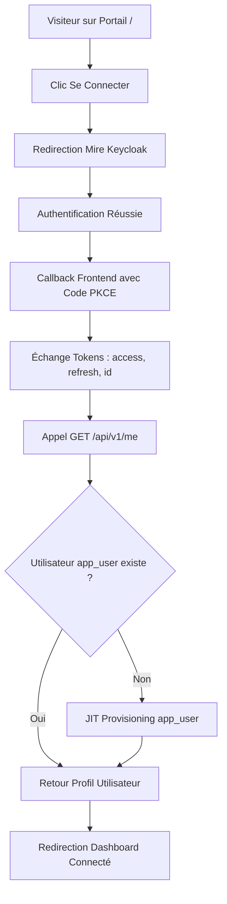

# Domaine : Identité & Accès (auth-and-identity) — Comportement Produit

> **Mission :** Fournir une gestion sécurisée, standardisée et sans friction de l'identité des utilisateurs, de l'authentification OIDC (Keycloak) et du cycle de vie des sessions sur Nanko.  
> **Acteurs & Personas :** Visiteur anonyme, Utilisateur authentifié, Administrateur système.

---

## 1. Périmètre & Frontières du Domaine (Bounded Context)

* **Ce qui relève de ce domaine (In Scope) :**
  * Mire et flux OIDC Authorization Code + PKCE via Keycloak.
  * Synchronisation Just-In-Time (JIT) de l'utilisateur interne (`app_user`).
  * Maintien silencieux de session et déconnexion globale SSO.
  * Portail d'accueil pour les visiteurs non connectés (`UnauthenticatedView`).
  * Sélecteur de thème clair/sombre (`ThemeSwitch`).
* **Ce qui relève d'autres domaines (Out of Scope & Frontières) :**
  * *Organisations & Projets :* Délégué à `workspace-management`.
  * *Éditeur d'architecture :* Délégué à `studio-modeling`.

---

## 2. Macro-Flux Métier

---

## 3. Cartographie des Parcours Utilisateurs

| ID | Parcours Utilisateur | Acteur | Déclencheur | Résultat Attendu |
|---|---|---|---|---|
| `JRN-01` | Portail Visiteur & CTA Connexion | Visiteur | Navigation sur `/` | Présentation produit et redirection vers Keycloak |
| `JRN-02` | Authentification OIDC & JIT Sync | Utilisateur | Saisie identifiants Keycloak | Tokens émis, utilisateur `app_user` synchronisé |
| `JRN-03` | Renouvellement Silencieux | Client React | Expiration imminente du JWT | Rafraîchissement automatique sans coupure |
| `JRN-04` | Déconnexion Globale | Utilisateur | Clic « Déconnexion » | Session locale purgée et déconnexion SSO Keycloak |
| `JRN-05` | Personnalisation Thème | Utilisateur | Changement ThemeSwitch | Thème clair/sombre persisté et appliqué sans flash |

---

## 4. Invariants Fonctionnels & Règles Métier

* **`INV-BUS-01` (Zero Password Storage) :** Nanko ne stocke ni ne manipule aucun mot de passe ou secret utilisateur en base locale.
* **`INV-BUS-02` (Idempotence JIT) :** Deux requêtes simultanées au premier login garantissent une création sans doublon grâce à la contrainte d'unicité sur `keycloak_id`.
* **`INV-BUS-03` (Découplage IAM vs Autorisation) :** `AuthAndIdentity` résout l'identité (`UserId`). L'accès aux ressources est délégué à `workspace-management`.

---

## 5. Matrice des Échecs & Cas Limites

| Situation d'Échec | Cause Racine | Comportement Système | Recouvrement Utilisateur |
|---|---|---|---|
| **Token Expiré / Révoqué** | Session inactive prolongée | L'API retourne HTTP 401 | Renouvellement automatique ou redirection vers Keycloak |
| **Clés JWKS Renouvelées** | Rotation de clé sur Keycloak | Rafraîchissement automatique du cache JWKS backend | Transparent pour l'utilisateur |
| **Indisponibilité Keycloak** | Panne réseau IdP | Validation des tokens existants active via le cache local | Poursuite du travail pour les sessions ouvertes |
