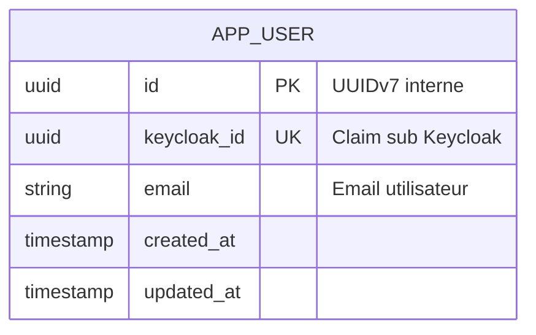

# Domaine : Identité & Accès (auth-and-identity) — Modèle de Données & Schéma DB

> **Mission :** Persister les comptes utilisateurs internes Nanko et assurer la correspondance biunivoque avec l'annuaire d'identité Keycloak (OIDC).

---

## 1. Diagramme Entité-Relation (ERD)



---

## 2. Dictionnaire de Données & Stockage (PostgreSQL)

| Colonne / Champ | Type | Nullable | Valeur par défaut | Description & Rôle Métier |
|---|:---:|:---:|:---:|---|
| `app_user.id` | `UUID` | Non | UUIDv7 | Identifiant primaire interne Nanko |
| `app_user.keycloak_id` | `UUID` | Non | - | Identifiant unique externe (`sub` du JWT Keycloak) |
| `app_user.email` | `VARCHAR(180)` | Non | - | Adresse email synchronisée au login |
| `app_user.created_at` | `TIMESTAMPTZ` | Non | `NOW()` | Horodatage de première connexion |
| `app_user.updated_at` | `TIMESTAMPTZ` | Non | `NOW()` | Horodatage de dernière synchronisation |

---

## 3. Agrégats & Entités Métier (Cœur Hexagonal)

```text
User (Root Aggregate)
├── id: UserId (UUIDv7)
├── keycloakId: KeycloakId (UUID)
├── email: string
└── syncTimestamps(createdAt, updatedAt)
```

---

## 4. Règles d'Intégrité & Cycle de Vie

| Règle | Type | Description |
|---|---|---|
| **`INT-AUTH-01`** | **Unicité Keycloak ID** | Un compte Keycloak ne peut être lié qu'à un seul utilisateur interne (`UNIQUE INDEX uniq_user_keycloak_id`). |
| **`INT-AUTH-02`** | **Idempotence du JIT Provisioning** | Si l'utilisateur existe déjà lors de l'appel à `GET /api/v1/me`, ses informations sont rafraîchies sans duplication. |
| **`INT-AUTH-03`** | **Clés Primaires UUIDv7** | L'identifiant interne est un UUIDv7 séquentiel, indépendant du `keycloak_id` externe. |
