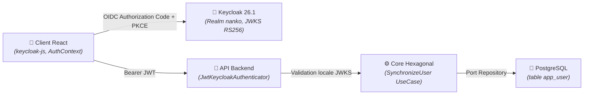

# Domaine : Identité & Accès (auth-and-identity) — Architecture Technique

> [!NOTE]
> **Mission :** Sécuriser la plateforme Nanko via Keycloak OIDC, valider cryptographiquement les jetons JWT Bearer et propager l'identité utilisateur de façon étanche et hexagonale.

---

## 1. Flux Architectural des Couches

---

## 2. Cartographie des Composants

| Couche | Responsabilité Technique | Composants Clés |
|---|---|---|
| **Identity Provider** | Émission de jetons JWT RS256, gestion de session et login SSO | Keycloak 26.1 (`infra/keycloak/realm-nanko.json`) |
| **Client / Frontend** | Initialisation PKCE, renouvellement silencieux de token, garde de route | `keycloak.ts`, `AuthContext`, `ProtectedRoute`, `UserMenu` |
| **Transport / API** | Interception HTTP, validation de signature JWKS sans appel synchrone à Keycloak | `JwtKeycloakAuthenticator.php`, `JwtKeycloakValidator.php`, `Me.php` |
| **Cœur Métier (Core)** | Provisioning Just-in-Time (JIT) idempotent et résolution du compte interne | `SynchronizeUser/Handler.php`, `User.php`, `KeycloakId.php` |
| **Persistance / Données** | Stockage relationnel de l'utilisateur interne et horodatages de synchronisation | `DoctrineRepository.php`, table `app_user` |

---

## 3. Dépendances Inter-Domaines

| Relation | Domaine Lié | Contrat & Échange |
|---|---|---|
| **Fournit à** | `workspace-management` | Fournit le `userId` authentifié issu du jeton JWT validé |
| **Fournit à** | `studio-modeling` | Assure l'identité pour le contrôle d'accès aux documents |

---

## 4. Invariants Techniques & Sécurité

| Règle | Exigence d'Intégrité | Mécanisme de Contrôle |
|---|---|---|
| **`INV-TECH-01`** | **Zéro Mot de Passe en Base Nanko** : Nanko ne manipule ni ne stocke aucun mot de passe ou secret utilisateur | Délégation OIDC totale à Keycloak |
| **`INV-TECH-02`** | **Validation Locale Asynchrone des JWT** : Les signatures RS256 sont vérifiées localement via JWKS avec cache et invalidation sur rotation | `JwtKeycloakValidator` avec cache public keys |
| **`INV-TECH-03`** | **Idempotence du JIT Provisioning** : Tout appel simultané à `/api/v1/me` garantit l'absence de doublon sur `keycloak_id` | Contrainte SQL Unique & Use Case JIT |

---

## 5. Décisions d'Architecture de Référence

| Référence | Décision Structurante | Impact Technique |
|---|---|---|
| [`ADR-0002`](../../../decisions/architecture/ADR-0002-modular-monolith-and-bounded-contexts.md) | Monolithe Modulaire | Isolation stricte du module AuthAndIdentity sans couplage fort |
| [`ADR-0007`](../../../decisions/architecture/ADR-0007-postgresql-unique-runtime-source-of-truth.md) | Runtime PostgreSQL unique | Stockage de la table `app_user` et du schéma `keycloak` sur le même PostgreSQL |
| [`ADR-0011`](../../../decisions/architecture/ADR-0011-hexagonal-architecture-and-dbal-without-orm.md) | Hexagone & DBAL sans ORM | Entités pures et requêtes d'hydratation manuelles |
