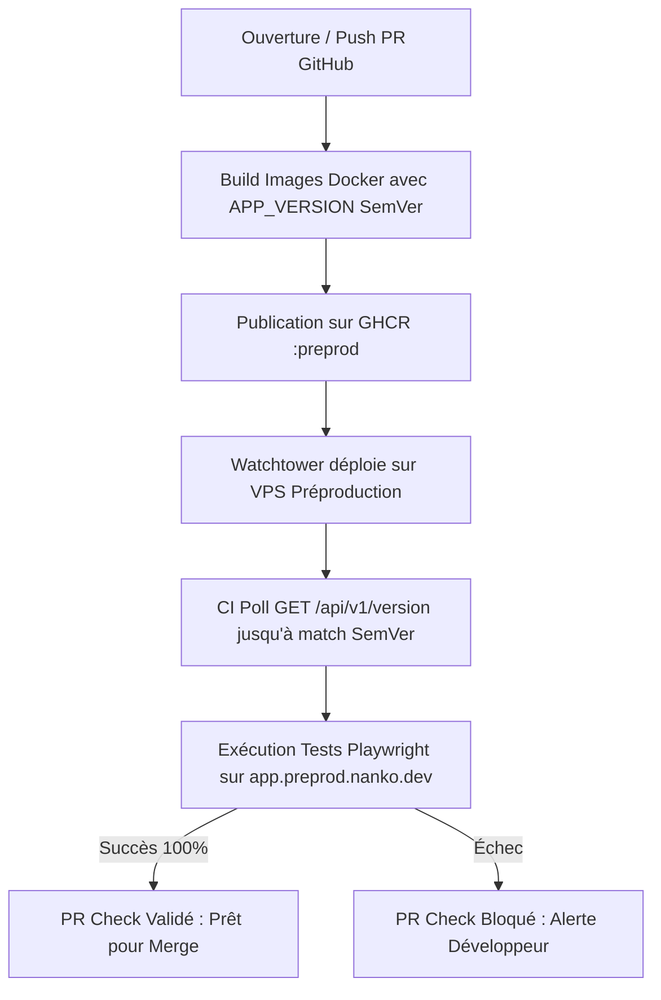

# Domaine : Plateforme & Livraison Continue (platform) — Comportement & Processus

> **Mission :** Garantir l'intégrité, la traçabilité et la stabilité de Nanko à travers une chaîne CI/CD automatisée, la validation E2E sur infrastructure réelle avant merge, l'observabilité distribuée (OpenTelemetry/SigNoz) et un versionnement SemVer strict.  
> **Acteurs & Personas :** Ingénieur DevOps, Développeur, Runner CI/CD, Sonde de supervision.

---

## 1. Périmètre & Frontières du Domaine (Bounded Context)

* **Ce qui relève de ce domaine (In Scope) :**
  * Validation automatisée E2E sur préproduction pour chaque Pull Request.
  * Calcul de version dynamique SemVer et traçabilité des commits.
  * Endpoint public de diagnostic de version (`/api/v1/version`).
  * Observabilité distribuée (traces, métriques, logs OpenTelemetry et SigNoz).
  * Protection d'accès HTTP Basic Auth et anti-indexation (`robots.txt`, `X-Robots-Tag`) sur préproduction.
  * Analytics éthiques et respectueuses de la vie privée (Plausible Analytics).
* **Ce qui relève d'autres domaines (Out of Scope & Frontières) :**
  * *Règles applicatives métier :* Délégué aux domaines respectifs (`auth-and-identity`, `workspace-management`, `studio-modeling`).

---

## 2. Macro-Flux CI/CD & Déploiement

---

## 3. Cartographie des Processus & Parcours

| ID | Processus / Parcours | Acteur | Déclencheur | Résultat Attendu |
|---|---|---|---|---|
| `PRC-01` | Validation E2E sur PR | GitHub Actions | Événement `pull_request` | Déploiement éphémère vérifié, tests Playwright 100% verts |
| `PRC-02` | Diagnostic de Version Active | Sonde / Développeur | `GET /api/v1/version` | Version SemVer, SHA et environnement retournés en 200 OK |
| `PRC-03` | Traçabilité Distribuée (OTel) | Frontend / Backend | Requête ou interaction | Propagation contexte W3C, traces et logs ingérés par SigNoz |
| `PRC-04` | Protection Préproduction | Visiteur / Crawler | Requête HTTP vers preprod | Basic Auth requis, `/robots.txt` et `X-Robots-Tag` interdisant l'indexation |
| `PRC-05` | Gestion des Crashs Frontend | Utilisateur | Exception non gérée | `AppErrorBoundary` avec Trace ID sans écran blanc |

---

## 4. Invariants Fonctionnels & Règles de Plateforme

* **`INV-PLAT-01` (Validation Préproduction Obligatoire) :** Aucune PR ne peut être mergée sans déploiement réel réussi et passage à 100% des tests E2E sur l'infrastructure de préproduction.
* **`INV-PLAT-02` (Zéro Indexation Préproduction) :** Tous les sous-domaines de préproduction interdisent formellement l'indexation via `/robots.txt` (`Disallow: /`) et l'en-tête `X-Robots-Tag`.
* **`INV-PLAT-03` (Fail-Open de la Télémétrie) :** Une défaillance ou indisponibilité du collecteur OpenTelemetry ou de Plausible ne doit en aucun cas bloquer ou dégrader l'expérience utilisateur applicative.

---

## 5. Matrice des Échecs & Résilience

| Situation d'Échec | Cause Racine | Comportement Système | Recouvrement |
|---|---|---|---|
| **Timeout Déploiement Préproduction** | Watchtower ou réseau VPS saturé | La CI boucle pendant 8 min maximum puis échoue avec logs explicites | Relance manuelle du workflow ou redémarrage conteneur |
| **Crash Composant Frontend** | Donnée inattendue ou exception React | `AppErrorBoundary` affiche un message clair avec le Trace ID W3C | Bouton « Recharger » ou « Retour à l'accueil » sans écran blanc |
| **Surcharge Collecteur Télémétrie** | Pic de requêtes | Les logs OTel sont abandonnés silencieusement (fail-open) | Les flux utilisateurs critiques continuent de fonctionner |
