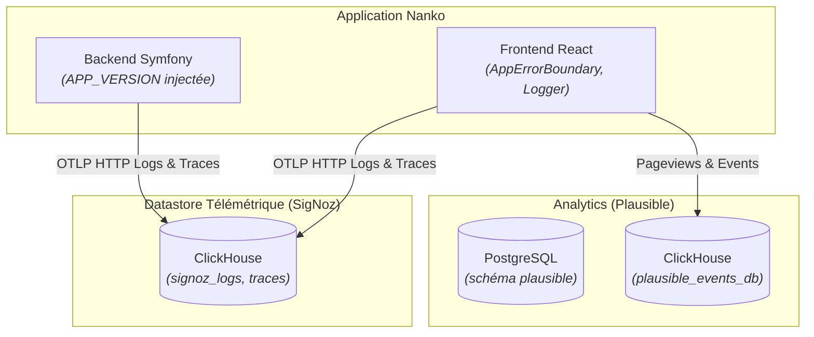

# Domaine : Plateforme & Livraison Continue (platform) — Modèle de Données & Stockage

> **Mission :** Structurer les métadonnées de versionnement applicatif, le modèle de données télémétrique OpenTelemetry (OTel) et le schéma d'audience éthique Plausible.

---

## 1. Modèle de Stockage & Datastores Dédiés

---

## 2. Dictionnaire de Données & DTOs

### 2.1. DTO Réponse Version (`GET /api/v1/version`)

| Propriété | Type | Nullable | Description & Format |
|---|:---:|:---:|---|
| `status` | `STRING` | Non | État opérationnel du service (`"ok"`) |
| `version` | `STRING` | Non | Version dynamique SemVer (ex: `v0.1.0-pr.14.2`, `v0.1.0`) |
| `commit` | `STRING` | Non | Hash SHA Git court du commit déployé |
| `environment` | `ENUM` | Non | Environnement d'exécution : `local`, `preprod`, `prod` |

### 2.2. Modèle LogRecord OpenTelemetry (Ingestion OTLP)

| Champ OTel | Type | Rôle Métier & Format |
|---|:---:|---|
| `timeUnixNano` | `UINT64` | Horodatage précis de l'événement en nanosecondes |
| `severityNumber` | `INT32` | Sévérité numérique OTel (INFO: 9, WARN: 13, ERROR: 17) |
| `severityText` | `STRING` | Libellé textuel (`DEBUG`, `INFO`, `WARN`, `ERROR`) |
| `body` | `STRING` | Corps textuel du message ou libellé de l'exception |
| `trace_id` | `STRING(32)` | Identifiant W3C hexadécimal corrélé avec la trace distribuée |
| `service.name` | `STRING` | Ressource émettrice : `nanko-backend` ou `nanko-frontend` |
| `deployment.environment` | `STRING` | Environnement : `local`, `preprod`, `prod` |

---

## 3. Conventions de Versionnement SemVer

| Contexte | Format SemVer | Exemple |
|---|---|---|
| **Pull Request (CI)** | `<base-tag>-pr.<pr_number>.<run_number>` | `v0.1.0-pr.14.2` |
| **Branche Main (RC)** | `<base-tag>-rc.<run_number>` | `v0.1.0-rc.35` |
| **Releases Production** | `<base-tag>` | `v0.1.0` |
| **Développement Local** | `v0.0.0-dev` | `v0.0.0-dev` |

---

## 4. Règles d'Intégrité & Cycle de Vie

| Règle | Type | Description |
|---|---|---|
| **`INT-PLAT-01`** | **Immutabilité de la Version Injectée** | La variable `APP_VERSION` est figée lors du build de l'image Docker et ne peut être altérée au runtime. |
| **`INT-PLAT-02`** | **Isolation Datastore Télémétrique** | Les métriques, traces et logs OTel n'écrivent jamais dans la base PostgreSQL métier Nanko (dédié à ClickHouse). |
| **`INT-PLAT-03`** | **Propagation Traceparent W3C** | Toute requête du frontend vers le backend propage l'en-tête standard `traceparent` pour relier les spans. |
