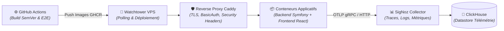

# Domaine : Plateforme & Livraison Continue (platform) — Architecture Technique

> [!NOTE]
> **Mission :** Orchestrer l'infrastructure CI/CD, le déploiement continu éphémère (Watchtower), le routage sécurisé (Caddy) et l'observabilité distribuée (OpenTelemetry, SigNoz, ClickHouse, Plausible).

---

## 1. Flux Architectural des Couches

---

## 2. Cartographie des Composants

| Couche | Responsabilité Technique | Composants Clés |
|---|---|---|
| **CI / CD** | Automatisation des builds, injection SemVer et validation des PRs par tests E2E | `pr-preprod-e2e.yml`, `deploy-preprod.yml`, `deploy-prod.yml` |
| **Ingress & Proxy** | Terminaison TLS, protection Basic Auth en préproduction et filtrage `/robots.txt` | Caddy (`infra/caddy/Caddyfile`), certificats Let's Encrypt |
| **Déploiement VPS** | Déploiement continu sans agent lourd ni exposition de clés SSH privées | Watchtower (`infra/compose.preprod.yml`) |
| **Observabilité** | Ingestion OTLP distribuée, corrélation W3C et tableau de bord de métriques | SigNoz Query Service, SigNoz Collector, ClickHouse 25.12 |
| **Analytics Éthiques** | Suivi d'audience respectueux de la vie privée sans cookies tiers | Plausible Analytics Community Edition (PostgreSQL + ClickHouse) |

---

## 3. Dépendances Inter-Domaines

| Relation | Domaine Lié | Contrat & Échange |
|---|---|---|
| **Supervise** | Tous les domaines | Collecte les traces W3C et les logs d'erreurs |
| **Valide** | `workspace-management`, `studio-modeling`, `auth-and-identity` | Exécute les suites de tests E2E Playwright sur préproduction |

---

## 4. Invariants Techniques & Sécurité

| Règle | Exigence d'Intégrité | Mécanisme de Contrôle |
|---|---|---|
| **`INV-TECH-01`** | **Sas d'Accès Préproduction** : Tout accès humain à la préproduction requiert une authentification HTTP Basic Auth valide (hors `/robots.txt`) | Caddy `basic_auth` (`PREPROD_HTTP_HASH`) |
| **`INV-TECH-02`** | **Déploiement Continu Pull** : Aucun accès SSH direct depuis GitHub Actions vers les serveurs VPS de production/préproduction | Watchtower scrute les digests GHCR (ADR-0010) |
| **`INV-TECH-03`** | **Anti-Indexation Stricte** : En-tête `X-Robots-Tag: noindex, nofollow...` injecté sur tous les sous-domaines préproduction | Caddy `header` universel |
| **`INV-TECH-04`** | **Cloisonnement Datastore Télémétrie** : ClickHouse n'est pas exposé publiquement et est réservé à la télémétrie | Réseau Docker interne |

---

## 5. Décisions d'Architecture de Référence

| Référence | Décision Structurante | Impact Technique |
|---|---|---|
| [`ADR-0002`](../../../decisions/architecture/ADR-002-bounded-contexts-structure.md) | Monolithe Modulaire | Regroupement des services dans un runtime unifié tout en isolant les Bounded Contexts |
| [`ADR-0007`](../../../decisions/architecture/ADR-007-postgres-only-for-mvp.md) | PostgreSQL Source Unique & Datastores Dédiés | PostgreSQL unique pour le métier, ClickHouse dédié à la télémétrie volumique |
| [`ADR-0010`](../../../decisions/architecture/ADR-010-watchtower-polling-deployment.md) | Pipeline PR Préproduction & SemVer | Validation systématique en préproduction réelle avant tout merge sur main |
