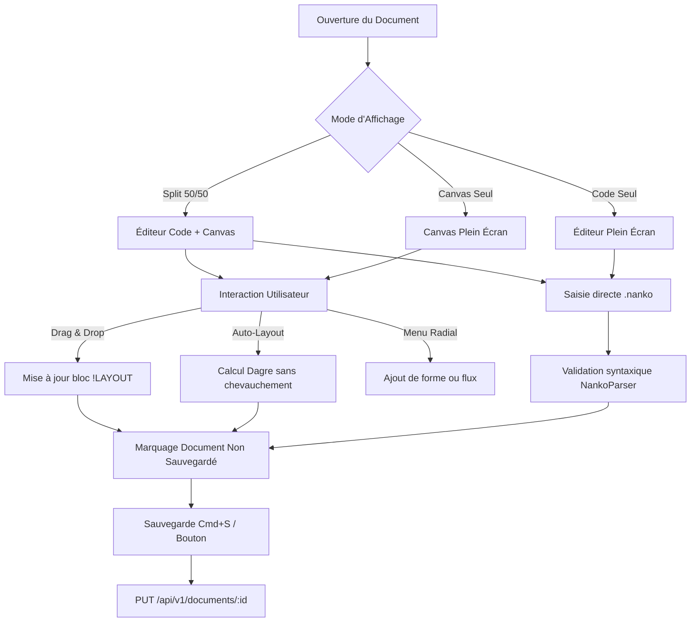

# Domaine : Studio de Modélisation (studio-modeling) — Comportement Produit

> **Mission :** Fournir une expérience interactive et fluide de modélisation d'architecture couplant un éditeur textuel de code source `.nanko` (DSL v1) et un canvas graphique interactif bidirectionnel (React Flow).  
> **Acteurs & Personas :** Architecte logiciel, Développeur, Lead Tech, Product Engineer.

---

## 1. Périmètre & Frontières du Domaine (Bounded Context)

* **Ce qui relève de ce domaine (In Scope) :**
  * Canvas visuel bidirectionnel (modes Split, Canvas plein écran, Code plein écran).
  * Analyse lexicale et syntaxique du langage déclaratif `.nanko` (DSL v1) et génération de l'AST dénormalisé.
  * Géométrie et rendu des formes graphiques Blueprint (`RectangleNode`, `CircleNode`, `TextNode`, `NankoEdge`).
  * Troncature élégante à 2 lignes avec ellipse et infobulles Blueprint interactives au survol sans troncature.
  * Manipulation spatiale (Drag & Drop) synchronisée dans le bloc `!LAYOUT ... !END`.
  * Réorganisation automatique sans chevauchement via l'algorithme hiérarchique Dagre.
  * Menu radial flottant contextuel pour l'insertion rapide de composants.
* **Ce qui relève d'autres domaines (Out of Scope & Frontières) :**
  * *Conteneur de documents & Projets :* Délégué à `workspace-management` (métadonnées, appartenance, persistance SQL du document).
  * *Authentification & Identité :* Délégué à `auth-and-identity`.

---

## 2. Macro-Flux Métier

---

## 3. Cartographie des Parcours Utilisateurs

| ID | Parcours Utilisateur | Acteur | Déclencheur | Résultat Attendu |
|---|---|---|---|---|
| `JRN-01` | Édition bidirectionnelle & Sauvegarde | Développeur | Saisie code ou `Cmd+S` | AST mis à jour, feedback visuel immédiat, code persisté |
| `JRN-02` | Rendu graphique typé Blueprint | Utilisateur | Rendu du document | Formes rectangulaires, circulaires (50%) et textuelles conformes |
| `JRN-03` | Infobulles Blueprint & Détail au survol | Utilisateur | Survol > 300 ms | Affichage complet de `desc` sans troncature, avec ascenseur si long |
| `JRN-04` | Repositionnement spatial (Drag & Drop) | Utilisateur | Glisser-déposer un nœud | Coordonnées `(x, y)` synchronisées dans le bloc `!LAYOUT` |
| `JRN-05` | Réorganisation automatique (Auto-Layout) | Utilisateur | Clic « Réorganiser » | Disposition ordonnée sans chevauchement via Dagre |
| `JRN-06` | Insertion rapide via Menu Radial | Utilisateur | Clic contextuel | Roue radiale d'actions immédiates (rect, circle, flux) |
| `JRN-07` | Tracé de Connecteur par Glisser & Magnétisme | Utilisateur | Glisser depuis une poignée révélée | Fil élastique, aimantation cible (< 32px), injection `source -> target` |
| `JRN-08` | Distribution Multi-Ports & Redimensionnement Automatique | Utilisateur | Multiples flux connectés sur un même flanc | Répartition uniforme sans collision, auto-scale x2 si > 8 flux |

---

## 4. Fiches Détaillées des Parcours

### `JRN-01` : Édition bidirectionnelle & Sauvegarde
* **Contexte :** Vue de travail sur `/projects/:projectId/documents/:documentId`.
* **Flux Nominal :**
  1. L'utilisateur saisit ou modifie du code déclaratif `.nanko` avec directive `@dsl-version 1`.
  2. Le parser vérifie la conformité syntaxique en temps réel ; le canvas reflète immédiatement les nouvelles formes et connexions.
  3. L'utilisateur déclenche la sauvegarde (`Cmd+S` ou bouton « Enregistrer »). Le document passe de l'état « Non sauvegardé » à « À jour ».
* **Variantes & Erreurs :** En cas d'erreur de syntaxe, l'éditeur surligne la ligne erronée avec message explicite sans effacer la saisie de l'utilisateur.

### `JRN-02` : Rendu graphique typé Blueprint
* **Contexte :** Affichage d'un graphe d'architecture sur le canvas React Flow.
* **Flux Nominal :**
  1. Le canvas instancie les nœuds selon leur géométrie sémantique :
     * `RectangleNode` : Panneau structuré pour conteneurs, services et composants.
     * `CircleNode` : Véritable disque (`border-radius: 50%`) avec badge et identifiant centrés au-dessus du libellé, et 4 ports de connexion tangents.
     * `TextNode` : Bloc d'annotation textuel avec bordure pointillée discrète.
     * `NankoEdge` : Arête directionnelle avec flèche SVG et badge de libellé de flux.
  2. Les descriptions sont élégamment tronquées à **2 lignes max** avec ellipse (`ellipsis`) pour préserver les dimensions compactes du nœud.

### `JRN-03` : Infobulles Blueprint & Détail au survol
* **Contexte :** Consultation d'un composant ou d'une arête documentée.
* **Flux Nominal :**
  1. L'utilisateur maintient le pointeur au-dessus d'un nœud ou d'un flux pendant au moins 300 ms (seuil anti-scintillement).
  2. Une infobulle Blueprint accessible (`role="tooltip"`, `BlueprintTooltip`) s'ouvre, révélant le nom complet, le type et l'intégralité de la description `desc` sans troncature.
  3. Pour les textes longs, l'infobulle active un ascenseur interne avec délai de grâce de 250 ms au survol, isolant les événements souris de React Flow (`nodrag`, `nowheel`, `nopan`).

### `JRN-04` : Repositionnement spatial (Drag & Drop)
* **Contexte :** Réagencement manuel des composants sur le canvas.
* **Flux Nominal :**
  1. L'utilisateur glisse un nœud vers une nouvelle position spatiale.
  2. Au relâchement (`onNodeDragStop`), les coordonnées `(x, y)` calculées sont injectées dans le bloc `!LAYOUT ... !END` du code source `.nanko`.
  3. Le document passe en état « Modifié » et est prêt pour la sauvegarde.

### `JRN-05` : Réorganisation automatique (Auto-Layout)
* **Contexte :** Graphe complexe ou désordonné.
* **Flux Nominal :**
  1. L'utilisateur clique sur « Réorganiser » dans la barre d'outils.
  2. L'algorithme Dagre calcule un placement hiérarchique optimal tenant compte des rayons circulaires réels et des largeurs rectangulaires.
  3. Toutes les coordonnées du bloc `!LAYOUT` sont mises à jour sans aucun croisement évitable.

### `JRN-07` : Tracé de Connecteur par Glisser, Omnidirectionnalité & Ancrage Dynamique
* **Contexte :** Liaison visuelle de deux formes sur le canvas sans basculer dans l'éditeur de code.
* **Flux Nominal :**
  1. Au repos, les poignées d'ancrage sont masquées pour garantir la pureté visuelle du schéma.
  2. Le survol (`:hover`) ou la sélection (`.selected`) d'une forme révèle immédiatement ses 4 poignées cardinales Blueprint et son ancre centrale `auto` (motif concentric target `◎`).
  3. L'utilisateur peut initier un tracé sortant depuis n'importe laquelle des 4 poignées cardinales (`top`, `bottom`, `left`, `right`) ou depuis l'ancre centrale `auto` ; un fil élastique suit le pointeur tandis que les formes distantes restent nettes.
  4. À l'approche de la forme cible (< 32px), la poignée candidate la plus proche s'aimante avec surbrillance distinctive (`scale(1.5)`, `--brand`). Si l'utilisateur vise le corps ou le centre de la cible, le mode d'ancrage dynamique `auto` est retenu.
  5. Au relâchement, l'arête `source -> target` est insérée dans le code source `.nanko`. Si des ancres cardinales fixes ont été sélectionnées, elles sont persistées dans le bloc `!LAYOUT` (`source->target: from=[side], to=[side]`). En mode `auto` pur, aucune surcharge n'est inscrite dans `!LAYOUT`.
  6. Le badge de libellé (`label`) se positionne automatiquement à 36px du point de départ le long du tracé, qualifiant immédiatement le flux sortant.
* **Variantes & Erreurs :** En cas d'auto-connexion (`source === target`) ou de doublon d'arête dans le même sens, la tentative est silencieusement annulée sans modifier le code source.

### `JRN-08` : Répartition Multi-Ports & Redimensionnement Automatique (Auto-Scale)
* **Contexte :** Connexion de multiples flux entrants ou sortants sur une même face d'une Shape.
* **Flux Nominal :**
  1. Lorsqu'un flanc compte $N$ connecteurs, les points d'attache sont automatiquement redistribués à intervalles réguliers ($\frac{1}{N+1}, \dots, \frac{N}{N+1}$) le long du bord.
  2. L'ordre des connecteurs le long de la face est calculé pour minimiser les croisements (selon la position de la forme opposée).
  3. Dès lors que le nombre de connecteurs sur un flanc dépasse la capacité nominale de 8 flux, la dimension correspondante (hauteur pour flancs verticaux, largeur pour flancs horizontaux, diamètre pour cercle) double automatiquement ($\times 2$).
  4. En cas de chevauchement spatial consécutif au redimensionnement, l'utilisateur rétablit l'espacement optimal en un clic sur le bouton « Réorganiser » (Dagre).

---

## 5. Invariants Fonctionnels & Règles Métier

* **`INV-BUS-01` (Invariance Sémantique Code $\leftrightarrow$ Canvas) :** Le code source `.nanko` est l'unique source de vérité. Toute manipulation sur le canvas (déplacement, ajout) modifie le texte `.nanko` de façon déterministe.
* **`INV-BUS-02` (Préservation de l'Édition Non Sauvegardée) :** Une tentative de quitter la vue avec des modifications non sauvegardées déclenche obligatoirement un avertissement de confirmation de navigation (`beforeunload`).
* **`INV-BUS-03` (Isolement des Événements Canvas) :** Les interactions au sein des modales, menus radiaux et infobulles scrollables sont totalement étanches des événements de zoom et de pan de React Flow.
* **`INV-BUS-04` (Intégrité des Connexions & Rejet des Doublons) :** Les auto-connexions (`source === target`) et les arêtes dupliquées dans le même sens sont strictement neutralisées au niveau du canvas et du moteur de sérialisation.
* **`INV-BUS-05` (Omnidirectionnalité & Ancrage Dynamique) :** Les 4 poignées cardinales de toute forme autorisent indifféremment l'émission et la réception de flux. L'ancre centrale `auto` recalcule les flancs de contact optimaux en temps réel lors du déplacement des nœuds.
* **`INV-BUS-06` (Positionnement Déterministe du Label de Flux) :** Le libellé du connecteur est positionné à une distance fixe de 36px de la poignée source le long du tracé (borné au milieu si distance < 72px).
* **`INV-BUS-07` (Répartition Uniforme Multi-Ports & Auto-Scale $\times 2$) :** Chaque connecteur raccordé sur un flanc disposant de $N$ flux se voit allouer un point d'attache dédié équidistant à $\frac{i+1}{N+1}$. Seules les 5 poignées canoniques (`top`, `bottom`, `left`, `right`, `auto`) sont interactives pour la création de flux ; les points d'attache distribués existants sont strictement passifs et invisibles au survol. L'insertion via la roue radiale (`A` + curseur) est atomique et produit strictement une forme unique. Dès le 9ᵉ flux sur un flanc, la forme s'agrandit automatiquement d'un facteur 2 sur la dimension correspondante (hauteur, largeur ou diamètre).

---

## 6. Matrice des Échecs & Cas Limites

| Situation d'Échec | Cause Racine | Comportement Système | Recouvrement Utilisateur |
|---|---|---|---|
| **Erreur de Syntaxe DSL** | Caractère invalide ou balise non fermée | Le parser lève une exception ciblée (ligne, colonne) ; le canvas reste dans son dernier état valide | L'utilisateur corrige la ligne signalée dans l'éditeur |
| **Boucle Circulaire de Dépendance** | Références croisées complexes | Dagre applique une inversion temporaire d'arête pour garantir un layout acyclique sans crash | Visualisation de l'arête avec flèche bi-directionnelle |
| **Texte de Description Très Long** | Contenu documentaire dense | La troncature à 2 lignes évite la déformation du nœud ; le tooltip prend le relais | Lecture fluide avec ascenseur dans l'infobulle Blueprint |
| **Connexion Invalide ou Doublon** | Tentative d'auto-boucle ou lien identique | `isValidConnection` retourne `false` ; le fil est annulé sans altération du code source | Relâcher sur une forme ou poignée valide |
