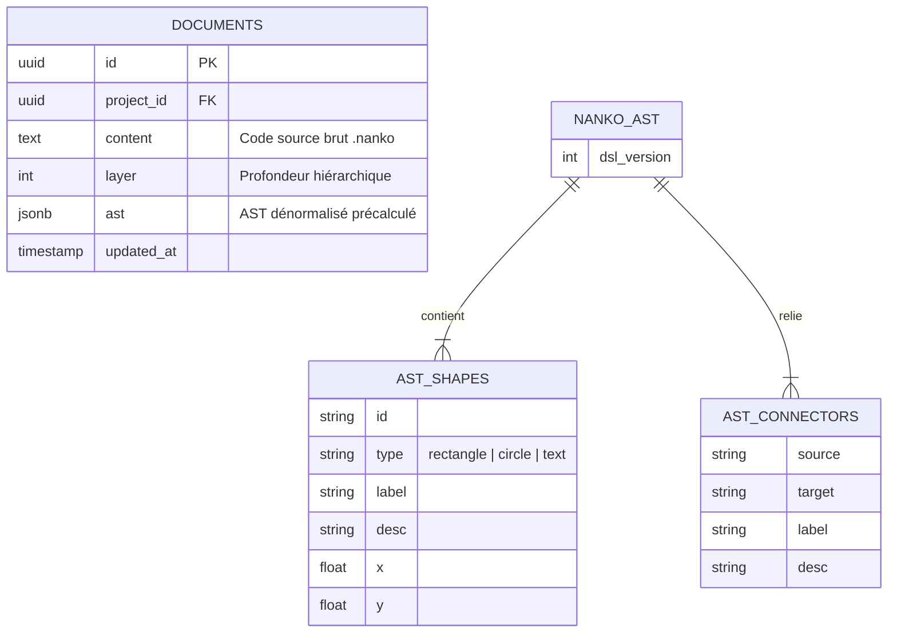

# Domaine : Studio de Modélisation (studio-modeling) — Modèle de Données & Stockage

> **Mission :** Structurer la persistance du code source `.nanko` et la dénormalisation de son Arbre Syntaxique Abstrait (AST) pour un chargement et un rendu graphique instantanés.

---

## 1. Diagramme Entité-Relation (ERD)



---

## 2. Dictionnaire de Données & Stockage

| Colonne / Champ | Type | Nullable | Valeur par défaut | Description & Rôle Métier |
|---|:---:|:---:|:---:|---|
| `documents.content` | `TEXT` | Non | Template par défaut | Code source déclaratif `.nanko` incluant `@dsl-version` et `!LAYOUT` |
| `documents.layer` | `INT` | Non | `0` | Profondeur hiérarchique du conteneur dans l'architecture |
| `documents.ast` | `JSONB` | Non | `{}` | Projection précalculée de l'AST (`dslVersion`, `shapes`, `connectors`) |
| `ast.shapes[].type` | `ENUM` | Non | - | Géométrie de forme : `rectangle`, `circle`, `text` |
| `ast.shapes[].x, y` | `FLOAT` | Oui | `null` | Coordonnées spatiales calculées ou issues du bloc `!LAYOUT` |
| `ast.connectors[].label` | `STRING` | Oui | `null` | Libellé sémantique du flux entre deux formes |
| `ast.connectors[].desc` | `STRING` | Oui | `null` | Description technique détaillée révélée dans l'infobulle |

---

## 3. Modèle d'AST en Mémoire (Cœur Hexagonal)

```text
NankoAst
├── dslVersion: int (ex: 1)
├── shapes: Shape[]
│   ├── id: string
│   ├── type: "rectangle" | "circle" | "text"
│   ├── label: string
│   ├── desc: ?string
│   └── coordinates: ?Coordinates(x, y)
└── connectors: Connector[]
    ├── source: string
    ├── target: string
    ├── label: ?string
    └── desc: ?string
```

---

## 4. Règles d'Intégrité & Cycle de Vie

| Règle | Type | Description |
|---|---|---|
| **`INT-AST-01`** | **Compilation Déterministe** | `documents.ast` est obligatoirement recalculé à chaque sauvegarde par `NankoParser` à partir de `content`. Aucune écriture manuelle directe dans le JSONB n'est autorisée. |
| **`INT-AST-02`** | **Format d'En-tête DSL** | Tout code `.nanko` doit déclarer en première directive non commentée la version du langage (ex: `@dsl-version 1`). Par défaut, la version 1 est appliquée si omise. |
| **`INT-AST-03`** | **Identifiants de Formes Uniques** | Dans un même document, deux formes ne peuvent partager le même identifiant textuel `id`. Une collision provoque une `InvalidNankoSyntaxException`. |
| **`INT-AST-04`** | **Validité des Connecteurs** | Tout connecteur `source -> target` doit référencer des identifiants de formes existant dans le bloc de déclarations sous peine d'erreur de parsing. |
