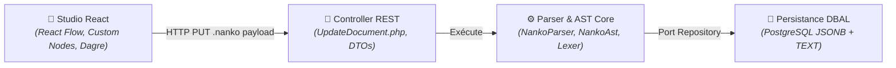

# Domaine : Studio de Modélisation (studio-modeling) — Architecture Technique

> [!NOTE]
> **Mission :** Orchestrer l'infrastructure frontend et backend permettant le rendu graphique haute performance (React Flow), la compilation syntaxique du langage `.nanko` et la réorganisation spatiale acyclique (Dagre).

---

## 1. Flux Architectural des Couches

---

## 2. Cartographie des Composants

| Couche | Responsabilité Technique | Composants Clés |
|---|---|---|
| **Client / Frontend** | Rendu interactif du graphe, manipulation nodale, tracé magnétique de connecteurs, auto-layout Dagre et infobulles Blueprint | `DocumentEditorView`, `NankoCanvas`, `RectangleNode`, `CircleNode`, `TextNode`, `NankoEdge`, `BlueprintTooltip`, `insertConnectorToSource`, `isValidConnection` |
| **Transport / API** | Désérialisation de l'entrée, gestion des codes d'erreur de syntaxe HTTP 400 | `UpdateDocument.php`, `GetDocument.php`, `UpdateDocumentInput.php` |
| **Cœur Métier (Core)** | Analyse lexicale, parsing déterministe et construction de l'arbre syntaxique | `NankoParser.php`, `NankoAst.php`, `Shape.php`, `Connector.php` |
| **Persistance / Données** | Écriture conjointe du code source et de l'arbre AST dans la table `documents` | `DocumentRepository.php`, `DoctrineRepository.php` |

> [!IMPORTANT]
> **Frontière de Domaine :** L'authentification, les jetons JWT et la vérification des droits d'accès à l'organisation parente sont délégués respectivement à `auth-and-identity` et `workspace-management`.

---

## 3. Dépendances Inter-Domaines

| Relation | Domaine Lié | Contrat & Échange |
|---|---|---|
| **Consomme** | `workspace-management` | Reçoit le contexte du conteneur (`documentId`, `projectId`, droits d'écriture) |
| **Consomme** | `auth-and-identity` | Vérifie l'identité de l'utilisateur authentifié |

---

## 4. Invariants Techniques & Sécurité

| Règle | Exigence d'Intégrité | Mécanisme de Contrôle |
|---|---|---|
| **`INV-TECH-01`** | **Déterminisme du Parsing** : Pour une chaîne source `.nanko` donnée, l'AST produit est 100% idempotent et exempt d'effets de bord | Tests unitaires backend stricts (`NankoParserTest`) |
| **`INV-TECH-02`** | **Isolation Événementielle du Canvas** : Aucun événement souris (clic, molette, glissement) dans les infobulles ou modales ne doit propager de zoom/pan au canvas React Flow | Attributs `nodrag`, `nowheel`, `nopan` et `stopPropagation()` |
| **`INV-TECH-03`** | **Auto-Layout Borné** : L'algorithme Dagre s'exécute côté client en moins de 100 ms pour un graphe standard (< 200 nœuds) sans dégrader le thread principal | Calcul asynchrone / Web Worker prêt |
| **`INV-TECH-04`** | **Intégrité du Tracé Réactif** : L'injection de connecteurs se fait avant le bloc `!LAYOUT` sans altérer les déclarations existantes, avec `connectionRadius={32}` et `connectionMode={ConnectionMode.Loose}` | Tests unitaires `insertConnectorToSource` et `isValidConnection` |

---

## 5. Décisions d'Architecture de Référence

| Référence | Décision Structurante | Impact Technique |
|---|---|---|
| [`PDR-004`](../../../decisions/product/PDR-004-radial-menu-and-contextual-handles.md) | Poignées contextuelles & Tracé magnétique | Révélation au survol/sélection, poignées carrées Blueprint, exclusion stricte d'auto-boucles |
| [`ADR-0002`](../../../decisions/architecture/ADR-002-bounded-contexts-structure.md) | Monolithe Modulaire | Découplage strict entre le conteneur documentaire et le moteur de studio |
| [`ADR-0007`](../../../decisions/architecture/ADR-007-postgres-only-for-mvp.md) | Runtime PostgreSQL unique | Stockage hybride relationnel et JSONB dénormalisé sur un seul moteur SQL |
| [`ADR-0011`](../../../decisions/architecture/ADR-011-hexagonal-architecture-backend.md) | Hexagone & DBAL sans ORM | Parser DSL pur sans adhérence à Doctrine ORM ni au framework Symfony |
