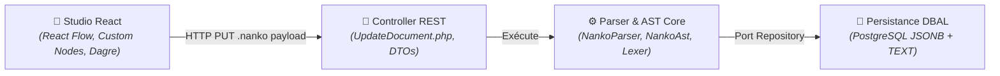

# Domaine : Studio de Modélisation (studio-modeling) — Architecture Technique

> [!NOTE]
> **Mission :** Orchestrer l'infrastructure frontend et backend permettant le rendu graphique haute performance (React Flow), la compilation syntaxique du langage `.nanko` et la réorganisation spatiale acyclique (Dagre).

---

## 1. Flux Architectural des Couches

---

## 2. Cartographie des Composants

| Couche | Responsabilité Technique | Composants Clés |
|---|---|---|
| **Client / Frontend** | Rendu interactif du graphe, manipulation nodale, tracé magnétique de connecteurs, auto-layout Dagre, poignées omnidirectionnelles, géométrie d'ancrage dynamique et pontets de croisement (line jumps) | `DocumentEditorView`, `NankoCanvas`, `RectangleNode`, `CircleNode`, `TextNode`, `NankoEdge`, `BlueprintTooltip`, `connectorGeometry`, `shapeGeometry`, `anchorDistribution`, `lineJumps`, `insertConnectorToSource`, `isValidConnection` |
| **Transport / API** | Désérialisation de l'entrée, gestion des codes d'erreur de syntaxe HTTP 400 | `UpdateDocument.php`, `GetDocument.php`, `UpdateDocumentInput.php` |
| **Cœur Métier (Core)** | Analyse lexicale, parsing déterministe, construction de l'arbre syntaxique et support du layout d'arêtes (`edgeLayout`) | `NankoParser.php`, `NankoAst.php`, `Shape.php`, `Connector.php` |
| **Persistance / Données** | Écriture conjointe du code source et de l'arbre AST dans la table `documents` | `DocumentRepository.php`, `DoctrineRepository.php` |

> [!IMPORTANT]
> **Frontière de Domaine :** L'authentification, les jetons JWT et la vérification des droits d'accès à l'organisation parente sont délégués respectivement à `auth-and-identity` et `workspace-management`.

---

## 3. Dépendances Inter-Domaines

| Relation | Domaine Lié | Contrat & Échange |
|---|---|---|
| **Consomme** | `workspace-management` | Reçoit le contexte du conteneur (`documentId`, `projectId`, droits d'écriture) |
| **Consomme** | `auth-and-identity` | Vérifie l'identité de l'utilisateur authentifié |

---

## 4. Invariants Techniques & Sécurité

| Règle | Exigence d'Intégrité | Mécanisme de Contrôle |
|---|---|---|
| **`INV-TECH-01`** | **Déterminisme du Parsing** : Pour une chaîne source `.nanko` donnée, l'AST produit est 100% idempotent et exempt d'effets de bord | Tests unitaires backend stricts (`NankoParserTest`) |
| **`INV-TECH-02`** | **Isolation Événementielle du Canvas** : Aucun événement souris (clic, molette, glissement) dans les infobulles ou modales ne doit propager de zoom/pan au canvas React Flow | Attributs `nodrag`, `nowheel`, `nopan` et `stopPropagation()` |
| **`INV-TECH-03`** | **Auto-Layout Borné** : L'algorithme Dagre s'exécute côté client en moins de 100 ms pour un graphe standard (< 200 nœuds) sans dégrader le thread principal | Calcul asynchrone / Web Worker prêt |
| **`INV-TECH-04`** | **Intégrité du Tracé Réactif** : L'injection de connecteurs se fait avant le bloc `!LAYOUT` sans altérer les déclarations existantes, avec `connectionRadius={32}` et `connectionMode={ConnectionMode.Loose}` | Tests unitaires `insertConnectorToSource` et `isValidConnection` |
| **`INV-TECH-05`** | **Ancrage Dynamique & Omnidirectionnalité** : Chaque nœud expose 4 poignées cardinales bidirectionnelles (`isConnectableStart={true}`, `isConnectableEnd={true}`) et 1 poignée centrale `auto`. La géométrie `connectorGeometry` résout les flancs de contact optimaux en temps réel et projette le label à 36px du point de départ | Fonctions `getOptimalConnectorSides`, rendu `NankoEdge` |
| **`INV-TECH-06`** | **Persistance Sélective du Layout d'Arêtes** : Seules les arêtes avec ancrages cardinaux explicites (`from=[side], to=[side]`) sont sérialisées dans `!LAYOUT`. Le mode `auto` pur reste implicite | Parsers/sérialiseurs `syncLayoutToSource`, `nankoParser.ts`, `NankoParser.php` |
| **`INV-TECH-07`** | **Distribution Multi-Ports, Auto-Scale & Projection Périmétrique** : Pour toute face comptant $N$ connecteurs, les points d'attache passifs (`isConnectable={false}`) sont répartis à $\frac{1}{N+1}\dots$ ordonnés selon la position opposée. Le tracé s'arrête sur le périmètre réel via `shapeGeometry.ts` (cercle 4 flancs, rectangle). Seules les 5 poignées canoniques sont connectables. L'insertion via la roue radiale est atomique. Le seuil de 8 flux déclenche l'échelle $\times 2$ (dont cercle 260x260) intégrée dans Dagre | Modules `anchorDistribution.ts`, `shapeGeometry.ts`, `NankoCanvas.tsx`, `calculateDagreLayout` |
| **`INV-TECH-08`** | **Pontets de Croisement & Résolution Géométrique des Crossovers** : Module `lineJumps.ts` calculant les intersections de segments orthogonaux (`findOrthogonalIntersection`). L'arête avec le z-index supérieur porte l'arc demi-cercle `A 6 6 0 0 1 ...` ; l'arête inférieure reste continue. Survol dynamique (`hoveredEdgeId` dans `NankoCanvas`, `onMouseEnter`/`onMouseLeave` dans `NankoEdge`) élevant le z-index à 1000. Préservation de l'horizontalité/verticalité stricte des segments découpés et dégagement d'angles | Modules `lineJumps.ts`, `NankoEdge.tsx`, `NankoCanvas.tsx` |
| **`INV-TECH-09`** | **Repositionnement Manuel des Labels Contraint sur le Trait & Persistance Différentielle** : Glisser interactif contraint le long du tracé du connecteur via projection orthogonale sur ses segments (`edgeLabelGeometry.ts`, `projectPointOnEdgePath`). Le badge reste continuellement centré sur le trait (`translate(-50%, -50%)`). Capture de pointeur (`setPointerCapture`), seuil de déplacement (3px) et double-clic de purge. Synchronisation différentielle dans `syncLayoutToSource.ts` supportant l'insertion, la modification et le nettoyage propre des clés `labelX` et `labelY` sans altérer les directives `from`/`to` existantes | Modules `NankoEdge.tsx`, `edgeLabelGeometry.ts`, `syncLayoutToSource.ts`, `NankoParser.php`, `NankoAst.php` |

---

## 5. Décisions d'Architecture de Référence

| Référence | Décision Structurante | Impact Technique |
|---|---|---|
| [`PDR-004`](../../../decisions/product/PDR-004-radial-menu-and-contextual-handles.md) | Poignées contextuelles & Tracé magnétique | Révélation au survol/sélection, poignées carrées Blueprint, exclusion stricte d'auto-boucles |
| [`Spec 022`](../../specs/archive/022-omnidirectional-and-smart-anchor-connectors.md) | Poignées Omnidirectionnelles & Ancrage Dynamique Intelligent | 4 poignées cardinales bidirectionnelles, cible centrale `auto`, calcul d'angle euclidien temps réel |
| [`Spec 023`](../../specs/archive/023-multi-anchor-distribution-and-auto-scale.md) | Distribution Multi-Ports & Redimensionnement Automatique | Poignées équidistantes sans collision, projection périmétrique 4 flancs, seuil de capacité 8 flux, facteur d'échelle $\times 2$ |
| [`Spec 024`](../../specs/archive/024-connector-line-jumps.md) | Pontets de Croisement des Connecteurs & Hiérarchie Z-Index | Arcs semi-circulaires SVG $r=6\text{px}$, détection orthogonale d'intersections, élévation dynamique au survol `z-index: 1000` |
| [`Spec 025`](../../specs/archive/025-draggable-connector-labels.md) | Repositionnement Manuel des Labels de Connecteurs & Persistance Layout | Coordonnées `labelX`/`labelY` dans `!LAYOUT`, drag avec pointer capture et zoom compensation, réinitialisation double-clic |
| [`ADR-0002`](../../../decisions/architecture/ADR-002-bounded-contexts-structure.md) | Monolithe Modulaire | Découplage strict entre le conteneur documentaire et le moteur de studio |
| [`ADR-0007`](../../../decisions/architecture/ADR-007-postgres-only-for-mvp.md) | Runtime PostgreSQL unique | Stockage hybride relationnel et JSONB dénormalisé sur un seul moteur SQL |
| [`ADR-0011`](../../../decisions/architecture/ADR-011-hexagonal-architecture-backend.md) | Hexagone & DBAL sans ORM | Parser DSL pur sans adhérence à Doctrine ORM ni au framework Symfony |
