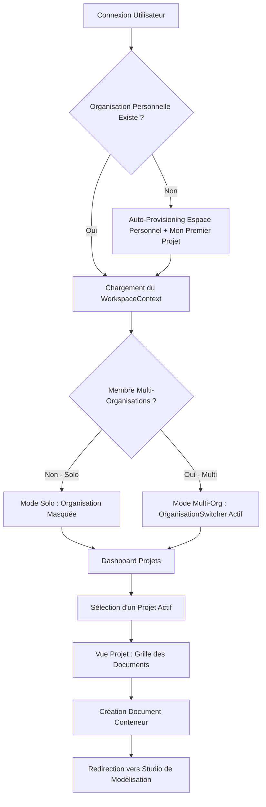

# Domaine : Espaces de Travail (workspace-management) — Comportement Produit

> **Mission :** Permettre aux utilisateurs et aux équipes de structurer leurs architectures au sein d'Organisations étanches et de Projets, servant de conteneurs obligatoires pour les documents d'architecture versionnés.  
> **Acteurs & Personas :** Développeur individuel, Membre d'équipe, Propriétaire d'organisation (Owner).

---

## 1. Périmètre & Frontières du Domaine (Bounded Context)

* **Ce qui relève de ce domaine (In Scope) :**
  * Auto-provisioning transparent de l'Organisation personnelle au premier login.
  * Expérience adaptative : Mode Solo (organisation masquée) vs Mode Multi-Org (sélecteur actif).
  * Création, modification et sélection persistée des Projets.
  * Création des conteneurs de Documents (nom, slug, layer hiérarchique) et affichage en grille sur le Dashboard.
  * Contrôle d'accès et d'appartenance organisationnelle.
* **Ce qui relève d'autres domaines (Out of Scope & Frontières) :**
  * *Éditeur de code .nanko & Canvas interactif :* Délégué à `studio-modeling`.
  * *Authentification & Gestion des Identités :* Délégué à `auth-and-identity`.

---

## 2. Macro-Flux Métier

---

## 3. Cartographie des Parcours Utilisateurs

| ID | Parcours Utilisateur | Acteur | Déclencheur | Résultat Attendu |
|---|---|---|---|---|
| `JRN-01` | Premier accès & Auto-provisioning | Nouvel utilisateur | Première navigation sur le Dashboard | Espace personnel et projet initial créés sans friction |
| `JRN-02` | Bascule Solo vs Multi-Organisation | Utilisateur | Adhésion à une organisation d'équipe | Apparition du sélecteur d'organisation dans la navigation |
| `JRN-03` | Création & Sélection de Projet | Utilisateur | Clic « + Nouveau Projet » | Projet créé et mémorisé localement comme actif |
| `JRN-04` | Création de Document Conteneur | Utilisateur | Clic « + Nouveau Document » | Document créé avec son layer et initialisé avec template source |

---

## 4. Fiches Détaillées des Parcours

### `JRN-01` : Premier accès & Auto-provisioning transparent
* **Contexte :** Première visite de l'utilisateur authentifié sur la plateforme.
* **Flux Nominal :**
  1. L'API interroge les organisations de l'utilisateur.
  2. Constatant l'absence d'espace personnel, elle crée immédiatement une `Organisation` (`is_personal = true`, nom: « Espace personnel ») et rattache l'utilisateur comme `owner`.
  3. Elle instancie un premier projet par défaut nommé « Mon premier projet » (`mon-premier-projet`).
  4. L'utilisateur atterrit directement sur son Dashboard sans aucune étape de configuration préalable.

### `JRN-02` : Bascule Solo vs Multi-Organisation
* **Contexte :** Affichage dans la barre de navigation.
* **Flux Nominal :**
  * **Mode Solo :** Tant que l'utilisateur ne possède que son espace personnel, l'organisation est totalement transparente. La navigation n'affiche que « Mes Projets ».
  * **Mode Multi-Org :** Dès que l'utilisateur est rattaché à une organisation supplémentaire, un menu déroulant d'organisation apparaît, permettant d'isoler strictement les projets de chaque entité.

### `JRN-03` : Création & Sélection de Projet
* **Contexte :** Organisation active sélectionnée.
* **Flux Nominal :**
  1. L'utilisateur clique sur « + Nouveau Projet » depuis le Dashboard.
  2. Une modale permet de renseigner le nom (le slug est prérempli et modifiable).
  3. À la création, le projet devient le projet actif, et son ID est conservé dans le `localStorage`.

### `JRN-04` : Création de Document Conteneur
* **Contexte :** Dashboard d'un projet actif.
* **Flux Nominal :**
  1. L'utilisateur clique sur « + Nouveau Document ».
  2. Il renseigne le nom, le slug et la profondeur hiérarchique (`layer`, défaut 0).
  3. Le conteneur est créé avec un template source initial, puis l'application redirige automatiquement vers le studio de modélisation.

---

## 5. Invariants Fonctionnels & Règles Métier

* **`INV-BUS-01` (Unicité de l'Espace Personnel) :** Un utilisateur ne peut posséder qu'une seule organisation personnelle (`is_personal = true`).
* **`INV-BUS-02` (Isolation Stricte des Ressources) :** Un projet appartient à une et une seule organisation. Aucun document ne peut être accédé en dehors du contexte d'appartenance de son organisation parente.
* **`INV-BUS-03` (Unicité des Slugs par Conteneur) :** Les slugs de projets sont uniques au sein d'une organisation ; les slugs de documents sont uniques au sein d'un projet.

---

## 6. Matrice des Échecs & Cas Limites

| Situation d'Échec | Cause Racine | Comportement Système | Recouvrement Utilisateur |
|---|---|---|---|
| **Collision de Slug de Projet** | Nom de projet identique dans la même organisation | L'API renvoie HTTP 409 Conflict avec code `PROJECT_SLUG_EXISTS` | Modification du slug suggéré dans le formulaire |
| **Tentative d'accès non autorisé** | Accès direct via URL à un projet d'une autre organisation | L'API renvoie HTTP 403 Forbidden | Redirection automatique vers le Dashboard personnel |
| **Réseau Déconnecté** | Coupure réseau pendant la création | TanStack Query affiche un message d'erreur clair avec bouton de réessai | Clic sur « Réessayer » sans rechargement de page |
