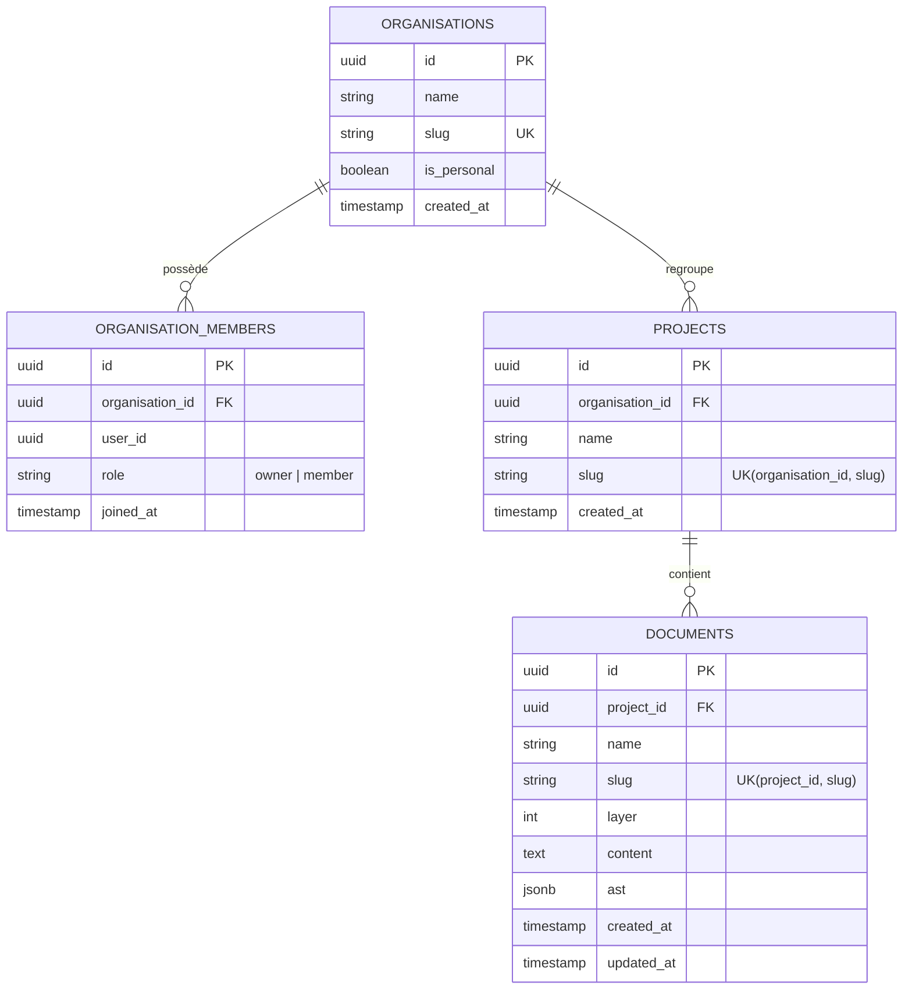

# Domaine : Espaces de Travail (workspace-management) — Modèle de Données & Schéma DB

> **Mission :** Modéliser l'isolation multi-tenant stricte des Organisations, de leurs Membres, des Projets et des conteneurs de Documents.

---

## 1. Diagramme Entité-Relation (ERD)



---

## 2. Dictionnaire de Données & Stockage (PostgreSQL)

| Colonne / Champ | Type | Nullable | Valeur par défaut | Description & Rôle Métier |
|---|:---:|:---:|:---:|---|
| `organisations.id` | `UUID` | Non | UUIDv7 | Identifiant unique de l'organisation |
| `organisations.name` | `VARCHAR(255)` | Non | - | Nom de l'organisation (ex: « Espace personnel ») |
| `organisations.slug` | `VARCHAR(255)` | Non | - | Slug unique global (index unique) |
| `organisations.is_personal` | `BOOLEAN` | Non | `false` | `true` si espace personnel auto-provisionné |
| `organisation_members.role` | `VARCHAR(32)` | Non | `'member'` | Rôle du membre (`owner` ou `member`) |
| `organisation_members.user_id`| `UUID` | Non | - | Référence à l'utilisateur (`auth-and-identity`) |
| `projects.slug` | `VARCHAR(255)` | Non | - | Slug unique au sein de l'organisation |
| `documents.slug` | `VARCHAR(255)` | Non | - | Slug unique au sein du projet |
| `documents.layer` | `INT` | Non | `0` | Profondeur hiérarchique du conteneur d'architecture |
| `documents.content` | `TEXT` | Non | Template initial | Code source brut du document `.nanko` |
| `documents.ast` | `JSONB` | Non | `{}` | AST précalculé dénormalisé |

---

## 3. Agrégats & Entités Métier (Cœur Hexagonal)

```text
Organisation (Root Aggregate)
├── id: OrganisationId (UUIDv7)
├── name: string
├── slug: string
├── isPersonal: bool
└── members: OrganisationMember[] (userId, role: Owner|Member)

Project (Entity)
├── id: ProjectId (UUIDv7)
├── organisationId: OrganisationId
├── name: string
└── slug: string

Document (Entity / Container)
├── id: DocumentId (UUIDv7)
├── projectId: ProjectId
├── name: string
├── slug: string
├── layer: Layer (int >= 0)
└── content: DocumentContent (.nanko)
```

---

## 4. Règles d'Intégrité & Cycle de Vie

| Règle | Type | Description |
|---|---|---|
| **`INT-DB-01`** | **Contrainte d'Unicité de Slug** | L'unicité de `projects.slug` est scopée par `organisation_id`. L'unicité de `documents.slug` est scopée par `project_id`. |
| **`INT-DB-02`** | **Espace Personnel Unique** | Un utilisateur ne peut être `owner` que d'une seule organisation avec `is_personal = true`. |
| **`INT-DB-03`** | **Cascade de Suppression** | La suppression d'une organisation entraîne la suppression en cascade de ses membres, de ses projets et de leurs documents. |
| **`INT-DB-04`** | **Clés Primaires UUIDv7** | Toutes les clés primaires sont générées via l'algorithme UUIDv7 pour garantir un tri chronologique et des performances d'index B-Tree optimales. |
