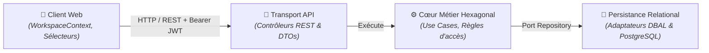

# Domaine : Espaces de Travail (workspace-management) — Architecture Technique

> [!NOTE]
> **Mission :** Orchestrer l'infrastructure applicative et l'isolation étanche des Organisations, des Projets et des conteneurs de Documents.

---

## 1. Flux Architectural des Couches

---

## 2. Cartographie des Composants

| Couche | Responsabilité Technique | Composants Clés |
|---|---|---|
| **Client Web** | Détection du mode (Solo transparent vs Multi-Org), persistance du contexte actif | `WorkspaceContext`, `OrganisationSwitcher`, `ProjectSwitcher` |
| **Transport API** | Validation des requêtes d'entrée, désérialisation, codes HTTP standard | `OrganisationController`, `ProjectController`, `DocumentController` |
| **Cœur Métier** | Vérification des droits d'appartenance, auto-provisioning de l'espace personnel | `GetOrCreatePersonalOrgUseCase`, `ProjectUseCase`, `DocumentUseCase` |
| **Persistance** | Requêtes SQL optimisées, clés étrangères, transactions ACID | `OrganisationRepository`, `ProjectRepository`, `DocumentRepository` |

> [!IMPORTANT]
> **Frontière de Domaine :** Tout le moteur de canvas visuel (React Flow, parsing DSL, menu radial, auto-layout Dagre) relève exclusivement du domaine **`studio-modeling`**.

---

## 3. Dépendances Inter-Domaines

| Relation | Domaine Lié | Contrat & Échange |
|---|---|---|
| **Consomme** | `auth-and-identity` | Reçoit le `userId` authentifié via le token JWT |
| **Expose à** | `studio-modeling` | Fournit le conteneur parent (`documentId`, `projectId`, `organisationId`) |

---

## 4. Invariants Techniques & Sécurité

| Règle | Exigence d'Intégrité | Mécanisme de Contrôle |
|---|---|---|
| **`INV-TECH-01`** | **Contrôle d'accès à la source** : Tout UseCase vérifie l'appartenance active de l'utilisateur à l'organisation avant toute lecture ou mutation | Guards applicatifs systématiques |
| **`INV-TECH-02`** | **Identifiants séquentiels UUIDv7** : Clés primaires générées côté serveur, ordonnées chronologiquement et sans collision | Générateur d'identifiant au domaine |
| **`INV-TECH-03`** | **Étanchéité hexagonale** : Le cœur métier ne dépend d'aucun framework ni driver de base de données | Analyseur de dépendances (CI / Deptrac) |

---

## 5. Décisions d'Architecture de Référence

| Référence | Décision Structurante | Impact Technique |
|---|---|---|
| [`ADR-0002`](../../../decisions/architecture/ADR-002-bounded-contexts-structure.md) | Monolithe Modulaire | Isolation stricte des Bounded Contexts en modules autonomes |
| [`ADR-0007`](../../../decisions/architecture/ADR-007-postgres-only-for-mvp.md) | Runtime PostgreSQL unique | Stockage relationnel unique sans dispersion de datastores |
| [`ADR-0011`](../../../decisions/architecture/ADR-011-hexagonal-architecture-backend.md) | Hexagone & DBAL sans ORM | Requêtes SQL explicites et entités pures découplées de l'ORM |
| [`PDR-0002`](../../../decisions/product/PDR-002-organisation-personnelle-implicite.md) | Espace personnel implicite | Auto-provisioning transparent sans friction au premier login |
