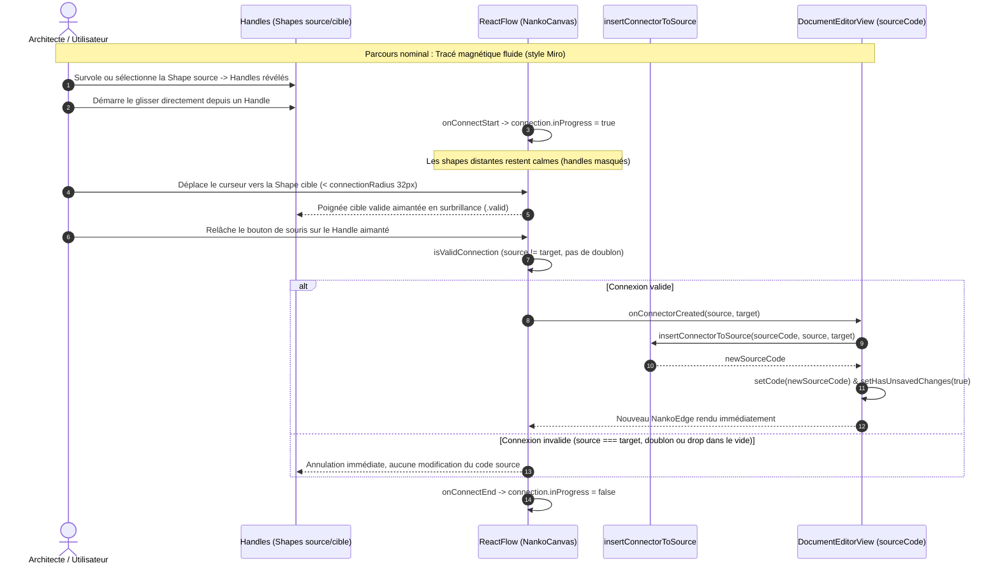

# Spec : 021 - Handles Contextuels, Tracé de Connecteur par Glisser & Magnétisme Automatique

## Métadonnées
* **Domaine concerné :** `.specs/knowledge/domains/studio-modeling/`
* **Type de changement :** `Évolution`
* **Cible :** `frontend` (React Flow, Handles, Nœuds, Canvas) + `tests-e2e` (Playwright)
* **Feature parente :** [04-smart-handles-magnetic-connectors](../../initiatives/active/studio-modeling/active/04-smart-handles-magnetic-connectors.md)
* **Complexité :** `Medium`

---

## 1. Intention & Contexte (*The Why*)

* **Problème résolu / Besoin :**
  Actuellement, relier deux shapes sur le Board Nanko impose de basculer en mode Split ou Code et de rédiger textuellement la syntaxe déclarative `source -> target`. De plus, les 4 poignées d'ancrage (`.nanko-handle`) sont en permanence visibles sur toutes les shapes, polluant visuellement le schéma au repos.
* **Impact utilisateur :**
  * Au repos, toutes les poignées d'ancrage sont masquées (`opacity: 0`), offrant un schéma d'architecture épuré sans bruit visuel.
  * Le simple survol d'une Shape (**`:hover`**) ou sa sélection (**`.selected`**) révèle instantanément ses 4 poignées d'ancrage, permettant de démarrer un tracé en un seul geste fluide sans clic de sélection préalable (style Miro / FigJam).
  * Glisser depuis une poignée étire une ligne de connexion ; les formes distantes sur le Board restent nettes et calmes (aucun affichage parasite de handles sur tout le canvas).
  * À l'approche de la forme cible (< 32px), la poignée candidate la plus proche s'aimante automatiquement avec surbrillance distinctive.
  * Relâcher la souris crée le connecteur dans le code `.nanko` (`source -> target`), trace l'arête visuelle et active l'état non sauvegardé (`Cmd+S`).
  * Les auto-connexions (`source === target`) et les doublons d'arêtes sont neutralisés.
* **In Scope (Ce qui est ajouté / modifié) :**
  * Masquage contextuel des poignées d'ancrage dans `NankoCanvas.module.css` (invisibles au repos, visibles localement au survol `:hover` ou à la sélection `.selected`).
  * Surbrillance magnétique sur la poignée candidate valide ciblée (`.valid`, zoom `scale(1.5)` et couleur `var(--brand)`).
  * Câblage de `onConnect`, `onConnectStart`, `onConnectEnd`, `isValidConnection` et `connectionRadius={32}` sur `<ReactFlow>` dans `NankoCanvas.tsx`.
  * Utilitaire `insertConnectorToSource.ts` pour injecter la déclaration `source -> target` regroupée sous le bloc des Shapes dans le texte `.nanko`.
  * Callback `onConnectorCreated` sur `NankoCanvas` câblé dans `DocumentEditorView.tsx`.
  * Désactivation de `isConnectable` sur les nœuds en cas d'erreur de syntaxe globale (`syntaxError`).
  * Tests unitaires Vitest (`insertConnectorToSource.test.ts`, `NankoCanvas.test.tsx`) et scénario E2E Playwright (`canvas-connector-drawing.spec.ts`).
* **Out of Scope (Exclusions strictes) :**
  * Révélation globale des handles sur l'ensemble du Board (exclue au profit d'une approche ciblée à l'approche, style Miro).
  * Suppression en cascade des connecteurs lors de la suppression d'une Shape (objet de la feature ultérieure).
  * Outil connecteur activé au clavier via la roue radiale (le tracé se déclenche exclusivement par glisser depuis un handle).
  * Inversion du sens d'un connecteur existant.
  * Modification du backend Symfony ou du modèle relationnel SQL.

> *Omission Note : Sections 4.1 (Modèle de données & API) et 4.3 (Infrastructure & Runtime) non applicables (mutation textuelle client-only de `sourceCode` sans altération de schéma).*

---

## 2. Flux & Architecture



---

## 3. Inventaire des Fichiers & Contrats

### 3.1. Arborescence Factorisée
*Chemins relatifs à la racine du workspace.*

```text
frontend/
├── src/
│   ├── features/
│   │   └── documents/
│   │       └── components/
│   │           └── canvas/
│   │               ├── NankoCanvas.tsx                 [MOD] Câblage onConnect, useConnection, isValidConnection
│   │               ├── NankoCanvas.module.css          [MOD] Règles de masquage/révélation des .nanko-handle et surbrillance .valid
│   │               ├── NankoCanvas.test.tsx            [MOD] Tests unitaires isValidConnection et onConnect
│   │               └── utils/
│   │                   ├── insertConnectorToSource.ts   [NEW] Sérialisation déterministe de "source -> target"
│   │                   ├── insertConnectorToSource.test.ts [NEW] Tests unitaires de sérialisation et détection de doublons
│   │                   └── isValidConnection.ts         [NEW] Fonction pure de validation d'arête
│   └── views/
│       └── DocumentEditorView.tsx                      [MOD] Câblage handleConnectorCreated -> insertConnectorToSource
tests-e2e/
└── tests/
    └── app/
        └── canvas-connector-drawing.spec.ts            [NEW] Scénario E2E de tracé par glisser et magnétisme
```

### 3.2. Contrats Clés & Signatures

```typescript
// frontend/src/features/documents/components/canvas/utils/insertConnectorToSource.ts

export interface InsertConnectorResult {
  newSourceCode: string
  alreadyExists: boolean
}

/**
 * Insère une déclaration de connecteur "source -> target" dans le code .nanko.
 * Les connecteurs sont regroupés après les shapes et avant le bloc !LAYOUT.
 * No-op si l'arête source -> target existe déjà.
 */
export function insertConnectorToSource(
  sourceCode: string,
  source: string,
  target: string,
): InsertConnectorResult
```

```typescript
// frontend/src/features/documents/components/canvas/NankoCanvas.tsx

export interface NankoCanvasProps {
  ast: NankoAst
  syntaxError: string | null
  onNodePositionChange?: (nodeId: string, position: { x: number; y: number }) => void
  onAutoLayoutApplied?: (newPositions: Record<string, { x: number; y: number }>) => void
  onCreateShape?: (shapeType: ShapePrimitiveType, position: { x: number; y: number }) => void
  onConnectorCreated?: (source: string, target: string) => void // [NEW]
}
```

---

## 4. Spécifications Détaillées

### 4.2. Spécifications UI & Interaction

#### Rendu visuel & Wireframes conceptuels

```text
AU REPOS (aucune sélection/survol)    SURVOL OU SÉLECTION           APPROCHE DE LA FORME CIBLE
+--------------------------+        +--------------------------+   +--------------------------+
| RECTANGLE       gateway  |        |[RECTANGLE       gateway ]|   | RECTANGLE       gateway  | (source)
+--------------------------+        +--------------------------+   +--------------------------+
| API Gateway              |        |○ API Gateway            ○|                \  
+--------------------------+        +--------------------------+                 \ (fil élastique)
   (poignées masquées)                 (survol : handles révélés)                  \
                                                                   +--------------------------+
                                                                   |◉ CIRCLE          auth    | (cible approchée :
                                                                   +--------------------------+  handle aimanté
                                       [Autres shapes du Board        (shapes distantes :        < 32px)
                                        restent calmes et sans         restent nettes et sans
                                        handles affichés]              handles affichés]
```

#### Règles CSS de Visibilité & Surbrillance (`NankoCanvas.module.css`)

```css
/* Poignées d'ancrage masquées par défaut */
.nanko-handle {
  opacity: 0;
  pointer-events: none;
  transition: opacity 0.12s ease, transform 0.12s ease;
}

/* Révélation locale : survol (:hover) OU sélection (.selected) - ergonomie Miro / FigJam */
:global(.react-flow__node:hover) .nanko-handle,
:global(.react-flow__node.selected) .nanko-handle {
  opacity: 1;
  pointer-events: all;
}

/* Approche magnétique ciblée : poignée candidate valide (< connectionRadius 32px) */
.nanko-handle:global(.valid) {
  opacity: 1;
  pointer-events: all;
  transform: scale(1.5);
  background-color: var(--brand) !important;
}
```

#### Matrice des États d'Interface

| État | Déclencheur | Rendu visuel & Comportement |
|---|---|---|
| **Repos** | Aucun survol, aucune sélection, aucun tracé | Toutes les poignées d'ancrage invisibles (`opacity: 0`). |
| **Survol ou Sélection** | Survol de la souris (`:hover`) ou clic simple sur un nœud (`.selected`) | Les 4 poignées d'ancrage du nœud deviennent visibles et immédiatement interactives. |
| **Tracé en cours** | Glisser depuis une poignée | Ligne de connexion élastique suivant le curseur ; formes distantes restant calmes et nettes sans affichage de poignées parasites. |
| **Approche magnétique** | Curseur < 32px d'une poignée cible valide | La poignée cible candidate s'agrandit (`scale(1.5)`), passe en opacité `1` et adopte la couleur `--brand`. |
| **Drop valide** | Relâchement sur la poignée aimantée | Arête tracée, ligne `source -> target` ajoutée au code source, état non sauvegardé activé. |
| **Drop invalide / Annulation** | Relâchement dans le vide, auto-connexion ou doublon | Fil de connexion annulé, poignées revenant à l'état masqué, aucun impact sur le code source. |

---

## 5. Invariants Métier & Traçabilité des Tests

* **INV-1 · Masquage au repos & révélation au survol / sélection (style Miro)**  
  Toutes les poignées d'ancrage sont invisibles (`opacity: 0`) au repos. Dès qu'un nœud est survolé (`:hover`) ou sélectionné (`.selected`), ses poignées d'ancrage passent à `opacity: 1` et deviennent interactives, permettant de lancer un tracé en un seul geste sans sélection préalable.  
  ↳ *Covered by:* [`NankoCanvas.test.tsx`](#appendix-file-index)

* **INV-2 · Zéro pollution globale & magnétisme ciblé**  
  Aucun allumage global de l'ensemble des poignées du Board n'est déclenché pendant le tracé. Seule la poignée candidate de la forme cible approchée dans le rayon de capture (< 32px) s'active en surbrillance distinctive (`.valid`).  
  ↳ *Covered by:* [`NankoCanvas.test.tsx`](#appendix-file-index), [`canvas-connector-drawing.spec.ts`](#appendix-file-index)

* **INV-3 · Rejet strict des auto-connexions et des doublons**  
  `isValidConnection` retourne `false` si `source === target` ou si une connexion identique existe déjà dans le même sens.  
  ↳ *Covered by:* [`NankoCanvas.test.tsx`](#appendix-file-index), [`insertConnectorToSource.test.ts`](#appendix-file-index)

* **INV-4 · Isomorphisme et regroupement sémantique DSL**  
  L'arête créée est injectée dans le code `.nanko` après le bloc des shapes et avant le bloc `!LAYOUT`, sans altérer les déclarations existantes.  
  ↳ *Covered by:* [`insertConnectorToSource.test.ts`](#appendix-file-index)

* **INV-5 · Résilience aux erreurs syntaxiques**  
  Lorsque `syntaxError` est présent (canvas en pause), les interactions de connexion sont désactivées pour prévenir la création de liens sur un graphe désynchronisé.  
  ↳ *Covered by:* [`NankoCanvas.test.tsx`](#appendix-file-index)

---

## 6. Pièges Techniques & Anti-Patterns

* **`connectionRadius` insuffisant :** Par défaut, React Flow n'active la détection que lorsque le curseur touche le handle (7px). Définir `connectionRadius={32}` sur `<ReactFlow>` garantit une détection magnétique confortable sur trackpad.
* **Boucle infinie lors de l'injection :** Ne pas écraser les retours à la ligne ni déstructurer le bloc `!LAYOUT ... !END`. `insertConnectorToSource` doit cibler strictement le segment sémantique supérieur.
* **Perte du focus ou interférence avec le pan du canvas :** S'assurer que le drag depuis un handle n'active pas le déplacement de canvas (`panOnDrag`). React Flow gère ceci nativement lorsque le pointeur démarre sur un handle interactif.

---

## 7. Plan d'Exécution Séquentiel

- [x] **Phase 1 : Logique de Sérialisation & Tests Unitaires**
  - [x] Créer [`insertConnectorToSource.ts`](#appendix-file-index) pour insérer `source -> target` de manière déterministe.
  - [x] Écrire [`insertConnectorToSource.test.ts`](#appendix-file-index) (insertion nominale, regroupement sous les shapes, détection de doublon no-op).

- [x] **Phase 2 : Styles CSS & Handles Contextuels**
  - [x] Mettre à jour [`NankoCanvas.module.css`](#appendix-file-index) : règles de masquage au repos, sélection, état `.isConnecting` et surbrillance `.valid`.

- [x] **Phase 3 : Intégration React Flow & Canvas**
  - [x] Intégrer `connectionMode={ConnectionMode.Loose}`, `isValidConnection`, `onConnect`, `connectionRadius={32}` dans [`NankoCanvas.tsx`](#appendix-file-index).
  - [x] Câbler `onConnectorCreated` dans [`DocumentEditorView.tsx`](#appendix-file-index).
  - [x] Valider avec les tests unitaires [`NankoCanvas.test.tsx`](#appendix-file-index).

- [x] **Phase 4 : Validation E2E & Portes de Qualité**
  - [x] Écrire [`canvas-connector-drawing.spec.ts`](#appendix-file-index) dans Playwright.
  - [x] Exécuter l'ensemble des tests unitaires, typage (`tsc -b`) et linter (`oxlint`).

---

## 8. Validation BDD & Commandes d'Exécution

### 8.1. Scénarios Gherkin Exhaustifs

```gherkin
Feature: Tracé de Connecteur par Glisser & Magnétisme Automatique

  # ============================================================================
  # 1. Tests Unitaires (@unit)
  # ============================================================================

  @unit
  Scenario: [INV-4] Insertion nominale d'un connecteur dans le code source
    Given un code source .nanko avec deux shapes "rectangle a" et "circle b"
    When la fonction "insertConnectorToSource" est appelée avec "a" et "b"
    Then le nouveau code source contient la ligne "a -> b" placée après les shapes
    And "alreadyExists" est faux

  @unit
  Scenario: [INV-3] Rejet de doublon à la sérialisation
    Given un code source .nanko contenant déjà "a -> b"
    When la fonction "insertConnectorToSource" est appelée avec "a" et "b"
    Then le code source reste inchangé
    And "alreadyExists" est vrai

  # ============================================================================
  # 2. Tests Composants & Intégration (@component / @integration)
  # ============================================================================

  @integration
  Scenario: [INV-1] Poignées masquées au repos et révélées au survol
    Given un canvas NankoCanvas rendu avec des shapes non survolées et non sélectionnées
    Then les poignées ".nanko-handle" ont une opacité de 0
    When l'utilisateur survole l'une des shapes
    Then les poignées ".nanko-handle" de cette shape ont une opacité de 1 et sont interactives

  @integration
  Scenario: [INV-3] Validation de connexion refusant les auto-connexions
    Given le canvas initialisé avec un nœud "gateway"
    When "isValidConnection" est évalué avec source "gateway" et target "gateway"
    Then la valeur retournée est false

  # ============================================================================
  # 3. Tests End-to-End (@e2e)
  # ============================================================================

  @e2e
  Scenario: [INV-2] Tracé complet de connecteur avec magnétisme et persistance
    Given l'utilisateur est sur l'éditeur de document avec deux shapes
    When l'utilisateur survole la première shape
    And glisse directement depuis une poignée d'ancrage vers la seconde shape
    And relâche le bouton sur la poignée aimantée de la cible
    Then le nouveau connecteur est affiché sur le canvas
    And le code source affiche la relation "source -> target"
    And l'état non sauvegardé est activé
```

### 8.2. Commandes d'Exécution

```bash
# 1. Tests unitaires ciblés
npm test -- src/features/documents/components/canvas/utils/insertConnectorToSource.test.ts src/features/documents/components/canvas/NankoCanvas.test.tsx

# 2. Portes de qualité statiques
npm run typecheck
npm run lint

# 3. Suite complète frontend
npm test
```

---

<a id="appendix-file-index"></a>
## Annexe : Index des Fichiers

| Nom Court | Chemin Relatif au Projet |
|---|---|
| `NankoCanvas.tsx` | `frontend/src/features/documents/components/canvas/NankoCanvas.tsx` |
| `NankoCanvas.module.css` | `frontend/src/features/documents/components/canvas/NankoCanvas.module.css` |
| `NankoCanvas.test.tsx` | `frontend/src/features/documents/components/canvas/NankoCanvas.test.tsx` |
| `insertConnectorToSource.ts` | `frontend/src/features/documents/components/canvas/utils/insertConnectorToSource.ts` |
| `insertConnectorToSource.test.ts` | `frontend/src/features/documents/components/canvas/utils/insertConnectorToSource.test.ts` |
| `DocumentEditorView.tsx` | `frontend/src/views/DocumentEditorView.tsx` |
| `canvas-connector-drawing.spec.ts` | `tests-e2e/tests/app/canvas-connector-drawing.spec.ts` |
