# Spec : 021 - Édition In-Place (Double-clic) et Popover Contextuelle pour Label & Desc

## Métadonnées
* **Domaine concerné :** `.specs/knowledge/domains/studio-modeling/`
* **Type de changement :** `Évolution`
* **Cible :** `frontend` (Canvas React Flow, composants Nœuds/Arêtes, CSS Blueprint) + `tests-e2e` (Playwright)

---

## 1. Intention & Contexte (Le « Why » du Delta)

* **Problème résolu / Besoin :**
  Les Deltas 018 et 019 ont livré le tokenizer DSL clé-valeur et le rendu visuel enrichi (`label` + sous-titre `desc` + tooltips) sur le Board. Mais toute modification d'un `label` ou d'une `desc` exige encore de revenir dans l'éditeur de code Monaco et de manipuler la syntaxe `.nanko` à la main. Cela casse le flux de modélisation visuelle : un architecte qui vient de tracer un schéma sur le Canvas doit changer d'outil mental pour le documenter, ce qui va à l'encontre du principe directeur « Simplicité & Zéro friction » (`.specs/vision.md`).
* **Impact utilisateur :**
  * Un **double-clic** sur le libellé d'une Shape (`RectangleNode`, `CircleNode`, `TextNode`) ou sur le badge d'un Connecteur (`NankoEdge`) transforme immédiatement le texte en champ d'édition inline focalisé. `Entrée` ou perte de focus valide, `Échap` annule et restaure la valeur précédente.
  * Un **clic simple** sur une Shape ou un Connecteur ouvre une **popover contextuelle** (`ElementPopover`) ancrée au-dessus de l'élément sélectionné, avec deux champs : `Label` (obligatoire) et `Description` (optionnelle). Elle se ferme au clic extérieur ou à `Échap`.
  * Chaque validation de champ régénère la ligne `.nanko` correspondante dans le code source et déclenche l'état « Non enregistré », prête pour une sauvegarde `Cmd+S` / `Ctrl+S` — comportement identique à celui déjà en place pour le drag & drop de nœuds (`onNodePositionChange`) et la création par roue radiale (`onCreateShape`).
* **In Scope (Ce qui est ajouté/modifié) :**
  * **Édition in-place (double-clic)** du `label` sur `RectangleNode.tsx`, `CircleNode.tsx`, `TextNode.tsx` et sur le badge central de `NankoEdge.tsx`.
  * **Popover contextuelle** `ElementPopover.tsx` (+ `ElementPopover.module.css`) affichée au clic simple sur une Shape/Connecteur sélectionné, permettant d'éditer `label` et `desc` sans passer par le code.
  * **Utilitaires de sérialisation** `frontend/src/features/documents/components/canvas/utils/updateAttributeInSource.ts` : `updateShapeAttributeInSource(sourceCode, shapeId, attribute, value)` et `updateConnectorAttributeInSource(sourceCode, source, target, attribute, value)`, réutilisant les règles d'échappement de guillemets (`\"`) déjà définies par le tokenizer (Delta 018).
  * **Nouveaux callbacks** sur `NankoCanvas` : `onUpdateNodeAttribute?: (nodeId: string, attribute: 'label' | 'desc', value: string) => void` et `onUpdateEdgeAttribute?: (source: string, target: string, attribute: 'label' | 'desc', value: string) => void`, câblés dans `frontend/src/views/DocumentEditorView.tsx` en miroir de `handleNodePositionChange`.
  * **Validation locale** du formulaire popover (schéma Zod `elementAttributesFormSchema`) : `label` requis (1 à 100 caractères), `desc` optionnelle (0 à 500 caractères), sanitisation des retours à la ligne saisis dans `desc` (remplacés par un espace, cf. Invariant 2).
  * **Tests unitaires** (`RectangleNode.test.tsx`, `CircleNode.test.tsx`, `TextNode.test.tsx`, `NankoEdge.test.tsx`, `ElementPopover.test.tsx`, `updateAttributeInSource.test.ts`) et **E2E** (`canvas-inplace-editing.spec.ts`).
* **Out of Scope (Exclusions strictes) :**
  * Les autres actions de la popover décrites dans la Target `studio-board.md` (§3.2) : changement d'`@id`, changement de type/variante de Shape, inversion du sens d'un Connecteur, duplication (`Cmd+D`), suppression — reportées à un delta ultérieur de la Target `studio-board`.
  * Le modèle de droits `viewer` / `editor` (§4 de `studio-board.md`) : non encore implémenté dans le domaine `workspace-management` (aucune Capability n'existe à ce jour). Tout utilisateur ayant accès au document peut éditer, à l'identique du comportement déjà actif pour le drag & drop et la roue radiale.
  * Le contenu Markdown ou multi-ligne réel dans `desc` : le format `.nanko` reste strictement ligne-par-ligne (aucun échappement `\n` défini par le tokenizer du Delta 018) — cf. Invariant 2.
  * Toute modification du backend Symfony, du schéma SQL ou du contrat `PUT /api/v1/documents/{documentId}` : réutilisation stricte de l'endpoint existant.
  * La pile Undo/Redo unifiée (§5.3 de `studio-board.md`) : chaque édition reste une mutation locale de `sourceCode` comme le reste du Studio aujourd'hui, sans pile d'annulation dédiée.

---

## 2. Flux & Architecture (Diff)

```mermaid
sequenceDiagram
    autonumber
    actor U as Architecte / Utilisateur
    participant N as Nœud/Arête (RectangleNode / CircleNode / TextNode / NankoEdge)
    participant P as ElementPopover
    participant C as DocumentEditorView (état sourceCode)
    participant U2 as updateAttributeInSource.ts

    Note over U,U2: Parcours 1 - Édition In-Place (Double-clic)
    U->>N: Double-clic sur le libellé
    N->>N: Bascule en <input> focalisé, valeur pré-remplie
    U->>N: Entrée (ou blur)
    N->>U2: updateShapeAttributeInSource(sourceCode, id, "label", value)
    U2-->>C: setCode(newSourceCode)
    C-->>U: Canvas + éditeur de code synchronisés, état "Non enregistré" actif
    U->>N: Échap (annulation)
    N-->>U: Restauration de la valeur précédente, aucune mutation

    Note over U,U2: Parcours 2 - Popover Contextuelle (Clic simple)
    U->>N: Clic simple sur la Shape/Connecteur (sélection React Flow)
    N->>P: Ouverture ancrée au-dessus de l'élément (label + desc pré-remplis)
    U->>P: Modifie "desc" et quitte le champ (blur)
    P->>P: Validation Zod (elementAttributesFormSchema) + sanitisation des retours à la ligne
    alt Validation réussie
        P->>U2: updateShapeAttributeInSource / updateConnectorAttributeInSource(sourceCode, ..., "desc", value)
        U2-->>C: setCode(newSourceCode)
        C-->>U: Sous-titre "desc" mis à jour sur le Canvas, état "Non enregistré" actif
    else Validation échouée (label vidé)
        P-->>U: Message d'erreur inline sous le champ, aucune mutation du code
    end
    U->>P: Clic extérieur ou Échap
    P-->>U: Fermeture de la popover
```



---

## 3. Delta Modèle de données & Base de données

Aucune modification du schéma relationnel, de la persistance ni de l'AST dénormalisé n'est nécessaire. Les champs `label` et `desc` existent déjà sur `Shape` et `Connector` depuis le Delta 018 (`document.ast` en `jsonb`). Ce delta ne fait que régénérer le `sourceCode` texte côté client, qui suit ensuite le circuit de sauvegarde existant (`PUT /api/v1/documents/{documentId}` → `NankoParser` → AST re-normalisé).

---

## 4. Delta Contrats d'API (Symfony)

Aucun nouvel endpoint ni modification de contrat. Le formulaire popover et l'édition in-place mutent uniquement l'état local `sourceCode` (`DocumentEditorView.tsx`) ; la persistance continue de transiter par `PUT /api/v1/documents/{documentId}` déjà documenté dans `.specs/knowledge/domains/studio-modeling/contracts.md`, déclenché par le raccourci `Cmd+S` / `Ctrl+S` existant.

---

## 5. Configuration Réseau, Prérequis DNS & Variables d'Environnement

* **Prérequis DNS :** Aucun.
* **Sécurisation :** Inchangée (JWT Bearer Token Keycloak sur `PUT /api/v1/documents/{documentId}`).
* **Variables d'environnement :** Aucune nouvelle variable.

---

## 6. Delta Maquettes & Layout UI

### 6.1. Édition In-Place (Double-clic)

```text
+--------------------------+          +--------------------------+
| RECTANGLE       gateway  |          | RECTANGLE       gateway  |
+--------------------------+  dblclk  +--------------------------+
| API Gateway              |  ----->  | [ API Gateway________ ]  |  <- <input> focalisé
| Point d'entrée HTTPS...  |          | Point d'entrée HTTPS...  |
+--------------------------+          +--------------------------+
                                        Entrée = valider, Échap = annuler
```

### 6.2. Popover Contextuelle (Clic simple)

```text
                +-----------------------------------------+
                |  Label                                  |
                |  [ API Gateway                        ]  |
                |                                           |
                |  Description                             |
                |  [ Point d'entrée HTTPS public avec    ]  |
                |  [ terminaison TLS et rate limiting    ]  |
                |                                           |
                +-----------------------------------------+
                                     |  (flèche d'ancrage)
                          +--------------------------+
                          | RECTANGLE       gateway  |
                          +--------------------------+
                          | API Gateway              |
                          | Point d'entrée HTTPS...  |
                          +--------------------------+
```

### 6.3. Arborescence des Fichiers Modifiés & Nouveaux

```text
frontend/src/features/documents/
├── components/canvas/
│   ├── NankoCanvas.tsx                              # Ajout onUpdateNodeAttribute / onUpdateEdgeAttribute, câblage clic/double-clic
│   ├── nodes/
│   │   ├── RectangleNode.tsx                        # Double-clic label -> <input> inline
│   │   ├── RectangleNode.test.tsx
│   │   ├── CircleNode.tsx                           # idem, géométrie circulaire
│   │   ├── CircleNode.test.tsx
│   │   ├── TextNode.tsx                              # idem
│   │   └── TextNode.test.tsx
│   ├── edges/
│   │   ├── NankoEdge.tsx                             # Double-clic badge -> <input> inline
│   │   └── NankoEdge.test.tsx
│   ├── popover/
│   │   ├── ElementPopover.tsx                        # Nouveau : popover contextuelle label + desc
│   │   ├── ElementPopover.module.css
│   │   └── ElementPopover.test.tsx
│   └── utils/
│       ├── updateAttributeInSource.ts                # Nouveau : sérialisation label/desc vers le .nanko
│       └── updateAttributeInSource.test.ts
├── schemas.ts                                        # Ajout elementAttributesFormSchema (Zod)
└── (aucun changement backend)

frontend/src/views/
└── DocumentEditorView.tsx                            # handleUpdateNodeAttribute / handleUpdateEdgeAttribute (miroir de handleNodePositionChange)

tests-e2e/tests/app/
└── canvas-inplace-editing.spec.ts                    # Nouveau : parcours double-clic + popover
```

---

## 7. Delta Spécifications UI & Logique Client (React)

### 7.1. Schéma de validation Zod (`frontend/src/features/documents/schemas.ts`)

```typescript
import { z } from 'zod';

export const elementAttributesFormSchema = z.object({
  label: z
    .string()
    .trim()
    .min(1, 'Le label ne peut pas être vide')
    .max(100, 'Le label ne peut pas dépasser 100 caractères'),
  desc: z
    .string()
    .max(500, 'La description ne peut pas dépasser 500 caractères')
    .transform((value) => value.replace(/\r?\n/g, ' ').trim())
    .optional(),
});

export type ElementAttributesFormInput = z.infer<typeof elementAttributesFormSchema>;
```

### 7.2. Signature des utilitaires de sérialisation (`updateAttributeInSource.ts`)

```typescript
export function updateShapeAttributeInSource(
  sourceCode: string,
  shapeId: string,
  attribute: 'label' | 'desc',
  value: string,
): string

export function updateConnectorAttributeInSource(
  sourceCode: string,
  source: string,
  target: string,
  attribute: 'label' | 'desc',
  value: string,
): string
```
* Réutilise l'échappement des guillemets internes (`"` → `\"`) déjà appliqué par `nankoParser.ts`.
* Si l'attribut ciblé n'existe pas encore sur la ligne (ex: ajout d'un premier `desc`), il est inséré ; sinon sa valeur est remplacée in-place sans réordonner les autres attributs de la ligne.
* Retourne le `sourceCode` inchangé (no-op) si l'identifiant de Shape ou le couple `source -> target` du Connecteur est introuvable, plutôt que de lever une exception (cohérence avec `updateNankoSourceLayout`).

### 7.3. Matrice des États d'Interface

| État | Déclencheur | Rendu visuel & Comportement |
|---|---|---|
| **Idle (Sélection)** | Clic simple sur une Shape/Connecteur | Élément mis en surbrillance (`selected`), aucune popover encore affichée si le clic n'a pas encore été traité par l'`onClick`. |
| **Popover ouverte** | `onClick` sur l'élément sélectionné | `ElementPopover` ancrée au-dessus, champs `label`/`desc` pré-remplis, focus initial sur le champ `label`. |
| **Édition In-Place** | Double-clic sur le libellé (Shape ou badge d'arête) | Le texte statique est remplacé par un `<input>` focalisé et le texte est présélectionné. |
| **Erreur de validation locale** | `label` vidé puis blur/Entrée (in-place) ou soumission popover avec `label` vide | Bordure rouge sur le champ, message d'erreur inline, valeur non appliquée au `sourceCode`, ancienne valeur conservée à l'écran. |
| **Validé (Commit)** | Entrée/blur avec valeur valide (in-place) ou blur de champ valide (popover) | `sourceCode` régénéré via `updateAttributeInSource`, badge « Non enregistré » activé, Canvas et éditeur de code Monaco se resynchronisent instantanément. |

---

## 8. Invariants & Cas limites (*Edge cases*)

1. **Le `label` ne peut jamais être vidé :** Toute tentative de validation avec un `label` vide (in-place ou popover) est rejetée localement (message inline), l'ancienne valeur est restaurée dans l'`<input>`/le formulaire, et aucune mutation du `sourceCode` n'est déclenchée — cohérent avec l'invariant backend « L'attribut `label` est obligatoire pour toute shape » (`NankoParser.php`).
2. **Absence d'échappement `\n` dans le DSL :** Le format `.nanko` est strictement ligne-par-ligne (`NankoParser::parse` découpe d'abord sur les retours à la ligne). Toute saisie multi-ligne dans le champ `desc` de la popover est donc sanitisée (retours à la ligne remplacés par un espace) **avant** sérialisation, pour ne jamais produire un `.nanko` syntaxiquement invalide.
3. **`desc` sur un Connecteur sans `label` :** Conformément à l'invariant existant (« un connecteur ne peut pas porter de `desc` sans `label` »), le champ `desc` de la popover d'un Connecteur sans `label` est désactivé avec une info-bulle explicative tant que le champ `label` n'a pas été rempli et validé.
4. **Échappement des guillemets :** Toute occurrence de `"` saisie dans `label` ou `desc` est échappée en `\"` par `updateAttributeInSource.ts` avant d'être injectée dans le `sourceCode`, à l'identique du comportement du tokenizer (Delta 018).
5. **Annulation (`Échap`) :** Ferme la popover ou quitte le mode in-place sans appliquer la moindre mutation, y compris si l'utilisateur avait déjà modifié le champ sans le valider.
6. **Concurrence Double-clic / Popover :** L'ouverture du mode in-place (double-clic) ferme immédiatement une popover déjà ouverte sur le même élément pour éviter deux éditeurs actifs simultanément sur la même valeur.
7. **Résilience aux erreurs de syntaxe globales :** Si le `sourceCode` est déjà dans un état syntaxiquement invalide (canvas en pause, cf. Parcours existant), l'édition in-place et la popover restent désactivées sur les nœuds dérivés du dernier AST valide, pour ne pas générer une mutation sur un identifiant potentiellement obsolète.
8. **Élément introuvable après mutation externe :** Si l'identifiant de Shape ou le couple `source -> target` a disparu du `sourceCode` entre l'ouverture de l'éditeur inline/popover et sa validation (ex: suppression concurrente via l'éditeur de code), `updateAttributeInSource` renvoie le `sourceCode` inchangé (no-op) plutôt que de lever une exception.

---

## 9. Plan d'exécution séquentiel

- [ ] **Phase 1 : Frontend Canvas & Composants Graphiques (`frontend/src/features/documents/`)**
  - [ ] 1. Créer `updateAttributeInSource.ts` (`updateShapeAttributeInSource`, `updateConnectorAttributeInSource`) réutilisant l'échappement de guillemets du tokenizer.
  - [ ] 2. Ajouter `elementAttributesFormSchema` dans `schemas.ts`.
  - [ ] 3. Créer `ElementPopover.tsx` (+ styles CSS Modules) : champs `label`/`desc`, validation Zod, fermeture au clic extérieur / `Échap`, désactivation du champ `desc` sur Connecteur sans `label`.
  - [ ] 4. Adapter `RectangleNode.tsx`, `CircleNode.tsx`, `TextNode.tsx` : double-clic sur le libellé → `<input>` inline ; clic simple → ouverture de `ElementPopover`.
  - [ ] 5. Adapter `NankoEdge.tsx` : double-clic sur le badge → `<input>` inline ; clic simple → `ElementPopover` avec désactivation conditionnelle de `desc`.
  - [ ] 6. Ajouter `onUpdateNodeAttribute` / `onUpdateEdgeAttribute` sur `NankoCanvas.tsx` et les câbler dans `DocumentEditorView.tsx` (miroir de `handleNodePositionChange`).
  - [ ] 7. Styles Blueprint de la popover et de l'`<input>` inline (cohérence avec `BlueprintTooltip` et le design system existant).

- [ ] **Phase 2 : Tests Unitaires Frontend (`frontend/`)**
  - [ ] 1. `updateAttributeInSource.test.ts` : ajout/remplacement d'attribut, échappement de guillemets, no-op sur identifiant introuvable.
  - [ ] 2. `ElementPopover.test.tsx` : validation Zod, sanitisation des retours à la ligne, désactivation conditionnelle de `desc`.
  - [ ] 3. Mise à jour de `RectangleNode.test.tsx`, `CircleNode.test.tsx`, `TextNode.test.tsx`, `NankoEdge.test.tsx` : bascule double-clic → `<input>`, validation `Entrée`/`Échap`.
  - [ ] 4. Valider la suite complète : `pnpm --filter frontend typecheck`, `pnpm --filter frontend lint`, `pnpm --filter frontend test`.

- [ ] **Phase 3 : End-to-End (`tests-e2e/`)**
  - [ ] 1. Créer `canvas-inplace-editing.spec.ts` : parcours double-clic sur un `label` de Shape, parcours popover sur un Connecteur (édition `desc`), rejet d'un `label` vidé, persistance après `Cmd+S` et rechargement.
  - [ ] 2. Valider la suite complète : `make test-e2e`.

- [ ] **Phase 4 : Synchronisation documentaire (Automatisable via `/sync-current`)**
  - [ ] 1. Mettre à jour `.specs/knowledge/domains/studio-modeling/behavior.md` (nouveau Parcours décrivant l'édition in-place et la popover).
  - [ ] 2. Mettre à jour `.specs/knowledge/domains/studio-modeling/tech.md` (composants `ElementPopover`, `updateAttributeInSource.ts`).
  - [ ] 3. Déplacer ce fichier dans `.specs/specs/archive/021-studio-inplace-and-popover-editing.md`.
  - [ ] 4. Mettre à jour la Target `.specs/targets/active/dsl-attributes-label-desc.md` pour cocher le Delta 3 (et renommer sa référence de `020-studio-inplace-and-popover-editing` vers `021-studio-inplace-and-popover-editing`, le numéro 020 ayant été pris entre-temps par la migration CSS Modules).

---

## 10. Definition of Done & Stratégie de tests

### 10.1. Scénarios de validation (Format Gherkin avec tags)

```gherkin
# ==============================================================================
# TESTS FRONTEND (frontend/ - Unitaires & Composants React)
# ==============================================================================

@web @unit
Fonctionnalité: Édition in-place et popover contextuelle des attributs label/desc

  Scénario: Double-clic sur le label d'une Shape ouvre l'édition inline
    Étant donné un RectangleNode avec le label "Auth Service"
    Quand l'utilisateur double-clique sur le libellé
    Alors un champ de saisie focalisé apparaît pré-rempli avec "Auth Service"

  @web @unit
  Scénario: Validation de l'édition inline par Entrée
    Étant donné le champ d'édition inline du label ouvert avec la valeur "Auth Service"
    Quand l'utilisateur saisit "Identity Provider" et appuie sur Entrée
    Alors le callback "onUpdateNodeAttribute" est appelé avec "label" et "Identity Provider"

  @web @unit
  Scénario: Annulation de l'édition inline par Échap
    Étant donné le champ d'édition inline du label ouvert avec la valeur "Auth Service"
    Quand l'utilisateur modifie le texte puis appuie sur Échap
    Alors le libellé affiché redevient "Auth Service" et aucun callback n'est déclenché

  @web @unit
  Scénario: Rejet d'un label vidé
    Étant donné le champ d'édition inline du label ouvert
    Quand l'utilisateur vide le champ puis valide
    Alors un message d'erreur inline s'affiche et aucun callback n'est déclenché

  @web @unit
  Scénario: Ouverture de la popover au clic simple et édition de la description
    Étant donné une CircleNode sélectionnée avec desc null
    Quand l'utilisateur clique sur la shape puis renseigne "Base de données primaire" dans le champ Description
    Et quitte le champ (blur)
    Alors le callback "onUpdateNodeAttribute" est appelé avec "desc" et "Base de données primaire"

  @web @unit
  Scénario: Sanitisation des retours à la ligne dans la description
    Étant donné la popover ouverte sur une Shape
    Quand l'utilisateur colle un texte multi-ligne dans le champ Description
    Alors la valeur transmise au callback ne contient aucun caractère de retour à la ligne

  @web @unit
  Scénario: Désactivation du champ desc sur un Connecteur sans label
    Étant donné un NankoEdge sans label ni desc
    Quand l'utilisateur ouvre la popover contextuelle
    Alors le champ Description est désactivé avec une info-bulle explicative

  @web @unit
  Scénario: Sérialisation d'un attribut existant
    Quand "updateShapeAttributeInSource" est appelé sur une ligne 'rectangle app label="App"' pour remplacer "label" par 'Nouvelle App "V2"'
    Alors la ligne résultante est 'rectangle app label="Nouvelle App \"V2\""'

  @web @unit
  Scénario: No-op sur identifiant introuvable
    Quand "updateShapeAttributeInSource" est appelé avec un shapeId absent du sourceCode
    Alors le sourceCode retourné est strictement identique à l'original

# ==============================================================================
# TESTS E2E (tests-e2e/ - Parcours complet sur le Canvas interactif)
# ==============================================================================

@e2e @preprod
Fonctionnalité: Édition visuelle des attributs sur le Board sans passer par le code

  Scénario: Édition in-place du label puis sauvegarde
    Étant donné que l'utilisateur édite un document contenant une shape "rectangle api label=\"API\""
    Quand il double-clique sur le libellé "API", saisit "API Gateway" et valide par Entrée
    Et qu'il sauvegarde via "Cmd+S"
    Alors le code source affiche 'rectangle api label="API Gateway"'
    Et après rechargement de la page, le nœud affiche toujours "API Gateway"

  Scénario: Édition de la description via la popover contextuelle
    Étant donné que l'utilisateur édite un document contenant une shape "circle db label=\"Database\""
    Quand il clique sur la shape "db" pour ouvrir la popover
    Et renseigne "Cluster PostgreSQL 16" dans le champ Description puis quitte le champ
    Et sauvegarde via "Cmd+S"
    Alors le code source contient 'desc="Cluster PostgreSQL 16"' sur la ligne de la shape "db"
    Et le sous-titre "Cluster PostgreSQL 16" est visible sous le libellé "Database" sur le Canvas
```

### 10.2. Commandes de validation automatisée

```bash
# 1. Validation Frontend (Typecheck, Lint, Tests unitaires)
pnpm --filter frontend typecheck
pnpm --filter frontend lint
pnpm --filter frontend test

# 2. Validation End-to-End Playwright
make test-e2e
```
