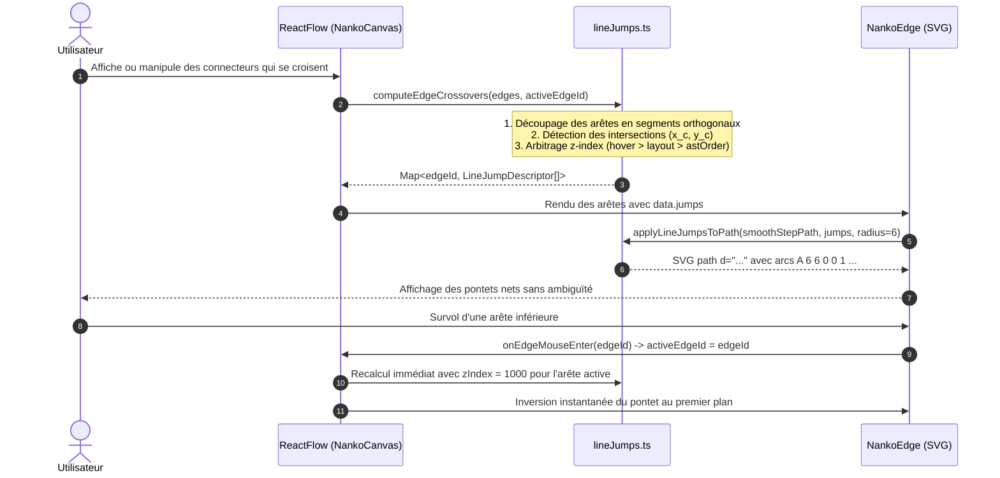

# Spec : 024 - Pontets de Croisement des Connecteurs & Hiérarchie Z-Index

## Métadonnées
* **Statut :** `En cours 🚀`
* **Domaine concerné :** `studio-modeling` ([Architecture Technique](../../knowledge/domains/studio-modeling/tech.md) · [Comportement Produit](../../knowledge/domains/studio-modeling/behavior.md))
* **Type de changement :** `Évolution Visuelle & Ergonomie`
* **Cible :** `frontend` (React Flow, Arêtes NankoEdge, Calculs Géométriques LineJumps, NankoCanvas) + `tests-e2e` (Playwright)
* **Feature parente :** [14-connector-line-jumps](../../initiatives/active/studio-modeling/active/14-connector-line-jumps.md)
* **Complexité :** `Medium`

---

## 1. Intention & Contexte (*The Why*)

* **Problème résolu / Besoin :**
  1. Lorsque deux connecteurs orthogonaux se croisent sur le canvas sans être connectés, l'intersection en angle droit (`┼`) engendre une ambiguïté visuelle forte (« croix à 4 voies ») : l'utilisateur peut percevoir un carrefour ou un embranchement de flux.
  2. Conformément aux normes de schémas électriques et électroniques (**IEC 60617 / IEEE 315**) et aux logiciels de CAO professionnels, le Studio Nanko adopte les **Pontets de Croisement (*Line Jumps*)** : la ligne au premier plan enjambe la ligne inférieure au moyen d'un arc de cercle semi-circulaire régulier ($r = 6\text{px}$).
  3. L'arbitrage de priorité s'appuie sur une hiérarchie de profondeur naturelle (**`z-index`**), évitant les règles arbitraires et permettant une interaction dynamique au survol : survoler un connecteur élève instantanément son z-index, lui permettant d'enjamber tous les flux croisés pour une lisibilité parfaite du parcours.
* **Impact utilisateur :**
  * Clarté immédiate des flux indépendants : suppression de toute confusion de carrefour.
  * Élévation interactive : au survol de la souris sur un connecteur, celui-ci passe au premier plan (`zIndex = 1000`) et enjambe tous les câbles qu'il traverse.
  * Préservation totale du style Blueprint : coins droits (`borderRadius: 0`), contact périmétrique circulaire (`INV-7` Spec 023) et déport du label à 36px.
* **In Scope (Ce qui est ajouté / modifié) :**
  * Module utilitaire géométrique `lineJumps.ts` pour la détection d'intersections orthogonales entre arêtes et l'injection d'arcs SVG réguliers.
  * Adaptation de `NankoEdge.tsx` pour appliquer les arcs de pontets calculés et gérer les événements de survol avec élévation dynamique.
  * Intégration dans `NankoCanvas.tsx` pour le calcul unifié des crossovers et la gestion de l'état d'arête active.
  * Tests unitaires exhaustifs (Vitest) et tests End-to-End (Playwright).
* **Out of Scope (Exclusions strictes) :**
  * Déformation ou pontet sur les connecteurs diagonaux/courbes libres (seul le mode orthogonal SmoothStep est ciblé).
  * Modification du tracé des lignes d'arrière-plan (l'arête inférieure reste une ligne droite continue).

> *Omission Note : Section 4.1 (Backend & Persistance) et Section 4.3 (Infrastructure & Configuration) non applicables (le calcul des pontets est purement visuel et frontend, déduit des arêtes de l'AST et du layout).*

---

## 2. Flux & Architecture



### Wireframe Visuel & Géométrie d'Arc

```text
               PONTET DE CROISEMENT (LINE JUMP SVG)
                       Rayon r = 6px

                             │ (Connecteur inférieur : z-index 1)
                             │ (Ligne continue)
                       ──────╭╮────── (Connecteur supérieur : z-index 2)
                             │        (Arc SVG A 6 6 0 0 1 ...)
                             │

GÉOMÉTRIE D'INSERTION SVG SELON LA DIRECTION :
* Horizontal (gauche -> droite) : L (xc - 6) yc  A 6 6 0 0 1 (xc + 6) yc
* Horizontal (droite -> gauche) : L (xc + 6) yc  A 6 6 0 0 1 (xc - 6) yc
* Vertical (haut -> bas)         : L xc (yc - 6)  A 6 6 0 0 1 xc (yc + 6)
* Vertical (bas -> haut)         : L xc (yc + 6)  A 6 6 0 0 1 xc (yc - 6)
```

---

## 3. Inventaire des Fichiers & Contrats

### 3.1. Arborescence Factorisée
*Chemins relatifs à la racine du workspace.*

```text
frontend/src/features/documents/components/canvas/
├── utils/
│   ├── lineJumps.ts                    [NEW] Détection des croisements et calcul des arcs de saut SVG
│   ├── lineJumps.test.ts               [NEW] Tests unitaires des intersections et injection des arcs
│   └── anchorDistribution.ts           [REF] Référence pour les coordonnées d'ancrage
├── edges/
│   ├── NankoEdge.tsx                   [MOD] Injection des pontets et gestion du survol
│   ├── NankoEdge.test.tsx              [MOD] Tests de rendu des pontets SVG
│   └── NankoEdge.module.css            [MOD] Styles du curseur et de mise en avant
├── NankoCanvas.tsx                     [MOD] Intégration du calcul des crossovers et état activeEdgeId
tests-e2e/tests/app/
└── canvas-connector-drawing.spec.ts    [MOD] Scénario Playwright de vérification des pontets et inversion au survol
```

---

## 4. Spécifications Détaillées par Couche

### 4.2. Couche Présentation & Frontend

* **`lineJumps.ts` :**
  - Contrats TypeScript :
    ```typescript
    export interface Point {
      x: number
      y: number
    }

    export interface OrthogonalSegment {
      start: Point
      end: Point
      orientation: 'horizontal' | 'vertical'
    }

    export interface LineJumpDescriptor {
      x: number
      y: number
      orientation: 'horizontal' | 'vertical'
      direction: 'positive' | 'negative'
    }
    ```
  - `computeEdgeCrossovers(edges, activeEdgeId)` :
    - Décompose chaque arête en segments orthogonaux issus de `getSmoothStepPath({ borderRadius: 0 })`.
    - Pour chaque paire d'arêtes $(E_A, E_B)$, recherche les intersections strictes entre segments horizontaux et verticaux.
    - Exclut les intersections situées à moins de 8px des extrémités d'ancrage (handles).
    - Détermine l'arête gagnante selon `effectiveZIndex` :
      - Si $E$ est `activeEdgeId`, `effectiveZIndex = 1000`.
      - Sinon, `effectiveZIndex` = index de l'arête dans l'AST ou spécifié dans `!LAYOUT`.
    - Associe les points de saut ordonnés le long du tracé à l'arête gagnante.
  - `applyLineJumpsToPath(svgPath, jumps, radius = 6)` :
    - Parse les commandes SVG du chemin (`M`, `L`).
    - Pour chaque segment traversant un ou plusieurs points de saut, insère les arcs `A radius radius 0 0 1 ...`.

* **`NankoEdge.tsx` :**
  - Reçoit `data.jumps: LineJumpDescriptor[]`.
  - Applique `applyLineJumpsToPath` sur le chemin `SmoothStep` avant d'ajouter le segment terminal périmétrique (`INV-7`).
  - Gère `onMouseEnter` et `onMouseLeave` sur le conteneur du path pour notifier le canvas de l'arête active.
  - Le tracé de base conserve `stroke: var(--brand)` et `strokeWidth: 1.5`.

* **`NankoCanvas.tsx` :**
  - État `activeEdgeId: string | null`.
  - Dans `buildEdgesFromAst`, appel de `computeEdgeCrossovers` pour enrichir `edge.data.jumps` et `edge.zIndex`.

---

## 5. Invariants du Système & Règles Métier

* **`INV-1` (Détection géométrique orthogonale stricte) :**
  Seuls les croisements perpendiculaires stricts (segment horizontal coupant un segment vertical) génèrent un pontet. Les segments parallèles, colinéaires ou les connexions partageant un handle sont exclus.
  ↳ *Couvert par : `lineJumps.ts`, `lineJumps.test.ts`.*

* **`INV-2` (Arbitrage par z-index déterministe) :**
  Pour toute intersection entre deux arêtes, c'est exclusivement l'arête ayant le `z-index` effectif le plus élevé qui porte le pontet. L'arête inférieure demeure une ligne droite continue.
  ↳ *Couvert par : `lineJumps.ts`, `NankoEdge.tsx`.*

* **`INV-3` (Tracé géométrique d'arc SVG régulier) :**
  Le pontet est un arc de cercle SVG (`A 6 6 0 0 1 ...`) de rayon nominal $r = 6\text{px}$, centré sur le croisement et orienté selon le sens du flux.
  ↳ *Couvert par : `lineJumps.ts`, `NankoEdge.tsx`, `NankoEdge.test.tsx`.*

* **`INV-4` (Élévation dynamique au survol) :**
  Le survol d'un connecteur par le pointeur élève temporairement son `zIndex` à 1000, lui conférant la priorité immédiate et inversant les pontets pour passer au-dessus de tous les flux traversés.
  ↳ *Couvert par : `NankoCanvas.tsx`, `NankoEdge.tsx`, `canvas-connector-drawing.spec.ts`.*

* **`INV-5` (Non-régression Blueprint & INV-7) :**
  L'application des pontets préserve strictement les angles droits Blueprint (`borderRadius: 0`), le déport de badge de label à 36px, et les segments d'impact périmétrique circulaire (`INV-7`).
  ↳ *Couvert par : `NankoEdge.test.tsx`, `shapeGeometry.test.ts`.*

---

## 6. Risques & Points de Vigilance Techniques

1. **Précision des coordonnées d'intersection :** Les calculs flottants doivent tolérer un epsilon ($\epsilon = 0.5\text{px}$) pour garantir la détection sans faux négatifs.
2. **Multiples croisements proches :** Si deux intersections sur un même segment sont espacées de moins de $2r = 12\text{px}$, les arcs ne doivent pas se chevaucher (espacement minimum garanti).
3. **Fluidité à 60 FPS :** Le calcul des crossovers est optimisé géométriquement sans parcours de canvas DOM, exécuté uniquement lors des modifications d'arêtes ou du survol.
4. **Zéro régression sur les interactions de canvas :** Les événements de survol d'arête n'interfèrent pas avec le drag des nœuds ou le tracé de nouveaux connecteurs.

---

## 7. Migration & Rétrocompatibilité

* 100% rétrocompatible. Aucun impact sur le langage DSL `.nanko`.
* Les schémas existants bénéficient automatiquement des pontets dès lors que deux connecteurs se croisent.

---

## 8. Stratégie de Test & Assurance Qualité

### 8.1. Scénarios BDD / Gherkin

```gherkin
Feature: Pontets de Croisement des Connecteurs & Hiérarchie Z-Index (Spec 024)

  @INV-1 @INV-2 @INV-3
  Scenario: Génération d'un pontet lors du croisement de deux connecteurs
    Given deux nœuds A et B reliés par un connecteur horizontal C1
    And deux nœuds C et D reliés par un connecteur vertical C2 qui croise C1
    And le connecteur C2 a un z-index supérieur à C1
    When le canvas calcule et affiche les arêtes
    Then le connecteur C2 comporte un arc de cercle de saut SVG "A 6 6" au point d'intersection
    And le connecteur C1 conserve un tracé rectiligne continu sans arc

  @INV-4
  Scenario: Inversion dynamique du pontet au survol du connecteur inférieur
    Given le connecteur C1 situé sous le connecteur C2
    When l'utilisateur survole le connecteur C1 avec la souris
    Then le connecteur C1 passe au premier plan avec un z-index élevé
    And le tracé de C1 adopte désormais l'arc de saut au-dessus de C2
    And le tracé de C2 redevient une ligne droite continue

  @INV-5
  Scenario: Préservation des segments de contact périmétrique circulaire avec pontet
    Given un connecteur se dirigeant vers un CircleNode et croisant un autre flux
    When son tracé est rendu avec le pontet
    Then il comporte l'arc de pontet "A 6 6" au croisement
    And il conserve son segment terminal "L" rectiligne vers le contour réel du cercle
```

### 8.2. Commandes de Validation & Quality Gates

```bash
# Frontend Unit & Component Tests
pnpm --filter frontend test

# Frontend Linter & Typecheck
pnpm --filter frontend lint && pnpm --filter frontend typecheck

# Backend Quality Gates
make deptrac && make static-analysis && make lint && make test-backend

# End-to-End Tests complets
pnpm --filter tests-e2e test
```
