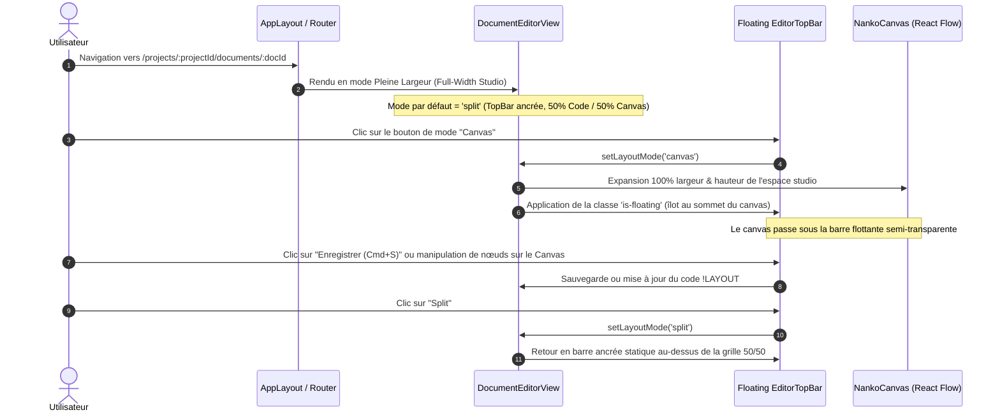

# Change : 016 - Espace de Travail Pleine Largeur et Barre de Commandes Flottante sur le Canvas

## Métadonnées
* **Domaine concerné :** `.specs/current/domains/workspace-management/`
* **Type de changement :** `Évolution`
* **Cible :** `frontend` (avec validation d'intégration `tests-e2e/`)

---

## 1. Intention & Contexte (Le « Why » du Delta)
* **Problème résolu / Besoin :**
  Actuellement, la vue d'édition de document (`DocumentEditorView`) est encapsulée dans le conteneur standard de l'application (`.app-main`), contraint à une largeur maximale de `1200px` avec des marges latérales importantes et un espacement vertical statique. Dans un outil de modélisation d'architecture (*diagrams-as-code*), cette disposition en boîte étriquée bride la lisibilité des graphes React Flow et encombre l'espace visuel. De plus, la barre d'en-tête de l'éditeur (`editor-topbar`) occupe une place fixe et repousse le canvas vers le bas, empêchant une immersion visuelle complète.
* **Impact utilisateur :**
  * L'espace de travail de l'éditeur passe en **pleine largeur (*edge-to-edge*)** : l'écran est maximisé entre la Navbar et le Footer sans contrainte artificielle de 1200px, offrant une surface de conception optimale.
  * En mode **Canvas**, la barre de commandes et d'outils devient une **barre flottante élégante (*island toolbar*)** positionnée au sommet du canevas avec effet de verre/flou technique (`backdrop-filter`), laissant le canvas s'étendre en arrière-plan sur 100% de la surface.
  * En modes **Split** et **Code**, la barre d'outils conserve un comportement classique ancré au-dessus des panneaux pour préserver l'alignement naturel avec les éditeurs de texte.
  * La Navbar générale et le Footer restent visibles et cohérents avec l'architecture globale de l'application.
* **In Scope (Ce qui est ajouté/modifié) :**
  * **Layout plein écran pour le studio (`frontend/src/`)** :
    * Adaptation de la structure de mise en page (`AppLayout.tsx` et `App.css`) pour permettre à l'éditeur de s'affranchir de la contrainte `max-width: 1200px` et d'exploiter 100% de la largeur du viewport.
    * Hauteur calculée précisément entre la Navbar (`var(--navbar-height, 60px)`) et le Footer pour éliminer tout ascenseur de défilement vertical parasite de la page globale.
  * **Barre d'outils flottante en mode Canvas (`DocumentEditorView.tsx` & `App.css`)** :
    * Transformation conditionnelle de `editor-topbar` en îlot flottant au sommet du canvas lorsque le mode `canvas` est actif (`.editor-topbar.is-floating`).
    * Style visuel Blueprint Nanko : fond sombre translucide / blanc translucide (`backdrop-filter: blur(12px)`), bordure fine contrastée, ombrage flottant technique, centrage supérieur et élévation `z-index: 10`.
    * Préservation intégrale de toutes les interactions : navigation retour `← Projets`, métadonnées du document (`nom`, `slug`, badge `Layer`), sélecteur `[ Split | Canvas | Code ]`, indicateur de sauvegarde et bouton `Enregistrer (Cmd+S)`.
  * **Tests E2E Playwright (`tests-e2e/`)** :
    * Enrichissement du scénario de test pour vérifier la pleine largeur du canvas et la position flottante de la barre de commandes en mode Canvas.
* **Out of Scope (Exclusions strictes) :**
  * Aucune modification des contrats d'API backend ni du schéma de base de données PostgreSQL.
  * Le Dashboard principal (`/`) conserve sa largeur centrée de 1200px avec ses cartes de projets et documents.
  * Pas de masquage de la Navbar supérieure ni du Footer applicatif.

---

## 2. Flux & Architecture (Diff)



---

## 3. Delta Modèle de données & Base de données

* **Aucune modification de base de données :**
  L'évolution concerne exclusivement l'ergonomie, la disposition CSS et le rendu des composants frontend. Le schéma `document`, les agrégats Doctrine et les migrations existantes restent inchangés.

---

## 4. Delta Contrats d'API (Symfony)

* **Aucune modification d'API REST :**
  Les endpoints existants (`GET /api/v1/documents/{id}`, `PUT /api/v1/documents/{id}`) restent rigoureusement identiques.

---

## 5. Configuration Réseau, Prérequis DNS, Variables d'Environnement & CI/CD

* **Réseau & DNS :** Aucun impact réseau ou DNS.
* **Variables d'Environnement :** Aucune variable supplémentaire.
* **CI/CD :** Les suites de tests existantes (`make static-analysis`, `make lint`, `make test-backend`, `make test-e2e`) s'appliquent sans modification de configuration.

---

## 6. Maquettes & Expérience Visuelle

### 6.1. Wireframe Mode Canvas (Plein Écran & Barre Flottante)

```text
+------------------------------------------------------------------------------------------------------------------------------------+
|  [NANKO Logo]   Architecture de code   Projet: Mon premier projet                         [☀️ 💻 🌙]  user@nanko.dev  [Déconnexion] |
+------------------------------------------------------------------------------------------------------------------------------------+
|                                                                                                                                    |
|                  +---------------------------------------------------------------------------------------------+                   |
|                  | [← Projets]  Archi de départ [Layer: 0]  |  [ Split ] [ CANVAS ] [ Code ]  |  • Enregistré ✓  [Enregistrer] |   |
|                  +---------------------------------------------------------------------------------------------+                   |
|                                                                                                                                    |
|                                                                                                                                    |
|                                +--------------------------+                                                                        |
|                                | rectangle front          |                                                                        |
|                                | Frontend Web             |                                                                        |
|                                +-------------+------------+                                                                        |
|                                              |                                                                                     |
|                                              | "requêtes SQL"                                                                      |
|                                              v                                                                                     |
|                                     (( circle db ))                                                                                |
|                                     (( PostgreSQL ))                                                                               |
|                                                                                                                                    |
|                                                                                                                                    |
|  +--------------------------------+                                                                                                |
|  | [⟳ Réorganiser] | + | − | ⛶ | Map |                                                                                               |
|  +--------------------------------+                                                                                                |
|                                                                                                                                    |
+------------------------------------------------------------------------------------------------------------------------------------+
| © 2026 NANKO - Architecture de code                                                                         Documentation & Vision |
+------------------------------------------------------------------------------------------------------------------------------------+
```

### 6.2. Wireframe Mode Split (Pleine Largeur & Barre Ancrée)

```text
+------------------------------------------------------------------------------------------------------------------------------------+
|  [NANKO Logo]   Architecture de code   Projet: Mon premier projet                         [☀️ 💻 🌙]  user@nanko.dev  [Déconnexion] |
+------------------------------------------------------------------------------------------------------------------------------------+
| [← Projets]  Archi de départ [Layer: 0]  |  [ SPLIT ] [ Canvas ] [ Code ]  |  • Enregistré ✓  [Enregistrer (Cmd+S)]                |
+------------------------------------------------------------------------------------------------------------------------------------+
| 1 | @id archi-de-depart                            |                                                                               |
| 2 | @layer 0                                       |                           +-----------------------+                           |
| 3 |                                                |                           | rectangle front       |                           |
| 4 | rectangle front "Frontend Web"                 |                           +-----------+-----------+                           |
| 5 | circle db "PostgreSQL DB"                      |                                       | "requêtes SQL"                        |
| 6 |                                                |                                       v                                       |
| 7 | front -> db "requêtes SQL"                     |                                (( circle db ))                                |
| 8 |                                                |                                                                               |
|   | [Éditeur de code source Monaco/Textarea]       | [⟳ Réorganiser] [Zoom]                 [Canvas React Flow 50%]                |
+----------------------------------------------------+-------------------------------------------------------------------------------+
| © 2026 NANKO - Architecture de code                                                                         Documentation & Vision |
+------------------------------------------------------------------------------------------------------------------------------------+
```

### 6.3. Tokens Visuels de la Barre Flottante (Palette Nanko Blueprint)

* **Mode Sombre (Dark Mode) :**
  * Fond de la barre flottante : `color-mix(in srgb, var(--surface) 85%, transparent)` avec `backdrop-filter: blur(12px)`.
  * Bordure : `1px solid var(--border-strong)` (`#1C4750`).
  * Ombre portée : `0 8px 32px rgba(0, 0, 0, 0.45)`.
  * Alignement : Centrée horizontalement à `top: 14px; left: 50%; transform: translateX(-50%); width: auto; max-width: calc(100% - 32px);`.
  * Coins : Angles nets rigoureusement droits (`border-radius: 0;`), conformes au style d'ingénierie blueprint.
* **Mode Clair (Light Mode) :**
  * Fond de la barre flottante : `color-mix(in srgb, #FFFFFF 90%, transparent)` avec `backdrop-filter: blur(12px)`.
  * Bordure : `1px solid var(--border-strong)` (`#CBD5E1`).
  * Ombre portée : `0 8px 24px rgba(0, 0, 0, 0.08)`.

---

## 7. Schéma Zod & Composants UI

### 7.1. Composants Frontend Modifiés

1. **[AppLayout.tsx](../../../frontend/src/components/layout/AppLayout.tsx)** :
   * Détection de la vue active : si la route correspond à `/projects/:projectId/documents/:documentId`, la classe `.app-main-fullscreen` est appliquée sur l'élément `<main>`, désactivant la contrainte `max-width: 1200px` et les marges restrictives.
2. **[DocumentEditorView.tsx](../../../frontend/src/views/DocumentEditorView.tsx)** :
   * En mode `canvas` :
     * Le conteneur englobant passe en `position: relative; width: 100%; height: 100%;`.
     * La barre `editor-topbar` reçoit la classe `.is-floating`.
     * Le canvas `NankoCanvas` occupe 100% de la surface sous la barre flottante.
   * En mode `split` et `code` :
     * La barre `editor-topbar` reste dans le flux normal statique `.is-static`.
3. **[App.css](../../../frontend/src/App.css)** :
   * Définition de `.app-main-fullscreen` : `max-width: 100%; padding: 0.75rem 1rem; width: 100%; height: calc(100vh - var(--navbar-height, 60px) - 45px); overflow: hidden;`.
   * Règles CSS pour `.editor-topbar.is-floating` : position absolue, centrage supérieur, élévation `z-index: 20`, fond `backdrop-filter: blur(12px)`, padding compact.
   * Ajustement de `.editor-workspace-canvas-only` pour couvrir toute la hauteur disponible sans barres de défilement externes.

---

## 8. Invariants & Cas Limites

* **Invariant 1 : Zéro scroll de page externe dans l'éditeur**
  L'écran d'édition ne doit pas produire d'ascenseur de défilement au niveau du document `body`. Tout le défilement et la navigation spatiale se font à l'intérieur du canvas (pan/zoom) ou du panneau de code source.
* **Invariant 2 : Intégrité du Dashboard**
  La vue `/` (Dashboard des projets et des documents) conserve sa mise en page centrée `max-width: 1200px` avec son padding aéré habituel.
* **Cas limite : Écrans étroits / Petites résolutions**
  Si la largeur de la fenêtre est inférieure à 900px, la barre flottante s'adapte avec `flex-wrap: wrap` ou compacte ses libellés sans déborder hors de l'écran (`max-width: calc(100% - 24px)`).
* **Cas limite : Collision visuelle des contrôles**
  La barre flottante supérieure est positionnée en haut au centre (`top: 14px`), tandis que les contrôles de zoom et minimap de React Flow sont ancrés en bas à gauche (`Panel position="bottom-left"`) et en bas à droite (`MiniMap`), évitant toute superposition.

---

## 9. Plan d'exécution séquentiel (Phasé avec DoD)

- [x] **Phase 1 : Layout Studio Pleine Largeur (`AppLayout.tsx` & `App.css`)**
  - [x] 1. Identifier les routes d'édition de document et appliquer la variante pleine largeur sur le conteneur principal `<main className="app-main app-main-fullscreen">`.
  - [x] 2. Ajuster les hauteurs calculées pour supprimer tout scroll de la page parente.
  - [x] **DoD Phase 1 :** L'éditeur de document s'étend sur toute la largeur de l'écran sans impacter le Dashboard.

- [x] **Phase 2 : Barre d'Outils Flottante sur le Canvas (`DocumentEditorView.tsx` & `App.css`)**
  - [x] 1. Rendre la barre `editor-topbar` conditionnellement flottante (`.is-floating`) lorsque `layoutMode === 'canvas'`.
  - [x] 2. Implémenter le style Blueprint avec fond translucide `backdrop-filter: blur(12px)`, bordure technique et ombre portée.
  - [x] 3. Veiller à ce que le canvas `NankoCanvas` occupe l'intégralité du fond sans décalage ni coupure.
  - [x] 4. Conserver la barre ancrée statique en modes `Split` et `Code`.
  - [x] **DoD Phase 2 :** En mode Canvas, la barre flotte élégamment sur le graphe ; en mode Split/Code, elle reste ancrée.

- [x] **Phase 3 : Validation E2E & Quality Gates (`tests-e2e/`)**
  - [x] 1. Mettre à jour `tests-e2e/tests/app/canvas-visualization.spec.ts` pour valider la présence de la barre flottante en mode Canvas.
  - [x] 2. Exécuter les quality gates : `make static-analysis`, `make lint`, `make test-backend`, `make deptrac`, `make test-e2e`.
  - [x] **DoD Phase 3 :** 100% des tests et quality gates au vert.

---

## 10. Definition of Done & Stratégie de tests

### 10.1. Scénarios de validation (Gherkin)

```gherkin
@e2e @frontend
Fonctionnalité: Espace de Travail Pleine Largeur et Barre de Commandes Flottante sur le Canvas

  Scénario: Affichage plein écran immersif de l'éditeur de document
    Étant donné un utilisateur connecté ouvrant un document d'architecture
    Quand la vue de l'éditeur s'affiche
    Alors le conteneur principal occupe 100% de la largeur du viewport sans limite à 1200px
    Et la barre de navigation supérieure et le footer restent visibles

  Scénario: Barre flottante en mode Canvas plein écran
    Étant donné l'éditeur de document ouvert
    Quand l'utilisateur clique sur le mode "Canvas"
    Alors la barre de commandes devient un îlot flottant au centre supérieur du canvas
    Et le canvas React Flow s'étend en arrière-plan sous la barre
    Et les actions de sauvegarde, changement de mode et zoom restent pleinement fonctionnelles

  Scénario: Barre ancrée statique en modes Split et Code
    Étant donné l'éditeur de document affiché en mode Canvas avec barre flottante
    Quand l'utilisateur clique sur le mode "Split"
    Alors la barre de commandes revient dans le flux statique au-dessus des panneaux 50/50
    Quand l'utilisateur clique sur le mode "Code"
    Alors la barre de commandes reste dans le flux statique au-dessus de l'éditeur de code et de l'inspecteur
```

### 10.2. Commandes de validation automatisée

```bash
# 1. Frontend
pnpm --filter frontend typecheck
pnpm --filter frontend lint
pnpm --filter frontend test

# 2. End-to-End
pnpm --filter tests-e2e test
```
