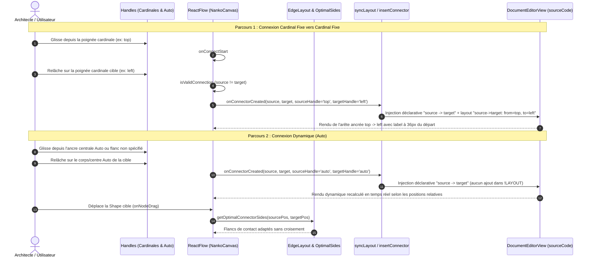

# Spec : 022 - Poignées Omnidirectionnelles & Ancrage Dynamique Intelligent

## Métadonnées
* **Statut :** `Livré & Archivé ✅`
* **Domaine concerné :** `studio-modeling` ([Architecture Technique](../../knowledge/domains/studio-modeling/tech.md) · [Comportement Produit](../../knowledge/domains/studio-modeling/behavior.md))
* **Type de changement :** `Évolution`
* **Cible :** `frontend` (React Flow, Handles, Nœuds, Edges, Sérialiseurs) + `backend` (Parser DSL) + `tests-e2e` (Playwright)
* **Feature parente :** [08-omnidirectional-and-smart-anchor-connectors](../../initiatives/active/studio-modeling/archive/08-omnidirectional-and-smart-anchor-connectors.md)
* **Complexité :** `Medium`

---

## 1. Intention & Contexte (*The Why*)

* **Problème résolu / Besoin :**
  Actuellement, les connecteurs sur le Canvas Nanko sont contraints par des poignées rigides asymétriques (`left` et `top` strictement récepteurs / `target`, `right` et `bottom` strictement émetteurs / `source`), bloquant tout tracé ascendant ou arbitraire. De plus, les arêtes ne disposent pas d'ancrage dynamique (`auto`), imposant des croisements inélégants lors du déplacement des formes, et le badge de libellé est figé au milieu (`50%`), manquant de clarté pour qualifier immédiatement le flux sortant.
* **Impact utilisateur :**
  * Les 4 poignées cardinales (`top`, `bottom`, `left`, `right`) de toute Shape (`RectangleNode`, `CircleNode`, `TextNode`) deviennent 100% omnidirectionnelles : chacune peut indifféremment initier un flux sortant ou accueillir un flux entrant.
  * Une ancre centrale discrète `auto` est ajoutée au cœur de chaque Shape : se connecter à celle-ci permet au connecteur d'adapter dynamiquement ses faces de contact en temps réel au fil des déplacements (`onNodeDrag`).
  * Persistance sélective dans `!LAYOUT` : les connexions en mode `auto` ne polluent pas le bloc `!LAYOUT` ; seules les arêtes comportant au moins une ancre cardinale fixe sont persistées sous la syntaxe déterministe `source->target: from=[side], to=[side]`.
  * Le libellé du connecteur (`label`) est positionné par défaut à 36px le long du tracé depuis la poignée source, qualifiant instantanément le flux sortant.
  * Les auto-connexions (`source === target`) demeurent strictement neutralisées.
* **In Scope (Ce qui est ajouté / modifié) :**
  * Remplacement des contraintes asymétriques des handles dans `RectangleNode.tsx`, `CircleNode.tsx` et `TextNode.tsx` par 4 poignées omnidirectionnelles (`isConnectableStart={true}`, `isConnectableEnd={true}`).
  * Ajout d'une poignée centrale `auto` sur les 3 types de nœuds, révélée au survol/sélection.
  * Support du calcul dynamique de face optimale (`getOptimalConnectorSides`) lorsque l'une ou les deux extrémités d'une arête sont en mode `auto`.
  * Extension du parseur `nankoParser.ts`, du schéma `schemas.ts` et du parseur backend `NankoParser.php` pour lire et sérialiser les entrées d'arêtes dans `!LAYOUT` (`source->target: from=..., to=...`).
  * Mise à jour de `insertConnectorToSource.ts` et `syncLayoutToSource.ts` pour enregistrer les ancres fixes sélectionnées.
  * Calcul de position du badge de libellé à 36px de la poignée source dans `NankoEdge.tsx`.
  * Tests unitaires Vitest, tests PHP backend et tests E2E Playwright.
* **Out of Scope (Exclusions strictes) :**
  * Distribution spatiale multi-connecteurs espacée sur un même flanc (déléguée à la feature 09).
  * Redimensionnement automatique $\times 2$ des Shapes en cas de saturation de capacité de flux (délégué à la feature 09).
  * Repositionnement manuel par glisser du badge de label (délégué à la feature 10).
  * Routage orthogonal de contournement d'obstacles (les arêtes utilisent les courbes de Bézier / Step React Flow).

> *Omission Note : Section 4.3 (Infrastructure & Configuration) non applicable (évolutions purement applicatives frontend/backend sans modification d'infrastructure ni de variable d'environnement).*

---

## 2. Flux & Architecture



---

## 3. Inventaire des Fichiers & Contrats

### 3.1. Arborescence Factorisée
*Chemins relatifs à la racine du workspace.*

```text
backend/
├── src/
│   └── WorkspaceManagement/
│       └── Core/
│           └── Domain/
│               └── Document/
│                   └── Parser/
│                       └── NankoParser.php                     [MOD] Prise en charge des entrées d'arêtes dans !LAYOUT
└── tests/
    └── Unit/
        └── WorkspaceManagement/
            └── Core/
                └── Domain/
                    └── Document/
                        └── NankoParserTest.php                 [MOD] Couverture de parsing !LAYOUT avec connecteurs
frontend/
├── src/
│   └── features/
│       └── documents/
│           ├── schemas.ts                                      [MOD] Extension de nankoAstSchema (edgeLayout)
│           └── components/
│               └── canvas/
│                   ├── NankoCanvas.tsx                         [MOD] Câblage handles, calcul dynamique auto, gestion onConnect
│                   ├── NankoCanvas.module.css                  [MOD] Style de l'ancre centrale auto (.nanko-handle-auto)
│                   ├── nodes/
│                   │   ├── RectangleNode.tsx                   [MOD] 4 poignées omnidirectionnelles + ancre auto centrale
│                   │   ├── RectangleNode.module.css            [MOD] Positionnement poignée auto centrale
│                   │   ├── CircleNode.tsx                      [MOD] 4 poignées omnidirectionnelles + ancre auto centrale
│                   │   ├── CircleNode.module.css               [MOD] Positionnement poignée auto centrale
│                   │   ├── TextNode.tsx                        [MOD] 4 poignées omnidirectionnelles + ancre auto centrale
│                   │   └── TextNode.module.css                 [MOD] Positionnement poignée auto centrale
│                   ├── edges/
│                   │   ├── NankoEdge.tsx                       [MOD] Décalage déterministe du label à 36px de la source
│                   │   └── NankoEdge.test.tsx                  [MOD] Test du positionnement du label à 36px
│                   └── utils/
│                       ├── connectorGeometry.ts                [NEW] Calcul géométrique pur des faces de contact optimales
│                       ├── connectorGeometry.test.ts           [NEW] Tests unitaires des faces optimales (auto)
│                       ├── nankoParser.ts                      [MOD] Parsing des arêtes dans !LAYOUT
│                       ├── nankoParser.test.ts                 [MOD] Tests de parsing des ancres de connecteurs dans !LAYOUT
│                       ├── insertConnectorToSource.ts          [MOD] Injection avec ancres optionnelles dans !LAYOUT
│                       ├── insertConnectorToSource.test.ts     [MOD] Tests d'insertion avec et sans ancres
│                       ├── syncLayoutToSource.ts               [MOD] Sérialisation des ancres d'arêtes dans !LAYOUT
│                       └── syncLayoutToSource.test.ts          [MOD] Tests de mise à jour/suppression des ancres d'arêtes
tests-e2e/
└── tests/
    └── app/
        └── canvas-connector-drawing.spec.ts                    [MOD] Scénarios E2E omnidirectionnels et ancrage dynamique auto
```

### 3.2. Contrats Clés & Signatures

```typescript
// frontend/src/features/documents/schemas.ts
export type CardinalAnchorSide = 'top' | 'bottom' | 'left' | 'right'
export type AnchorSide = CardinalAnchorSide | 'auto'

export const edgeAnchorLayoutSchema = z.object({
  from: z.enum(['top', 'bottom', 'left', 'right', 'auto']).optional(),
  to: z.enum(['top', 'bottom', 'left', 'right', 'auto']).optional(),
})

export const nankoAstSchema = z.object({
  dslVersion: z.number().int().default(1),
  shapes: z.array(nankoAstShapeSchema).default([]),
  connectors: z.array(nankoAstConnectorSchema).default([]),
  layout: z.union([nankoAstLayoutSchema, z.array(z.any()).transform(() => ({}))]).optional().default({}),
  edgeLayout: z.record(z.string(), edgeAnchorLayoutSchema).optional().default({}),
})

// frontend/src/features/documents/components/canvas/utils/connectorGeometry.ts
export interface NodeBounds {
  x: number
  y: number
  width: number
  height: number
}

/**
 * Détermine les faces de contact optimales (Position.Top, Right, Bottom, Left)
 * entre deux formes lorsque l'une ou les deux utilisent l'ancre 'auto'.
 */
export function getOptimalConnectorSides(
  sourceBounds: NodeBounds,
  targetBounds: NodeBounds,
  sourceAnchor?: AnchorSide,
  targetAnchor?: AnchorSide,
): { sourceSide: CardinalAnchorSide; targetSide: CardinalAnchorSide }

// frontend/src/features/documents/components/canvas/utils/insertConnectorToSource.ts
export interface InsertConnectorOptions {
  from?: AnchorSide | null
  to?: AnchorSide | null
}

export function insertConnectorToSource(
  sourceCode: string,
  source: string,
  target: string,
  options?: InsertConnectorOptions,
): InsertConnectorResult
```

---

## 4. Spécifications Détaillées

### 4.1. Modèle de Données & Contrats DSL

#### Grammaire du bloc `!LAYOUT` étendu
Le bloc `!LAYOUT ... !END` accepte deux types d'entrées déterministes :
1. Coordonnées spatiales des nœuds :
   `nodeId: x=100, y=200`
2. Ancrage spatial d'une arête :
   `source->target: from=[side], to=[side]`
   Où `[side]` vaut `top`, `bottom`, `left`, ou `right`. Si un côté est `auto`, il peut être omis (ex: `source->target: from=top` ou `source->target: to=left`). Si les deux côtés sont `auto`, l'arête n'a AUCUNE entrée dans `!LAYOUT`.

#### Backend PHP (`NankoParser.php`)
Le parseur backend prend en compte les lignes de connecteur dans `$inLayout` sans lever d'erreur de syntaxe, et les expose dans la structure AST dénormalisée `edgeLayout` :
```php
if (preg_match('/^([a-zA-Z0-9_-]+)->([a-zA-Z0-9_-]+)\s*:\s*(.*)$/', $line, $matches)) {
    $edgeKey = $matches[1] . '->' . $matches[2];
    $edgeLayout[$edgeKey] = $this->parseEdgeLayoutAttributes($matches[3]);
}
```

### 4.2. Spécifications UI & Interactions

```text
SURVOL OU SÉLECTION D'UNE FORME (RECTANGLE, CIRCLE, TEXT)
                       [Top : In/Out]
                            ○
                   +-----------------+
  [Left : In/Out]  |                 |  [Right : In/Out]
        ○          |    ◎ [Auto]     |        ○
                   |                 |
                   +-----------------+
                            ○
                      [Bottom : In/Out]

POSITIONNEMENT DU LABEL DE CONNECTEUR (INV-6)
         +----------+
         |  Source  |──────○───[ 36px ]───[ Label ]─────────────>○  Target
         +----------+    sourceHandle
```

#### Matrice d'Interaction des Poignées
| Clic / Glisser depuis | Cible du Relâchement | Résultat Visuel | Persistance dans `!LAYOUT` |
|---|---|---|---|
| Poignée cardinale (`top`) | Poignée cardinale (`right`) | Arête fixée déterministement sur les flancs choisis | `source->target: from=top, to=right` |
| Poignée cardinale (`top`) | Ancre centrale `auto` (ou corps de Shape) | Flanc source fixé (`top`), flanc cible s'adaptant dynamiquement à la position | `source->target: from=top` |
| Ancre centrale `auto` | Poignée cardinale (`bottom`) | Flanc source dynamique vers la cible, flanc cible fixé (`bottom`) | `source->target: to=bottom` |
| Ancre centrale `auto` | Ancre centrale `auto` | Les deux flancs s'adaptent dynamiquement en permanence | Aucune entrée dans `!LAYOUT` |
| N'importe quelle poignée | Même forme (`source === target`) | Rejet immédiat (`isValidConnection: false`), fil annulé | Aucun changement |

#### Positionnement du Label à 36px (`INV-6`)
Dans `NankoEdge.tsx`, au lieu d'utiliser `labelX, labelY` renvoyés à 50% par `getSmoothStepPath`, les coordonnées du badge sont calculées le long du premier segment émanant de la poignée source :
* Si `sourcePosition === Position.Right` : `(labelX, labelY) = (sourceX + 36, sourceY)`
* Si `sourcePosition === Position.Left` : `(labelX, labelY) = (sourceX - 36, sourceY)`
* Si `sourcePosition === Position.Bottom` : `(labelX, labelY) = (sourceX, sourceY + 36)`
* Si `sourcePosition === Position.Top` : `(labelX, labelY) = (sourceX, sourceY - 36)`
* Si la distance totale séparant la source et la cible est inférieure à 72px, le label est centré au milieu du tracé pour éviter tout chevauchement avec la cible.

---

## 5. Invariants Métier & Traçabilité des Tests

* **INV-1 · Omnidirectionnalité totale des poignées**  
  Les 4 poignées cardinales (`top`, `bottom`, `left`, `right`) permettent indifféremment d'initier un tracé sortant ou d'accueillir un tracé entrant sur tout type de nœud.  
  ↳ *Covered by:* [`RectangleNode.tsx`](#appendix-file-index), [`CircleNode.tsx`](#appendix-file-index), [`TextNode.tsx`](#appendix-file-index), [`canvas-connector-drawing.spec.ts`](#appendix-file-index)

* **INV-2 · Double mode d'ancrage Fixe vs Auto**  
  Une connexion cardinale reste verrouillée sur sa face d'origine ; une connexion `auto` recalcule sa face optimale en temps réel lors du déplacement de nœuds.  
  ↳ *Covered by:* [`connectorGeometry.ts`](#appendix-file-index), [`connectorGeometry.test.ts`](#appendix-file-index), [`NankoCanvas.tsx`](#appendix-file-index)

* **INV-3 · Persistance sélective dans `!LAYOUT`**  
  Seules les arêtes comportant au moins une ancre cardinale fixe sont persistées dans le bloc `!LAYOUT` sous la syntaxe `source->target: from=..., to=...`. Le mode `auto` pur ne génère aucune surcharge.  
  ↳ *Covered by:* [`insertConnectorToSource.ts`](#appendix-file-index), [`syncLayoutToSource.ts`](#appendix-file-index), [`nankoParser.ts`](#appendix-file-index), [`NankoParser.php`](#appendix-file-index)

* **INV-4 · Rejet absolu des auto-connexions**  
  Relâcher un connecteur sur la même forme (`source === target`), même entre des poignées distinctes ou l'ancre `auto`, est formellement rejeté sans altérer le document.  
  ↳ *Covered by:* [`isValidConnection.ts`](#appendix-file-index), [`NankoCanvas.test.tsx`](#appendix-file-index), [`canvas-connector-drawing.spec.ts`](#appendix-file-index)

* **INV-5 · Parité géométrique des formes**  
  Les 3 formes de base (`rectangle`, `circle`, `text`) implémentent identiquement les 4 poignées cardinales et l'ancre centrale `auto`.  
  ↳ *Covered by:* [`RectangleNode.tsx`](#appendix-file-index), [`CircleNode.tsx`](#appendix-file-index), [`TextNode.tsx`](#appendix-file-index)

* **INV-6 · Positionnement déterministe du label à 36px de la source**  
  Le badge de libellé du connecteur est positionné par défaut à 36px du point de départ le long de la ligne, qualifiant sans ambiguïté le flux sortant.  
  ↳ *Covered by:* [`NankoEdge.tsx`](#appendix-file-index), [`NankoEdge.test.tsx`](#appendix-file-index)

---

## 6. Pièges Techniques & Anti-Patterns

* **Conflit de Handle ID dans React Flow :** Si deux `<Handle />` partagent le même ID sans distinction de type, React Flow peut se tromper lors de la résolution des coordonnées. Utiliser des IDs uniques (`top`, `bottom`, `left`, `right`, `auto`) et configurer `isConnectableStart={true}` et `isConnectableEnd={true}` avec `ConnectionMode.Loose`.
* **Disparition de l'ancre `auto` au centre d'un nœud :** L'ancre centrale doit avoir une taille cliquable décente (ex: 18x18px) tout en restant visuellement discrète (motif concentric circle `◎`) pour permettre à l'utilisateur de viser facilement le centre de la Shape.
* **Pollution inutile du bloc `!LAYOUT` :** Ne jamais écrire `source->target: from=auto, to=auto` dans le code `.nanko`. Le code source doit rester concis et élégant.
* **Divergence de parsing Backend / Frontend :** Le backend Symfony et le frontend TypeScript doivent tous deux parser et tolérer les lignes d'arêtes dans `!LAYOUT` sans rejeter les documents valides.
* **Superposition de label en cas de nœuds collés :** Si la distance source-cible est inférieure à 72px, borner la position du label au milieu géométrique (50%) pour éviter qu'il n'entre en collision avec la forme cible.

---

## 7. Plan d'Exécution Séquentiel

- [ ] **Phase 1 : Contrats, Parsers & Géométrie Pure**
  - [ ] Implémenter `connectorGeometry.ts` et sa suite de tests [`connectorGeometry.test.ts`](#appendix-file-index).
  - [ ] Étendre le schéma Zod [`schemas.ts`](#appendix-file-index) pour intégrer `edgeLayout`.
  - [ ] Mettre à jour [`nankoParser.ts`](#appendix-file-index) et [`nankoParser.test.ts`](#appendix-file-index) pour supporter les lignes `source->target: from=..., to=...`.
  - [ ] Mettre à jour [`NankoParser.php`](#appendix-file-index) et [`NankoParserTest.php`](#appendix-file-index) côté backend.
  - [ ] Étendre [`insertConnectorToSource.ts`](#appendix-file-index) et [`syncLayoutToSource.ts`](#appendix-file-index) avec leurs tests unitaires.

- [ ] **Phase 2 : Composants Nœuds, Handles & Edge Label**
  - [ ] Modifier [`RectangleNode.tsx`](#appendix-file-index), [`CircleNode.tsx`](#appendix-file-index) et [`TextNode.tsx`](#appendix-file-index) pour ajouter les poignées omnidirectionnelles et l'ancre centrale `auto`.
  - [ ] Styliser l'ancre centrale et les 4 faces dans les fichiers CSS modules associés.
  - [ ] Mettre à jour [`NankoEdge.tsx`](#appendix-file-index) pour positionner le label à 36px de la source avec test dans [`NankoEdge.test.tsx`](#appendix-file-index).

- [ ] **Phase 3 : Intégration Canvas, Recalcul Dynamique & E2E**
  - [ ] Adapter [`NankoCanvas.tsx`](#appendix-file-index) pour calculer dynamiquement les faces de contact des arêtes `auto` lors du rendu et lors de `onNodeDrag`.
  - [ ] Mettre à jour [`NankoCanvas.test.tsx`](#appendix-file-index).
  - [ ] Enrichir les tests E2E Playwright dans [`canvas-connector-drawing.spec.ts`](#appendix-file-index).
  - [ ] Valider 100% des quality gates (Vitest, PHPUnit, Deptrac, ESLint, Typecheck, Playwright).

---

## 8. Validation BDD & Quality Gates

### 8.1. Scénarios Gherkin Exhaustifs

```gherkin
Feature: Poignées Omnidirectionnelles et Ancrage Dynamique Intelligent

  # ============================================================================
  # 1. Tests Unitaires (@unit)
  # ============================================================================

  @unit
  Scenario: [INV-1] Les poignées cardinales sont omnidirectionnelles
    Given un nœud RectangleNode instancié
    When on inspecte ses 4 poignées "top", "bottom", "left", "right"
    Then chaque poignée autorise à la fois le départ (isConnectableStart) et l'arrivée (isConnectableEnd)

  @unit
  Scenario: [INV-2] Calcul optimal des faces en mode auto
    Given une forme source en (0, 0, 100, 60) et une forme cible en (200, 0, 100, 60)
    When getOptimalConnectorSides est appelée avec sourceAnchor="auto" et targetAnchor="auto"
    Then sourceSide est "right" et targetSide est "left"

  @unit
  Scenario: [INV-3] Persistance sélective dans !LAYOUT
    Given un code source sans arête dans !LAYOUT
    When insertConnectorToSource est appelée avec source="a", target="b", from="top", to="left"
    Then le bloc !LAYOUT contient la ligne "a->b: from=top, to=left"
    When insertConnectorToSource est appelée avec from="auto", to="auto"
    Then le bloc !LAYOUT ne contient aucune ligne pour ce connecteur

  @unit
  Scenario: [INV-4] Rejet des auto-connexions
    Given une connexion où source="app" et target="app"
    When isValidNankoConnection est évaluée
    Then elle retourne false quelle que soit la poignée source ou cible

  @unit
  Scenario: [INV-5] Parité géométrique des formes
    Given les composants RectangleNode, CircleNode et TextNode
    When on dénombre leurs éléments Handle
    Then chaque forme dispose exactement de 4 poignées cardinales et 1 poignée centrale auto

  @unit
  Scenario: [INV-6] Positionnement déterministe du label à 36px
    Given une arête reliant (0, 100) vers (300, 100) avec sourcePosition="right"
    When les coordonnées du label sont calculées dans NankoEdge
    Then labelX vaut exactement sourceX + 36 et labelY vaut sourceY

  # ============================================================================
  # 2. Tests d'Intégration & Composants (@component)
  # ============================================================================

  @component
  Scenario: [INV-2] Adaptation dynamique de l'arête auto au drag de nœud
    Given un canvas NankoCanvas avec deux formes reliées en mode auto
    When la forme cible est déplacée au-dessus de la forme source
    Then l'arête s'oriente automatiquement de top vers bottom

  # ============================================================================
  # 3. Tests End-to-End (@e2e)
  # ============================================================================

  @e2e
  Scenario: Tracé ascendant depuis la poignée top vers la poignée bottom
    Given l'application Nanko ouverte sur un document avec deux formes superposées
    When l'utilisateur glisse depuis la poignée top de la forme inférieure vers la poignée bottom de la forme supérieure
    Then le connecteur est créé, le code .nanko est synchronisé et le flux est visible
```

### 8.2. Commandes d'Exécution & Quality Gates

```bash
# 1. Tests unitaires frontend (ciblés + suite globale complète)
pnpm --filter frontend test frontend/src/features/documents/components/canvas/utils/connectorGeometry.test.ts frontend/src/features/documents/components/canvas/utils/insertConnectorToSource.test.ts frontend/src/features/documents/components/canvas/utils/nankoParser.test.ts frontend/src/features/documents/components/canvas/edges/NankoEdge.test.tsx
pnpm --filter frontend test

# 2. Tests unitaires backend & architecture
make test-backend
make deptrac

# 3. Validation TypeScript & Linter
pnpm --filter frontend typecheck
pnpm --filter frontend lint

# 4. Tests E2E Playwright en local (ciblé feature + suite globale non-régression)
pnpm --filter tests-e2e test canvas-connector-drawing
pnpm --filter tests-e2e test
```

---

<a id="appendix-file-index"></a>
## Annexe : Index des Fichiers

| Nom Court | Chemin Relatif au Projet |
|---|---|
| `NankoParser.php` | `backend/src/WorkspaceManagement/Core/Domain/Document/Parser/NankoParser.php` |
| `NankoParserTest.php` | `backend/tests/Unit/WorkspaceManagement/Core/Domain/Document/NankoParserTest.php` |
| `schemas.ts` | `frontend/src/features/documents/schemas.ts` |
| `NankoCanvas.tsx` | `frontend/src/features/documents/components/canvas/NankoCanvas.tsx` |
| `NankoCanvas.module.css` | `frontend/src/features/documents/components/canvas/NankoCanvas.module.css` |
| `RectangleNode.tsx` | `frontend/src/features/documents/components/canvas/nodes/RectangleNode.tsx` |
| `CircleNode.tsx` | `frontend/src/features/documents/components/canvas/nodes/CircleNode.tsx` |
| `TextNode.tsx` | `frontend/src/features/documents/components/canvas/nodes/TextNode.tsx` |
| `NankoEdge.tsx` | `frontend/src/features/documents/components/canvas/edges/NankoEdge.tsx` |
| `NankoEdge.test.tsx` | `frontend/src/features/documents/components/canvas/edges/NankoEdge.test.tsx` |
| `connectorGeometry.ts` | `frontend/src/features/documents/components/canvas/utils/connectorGeometry.ts` |
| `connectorGeometry.test.ts` | `frontend/src/features/documents/components/canvas/utils/connectorGeometry.test.ts` |
| `nankoParser.ts` | `frontend/src/features/documents/components/canvas/utils/nankoParser.ts` |
| `nankoParser.test.ts` | `frontend/src/features/documents/components/canvas/utils/nankoParser.test.ts` |
| `insertConnectorToSource.ts` | `frontend/src/features/documents/components/canvas/utils/insertConnectorToSource.ts` |
| `insertConnectorToSource.test.ts` | `frontend/src/features/documents/components/canvas/utils/insertConnectorToSource.test.ts` |
| `syncLayoutToSource.ts` | `frontend/src/features/documents/components/canvas/utils/syncLayoutToSource.ts` |
| `syncLayoutToSource.test.ts` | `frontend/src/features/documents/components/canvas/utils/syncLayoutToSource.test.ts` |
| `isValidConnection.ts` | `frontend/src/features/documents/components/canvas/utils/isValidConnection.ts` |
| `canvas-connector-drawing.spec.ts` | `tests-e2e/tests/app/canvas-connector-drawing.spec.ts` |
