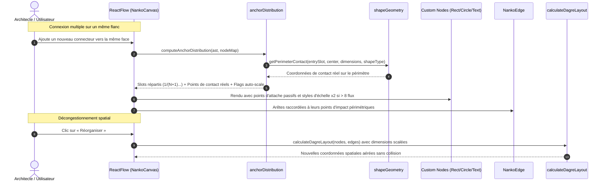

# Spec : 023 - Distribution Multi-Ports & Redimensionnement Automatique

## Métadonnées
* **Statut :** `Livré & Archivé ✅`
* **Domaine concerné :** `studio-modeling` ([Architecture Technique](../../knowledge/domains/studio-modeling/tech.md) · [Comportement Produit](../../knowledge/domains/studio-modeling/behavior.md))
* **Type de changement :** `Évolution & Stabilisation`
* **Cible :** `frontend` (React Flow, Nœuds, Handles, Layout Dagre, Roue Radiale, Géométrie de connecteurs) + `tests-e2e` (Playwright)
* **Feature parente :** [09-multi-anchor-distribution-and-auto-scale](../../initiatives/active/studio-modeling/archive/09-multi-anchor-distribution-and-auto-scale.md)
* **Complexité :** `Medium`

---

## 1. Intention & Contexte (*The Why*)

* **Problème résolu / Besoin :**
  1. Lorsque plusieurs connecteurs se branchent sur le même flanc d'une Shape, la convergence sur un point d'ancrage unique engendre une superposition illisible (« effet hérisson »).
  2. Cependant, la distribution spatiale des connecteurs existants ne doit **jamais** être confondue avec les poignées interactives de création : l'utilisateur ne doit avoir à sa disposition que les 5 handles canoniques lorsqu'il désire créer ou brancher un flux, sans que des poignées superflues n'apparaissent au survol.
  3. Au-delà d'un certain nombre de connexions (seuil de 8 flux), la densité visuelle sature le composant, justifiant un agrandissement automatique $\times 2$.
  4. L'insertion de forme assistée par la roue radiale (`A` + pointage) doit être rigoureusement unitaire et atomique (élimination de tout double appel créant deux formes).
  5. Pour les formes non rectangulaires (`circle`), les connecteurs ne doivent jamais flotter dans le vide ni sembler décollés : le système sépare la boîte de manipulation rectangulaire (qui distribue les slots) de la forme affichée où le connecteur est projeté vers le centre et s'arrête exactement sur le contour périmétrique réel.
* **Impact utilisateur :**
  * **Distribution spatiale transparente :** Sur chaque flanc accueillant $N$ connecteurs, les points d'attache passifs sont redistribués à intervalles réguliers ($\frac{1}{N+1}, \dots, \frac{N}{N+1}$) le long du segment, supprimant toute superposition.
  * **Clarté d'interaction (5 Handles uniquement) :** Au survol d'une Shape ou lors du glisser pour créer un connecteur, **seules les 5 poignées canoniques** (`top`, `bottom`, `left`, `right` et centrale `auto`) sont visibles et interactives. Les points d'attache distribués existants restent strictement passifs, invisibles au survol et non connectables.
  * **Contact géométrique parfait (INV-7) :** Quel que soit le flanc d'arrivée (`left`, `right`, `top`, `bottom`), le fil arrive sur la boîte de manipulation et termine son tracé pile sur le contour de la forme affichée (contact direct pour `rectangle`, découpe sur le rayon $R$ pour `circle`).
  * **Création atomique garantie (Roue radiale) :** Maintenir `A` (ou `Tab`), survoler un secteur (ex: `rectangle`, `circle`) et relâcher la touche insère exactement une seule forme sans doublon, y compris en mode développement React StrictMode.
  * **Auto-Scale adaptatif :** Dès lors que le nombre total de connecteurs sur un flanc dépasse la capacité nominale de 8 flux :
    - Flanc vertical (`left` ou `right`) : la hauteur de la Shape double automatiquement ($\times 2$).
    - Flanc horizontal (`top` ou `bottom`) : la largeur de la Shape double automatiquement ($\times 2$).
    - Forme circulaire (`circle`) : le diamètre double automatiquement ($\times 2$, 260px au lieu de 130px) sur largeur et hauteur.
    - Forme textuelle (`text`) : redimensionnement correspondant.
  * L'algorithme Dagre prend en compte ces dimensions élargies lors de l'action « Réorganiser » de la barre d'outils pour décongestionner le graphe sans chevauchement.
* **In Scope (Ce qui est ajouté / modifié) :**
  * Module de stratégie géométrique `shapeGeometry.ts` : calcul d'intersection périmétrique pour `rectangle` et `circle` sur les 4 flancs (`left`, `right`, `top`, `bottom`).
  * Module utilitaire `anchorDistribution.ts` pour le calcul déterministe des créneaux d'ancrage le long de chaque flanc et la projection périmétrique des points d'impact.
  * Adaptation de `RectangleNode.tsx`, `CircleNode.tsx` et `TextNode.tsx` pour isoler strictement les 5 poignées interactives de création des points d'ancrage distribués passifs (`isConnectable={false}`, invisibles au survol, sans classe `.nanko-handle`).
  * Fiabilisation atomique de la création de forme dans `NankoCanvas.tsx` (extraction de l'effet hors des callbacks `setState` pour neutraliser le doublement StrictMode, et déduplication événementielle clic/relâchement).
  * Adaptation de `dagreLayout.ts` pour intégrer les dimensions scalées des nœuds (dont le diamètre 260x260 pour les cercles) lors du réagencement automatique.
  * Adaptation de `NankoCanvas.tsx` pour alimenter les arêtes React Flow avec leurs points d'ancrage distribués passifs respectifs.
  * Tests unitaires exhaustifs (Vitest) et tests End-to-End (Playwright).
* **Out of Scope (Exclusions strictes) :**
  * Poignées redimensionnables manuellement à la souris par étirement (*Resize handles* aux 4 coins).
  * Moteur physique temps réel de répulsion dynamique (la réorganisation spatiale reste déclenchée par l'action Dagre).
  * Attribution manuelle d'un index de slot par l'utilisateur (le calcul d'ordonnancement est déterministe et automatique).

> *Omission Note : Section 4.1 (Backend & Persistance) et Section 4.3 (Infrastructure & Configuration) non applicables (le dimensionnement et les slots de distribution sont déduits en temps réel de l'AST et du layout des arêtes sans modification du schéma SQL ni de la syntaxe DSL v1).*

---

## 2. Flux & Architecture



### Modèle Bi-Couche : Boîte de Manipulation vs Forme Affichée (INV-7)

```text
Cas 1 : Cercle (Traversée de la boîte vers le centre et contact net sur le périmètre)
               BOÎTE DE MANIPULATION (Rectangle Englobant)
           + - - - - - - - - - - - - - - - - - - - - - - - - - - - +
           |                                                       |
           |                     CERCLE AFFICHÉ                    |
           |                      . - ~ ~ - .                      |
Flux 1     |                  . '             ' .                  |
───────────X (Slot 1: 33%)  /                     \                |
(Connecteur| ╲             /                       \               |
 externe)  |  ╲           |                         |              |
           |   ─────────> ● (Arrêt Périmètre 1)     |              |
           |     (visée   |                         |              |
           |      vers C) |            C            |              |
           |              |        (Centre)         |              |
           |   ─────────> ● (Arrêt Périmètre 2)     |              |
Flux 2     |  ╱           |                         |              |
───────────X (Slot 2: 66%) \                       /               |
(Connecteur| ╱              \                     /                |
 externe)  |                  . '             ' .                  |
           |                      ' - . . - '                      |
           |                                                       |
           + - - - - - - - - - - - - - - - - - - - - - - - - - - - +

Cas 2 : Rectangle (Boîte de manipulation = Forme affichée : contact direct)
           +───────────────────────────────────────────────────────+
Flux 1     |                                                       |
───────────● (Slot 1: 33% = Point d'arrêt direct)                  |
           |                           C                           |
Flux 2     |                       (Centre)                        |
───────────● (Slot 2: 66% = Point d'arrêt direct)                  |
           +───────────────────────────────────────────────────────+
```

---

## 3. Inventaire des Fichiers & Contrats

### 3.1. Arborescence Factorisée
*Chemins relatifs à la racine du workspace.*

```text
frontend/src/features/documents/components/canvas/
├── utils/
│   ├── shapeGeometry.ts                [NEW] Stratégies de projection périmétrique par type de forme
│   ├── shapeGeometry.test.ts           [NEW] Tests unitaires des calculs de contact (cercle 4 flancs, rectangle)
│   ├── anchorDistribution.ts           [MOD] Intégration de la géométrie périmétrique et seuil auto-scale
│   ├── anchorDistribution.test.ts      [MOD] Tests unitaires de répartition et dépassement de seuil
│   ├── connectorGeometry.ts            [MOD] Extraction du flanc cardinal canonique depuis un handleId
│   ├── connectorGeometry.test.ts       [MOD] Tests d'extraction de flanc
│   └── dagreLayout.ts                  [MOD] Intégration des dimensions scalées (dont cercle 260x260) dans Dagre
├── nodes/
│   ├── RectangleNode.tsx               [MOD] Support des points d'attache passifs et classes d'échelle
│   ├── RectangleNode.module.css        [MOD] Styles d'agrandissement x2 (isScaledY, isScaledX)
│   ├── CircleNode.tsx                  [MOD] Points d'attache passifs 4 flancs et diamètre 260px
│   ├── CircleNode.module.css           [MOD] Styles d'agrandissement x2 (isScaledDiameter)
│   ├── TextNode.tsx                    [MOD] Support des points d'attache passifs et dimensionnement x2
│   └── TextNode.module.css             [MOD] Styles d'agrandissement x2
├── NankoCanvas.tsx                     [MOD] Création atomique sans doublon, branchement de la distribution
├── NankoCanvas.module.css              [MOD] Styles des points d'attache passifs (nanko-passive-anchor)
tests-e2e/tests/app/
└── canvas-connector-drawing.spec.ts    [MOD] Scénarios E2E Playwright de répartition et auto-scale
```

---

## 4. Spécifications Détaillées par Couche

### 4.2. Couche Présentation & Frontend
* **`shapeGeometry.ts` & `NankoEdge.tsx` :**
  - Définit le contrat `PerimeterContactResult` avec `getPerimeterContact(side, offsetPercentage, shapeType)`.
  - Pour `rectangle` et `text` : la boîte de manipulation et la forme affichée se confondent ($P_{\text{box}} = P_{\text{contact}}$, delta nul).
  - Pour `circle` : le connecteur arrive au point de slot $P_{\text{box}}$ sur l'arrête du rectangle englobant, puis est orienté en ligne droite vers le centre $C = (50\%, 50\%)$ de la forme affichée et s'arrête pile sur le périmètre circulaire de rayon $R = 50\%$ :
    - Vecteur de visée vers le centre : $\vec{v} = P_{\text{box}} - C$.
    - Distance au centre : $L = \|\vec{v}\| = \sqrt{v_x^2 + v_y^2}$.
    - Point de contact sur le cercle : $P_{\text{contact}} = C + \frac{R}{L} \cdot \vec{v}$.
    - Décalage vectoriel : $\vec{\delta} = P_{\text{contact}} - P_{\text{box}}$.
  - Dans `NankoEdge.tsx`, le tracé orthogonal (SmoothStep) rejoint $P_{\text{box}}$, puis un segment terminal rectiligne `L (targetX + dx) (targetY + dy)` est ajouté en direction du centre, garantissant que la flèche (`markerEnd`) touche directement le contour du cercle avec l'orientation vers le centre.
* **`anchorDistribution.ts` :**
  - Entrées : `ast.shapes`, `ast.connectors`, `ast.edgeLayout`, positions des nœuds.
  - Ordonne les connecteurs le long de chaque flanc selon la coordonnée du nœud opposé.
  - Calcule le ratio de position : $\frac{i + 1}{N + 1}$.
  - Utilise `shapeGeometry.ts` pour calculer les offsets exacts de contact périmétrique.
  - Détecte l'auto-scale dès que $N > 8$ sur un flanc (`scaleY` pour vertical, `scaleX` pour horizontal, `scaleDiameter` pour cercle).
* **Composants Nœuds (`RectangleNode`, `CircleNode`, `TextNode`) :**
  - **Handles de création :** Maintiennent strictement les 4 poignées cardinales canoniques (`left`, `top`, `right`, `bottom`) et la poignée centrale `auto` (`isConnectable = true`, classe `.nanko-handle`).
  - **Points d'attache passifs :** Quand $N > 1$ connecteurs sont raccordés sur un flanc, génèrent les poignées dynamiques d'ancrage `<Handle id={`${side}-${edgeKey}`} isConnectable={false} style={{ ... }} />` :
    - Strictement non connectables (`isConnectable={false}`, `isConnectableStart={false}`, `isConnectableEnd={false}`).
    - Invisibles et intouchables (`opacity: 0 !important; pointer-events: none !important;`).
    - Ne portent JAMAIS la classe `.nanko-handle` (évitant ainsi tout affichage au survol ou sélection du nœud).
  - Pour `CircleNode`, le positionnement passif tient compte de l'équation du cercle pour que les terminaisons épousent parfaitement le bord courbé :
    $x_{rel} = \sqrt{R^2 - y_{rel}^2}$ avec $R = 50\%$.
  - Appliquent les classes CSS d'échelle doublée lorsque les seuils de capacité sont franchis.
* **Canvas & Roue Radiale (`NankoCanvas.tsx`) :**
  - Fiabilisation de la création de formes : extraction de `onCreateShape` hors de tout callback `setState` (évitant la double invocation induite par React `<StrictMode>`).
  - Déduplication événementielle : garde d'état empêchant qu'un clic sur un secteur suivi du relâchement de la touche `A` ne déclenche deux fois `onCreateShape`.

---

## 5. Invariants du Système & Règles Métier

* **`INV-1` (Espacement régulier sans collision) :**
  Sur une face comptant $N$ connecteurs raccordés, chaque connecteur dispose d'un point d'ancrage dédié espacé de manière uniforme le long du bord aux positions $\frac{i+1}{N+1}$ ($i \in [0, N-1]$).
  ↳ *Couvert par : `anchorDistribution.ts`, `RectangleNode.tsx`, `CircleNode.tsx`, `TextNode.tsx`.*

* **`INV-2` (Seuil de capacité 8 et facteur d'échelle $\times 2$) :**
  La capacité nominale d'un flanc standard est fixée à 8 connecteurs. Dès le 9ᵉ connecteur sur un flanc vertical (`left` ou `right`), la hauteur est multipliée par 2. Dès le 9ᵉ connecteur sur un flanc horizontal (`top` ou `bottom`), la largeur est multipliée par 2.
  ↳ *Couvert par : `anchorDistribution.ts`, `RectangleNode.module.css`, `TextNode.module.css`.*

* **`INV-3` (Universalité des formes) :**
  La règle d'auto-agrandissement s'applique à l'ensemble des formes (`rectangle`, `circle` par doublement de son diamètre à 260px dès qu'un flanc dépasse 8 flux, et `text`).
  ↳ *Couvert par : `CircleNode.tsx`, `CircleNode.module.css`, `TextNode.tsx`.*

* **`INV-4` (Désengorgement par réorganisation Dagre) :**
  L'espacement spatial après redimensionnement est assuré par le calcul hiérarchique acyclique Dagre prenant en compte les nouvelles largeurs et hauteurs des nœuds.
  ↳ *Couvert par : `dagreLayout.ts`, `NankoCanvas.tsx`.*

* **`INV-5` (Isolement strict : 5 handles de création vs points d'attache passifs) :**
  Chaque nœud expose strictement 5 poignées interactives connectables (`left`, `top`, `right`, `bottom`, `auto`). Les points d'attache distribués existants sont 100% passifs (`isConnectable = false`), invisibles au survol (`opacity: 0; pointer-events: none`), et ne portent pas la classe `.nanko-handle`.
  ↳ *Couvert par : `RectangleNode.tsx`, `CircleNode.tsx`, `TextNode.tsx`, `NankoCanvas.module.css`.*

* **`INV-6` (Création atomique et unitaire via la roue radiale) :**
  L'action de création de forme via la roue radiale (`A` + pointage) ou raccourcis directs crée strictement et uniquement une seule forme sans doublon, y compris sous React `<StrictMode>`.
  ↳ *Couvert par : `NankoCanvas.tsx`.*

* **`INV-7` (Modèle bi-couche : Boîte de manipulation & Projection d'impact périmétrique) :**
  Chaque Shape s'inscrit dans une boîte de manipulation rectangulaire servant de référence aux slots d'entrée. Le connecteur se dirige vers le centre et s'arrête exactement sur le périmètre réel de la forme affichée (contact direct pour `rectangle`, découpe sur le rayon $R$ pour `circle` sur les 4 flancs `left`, `right`, `top`, `bottom`).
  ↳ *Couvert par : `shapeGeometry.ts`, `anchorDistribution.ts`, `CircleNode.tsx`.*

---

## 6. Risques & Points de Vigilance Techniques

1. **Stabilité des IDs de Handles :** Les IDs de points d'attache passifs doivent être déterministes (`${side}-${source}-${target}`) afin que React Flow puisse relier l'arête à la bonne ancre sans perte d'état lors des re-renders.
2. **Pureté des Effets de Bord React :** Tout appel provoquant une mutation du document (`onCreateShape`) doit résider dans un gestionnaire d'événement impératif et jamais dans une fonction de mise à jour d'état fonctionnelle `setState(prev => ...)`.
3. **Confusion Visuelle Utilisateur :** Aucun point d'attache distribué passif ne doit réagir au survol (`:hover`) ou devenir une source/cible de glisser-déposer. Seules les 5 poignées canoniques demeurent visibles.
4. **Continuité Géométrique 360° :** Sur `CircleNode`, le calcul de contact périmétrique s'applique uniformément aux 4 flancs (`top`, `bottom`, `left`, `right`) : aucun connecteur ne doit flotter en dehors du cercle ou s'arrêter à l'intérieur.
5. **Non-Régression sur les Sélecteurs E2E :** Les poignées cardinales de base continuent d'exister pour préserver tous les tests E2E et interactions existantes.

---

## 7. Migration & Rétrocompatibilité

* **Données existantes :** 100% rétrocompatible. Aucun changement de syntaxe DSL `.nanko`.
* **Arêtes sans multi-ancrage ($N=1$) :** Utilisent le point central standard à 50% ($1/(1+1)$).

---

## 8. Stratégie de Test & Assurance Qualité

### 8.1. Scénarios BDD / Gherkin

```gherkin
Feature: Distribution Multi-Ports & Redimensionnement Automatique (Spec 023)

  @INV-1
  Scenario: Répartition uniforme de 3 connecteurs sur un flanc droit
    Given un nœud "gateway" avec 3 connecteurs sortants vers 3 services distincts sur le flanc "right"
    When le canvas calcule la distribution des ancres
    Then les 3 poignées sont réparties le long du bord droit aux positions 25%, 50% et 75%
    And aucun connecteur ne partage le même point de contact

  @INV-2
  Scenario: Dépassement de capacité sur un flanc vertical (> 8 flux)
    Given un nœud "api" ayant 8 connecteurs sur son flanc droit
    When un 9ème connecteur est raccordé sur son flanc droit
    Then le nœud "api" adopte une hauteur multipliée par 2
    And les 9 poignées sont réparties de manière uniforme à des intervalles de 1/10

  @INV-3
  Scenario: Doublement de diamètre d'un nœud Circle en surcharge
    Given un nœud circulaire "auth" ayant 9 connecteurs sur un flanc
    When le nœud est rendu sur le canvas
    Then son diamètre passe à 260px (x2)
    And les poignées épousent la courbure du cercle

  @INV-4
  Scenario: Réorganisation Dagre avec nœuds redimensionnés
    Given un nœud redimensionné par auto-scale
    When l'utilisateur clique sur le bouton "Réorganiser"
    Then l'algorithme Dagre utilise la largeur et hauteur doublées pour calculer les positions
    And aucun nœud voisin ne chevauche le nœud agrandi

  @INV-5
  Scenario: Présence exclusive des 5 poignées interactives de création
    Given une Shape avec plusieurs connecteurs distribués sur son flanc droit
    When l'utilisateur survole la Shape pour initier un nouveau connecteur
    Then seules les 5 poignées canoniques (top, bottom, left, right, auto) sont visibles et connectables
    And les points d'attache distribués existants restent invisibles et non connectables

  @INV-6
  Scenario: Création unitaire et atomique d'un rectangle via la roue radiale
    Given l'utilisateur survole le canvas
    When il maintient la touche A, survole le secteur "rectangle" et relâche la touche A
    Then exactement un seul rectangle est inséré dans le document .nanko
    And aucun doublon n'est généré

  @INV-7
  Scenario: Contact périmétrique précis sur les 4 flancs d'un cercle
    Given un nœud circulaire "auth" avec 2 connecteurs sur son flanc supérieur (top) et 2 sur son flanc gauche (left)
    When les points d'impact réels sont calculés par shapeGeometry
    Then chaque connecteur s'arrête exactement sur le périmètre de rayon R
    And aucun connecteur ne flotte dans le vide par rapport au cercle visible
```

### 8.2. Commandes de Validation & Quality Gates

```bash
# Frontend Unit & Component Tests
pnpm --filter frontend test

# Frontend Linter & Typecheck
pnpm --filter frontend lint && pnpm --filter frontend typecheck

# Backend Quality Gates
make deptrac && make static-analysis && make lint && make test-backend

# End-to-End Tests complets
pnpm --filter tests-e2e test
```
