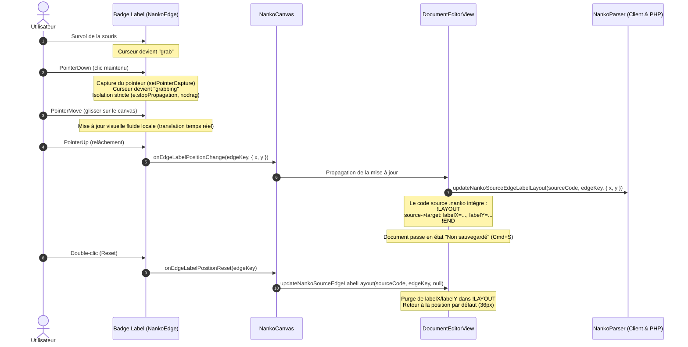

# Spec : 025 - Repositionnement Manuel des Labels de Connecteurs & Persistance Layout

## Métadonnées
* **Statut :** `Livré & Archivé ✅`
* **Domaine concerné :** `studio-modeling` ([Architecture Technique](../../knowledge/domains/studio-modeling/tech.md) · [Comportement Produit](../../knowledge/domains/studio-modeling/behavior.md))
* **Type de changement :** `Évolution Visuelle & Ergonomie`
* **Cible :** `backend` (Parser PHP `edgeLayout`), `frontend` (Schémas Zod, Parser client, Sync layout, `NankoEdge`, `NankoCanvas`, CSS Modules) + `tests-e2e` (Playwright)
* **Feature parente :** [10-draggable-connector-labels](../../initiatives/active/studio-modeling/archive/10-draggable-connector-labels.md)
* **Complexité :** `Medium`

---

## 1. Intention & Contexte (*The Why*)

* **Problème résolu / Besoin :**
  1. Par défaut, les libellés de connecteurs (`label`) sont positionnés de façon déterministe à 36px de la forme source le long du tracé orthogonal (Spec 022 / Spec 023).
  2. Cependant, sur des schémas denses ou des carrefours de connecteurs complexes, ce positionnement automatique peut entrer en collision avec d'autres arêtes, des formes voisines ou des annotations textuelles, dégradant la lisibilité.
  3. L'utilisateur a besoin de pouvoir cliquer-glisser directement le badge du libellé pour l'écarter ou le repositionner librement à l'endroit le plus lisible, avec persistance exacte dans la section `!LAYOUT ... !END` du code `.nanko` (`source->target: labelX=..., labelY=...`), et possibilité de réinitialiser la position au double-clic.
* **Impact utilisateur :**
  * **Ajustement ergonomique direct :** Survol avec curseur `grab`, déplacement fluide (`grabbing`) à la souris sans modifier le tracé du connecteur ni translater le canvas React Flow.
  * **Persistance transparente :** Les coordonnées relatives du label sont enregistrées dans le bloc `!LAYOUT` au relâchement (`pointerup`) sans altérer les ancres existantes (`from=`, `to=`) ni les autres nœuds.
  * **Réinitialisation immédiate (Reset) :** Un double-clic sur le badge réinitialise instantanément le label à sa position calculée par défaut (36px de la source) et purge les attributs `labelX` / `labelY` dans `!LAYOUT`.
* **In Scope (Ce qui est ajouté / modifié) :**
  * Support de `labelX` et `labelY` dans `edgeLayout` côté backend (`NankoParser.php`, `NankoAst.php`) et frontend (`schemas.ts`, `nankoParser.ts`).
  * Fonctions de synchronisation et mise à jour du bloc `!LAYOUT` pour les positions de labels dans `syncLayoutToSource.ts`.
  * Gestionnaire de drag (`pointerdown`, `pointermove`, `pointerup`) isolé dans `NankoEdge.tsx` avec `setPointerCapture` / `releasePointerCapture` et prévention du pan/zoom canvas (`nodrag`, `nowheel`, `stopPropagation`).
  * Double-clic sur `NankoEdge` pour réinitialiser la position du label.
  * Callback `onEdgeLabelPositionChange` dans `NankoCanvas.tsx` relayé vers `DocumentEditorView.tsx` pour modifier le code source `.nanko` de manière réactive.
  * Tests unitaires backend (PHPUnit) et frontend (Vitest), ainsi que tests End-to-End (Playwright).
* **Out of Scope (Exclusions strictes) :**
  * Rotation ou orientation angulaire du badge textuel (le texte reste rigoureusement horizontal).
  * Édition in-place du texte du libellé au clic (déléguée à la future feature `05-in-place-editing-popover`).
  * Déplacement de la flèche directionnelle SVG terminale.

---

## 2. Flux & Architecture



---

## 3. Périmètre des Modifications (Inventaire Exhaustif)

### 3.1. Backend (`backend/`)
* **`backend/src/WorkspaceManagement/Core/Domain/Document/Parser/NankoParser.php`** :
  * Étendre le regex de parsing d'arêtes dans `!LAYOUT` pour extraire `labelX` et `labelY` (ex: `source->target: from=top, to=left, labelX=180, labelY=95` ou `source->target: labelX=180, labelY=95`).
  * Normaliser les coordonnées comme entiers (`int`).
* **`backend/src/WorkspaceManagement/Core/Domain/Document/Parser/NankoAst.php`** :
  * Documenter les types PHPDoc d'`edgeLayout` : `array<string, array{from?: string, to?: string, labelX?: int, labelY?: int}>`.
* **`backend/tests/Unit/WorkspaceManagement/Core/Domain/Document/NankoParserTest.php`** :
  * Ajouter les tests de parsing pour `labelX` et `labelY` isolés ou combinés avec `from`/`to`.

### 3.2. Frontend (`frontend/`)
* **`frontend/src/features/documents/schemas.ts`** :
  * Enrichir `edgeAnchorLayoutSchema` avec `labelX: z.number().optional().nullable()` et `labelY: z.number().optional().nullable()`.
* **`frontend/src/features/documents/components/canvas/utils/nankoParser.ts`** :
  * Parser `labelX` et `labelY` dans `edgeLayout` lors de la lecture du bloc `!LAYOUT`.
* **`frontend/src/features/documents/components/canvas/utils/syncLayoutToSource.ts`** :
  * Implémenter `updateNankoSourceEdgeLabelLayout(sourceCode, edgeKey, coords | null)` pour mettre à jour ou supprimer `labelX` et `labelY` d'une arête dans le bloc `!LAYOUT` sans altérer `from` / `to` ni les autres nœuds.
* **`frontend/src/features/documents/components/canvas/edges/NankoEdge.tsx`** :
  * Récupérer `labelX` et `labelY` depuis `edgeData?.edgeLayout` ou `data`.
  * Si `labelX` et `labelY` sont définis, positionner le badge à ces coordonnées. Sinon, appliquer la règle déterministe (36px de la source).
  * Implémenter le glisser-déposer interactif via `pointerdown`, `pointermove`, `pointerup` avec conversion de coordonnées de flow via React Flow.
  * Implémenter le double-clic pour réinitialiser la position.
* **`frontend/src/features/documents/components/canvas/edges/NankoEdge.module.css`** :
  * Ajouter les classes et curseurs `grab` / `grabbing` sur `.edgeLabel`, gestion de l'état `.isDragging`.
* **`frontend/src/features/documents/components/canvas/NankoCanvas.tsx`** :
  * Injecter les données de position personnalisée dans les arêtes (`data.customLabelPosition`).
  * Transmettre les callbacks `onEdgeLabelPositionChange` et `onEdgeLabelPositionReset`.
* **`frontend/src/views/DocumentEditorView.tsx`** :
  * Raccorder les callbacks de déplacement de label à la mise à jour du code source via `updateNankoSourceEdgeLabelLayout`.

### 3.3. Tests (`tests-e2e/`, `frontend/`, `backend/`)
* **`frontend/src/features/documents/components/canvas/edges/NankoEdge.test.tsx`** :
  * Tester le rendu avec coordonnées personnalisées, le déclenchement du drag et du double-clic.
* **`frontend/src/features/documents/components/canvas/utils/syncLayoutToSource.test.ts`** :
  * Tester l'insertion, la mise à jour et la suppression de `labelX` / `labelY` dans `!LAYOUT`.
* **`tests-e2e/tests/app/canvas-connector-drawing.spec.ts`** :
  * Scénario E2E complet : glisser le badge de label sur le canvas, vérifier la mise à jour dans l'éditeur `.nanko`, recharger la page et vérifier le maintien de la position du label.

---

## 4. Spécifications Détaillées

### 4.1. Grammaire & Syntaxe dans `!LAYOUT`

```text
!LAYOUT
sourceNode: x=100, y=150
targetNode: x=400, y=150
sourceNode->targetNode: labelX=220, labelY=140
serviceA->serviceB: from=top, to=left, labelX=310, labelY=85
!END
```

* Si `labelX` et `labelY` sont présents : le label est centré sur `(labelX, labelY)`.
* Si `labelX` et `labelY` sont absents : le label est positionné à 36px du point de départ du flux (`INV-BUS-06`).
* La suppression de `labelX` et `labelY` retire ces attributs de la ligne d'arête. Si la ligne ne contient plus d'attribut (`from`, `to`), la ligne entière de l'arête est purgée de `!LAYOUT`.

### 4.2. Précision Géométrique & Référentiel Spatiale

* Les coordonnées `labelX` et `labelY` sont exprimées dans le référentiel spatial du canvas React Flow (coordonnées monde/flow, et non coordonnées écran du viewport).
* Lors du déplacement :
  $$\Delta x = \frac{\text{clientX}_{\text{actuel}} - \text{clientX}_{\text{start}}}{\text{zoom}}$$
  $$\Delta y = \frac{\text{clientY}_{\text{actuel}} - \text{clientY}_{\text{start}}}{\text{zoom}}$$
* Cette conversion garantit que le label suit fidèlement le pointeur, quel que soit le niveau de zoom ou le panoramique du canvas.

### 4.3. Isolation Événementielle Stricte

* Le conteneur du label possède la classe `nodrag` et intercepte `pointerdown` avec `e.stopPropagation()`.
* React Flow ne déclenche aucun déplacement de nœud parent, aucune sélection multiple au lasso, ni aucun panoramique du canvas pendant le drag du label.

### 4.4. Contrainte Stricte sur le Tracé du Connecteur (Centrage Obligatoire)

* Le badge de libellé ne peut pas flotter librement dans l'espace 2D du canvas.
* Tout déplacement de la souris est immédiatement projeté orthogonalement sur les segments horizontaux et verticaux du tracé SVG du connecteur (`projectPointOnEdgePath` dans `edgeLabelGeometry.ts`).
* Le badge reste continuellement centré sur le trait (`transform: translate(-50%, -50%)`) le long du chemin du connecteur.
* En cas de virage à angle droit, le badge suit le coude de manière fluide dès que la projection la plus proche bascule sur le segment adjacent.

---

## 5. Invariants Fonctionnels & Règles Métier

* **`INV-1` (Isolation Événementielle Absolue) :** Le drag du label n'induit aucun effet de bord sur le canvas (zéro translation du viewport, zéro sélection intempestive).
* **`INV-2` (Persistance Déterministe dans `!LAYOUT`) :** Seuls les libellés déplacés par l'utilisateur génèrent `labelX` et `labelY` dans `!LAYOUT`.
* **`INV-3` (Réinitialisation au Double-Clic) :** Un double-clic sur le badge supprime les coordonnées personnalisées dans `!LAYOUT` et repositionne le label à sa position par défaut (36px).
* **`INV-4` (Conservation des Ancrages Existants) :** La mise à jour de la position d'un label n'altère en aucun cas les directives de distribution d'ancres existantes (`from=[side]`, `to=[side]`).
* **`INV-5` (Style Blueprint Préservé) :** Le badge de label conserve sa typographie technique (`IBM Plex Mono`), son bord `var(--border-strong)` et son élévation au survol.

---

## 6. Stratégie de Test & Assurance Qualité

### 6.1. Scénarios BDD / Gherkin

```gherkin
Feature: Repositionnement Manuel des Labels de Connecteurs & Persistance Layout (Spec 025)

  @INV-1 @INV-2
  Scenario: Glisser-déposer d'un badge de libellé de connecteur
    Given un connecteur entre deux formes avec le libellé "HTTPS"
    When l'utilisateur clique et glisse le badge "HTTPS" vers une nouvelle position (x=250, y=120)
    Then le badge se déplace fluidement sous le curseur
    And le bloc !LAYOUT du document est mis à jour avec "labelX=250, labelY=120"
    And le tracé de l'arête reste inchangé

  @INV-3
  Scenario: Réinitialisation de la position du label au double-clic
    Given un connecteur dont le label a été déplacé manuellement ("labelX=250, labelY=120")
    When l'utilisateur double-clique sur le badge de label
    Then les coordonnées personnalisées sont supprimées du bloc !LAYOUT
    And le label se repositionne automatiquement à sa position déterministe par défaut (36px de la source)

  @INV-4
  Scenario: Préservation des ancres de connecteur existantes
    Given une arête configurée avec "from=top, to=left" dans !LAYOUT
    When l'utilisateur repositionne manuellement son label à (x=180, y=90)
    Then la ligne correspondante dans !LAYOUT devient "from=top, to=left, labelX=180, labelY=90"
```

### 6.2. Commandes de Validation & Quality Gates

```bash
# Frontend Unit Tests
pnpm --filter frontend test

# Frontend Linter & Typecheck
pnpm --filter frontend lint && pnpm --filter frontend typecheck

# Backend Quality Gates
make deptrac && make static-analysis && make lint && make test-backend

# Tests E2E Playwright
pnpm --filter tests-e2e test
```
