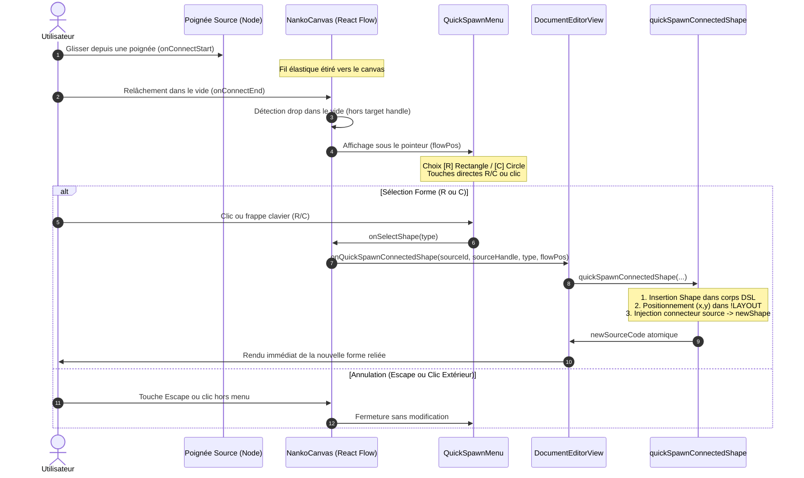

# Spec : 026 - Création Rapide Connectée par Dépôt dans le Vide (Quick Spawn on Drop)

## Métadonnées
* **Statut :** `En cours 🚀`
* **Domaine concerné :** `studio-modeling` ([Architecture Technique](../../knowledge/domains/studio-modeling/tech.md) · [Comportement Produit](../../knowledge/domains/studio-modeling/behavior.md))
* **Type de changement :** `Évolution Visuelle & Ergonomie`
* **Cible :** `frontend` (`NankoCanvas.tsx`, `QuickSpawnMenu.tsx`, `quickSpawnConnectedShape.ts`, CSS Modules) + `tests-e2e` (Playwright)
* **Feature parente :** [11-connector-quick-spawn-on-drop](../../initiatives/active/studio-modeling/active/11-connector-quick-spawn-on-drop.md)
* **Complexité :** `Medium`

---

## 1. Intention & Contexte (*The Why*)

* **Problème résolu / Besoin :**
  1. Actuellement, lorsqu'un utilisateur tire un connecteur depuis une poignée d'ancrage et le relâche dans un espace vide du canvas, l'action est silencieusement annulée. L'utilisateur doit d'abord créer une nouvelle forme à un autre endroit (via la roue radiale ou le raccourci clavier), puis revenir sur la forme initiale pour tirer à nouveau son fil.
  2. Inspiré des meilleurs standards d'ergonomie visuelle (Miro, FigJam), relâcher un connecteur sur le fond du canvas doit ouvrir un **mini-sélecteur de formes contextuel (QuickSpawnMenu)** à l'emplacement exact du relâchement, permettant d'instancier la nouvelle forme cible et de la relier d'un seul geste fluide et ininterrompu.
* **Impact utilisateur :**
  * **Accélération du flux de modélisation (x2) :** L'utilisateur modélise son graphe de proche en proche par simple tirage de connecteurs successifs.
  * **Fluidité sub-seconde (`INV-STRAT-02`) :** Choix direct à la souris ou au clavier (`R` pour rectangle, `C` pour cercle).
  * **Atomicité & Annulation unifiée :** La création du nœud et du connecteur ne génère qu'une seule mutation atomique dans le code `.nanko` (`Cmd+Z` unifié).
* **In Scope :**
  * Détection du relâchement d'un connecteur dans le vide via `onConnectStart`, `onConnect`, `onConnectEnd` dans `NankoCanvas.tsx`.
  * Création du composant contextuel `QuickSpawnMenu` (proposant `Rectangle` et `Circle`, support clavier `R`, `C`, `Escape`).
  * Fonction de mutation unifiée `quickSpawnConnectedShape.ts` combinant l'instanciation de forme et l'ajout du connecteur dans le code `.nanko` et `!LAYOUT`.
  * Câblage dans `DocumentEditorView.tsx` pour modifier le code source de manière réactive.
  * Tests unitaires (Vitest) et scénario End-to-End Playwright.
* **Out of Scope :**
  * Formes composites complexes ou groupements.
  * Reconnexion de flux existants (couverte par la Spec 027 / Feature 13).

---

## 2. Diagramme d'Interaction Métier

---

## 3. Périmètre des Modifications (Inventaire Exhaustif)

### 3.1. Frontend (`frontend/src/`)
* **`frontend/src/features/documents/components/canvas/quick-spawn/QuickSpawnMenu.tsx`** [NEW] :
  * Composant popover contextuel avec boutons d'insertion rapide (`rectangle`, `circle`), raccourcis clavier (`R`, `C`, `Escape`) et clic extérieur.
* **`frontend/src/features/documents/components/canvas/quick-spawn/QuickSpawnMenu.module.css`** [NEW] :
  * Styles Blueprint épurés (tokens `--surface`, `--border`, `--brand`), disposition compacte horizontale, badge de touche clavier `[R]`, `[C]`.
* **`frontend/src/features/documents/components/canvas/utils/quickSpawnConnectedShape.ts`** [NEW] :
  * Fonction pure appliquant de manière atomique la création de la forme (`insertShapeToSource`) et du connecteur sortant (`insertConnectorToSource`) dans le code source `.nanko`.
* **`frontend/src/features/documents/components/canvas/NankoCanvas.tsx`** [MODIFY] :
  * Écouteurs `onConnectStart`, `onConnectEnd` et affichage du `QuickSpawnMenu` aux coordonnées flow du canvas.
* **`frontend/src/views/DocumentEditorView.tsx`** [MODIFY] :
  * Callback `handleQuickSpawnConnectedShape` appliquant la mutation sur le code source du document.

### 3.2. Tests (`frontend/` & `tests-e2e/`)
* **`frontend/src/features/documents/components/canvas/utils/quickSpawnConnectedShape.test.ts`** [NEW] :
  * Tests unitaires vérifiant l'atomicité, la génération d'ID unique, l'injection dans le corps déclaratif et dans `!LAYOUT`.
* **`frontend/src/features/documents/components/canvas/quick-spawn/QuickSpawnMenu.test.tsx`** [NEW] :
  * Tests unitaires du composant (rendu, sélection par clic, touches R/C/Escape, clic extérieur).
* **`tests-e2e/tests/app/canvas-connector-drawing.spec.ts`** [MODIFY] :
  * Scénario E2E complet : tirer un câble depuis une poignée, relâcher dans le vide, vérifier l'apparition du mini-menu, créer un `rectangle` par frappe ou clic, et constater la présence de la nouvelle forme et du connecteur dans le textarea DSL.

---

## 4. Spécifications Détaillées

### 4.1. Détection du Relâchement dans le Vide
* Lors de `onConnectStart(event, { nodeId, handleId })` :
  * Enregistrer `connectingStateRef.current = { sourceNodeId: nodeId, sourceHandle: extractCanonicalSide(handleId) }`.
  * Initialiser `connectionMadeRef.current = false`.
* Lors de `onConnect(connection)` :
  * Marquer `connectionMadeRef.current = true`.
* Lors de `onConnectEnd(event)` :
  * Si `connectionMadeRef.current` est `false` et qu'une source était mémorisée :
    * Vérifier si la cible n'est pas un nœud ou poignée (`!(event.target as HTMLElement)?.closest?.('.react-flow__node')`).
    * Obtenir la position canvas : `const flowPos = screenToFlowPosition({ x: event.clientX, y: event.clientY })`.
    * Déclencher l'ouverture du `QuickSpawnMenu` à cette position.

### 4.2. Ergonomie du QuickSpawnMenu
* Menu centré sur le curseur ou décalé de 10px.
* Affichage de 2 options claires :
  * `[R] Rectangle`
  * `[C] Cercle`
* Style Blueprint sombre / clair s'adaptant à `colorMode`.
* Fermeture automatique sur `Escape` ou clic hors du conteneur.

### 4.3. Mutation Atomique du Code Source
* La nouvelle forme est insérée via `generateUniqueShapeId(type, existingIds)`.
* Coordonnées dans `!LAYOUT` centrées sur le point de relâchement (`x - width / 2`, `y - height / 2`).
* Connecteur `source -> newShape` inséré avec ancre source préservée et ancre cible opposée ou auto.
* Résultat en une seule modification de chaîne, garantissant un seul `Cmd+Z` pour annuler.

---

## 5. Invariants Fonctionnels & Règles Métier

* **`INV-BUS-10` (Quick Spawn & Atomicité Connectée) :** Le relâchement d'un connecteur dans le vide ouvre exclusivement le `QuickSpawnMenu`. La validation instancie simultanément la forme et le lien dans le code `.nanko`. L'annulation n'altère en rien le document.

---

## 6. Critères d'Acceptation & Quality Gates

1. Tirer un connecteur dans le vide ouvre le mini-picker sans erreur console.
2. Cliquer sur Rectangle ou appuyer sur `R` crée la nouvelle forme et le lien `source -> shape`.
3. Cliquer sur Cercle ou appuyer sur `C` crée un cercle et le lien `source -> shape`.
4. Appuyer sur `Escape` referme le menu et annule le tracé sans modifier le code.
5. Tous les tests Vitest, PHPUnit, PHPStan, Deptrac, Oxlint et Playwright passent à 100%.
