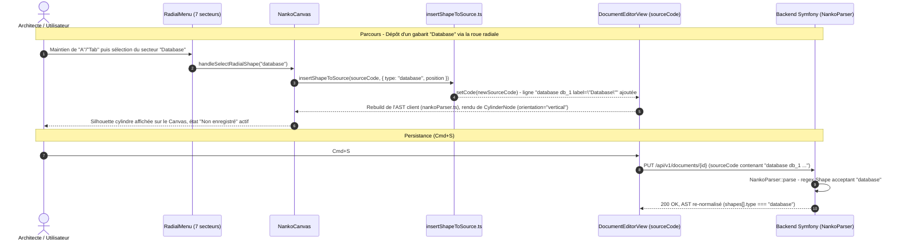

# Spec : 025 - Gabarits d'Architecture Pré-Typés (Database, Service, Gateway, Queue) & Extension de la Roue Radiale

## Métadonnées
* **Domaine concerné :** `.specs/knowledge/domains/studio-modeling/`
* **Type de changement :** `Évolution`
* **Cible :** `Fullstack` (`backend` : parseur DSL · `frontend` : rendu Canvas, roue radiale) + `tests-e2e`
* **Ordre de livraison recommandé :** Après le Delta 024 (3ᵉ secteur roue radiale « Text ») pour ne retoucher `radialMenuConfig.ts` qu'une seule fois — non bloquant techniquement si l'ordre réel diffère.

---

## 1. Intention & Contexte (Le « Why » du Delta)

* **Problème résolu / Besoin :**
  La Target `studio-board.md` (§2.1, §2.2) prévoit des « Gabarits d'architecture pré-typés » (Base de données, Microservice, API Gateway, Broker/File de messages) comme pilier de la modélisation visuelle rapide, au même titre que les primitives génériques déjà livrées (Rectangle/Circle/Text). Aujourd'hui, le DSL `.nanko` ne reconnaît que 3 types de Shape (`rectangle`, `circle`, `text` — `NankoParser.php`), obligeant un architecte à mimer un composant d'infrastructure avec un `rectangle label="Database"` générique, sans aucune expressivité visuelle immédiate.
* **Impact utilisateur :**
  * Quatre nouveaux types de Shape apparaissent dans la roue radiale (`A`/`Tab`) : `Database`, `Service`, `Gateway`, `Queue`, aux côtés des 3 primitives existantes.
  * `Database` et `Queue` se matérialisent sur le Canvas sous une **silhouette cylindre dédiée** (verticale pour `Database`, couchée pour `Queue`) plutôt qu'une carte rectangulaire.
  * `Service` et `Gateway` conservent la carte rectangulaire familière (titre, sous-titre, tooltip) enrichie d'un **pictogramme distinctif** en haut à gauche (engrenage pour Service, porte pour Gateway).
  * L'ensemble reste cohérent avec l'identité visuelle Blueprint existante (contours fins `--brand`, remplissage translucide `--surface`, adaptatif dark/light) — aucun style « icon pack » pastel importé.
* **In Scope (Ce qui est ajouté/modifié) :**
  * **Backend (`NankoParser.php`)** : extension de la regex de détection de Shape pour accepter `database`, `service`, `gateway`, `queue` en plus de `rectangle`, `circle`, `text`. Aucune migration SQL (le type reste une chaîne dans `document.ast` JSONB).
  * **Contrats frontend** : extension de l'enum `nankoAstShapeSchema.type` (Zod, `frontend/src/features/documents/schemas.ts`), du type `ShapePrimitiveType` et des maps `TYPE_PREFIXES` / `TYPE_DEFAULT_LABELS` (`insertShapeToSource.ts`) avec les préfixes `db_`, `svc_`, `gw_`, `queue_`.
  * **Nouveau composant `CylinderNode.tsx`** (+ CSS Module + tests), paramétré par `orientation: 'vertical' | 'horizontal'`, utilisé pour `database` (vertical) et `queue` (horizontal).
  * **Nouveaux composants `ServiceNode.tsx` / `GatewayNode.tsx`** (+ CSS Modules + tests), calqués sur la structure de `RectangleNode.tsx` avec un pictogramme SVG additionnel.
  * **Nouvelles icônes SVG inline** `GearIcon.tsx` / `DoorIcon.tsx` dans `frontend/src/features/documents/components/canvas/icons/`.
  * **Extension de la roue radiale** (`radialMenuConfig.ts`) : 7 secteurs (Rectangle, Circle, Text, Database, Service, Gateway, Queue), recalcul des angles.
  * **Prise en compte des nouvelles géométries dans `dagreLayout.ts`** (dimensions dédiées pour `database`/`queue`, à l'image du cas déjà existant pour `circle`).
  * **Tests unitaires & E2E** de la syntaxe DSL, du rendu des 4 nouveaux types et de la roue radiale à 7 secteurs.
* **Out of Scope (Exclusions strictes) :**
  * **Volet latéral drag & drop** : c'est l'objet du **Delta 026** distinct, qui consommera les types livrés ici.
  * **Raccourcis clavier directs** (`D`/`S`/`G`/`Q` façon `R`/`C`/`T`) : la création de ces 4 gabarits passe uniquement par la roue radiale dans ce delta.
  * **Attributs C4 avancés** (`tech=`, `external=`, etc.) : déjà exclus par la Target `dsl-attributes-label-desc.md`. Les 4 nouveaux gabarits restent de simples `type` de Shape, sans attribut supplémentaire.
  * **Réorganisation/curation de la roue radiale à long terme** (au-delà de 7 secteurs, l'ergonomie de la roue devra être revue) : dette reconnue mais non traitée ici.
  * **Édition in-place, popover, suppression, tracé de connecteur** sur ces nouveaux types : héritent automatiquement des mécanismes livrés par les Deltas 021/022/023 dès lors qu'ils sont eux-mêmes livrés (aucune logique spécifique à dupliquer, ces mécanismes opèrent déjà de façon générique sur tout `NodeProps`/`EdgeProps`).

---

## 2. Flux & Architecture (Diff)



---

## 3. Delta Modèle de données & Base de données

Aucune modification du schéma relationnel. Le champ `document.ast` (JSONB) accepte déjà n'importe quelle valeur de `type` de Shape sans contrainte SQL dédiée — seule la validation applicative (`NankoParser.php` côté backend, `nankoParser.ts` + Zod côté frontend) doit être étendue pour reconnaître les 4 nouvelles valeurs.

```json
{
  "dslVersion": 1,
  "shapes": [
    { "id": "db_1", "type": "database", "label": "PostgreSQL", "desc": null },
    { "id": "svc_1", "type": "service", "label": "Auth Service", "desc": "Émission des jetons JWT" },
    { "id": "gw_1", "type": "gateway", "label": "API Gateway", "desc": null },
    { "id": "queue_1", "type": "queue", "label": "Kafka", "desc": null }
  ],
  "connectors": [],
  "layout": {}
}
```

---

## 4. Delta Contrats d'API (Symfony)

Aucun nouvel endpoint. Le contrat `PUT /api/v1/documents/{documentId}` reste inchangé ; seule la validation interne de `NankoParser::parse()` évolue pour accepter les nouveaux mots-clés de type. Une tentative d'enregistrement d'un `sourceCode` contenant un type non reconnu (ex: `broker` au lieu de `queue`) continue de renvoyer `422 INVALID_NANKO_SYNTAX` avec le numéro de ligne, comme pour toute syntaxe invalide aujourd'hui.

---

## 5. Configuration Réseau, Prérequis DNS & Variables d'Environnement

* **Prérequis DNS :** Aucun.
* **Sécurisation :** Inchangée (JWT Bearer Token Keycloak sur `PUT /api/v1/documents/{documentId}`).
* **Variables d'environnement :** Aucune nouvelle variable.

---

## 6. Delta Maquettes & Layout UI

### 6.1. Silhouettes Database / Queue

```text
DATABASE (vertical)              QUEUE (couchée / horizontale)
     ______                      _________________
   /        \                   /                 \
  |  ●●●●●●  |                 |                   |
  |__________|                 |    ●●●●●●●●●●     |
  |  ●●●●●●  |                 |___________________|
  |__________|                    db_1  |  PostgreSQL
  |  ●●●●●●  |                          v
   \________/                     (label sous/à côté
   db_1                            de la silhouette)
   PostgreSQL
   (bandes horizontales = contour Blueprint --brand,
    remplissage translucide --surface)
```

### 6.2. Rectangles Décorés (Service / Gateway)

```text
+-----------------------------+          +-----------------------------+
| ⚙  SERVICE           svc_1  |          | 🚪 GATEWAY            gw_1  |
+-----------------------------+          +-----------------------------+
| Auth Service                |          | API Gateway                  |
| Émission des jetons JWT     |          |                               |
+-----------------------------+          +-----------------------------+
   (pictogramme SVG inline en haut à gauche, badge/id inchangés à droite)
```

### 6.3. Roue Radiale à 7 Secteurs

```text
                    ┌───────────────────┐
                   ╱   Rect │ Circle      ╲
                  ╱  Text  ×  Database     ╲
                 │   Queue │ Service │ Gw   │
                  ╲                        ╱
                   ╲______________________╱
        (7 secteurs de ~51° chacun, pastille centrale d'échappement conservée)
```

### 6.4. Arborescence des Fichiers Modifiés & Nouveaux

```text
backend/src/WorkspaceManagement/Core/Domain/Document/Parser/
└── NankoParser.php                                  # Regex Shape étendue (database|service|gateway|queue)

frontend/src/features/documents/
├── schemas.ts                                        # nankoAstShapeSchema.type : enum étendu
├── components/canvas/
│   ├── nodes/
│   │   ├── CylinderNode.tsx                          # Nouveau : silhouette cylindre (orientation vertical/horizontal)
│   │   ├── CylinderNode.module.css
│   │   ├── CylinderNode.test.tsx
│   │   ├── ServiceNode.tsx                           # Nouveau : RectangleNode + pictogramme engrenage
│   │   ├── ServiceNode.module.css
│   │   ├── ServiceNode.test.tsx
│   │   ├── GatewayNode.tsx                           # Nouveau : RectangleNode + pictogramme porte
│   │   ├── GatewayNode.module.css
│   │   └── GatewayNode.test.tsx
│   ├── icons/
│   │   ├── GearIcon.tsx                              # Nouveau : SVG inline engrenage
│   │   └── DoorIcon.tsx                              # Nouveau : SVG inline porte
│   ├── radial/
│   │   └── radialMenuConfig.ts                       # 7 secteurs, recalcul des angles
│   ├── utils/
│   │   ├── insertShapeToSource.ts                    # ShapePrimitiveType, TYPE_PREFIXES, TYPE_DEFAULT_LABELS étendus
│   │   └── dagreLayout.ts                            # Dimensions dédiées database (vertical) / queue (horizontal)
│   └── NankoCanvas.tsx                                # NODE_TYPES enrichi (database, service, gateway, queue)

tests-e2e/tests/app/
└── canvas-architecture-templates.spec.ts             # Nouveau : dépôt des 4 gabarits, persistance, rendu
```

---

## 7. Delta Spécifications UI & Logique Client (React)

### 7.1. Schéma Zod étendu (`frontend/src/features/documents/schemas.ts`)

```typescript
export const nankoAstShapeSchema = z.object({
  id: z.string(),
  type: z.enum(['rectangle', 'circle', 'text', 'database', 'service', 'gateway', 'queue']),
  label: z.string(),
  desc: z.string().optional().nullable().default(null),
})
```

### 7.2. Extension des maps de création (`insertShapeToSource.ts`)

```typescript
export type ShapePrimitiveType = 'rectangle' | 'circle' | 'text' | 'database' | 'service' | 'gateway' | 'queue'

const TYPE_PREFIXES: Record<ShapePrimitiveType, string> = {
  rectangle: 'rect',
  circle: 'circle',
  text: 'text',
  database: 'db',
  service: 'svc',
  gateway: 'gw',
  queue: 'queue',
}

const TYPE_DEFAULT_LABELS: Record<ShapePrimitiveType, string> = {
  rectangle: 'Rectangle',
  circle: 'Circle',
  text: 'Text',
  database: 'Database',
  service: 'Service',
  gateway: 'Gateway',
  queue: 'Queue',
}
```

### 7.3. Dimensions Dagre dédiées (`dagreLayout.ts`)

```typescript
const SHAPE_DIMENSIONS: Record<string, { width: number; height: number }> = {
  circle: { width: 130, height: 130 },
  database: { width: 140, height: 170 },   // cylindre vertical, plus haut que large
  queue: { width: 210, height: 110 },      // cylindre couché, plus large que haut
}
// rectangle / service / gateway / text conservent les dimensions par défaut (220×80)
```

### 7.4. Matrice des États d'Interface

| Type de Shape | Rendu au repos | Rendu sélectionné | Comportement `desc` |
|---|---|---|---|
| **`database`** | Silhouette cylindre verticale, contour `--brand`, label centré sous le corps du cylindre | Contour `--accent` + halo, cohérent avec `.isSelected` des autres nœuds | Sous-titre tronqué 2 lignes sous le label + tooltip Blueprint au survol (mécanisme partagé) |
| **`queue`** | Silhouette cylindre couchée (même composant, `orientation="horizontal"`) | Idem | Idem |
| **`service`** | Carte rectangulaire + pictogramme engrenage en haut à gauche | Idem `RectangleNode.isSelected` | Idem `RectangleNode` (sous-titre + tooltip) |
| **`gateway`** | Carte rectangulaire + pictogramme porte en haut à gauche | Idem | Idem |

---

## 8. Invariants & Cas limites (*Edge cases*)

1. **Rétrocompatibilité stricte du parseur :** L'extension de la regex Shape n'altère en rien la reconnaissance des 3 types existants (`rectangle`, `circle`, `text`) — tous les documents existants restent valides sans migration de contenu.
2. **Cohérence Handles avec l'état actuel du Canvas :** Tant que le Delta 022 (masquage des Handles au repos) n'est pas livré, les Handles de `CylinderNode`/`ServiceNode`/`GatewayNode` restent visibles en permanence, à l'identique du comportement actuel de `RectangleNode`/`CircleNode` — aucune logique de masquage spécifique n'est développée ici pour éviter une divergence à réconcilier plus tard.
3. **Positionnement des Handles sur la silhouette cylindre :** Les Handles de `CylinderNode` sont positionnés sur les points cardinaux du rectangle englobant de la silhouette (gauche/droite pour l'orientation verticale, un jeu identique pour l'orientation horizontale), afin de garantir des connecteurs visuellement propres quelle que soit l'orientation.
4. **Auto-Layout Dagre sans chevauchement :** `calculateDagreLayout` utilise les dimensions dédiées `database`/`queue` (§7.3) plutôt que les dimensions par défaut, pour éviter tout chevauchement visuel lors d'un « Réorganiser » sur un schéma mêlant primitives et gabarits.
5. **Aucune dépendance à une police d'icônes externe :** `GearIcon.tsx`/`DoorIcon.tsx` sont des composants SVG inline autonomes (pas de `<link>` de police, pas de dépendance npm ajoutée), cohérent avec la contrainte « aucune librairie d'icônes installée » constatée en amont.
6. **Type de Shape non reconnu :** Toute valeur de `type` hors de la liste des 7 types supportés (ex: faute de frappe `databse`) déclenche `422 INVALID_NANKO_SYNTAX` avec le numéro de ligne exact, à l'identique du comportement actuel pour tout type invalide.
7. **Régénération de la roue radiale :** L'ajout de 4 secteurs ne modifie pas le mécanisme de *release-to-create* existant (maintien de `A`/`Tab`, survol d'un secteur, relâchement) — seul le nombre et l'angle des secteurs changent.

---

## 9. Plan d'exécution séquentiel

- [ ] **Phase 1 : Backend (`backend/`)**
  - [ ] 1. Étendre la regex de détection de Shape dans `NankoParser.php` pour accepter `database`, `service`, `gateway`, `queue`.
  - [ ] **Tests Unitaires Backend :** Cas nominal de parsing pour chacun des 4 nouveaux types, rejet d'un type non reconnu (`backend/tests/Unit/`).
  - [ ] **Tests d'Intégration Backend :** `PUT /api/v1/documents/{id}` avec un `sourceCode` contenant les 4 nouveaux types (`make test-backend`).

- [ ] **Phase 2 : Frontend (`frontend/src/features/documents/`)**
  - [ ] 1. Étendre `nankoAstShapeSchema.type` (Zod) et le type `ShapePrimitiveType` + `TYPE_PREFIXES`/`TYPE_DEFAULT_LABELS` (`insertShapeToSource.ts`).
  - [ ] 2. Créer `GearIcon.tsx` et `DoorIcon.tsx` (SVG inline, trait fin `--brand`, adaptatif dark/light).
  - [ ] 3. Créer `CylinderNode.tsx` (+ CSS Module) paramétré par `orientation`, Handles positionnés sur le contour.
  - [ ] 4. Créer `ServiceNode.tsx` et `GatewayNode.tsx` (+ CSS Modules) sur la base de `RectangleNode.tsx` avec pictogramme additionnel.
  - [ ] 5. Enregistrer les 4 nouveaux types dans `NODE_TYPES` (`NankoCanvas.tsx`).
  - [ ] 6. Étendre `radialMenuConfig.ts` à 7 secteurs (recalcul des angles).
  - [ ] 7. Ajouter les dimensions dédiées `database`/`queue` dans `dagreLayout.ts`.
  - [ ] **Tests Unitaires Frontend :** `CylinderNode.test.tsx` (deux orientations), `ServiceNode.test.tsx`, `GatewayNode.test.tsx`, mise à jour de `dagreLayout.test.ts` et `radialMenuConfig` (si testé).
  - [ ] **Validation :** `pnpm --filter frontend typecheck`, `pnpm --filter frontend lint`, `pnpm --filter frontend test`.

- [ ] **Phase 3 : End-to-End (`tests-e2e/`)**
  - [ ] 1. Créer `canvas-architecture-templates.spec.ts` : dépôt de chacun des 4 gabarits via la roue radiale, vérification du rendu (silhouette / pictogramme), persistance après `Cmd+S` et rechargement, Auto-Layout sans chevauchement.
  - [ ] 2. Valider la suite complète : `pnpm --filter tests-e2e exec playwright test`.

- [ ] **Phase 4 : Synchronisation documentaire (Automatisable via `/sync-current`)**
  - [ ] 1. Mettre à jour `.specs/knowledge/domains/studio-modeling/behavior.md` (nouveau Parcours décrivant les 4 gabarits).
  - [ ] 2. Mettre à jour `.specs/knowledge/domains/studio-modeling/tech.md` (`CylinderNode`, `ServiceNode`, `GatewayNode`, icônes).
  - [ ] 3. Mettre à jour `.specs/knowledge/domains/studio-modeling/models.md` (types de Shape supportés par le parseur).
  - [ ] 4. Déplacer ce fichier dans `.specs/specs/archive/025-architecture-templates-and-radial-menu-extension.md`.
  - [ ] 5. Mettre à jour la Target `.specs/targets/active/studio-board.md` (§2.1) pour cocher les gabarits livrés.

---

## 10. Definition of Done & Stratégie de tests

### 10.1. Scénarios de validation (Format Gherkin avec tags)

```gherkin
# ==============================================================================
# TESTS BACKEND (backend/ - Unitaires, Intégration & Architecture)
# ==============================================================================

@api @unit
Fonctionnalité: Parsing des nouveaux types de Shape

  Scénario: Acceptation du type "database"
    Quand le parseur analyse la ligne 'database db_1 label="PostgreSQL"'
    Alors la Shape "db_1" est créée avec le type "database"

  @api @unit
  Scénario: Acceptation des types "service", "gateway", "queue"
    Quand le parseur analyse les lignes 'service svc_1 label="Auth"', 'gateway gw_1 label="API"', 'queue queue_1 label="Kafka"'
    Alors les 3 Shapes correspondantes sont créées avec leurs types respectifs

  @api @integration
  Scénario: Persistance d'un document avec gabarits via l'API
    Quand l'API reçoit "PUT /api/v1/documents/{id}" avec un sourceCode contenant les 4 nouveaux types
    Alors le code de réponse HTTP est 200
    Et l'AST retourné contient les 4 shapes avec leurs types corrects

# ==============================================================================
# TESTS FRONTEND (frontend/ - Unitaires & Composants React)
# ==============================================================================

@web @unit
Fonctionnalité: Rendu des gabarits d'architecture

  Scénario: CylinderNode en orientation verticale (Database)
    Étant donné un CylinderNode avec orientation="vertical" et label "PostgreSQL"
    Alors la silhouette rendue a une hauteur supérieure à sa largeur

  @web @unit
  Scénario: CylinderNode en orientation horizontale (Queue)
    Étant donné un CylinderNode avec orientation="horizontal" et label "Kafka"
    Alors la silhouette rendue a une largeur supérieure à sa hauteur

  @web @unit
  Scénario: ServiceNode affiche le pictogramme engrenage
    Étant donné un ServiceNode avec le label "Auth Service"
    Alors le composant "GearIcon" est présent en haut à gauche de la carte

  @web @unit
  Scénario: GatewayNode affiche le pictogramme porte
    Étant donné un GatewayNode avec le label "API Gateway"
    Alors le composant "DoorIcon" est présent en haut à gauche de la carte

  @web @unit
  Scénario: La roue radiale expose 7 secteurs
    Étant donné la configuration "SECTORS" de radialMenuConfig
    Alors elle contient exactement les types "rectangle", "circle", "text", "database", "service", "gateway", "queue"

  @web @unit
  Scénario: Dagre applique des dimensions dédiées aux gabarits cylindriques
    Étant donné un nœud de type "database" et un nœud de type "queue" sans mesure de rendu
    Quand "calculateDagreLayout" est appelé
    Alors les dimensions utilisées sont 140×170 pour "database" et 210×110 pour "queue"

# ==============================================================================
# TESTS E2E (tests-e2e/ - Parcours complet sur le Canvas interactif)
# ==============================================================================

@e2e @preprod
Fonctionnalité: Création et persistance des gabarits d'architecture

  Scénario: Dépôt des 4 gabarits via la roue radiale et sauvegarde
    Étant donné que l'utilisateur édite un document vide
    Quand il ouvre la roue radiale et dépose successivement "Database", "Service", "Gateway" et "Queue"
    Et qu'il sauvegarde via "Cmd+S"
    Alors le code source contient les 4 lignes de déclaration avec leurs types respectifs
    Quand la page est rechargée
    Alors les 4 Shapes s'affichent avec leur rendu dédié (silhouettes et pictogrammes)
```

### 10.2. Commandes de validation automatisée

```bash
# 1. Architecture, Base de données & Backend (backend/)
make deptrac
make test-backend
make static-analysis
make lint

# 2. Frontend (frontend/)
pnpm --filter frontend typecheck
pnpm --filter frontend lint
pnpm --filter frontend test

# 3. End-to-End (tests-e2e/)
pnpm --filter tests-e2e exec playwright test
```
