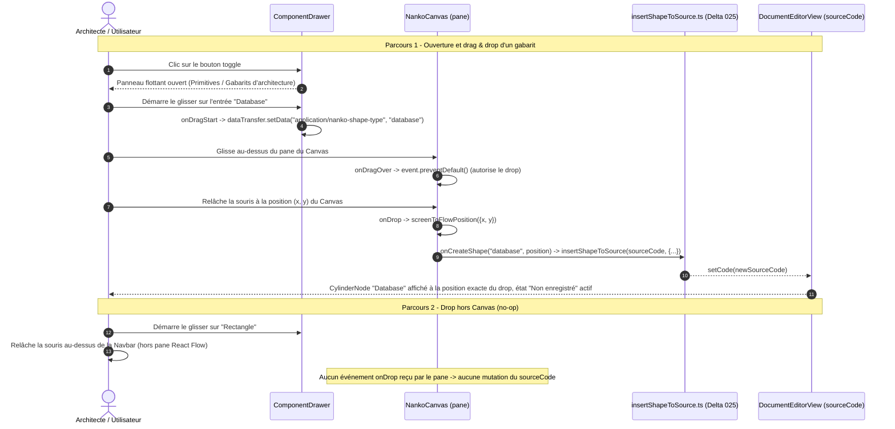

# Spec : 026 - Volet Latéral Escamotable (Component Drawer) & Drag & Drop de Shapes

## Métadonnées
* **Domaine concerné :** `.specs/knowledge/domains/studio-modeling/`
* **Type de changement :** `Évolution`
* **Cible :** `frontend` (Canvas, Drag & Drop natif) + `tests-e2e` (Playwright)
* **Dépendance :** Requiert la livraison préalable (ou simultanée) du **Delta 025** (`.specs/specs/planned/025-architecture-templates-and-radial-menu-extension.md`), dont le catalogue de types (`ShapePrimitiveType` étendu, préfixes/labels) est directement réutilisé.

---

## 1. Intention & Contexte (Le « Why » du Delta)

* **Problème résolu / Besoin :**
  Depuis le Delta 025, 7 types de Shape existent (3 primitives + 4 gabarits d'architecture), mais leur seul point d'entrée de création visuelle reste la roue radiale (`A`/`Tab`), qui devient déjà chargée à 7 secteurs et ne pourra pas indéfiniment absorber de futurs types. La Target `studio-board.md` (§2.2) prévoit un second point d'entrée complémentaire : un **volet latéral escamotable** permettant de parcourir le catalogue complet et de glisser-déposer directement l'élément désiré à l'endroit voulu du Canvas, sans geste clavier à mémoriser.
* **Impact utilisateur :**
  * Un bouton toggle discret sur le bord gauche du Canvas ouvre/ferme un panneau flottant listant les 7 types disponibles, organisés en deux sections : « Primitives » (Rectangle, Circle, Text) et « Gabarits d'architecture » (Database, Service, Gateway, Queue).
  * L'utilisateur glisse une entrée du catalogue et la relâche à l'endroit exact du Canvas où il souhaite déposer la Shape ; celle-ci est injectée dans le `.nanko` à cette position précise, avec le même comportement que la roue radiale (regroupement des shapes, synchronisation `!LAYOUT`, état « Non enregistré »).
  * L'état ouvert/fermé du volet est mémorisé (`localStorage`) et restauré à la prochaine visite ; le volet est **fermé par défaut** à la toute première visite d'un utilisateur, pour ne pas surcharger sa découverte du Studio.
  * Relâcher un élément glissé en dehors du Canvas (Navbar, éditeur de code en mode Split, zone du volet lui-même) n'a aucun effet, sans message d'erreur.
* **In Scope (Ce qui est ajouté/modifié) :**
  * **Nouveau composant `ComponentDrawer.tsx`** (+ CSS Module + tests) : panneau flottant ancré à gauche, bouton toggle, deux sections catégorisées, une entrée `draggable` par type de Shape.
  * **Câblage `onDragStart`** sur chaque entrée du catalogue (`event.dataTransfer.setData('application/nanko-shape-type', type)`), pattern natif HTML5 (sans dépendance npm).
  * **Câblage `onDragOver` / `onDrop`** sur le pane de `NankoCanvas.tsx`, conversion de la position de drop via `screenToFlowPosition`, appel à `onCreateShape` (callback déjà existant depuis le Delta 017, réutilisé tel quel).
  * **Persistance de l'état ouvert/fermé** du volet en `localStorage` (fermé par défaut à la première visite).
  * **Tests unitaires & E2E** du drag & drop de chaque catégorie de type, du toggle, et du drop ignoré hors Canvas.
* **Out of Scope (Exclusions strictes) :**
  * **Recherche/filtre** dans le catalogue du volet : catalogue de seulement 7 entrées, non nécessaire à ce stade.
  * **Raccourci clavier** pour ouvrir/fermer le volet : uniquement le bouton toggle dans ce delta.
  * **Réorganisation de la roue radiale** (curation, sous-menus) suite à l'ajout du volet : dette reconnue mais traitée dans un delta ultérieur distinct.
  * **Toute nouvelle fonction de sérialisation** : ce delta réutilise strictement `insertShapeToSource` (déjà générique depuis le Delta 025), aucune duplication de logique de génération de ligne `.nanko`.
  * **Modification du backend, du schéma SQL ou du contrat `PUT /api/v1/documents/{documentId}`** : delta strictement frontend/UI.

---

## 2. Flux & Architecture (Diff)



---

## 3. Delta Modèle de données & Base de données

Aucune modification du schéma relationnel, de la persistance ni de l'AST. Ce delta est une pure couche d'interaction UI réutilisant le circuit de création déjà établi (`insertShapeToSource` + `onCreateShape`, Delta 017/025) et le circuit de sauvegarde existant (`PUT /api/v1/documents/{documentId}`).

---

## 4. Delta Contrats d'API (Symfony)

Aucun nouvel endpoint ni modification de contrat.

---

## 5. Configuration Réseau, Prérequis DNS & Variables d'Environnement

* **Prérequis DNS :** Aucun.
* **Sécurisation :** Inchangée.
* **Variables d'environnement :** Aucune nouvelle variable.

---

## 6. Delta Maquettes & Layout UI

### 6.1. Volet Ouvert (Overlay Flottant, Bord Gauche)

```text
+----+------------------------------------------------------------+
| ☰  |                                                             |
+----+                                                             |
|PRIM|                    CANVAS REACT FLOW                        |
|▭ Rectangle              (le volet flotte PAR-DESSUS,             |
|● Circle                  ne réduit pas la largeur du Canvas)      |
|T  Text                                                            |
|                                                                    |
|GABARITS D'ARCHITECTURE                                            |
|⛁ Database                                                         |
|⚙ Service                                                          |
|🚪 Gateway                                                         |
|▭ Queue                                                            |
+----+------------------------------------------------------------+
```

### 6.2. Volet Fermé (Bouton Toggle Persistant)

```text
+----+------------------------------------------------------------+
| ☰  |                                                             |
+----+                    CANVAS REACT FLOW                        |
                          (100% de la surface, volet réduit à       |
                           un simple bouton toggle discret)         |
+------------------------------------------------------------------+
```

### 6.3. Arborescence des Fichiers Modifiés & Nouveaux

```text
frontend/src/features/documents/
├── components/canvas/
│   ├── NankoCanvas.tsx                         # onDragOver/onDrop sur le pane, conversion screenToFlowPosition
│   └── drawer/
│       ├── ComponentDrawer.tsx                 # Nouveau : panneau flottant, toggle, catalogue draggable
│       ├── ComponentDrawer.module.css
│       ├── ComponentDrawer.test.tsx
│       └── drawerCatalog.ts                    # Nouveau : liste des 7 entrées (type, label, icône) dérivée de TYPE_DEFAULT_LABELS

tests-e2e/tests/app/
└── canvas-component-drawer.spec.ts             # Nouveau : ouverture/fermeture, drag & drop par catégorie, drop hors Canvas
```

---

## 7. Delta Spécifications UI & Logique Client (React)

### 7.1. Registre du catalogue (`drawerCatalog.ts`)

```typescript
import type { ShapePrimitiveType } from '../utils/insertShapeToSource'

export interface DrawerCatalogEntry {
  type: ShapePrimitiveType
  section: 'Primitives' | 'Gabarits d\'architecture'
  label: string
}

export const DRAWER_CATALOG: DrawerCatalogEntry[] = [
  { type: 'rectangle', section: 'Primitives', label: 'Rectangle' },
  { type: 'circle', section: 'Primitives', label: 'Circle' },
  { type: 'text', section: 'Primitives', label: 'Text' },
  { type: 'database', section: 'Gabarits d\'architecture', label: 'Database' },
  { type: 'service', section: 'Gabarits d\'architecture', label: 'Service' },
  { type: 'gateway', section: 'Gabarits d\'architecture', label: 'Gateway' },
  { type: 'queue', section: 'Gabarits d\'architecture', label: 'Queue' },
]
```

### 7.2. Câblage Drag & Drop natif

```typescript
// ComponentDrawer.tsx - sur chaque entrée du catalogue
<div
  draggable
  onDragStart={(e) => {
    e.dataTransfer.setData('application/nanko-shape-type', entry.type)
    e.dataTransfer.effectAllowed = 'move'
  }}
  data-qa={`drawer-entry-${entry.type}`}
>
  {entry.label}
</div>

// NankoCanvas.tsx - sur le pane React Flow
const handleDragOver = useCallback((event: React.DragEvent) => {
  event.preventDefault()
  event.dataTransfer.dropEffect = 'move'
}, [])

const handleDrop = useCallback((event: React.DragEvent) => {
  event.preventDefault()
  const shapeType = event.dataTransfer.getData('application/nanko-shape-type') as ShapePrimitiveType
  if (!shapeType) return
  const flowPos = screenToFlowPosition({ x: event.clientX, y: event.clientY })
  onCreateShape?.(shapeType, flowPos)
}, [screenToFlowPosition, onCreateShape])
```

### 7.3. Persistance de l'état ouvert/fermé

```typescript
const STORAGE_DRAWER_OPEN_KEY = 'nanko_component_drawer_open'

// Lecture : localStorage.getItem(STORAGE_DRAWER_OPEN_KEY) === 'true' (absence de clé => false, fermé par défaut)
// Écriture : localStorage.setItem(STORAGE_DRAWER_OPEN_KEY, String(isOpen))
```

### 7.4. Matrice des États d'Interface

| État | Déclencheur | Rendu visuel & Comportement |
|---|---|---|
| **Fermé (défaut première visite)** | Aucune clé `localStorage` trouvée | Seul le bouton toggle est visible sur le bord gauche, Canvas à 100% de sa surface. |
| **Ouvert** | Clic sur le toggle (ou état restauré depuis `localStorage`) | Panneau flottant visible avec les 2 sections et les 7 entrées `draggable`. |
| **Glisser en cours (survol Canvas)** | `dragover` sur le pane React Flow | Curseur `move`, aucun effet visuel additionnel requis (pas de fantôme personnalisé dans ce delta). |
| **Drop valide** | `drop` sur le pane React Flow avec un type reconnu | Nouvelle Shape créée à la position exacte du curseur, état « Non enregistré » activé. |
| **Drop invalide/hors cible** | `drop` en dehors du pane (Navbar, éditeur Monaco, volet lui-même) | Aucun événement `onDrop` du pane n'est déclenché, aucune mutation, aucune notification. |

---

## 8. Invariants & Cas limites (*Edge cases*)

1. **Overlay non bloquant :** Le volet ouvert est positionné en `position: absolute`/`fixed` par-dessus le Canvas (jamais en `flex` réduisant sa largeur), cohérent avec le pattern déjà validé par PDR-003 pour la barre d'outils flottante.
2. **Aucune dépendance ajoutée :** Le drag & drop repose exclusivement sur l'API native `HTMLElement.draggable`/`DataTransfer` du navigateur, sans introduire `dnd-kit` ni équivalent — cohérent avec l'absence actuelle de toute librairie de drag & drop dans `frontend/package.json`.
3. **Isolation du type MIME `dataTransfer` :** La clé `application/nanko-shape-type` est spécifique à Nanko ; un `drop` provenant d'un glisser externe au navigateur (fichier, texte d'une autre page) ne contient pas cette clé et est ignoré silencieusement (`if (!shapeType) return`).
4. **Résilience aux erreurs de syntaxe globales :** Si le `sourceCode` est dans un état syntaxiquement invalide (canvas en pause), le `onDrop` reste techniquement actif mais `onCreateShape` hérite du même garde-fou que la roue radiale (pas de garde spécifique supplémentaire à développer, la fonction est déjà partagée).
5. **Type inconnu ou corrompu dans le `dataTransfer` :** Si la valeur lue ne correspond à aucun `ShapePrimitiveType` valide (ex: donnée altérée), le `drop` est traité comme un no-op plutôt que de lever une exception.
6. **Première visite vs visites suivantes :** L'absence de clé `localStorage` est interprétée comme « fermé » (et non comme une valeur par défaut ambiguë), garantissant un état stable et prévisible même après un `localStorage.clear()` manuel.
7. **Compatibilité avec les 3 modes de vue (Split/Canvas/Code) :** Le volet et son bouton toggle ne s'affichent que lorsque le Canvas est visible (modes `Split` et `Canvas`) ; en mode `Code` plein écran, le bouton toggle reste accessible mais le drop est naturellement impossible (aucun pane React Flow rendu) — comportement cohérent avec l'absence de la roue radiale elle-même en mode `Code`.

---

## 9. Plan d'exécution séquentiel

- [ ] **Phase 1 : Frontend Canvas & Composants Graphiques (`frontend/src/features/documents/`)**
  - [ ] 1. Créer `drawerCatalog.ts` (7 entrées, dérivées des labels/types du Delta 025).
  - [ ] 2. Créer `ComponentDrawer.tsx` (+ CSS Module) : bouton toggle, panneau flottant ancré à gauche, 2 sections, entrées `draggable`, persistance `localStorage`.
  - [ ] 3. Câbler `onDragOver`/`onDrop` sur le pane de `NankoCanvas.tsx`, réutilisant `onCreateShape` et `screenToFlowPosition`.
  - [ ] 4. Intégrer `ComponentDrawer` dans `DocumentEditorView.tsx` (visible en modes Split/Canvas uniquement).

- [ ] **Phase 2 : Tests Unitaires Frontend (`frontend/`)**
  - [ ] 1. `ComponentDrawer.test.tsx` : toggle, persistance `localStorage`, rendu des 2 sections et 7 entrées.
  - [ ] 2. Tests unitaires `NankoCanvas.test.tsx` : `onDrop` avec type valide déclenche `onCreateShape`, `onDrop` avec type absent/invalide est un no-op.
  - [ ] 3. Valider la suite complète : `pnpm --filter frontend typecheck`, `pnpm --filter frontend lint`, `pnpm --filter frontend test`.

- [ ] **Phase 3 : End-to-End (`tests-e2e/`)**
  - [ ] 1. Créer `canvas-component-drawer.spec.ts` : ouverture du volet, glisser-déposer d'une primitive et d'un gabarit vers des positions distinctes du Canvas, vérification du `sourceCode` après `Cmd+S`, tentative de drop hors Canvas (aucun effet), persistance de l'état ouvert après rechargement.
  - [ ] 2. Valider la suite complète : `make test-e2e`.

- [ ] **Phase 4 : Synchronisation documentaire (Automatisable via `/sync-current`)**
  - [ ] 1. Mettre à jour `.specs/knowledge/domains/studio-modeling/behavior.md` (nouveau Parcours décrivant le volet et le drag & drop).
  - [ ] 2. Mettre à jour `.specs/knowledge/domains/studio-modeling/tech.md` (`ComponentDrawer`, `drawerCatalog.ts`).
  - [ ] 3. Déplacer ce fichier dans `.specs/specs/archive/026-component-drawer-drag-and-drop.md`.
  - [ ] 4. Mettre à jour la Target `.specs/targets/active/studio-board.md` (§2.2) pour cocher le volet latéral livré.

---

## 10. Definition of Done & Stratégie de tests

### 10.1. Scénarios de validation (Format Gherkin avec tags)

```gherkin
# ==============================================================================
# TESTS FRONTEND (frontend/ - Unitaires & Composants React)
# ==============================================================================

@web @unit
Fonctionnalité: Volet latéral escamotable et drag & drop de Shapes

  Scénario: Le volet est fermé par défaut à la première visite
    Étant donné aucune clé "nanko_component_drawer_open" dans le localStorage
    Quand le ComponentDrawer est monté
    Alors le panneau est rendu en état fermé

  @web @unit
  Scénario: Le toggle ouvre le volet et persiste l'état
    Étant donné le ComponentDrawer fermé
    Quand l'utilisateur clique sur le bouton toggle
    Alors le panneau s'ouvre et "localStorage" contient la valeur "true" pour la clé du volet

  @web @unit
  Scénario: Le catalogue affiche les 2 sections avec les 7 entrées
    Étant donné le ComponentDrawer ouvert
    Alors la section "Primitives" contient "Rectangle", "Circle", "Text"
    Et la section "Gabarits d'architecture" contient "Database", "Service", "Gateway", "Queue"

  @web @unit
  Scénario: Le drop avec un type valide déclenche la création
    Quand "onDrop" est simulé sur le pane avec "application/nanko-shape-type" = "database"
    Alors "onCreateShape" est appelé avec le type "database" et la position calculée

  @web @unit
  Scénario: Le drop sans type reconnu est un no-op
    Quand "onDrop" est simulé sur le pane sans donnée "application/nanko-shape-type"
    Alors "onCreateShape" n'est pas appelé

# ==============================================================================
# TESTS E2E (tests-e2e/ - Parcours complet sur le Canvas interactif)
# ==============================================================================

@e2e @preprod
Fonctionnalité: Création de Shapes par glisser-déposer depuis le volet latéral

  Scénario: Glisser-déposer un gabarit depuis le volet vers le Canvas
    Étant donné que l'utilisateur édite un document vide et ouvre le volet latéral
    Quand il glisse l'entrée "Database" et la dépose à une position précise du Canvas
    Et qu'il sauvegarde via "Cmd+S"
    Alors le code source contient une nouvelle ligne "database db_1 label=..."
    Et le bloc "!LAYOUT" contient les coordonnées correspondant à la position du drop

  Scénario: Le volet reste ouvert après rechargement
    Étant donné que l'utilisateur a ouvert le volet latéral
    Quand la page est rechargée
    Alors le volet latéral est toujours affiché en état ouvert

  Scénario: Un drop hors du Canvas n'a aucun effet
    Étant donné que l'utilisateur édite un document avec le volet ouvert
    Quand il glisse une entrée du catalogue et relâche la souris au-dessus de la Navbar
    Alors aucune nouvelle Shape n'apparaît dans le code source
```

### 10.2. Commandes de validation automatisée

```bash
# 1. Validation Frontend (Typecheck, Lint, Tests unitaires)
pnpm --filter frontend typecheck
pnpm --filter frontend lint
pnpm --filter frontend test

# 2. Validation End-to-End Playwright
make test-e2e
```
