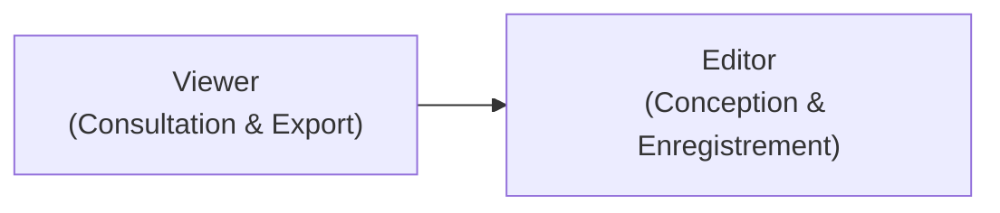

# Target : Studio, Board & Document ("Schema")

> **Statut :** Active (Cible en cours de cadrage et d'implémentation)  
> **Domaine associé :** `workspace-management`  
> **Origine :** Remplacement structuré de `CONCEPT.md`

Ce document spécifie les évolutions fonctionnelles et ergonomiques cibles pour la surface de modélisation visuelle (**Board**) et le **Document** Nanko, en partant de la base existante (visualisation React Flow, édition `.nanko` texte, drag de nœuds et synchronisation de `!LAYOUT`).

---

## 1. État Actuel vs État Cible

| Aspect | Existant (Base actuelle) | Cible Visée (Cette Target) |
|---|---|---|
| **Création d'éléments** | Exclusivement par saisie de texte dans le code source `.nanko`. | **Roue d'outils radiale** au curseur + **Volet latéral escamotable** (Drag & Drop). |
| **Création de connecteurs** | Manuelle dans le texte (`source -> target`). | **Tracé visuel libre** avec **magnétisme automatique** vers la Shape la plus proche. |
| **Édition des propriétés** | Édition du texte brut dans l'éditeur de code. | **Édition in-place** (double-clic) + **Popover contextuelle rapide** au-dessus de l'élément. |
| **Gestion des droits** | Pas de restriction par rôle/capability sur le studio. | **2 niveaux de Capability** : `viewer` (lecture seule) et `editor` (édition du Board/Document). |
| **Traçabilité & Historique** | Pas de suivi des actions unitaires (uniquement sauvegardes manuelles). | **Journal d'Activité granulaire (style Notion)** action par action, avec Diff visuel et restauration non destructive. |
| **Expérience Canvas** | Consultation, déplacement libre de nœuds, auto-layout Dagre. | Modélisation visuelle autonome complète, synchronisée bidirectionnellement avec le code. |

---

## 2. Outils de Création & Assistance sur le Board

### 2.1. Roue d'Outils Radiale (*Pie / Radial Menu*)
- **Déclenchement adapté Mac & Trackpad :** 
  - S'ouvre directement sous le pointeur de la souris par **maintien d'une touche clavier dédiée** (ex: touche `A` pour *Add* ou `Tab` maintenue).
  - Ce mécanisme clavier + trackpad offre une fluidité optimale sur macOS sans exiger de clic droit physique ni de geste complexe à deux doigts.
  - Relâcher la touche sans avoir cliqué sur un secteur referme instantanément la roue.
- **Comportement de placement (Dépôt immédiat) :**
  - Cliquer sur un secteur de la roue dépose immédiatement la Shape à l'emplacement exact du pointeur et referme la roue en un seul geste fluide.
- **Organisation des secteurs :**
  - **Primitives** : `Rectangle`, `Circle`, `Text`.
  - **Gabarits d'architecture** : `Database`, `Service`, `Queue`, `Gateway`.
  - **Conteneur** : `Group` / Boîte de périmètre pour regrouper visuellement des Shapes.
  - **Outil Connecteur** : Entrée directe en mode tracé de flux magnétique.

### 2.2. Volet Latéral Escamotable (*Component Drawer / Sidebar*)
- **Position & Comportement :** Volet escamotable situé sur le bord du canvas, rétractable d'un clic pour préserver 100% de la surface de travail.
- **Catalogue complet :**
  - **Formes de base (.nanko primitives)** : `Rectangle`, `Circle`, `Text`.
  - **Gabarits d'architecture pré-typés** : Base de données, Microservice, API Gateway, Broker/File de messages.
  - **Conteneurs / Groupes** : Zones de délimitation visuelle (clusters, sous-systèmes, tiers).
- **Glisser-Déposer (*Drag & Drop*) :** L'utilisateur tire n'importe quel élément depuis le volet et le lâche précisément à l'endroit désiré sur la grille du Board.

### 2.3. Assistance Spatiale : Guides d'Alignement Dynamiques (*Smart Guides*)
- **Magnétisme d'alignement intelligent :**
  - Lors du déplacement d'une Shape sur le Board, des guides d'alignement dynamiques (lignes directrices visuelles temporaires) apparaissent dès que la Shape s'aligne horizontalement ou verticalement avec une autre Shape (alignement sur les centres ou sur les bords).
  - Un léger magnétisme verrouille le mouvement sur ces axes pour garantir des schémas d'architecture rigoureux sans effort d'ajustement au pixel près.

---

## 3. Interactions Entre les Éléments & Connecteurs

### 3.1. Tracé Libre & Magnétisme Automatique des Connecteurs
- **Visibilité contextuelle des poignées (Handles) :**
  - Les poignées d'ancrage (*handles*) ne sont **visibles que lors de la sélection d'un objet** sur le Board (ou lorsqu'un tracé de connexion en cours s'en approche).
  - Au repos (aucun élément sélectionné), les poignées restent entièrement invisibles afin de préserver une lisibilité maximale et un rendu d'architecture épuré sans pollution visuelle.
- **Tracé visuel libre :**
  - L'utilisateur tire une ligne depuis une Shape ou depuis l'outil de connexion.
  - Le tracé est libre et fluide pendant le mouvement de la souris.
- **Magnétisme automatique (*Snap*) :**
  - Lorsque la ligne approche d'une Shape existante, le connecteur se magnétise automatiquement sur le point d'ancrage le plus pertinent de la Shape cible (détection de proximité).
  - Un indicateur visuel (apparition et surbrillance de la poignée magnétique cible) confirme le verrouillage avant le relâchement.
- **Finalisation :**
  - Au relâchement, le `Connector` est créé dans le modèle sémantique `.nanko`.
  - Une micro-popover propose immédiatement de saisir un label optionnel (ex: `"gRPC"`, `"HTTPS"`).

### 3.2. Édition des Propriétés : In-Place & Popover Contextuelle
- **Édition In-Place (Double-clic) :**
  - Double-clic sur le libellé d'une Shape : transforme le texte en champ d'édition inline focalisé.
  - Double-clic sur l'étiquette d'un Connector : permet de modifier ou d'ajouter directement le label du flux.
  - Validation par `Entrée` ou clic extérieur ; annulation par `Échap`.
- **Popover Contextuelle Rapide :**
  - Apparaît au-dessus de l'élément sélectionné d'un simple clic.
  - Propose des actions rapides :
    - Modifier l'identifiant (`@id`).
    - Changer le type/variante de la Shape.
    - Ajouter / Éditer le label d'un connecteur.
    - Inverser le sens du connecteur.
    - Dupliquer (`Cmd+D` / `Ctrl+D`).
    - Supprimer (`Suppr` / `Backspace`).

### 3.3. Intégrité Référentielle & Suppression
- **Suppression d'une Shape :**
  - La suppression d'une Shape supprime automatiquement en cascade tous les connecteurs entrants et sortants liés.
  - Les coordonnées dans le bloc `!LAYOUT` sont nettoyées.
- **Suppression d'un Connector :**
  - Supprime la relation sans impacter les Shapes associées.

### 3.4. Conteneurs / Groupes (*Groups & Clusters*)
- **Rôle fonctionnel :** Délimiter visuellement un sous-système, cluster d'infrastructure ou périmètre applicatif regroupant plusieurs Shapes.
- **Entraînement spatial automatique :**
  - Toute Shape positionnée à l'intérieur du périmètre d'un Conteneur est considérée comme son enfant spatial.
  - Déplacer le conteneur déplace automatiquement et de façon solidaire l'ensemble de ses Shapes enfants (maintien rigoureux des positions relatives).
- **Style visuel Blueprint :**
  - Fond translucide discret avec bordure technique pointillée ou fine.
  - En-tête avec titre éditable in-place (double-clic) et badge d'identification.
  - Poignées de redimensionnement libre aux 4 angles.

### 3.5. Navigation Inter-Layers (Liaison entre Documents)
- **Liaison d'une Shape vers un autre Document :**
  - Une Shape peut pointer vers un Document distinct (généralement positionné sur un autre `Layer`).
  - Un badge de profondeur cliquable (ex: `Layer 1 →`) apparaît sur la Shape pour plonger directement dans le Document cible au clic.

---

## 4. Modèle de Droits & Capabilities Cible

L'accès et les actions sur le Board et le Document sont gouvernés par deux niveaux de **Capability** :

### 4.1. Matrice Fonctionnelle des Droits

| Action sur le Studio | `viewer` | `editor` |
|---|:---:|:---:|
| **Navigation Board (Pan, Zoom, Fit View, Minimap)** | ✅ | ✅ |
| **Inspection visuelle & lecture du code .nanko** | ✅ | ✅ |
| **Export du schéma (PNG, SVG)** | ✅ | ✅ |
| **Consulter le Journal d'Activité et inspecter les diffs** | ✅ | ✅ |
| **Ouvrir la roue d'outils radiale & le volet latéral** | ❌ | ✅ |
| **Ajout, déplacement et suppression de Shapes** | ❌ | ✅ |
| **Tracé et suppression de Connectors** | ❌ | ✅ |
| **Édition in-place des libellés et propriétés** | ❌ | ✅ |
| **Enregistrement des modifications du Document** | ❌ | ✅ |
| **Restaurer un état depuis le Journal d'Activité** | ❌ | ✅ |

### 4.2. Adaptation de l'Interface selon la Capability
- **Mode `viewer` (Lecture seule) :**
  - La roue radiale et le volet latéral d'ajout sont désactivés/masqués.
  - Les Shapes ne sont pas déplaçables (canvas verrouillé en position, navigation pan/zoom préservée).
  - L'éditeur de code est en lecture seule (`readOnly`).
  - Un badge discret « Lecture seule » s'affiche dans la barre supérieure.
- **Mode `editor` (Atelier de conception) :**
  - Accès complet aux outils de création, d'édition in-place, de connexion magnétique, de traçabilité et d'enregistrement des modifications.

---

## 5. Synchronisation Bidirectionnelle Document $\leftrightarrow$ Board

1. **Manipulation Visuelle $\rightarrow$ Code `.nanko` :**
   - Tout ajout ou suppression de Shape/Connector met à jour l'AST et régénère les déclarations sémantiques.
   - Tout déplacement met à jour les coordonnées dans le bloc `!LAYOUT`.
   - L'état « Non enregistré » s'active immédiatement, prêt pour une sauvegarde (`Cmd+S`).
2. **Édition Code $\rightarrow$ Board :**
   - L'analyse syntaxique met à jour l'arbre de rendu du Board en continu.
   - En cas d'erreur de syntaxe pendant la frappe, le canvas se fige sur son dernier état cohérent (badge « Canvas en pause ») sans désorienter l'utilisateur.
3. **Historique Temporel & Undo / Redo Unifié (`Cmd+Z` / `Cmd+Shift+Z`) :**
   - La pile d'annulation unifie indistinctement les manipulations graphiques (déplacement d'une Shape, ajout d'un connecteur, redimensionnement d'un conteneur, auto-layout Dagre) et les modifications de code textuel.
   - Un `Cmd+Z` restaure l'état précédent du Document tout en recalculant simultanément le Canvas React Flow et l'éditeur de texte, sans risque de désynchronisation.

---

## 6. Référentiel des Raccourcis Clavier & Accès Cheatsheet

Afin de garantir une vélocité maximale et une prise en main immédiate, Nanko adopte les conventions ergonomiques standard de l'industrie (Figma, Miro, VS Code).

### 6.1. Accès à la Liste des Raccourcis (*Cheatsheet Modal*)
- **Déclenchement clavier :** 
  - Touche `?` (ou `Shift+/`) ou combinaison `Cmd+/` (Mac) / `Ctrl+/` (Linux/Windows).
- **Déclenchement souris :** 
  - Bouton discret d'aide `?` intégré à l'extrémité de la barre d'outils flottante supérieure.
- **Présentation :** 
  - Modale technique Blueprint épurée organisée par catégories (Outils, Navigation, Édition, Système) avec recherche rapide de raccourci.

### 6.2. Table des Raccourcis Clavier

| Catégorie | Raccourci Mac | Raccourci Win/Linux | Action Fonctionnelle |
|---|---|---|---|
| **Outils** | `A` ou `Tab` *(maintenu)* | `A` ou `Tab` *(maintenu)* | Ouvrir la **Roue radiale d'outils** sous le curseur |
| | `V` ou `Échap` | `V` ou `Échap` | Outil **Pointeur / Sélection** (ou désélectionner) |
| | `R` | `R` | Déposer rapidement une Shape **Rectangle** |
| | `C` | `C` | Déposer rapidement une Shape **Circle** |
| | `T` | `T` | Déposer rapidement une Shape **Text** |
| | `L` | `L` | Activer l'outil **Connecteur** (tracé magnétique libre) |
| | `G` | `G` | Grouper les éléments sélectionnés dans un **Conteneur** |
| **Navigation** | `Espace` *(maintenu)* | `Espace` *(maintenu)* | Mode **Main (Pan)** pour naviguer sans déplacer d'objet |
| | `Cmd + 0` | `Ctrl + 0` | **Fit View** : recentrer et adapter la vue à tout le graphe |
| | `Cmd + +` / `Cmd + -` | `Ctrl + +` / `Ctrl + -` | **Zoom avant / arrière** |
| | `Shift + L` | `Shift + L` | **Auto-Layout** : réorganiser le graphe (Dagre) |
| | `Cmd + 1 / 2 / 3` | `Ctrl + 1 / 2 / 3` | Basculer de vue Studio (**Split / Canvas / Code**) |
| **Édition** | `Double-clic` ou `Entrée` | `Double-clic` ou `Entrée` | **Édition in-place** du libellé / texte |
| | `Cmd + D` | `Ctrl + D` | **Dupliquer** la sélection avec décalage visuel |
| | `Suppr` ou `Retour` | `Suppr` ou `Retour` | **Supprimer** l'élément sélectionné (cascade connecteurs) |
| | `Cmd + Z` | `Ctrl + Z` | **Annuler** (Undo) |
| | `Cmd + Shift + Z` | `Ctrl + Y` | **Rétablir** (Redo) |
| | `Cmd + S` | `Ctrl + S` | **Enregistrer** les modifications du Document |
| **Aide** | `?` ou `Cmd + /` | `?` ou `Ctrl + /` | Ouvrir la **Cheatsheet des raccourcis** |

---

## 7. Traçabilité Granulaire & Journal d'Activité (Style Notion)

Le **Journal d'Activité** assure une traçabilité granulaire de **chaque action unitaire** réalisée au fil de l'eau sur le Document par les collaborateurs.

### 7.1. Flux d'Activité Action par Action (*Activity Feed*)
- **Accès dans le Studio :**
  - Bouton d'historique / cloche d'activité dans la barre d'outils ouvrant un volet latéral dédié (*Activity Drawer*).
- **Format d'une entrée d'action :**
  Chaque micro-action collaborative est tracée individuellement sous forme d'un événement typé :
  - **Auteur** : Avatar et nom du membre ayant déclenché l'action.
  - **Horodatage** : Timestamp relatif dynamique (*« Il y a 3 minutes »*) et absolu au survol (*« 8 sept. 2026 à 07:12:45 »*).
  - **Nature de l'action & cible** :
    - *« A ajouté la Shape `auth-service` (Rectangle) »*
    - *« A déplacé la Shape `users-db` »*
    - *« A tracé le connecteur `gateway` → `auth-service` (« HTTPS ») »*
    - *« A renommé le libellé de `auth-service` en « Identity Provider » »*
    - *« A groupé 3 Shapes dans le conteneur « Ingress Zone » »*
    - *« A appliqué un Auto-Layout Dagre »*
    - *« A supprimé le connecteur `legacy-api` »*

### 7.2. Diff Visuel et Textuel Contextuel
- **Mise en valeur au clic / survol :**
  - Cliquer sur une entrée d'action ou la survoler isole visuellement l'impact de cette action précise :
    - **Sur le Board (Diff Graphique)** :
      - **Vert** : Shape ou Connector nouvellement créé.
      - **Ambre / Bleu** : Élément modifié (déplacement, redimensionnement, libellé édité).
      - **Rouge / Pointillés fantômes** : Élément supprimé lors de cette action.
      - Auto-centrage fluide de la vue (*smooth pan*) sur l'élément concerné.
    - **Dans le Code (Diff Textuel)** :
      - Affiche un encart de diff textuel compact (`+` / `-`) montrant les lignes impactées dans le code `.nanko` ou dans le bloc `!LAYOUT`.

### 7.3. Restauration Non-Destructive (*Point-in-time Restore*)
- **Action « Revenir à cet état » :**
  - Chaque entrée du flux d'activité propose une action de restauration ciblée.
  - Cliquer sur cette action recharge l'état exact du Document (sémantique + spatial) tel qu'il était immédiatement après cette action.
- **Principe de non-destructivité :**
  - La restauration n'écrase ni ne tronque l'historique antérieur : elle enregistre une nouvelle action dans le Document (*« A restauré l'état du 8 sept. à 07:12 »*), préservant une traçabilité totale et continue.
