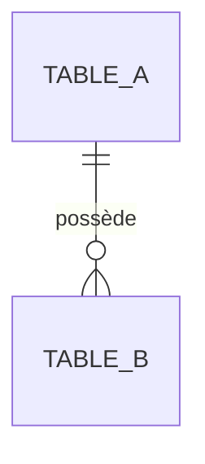

# Domaine : [Nom du Domaine] - Modèles & Schéma de Données

## 1. Modèle Domaine (Core)

### Agrégat : `[Nom de l'Agrégat]`
* **Entité racine :** `backend/src/Core/Domain/[Aggregate]/[Aggregate].php`
* **Identifiant :** `backend/src/Core/Domain/[Aggregate]/Id.php` (UUIDv7)
* **Value Objects :**
  * `[VO 1]` : Description

---

## 2. Schéma de Base de Données Actif

### Table : `[nom_de_la_table]`
* **Migration initiale :** `backend/migrations/Version[...].php`
* **Repository DBAL :** `backend/src/Adapter/Driven/Persistence/[Aggregate]/DoctrineRepository.php`
* **Type DBAL :** `backend/src/Adapter/Driven/Persistence/[Aggregate]/DoctrineId.php`

| Colonne | Type SQL | Nullable | Contraintes / Index | Description |
|---|---|---|---|---|
| `id` | `uuid` | Non | `PRIMARY KEY` | UUIDv7 de l'entité |
| `created_at` | `timestamp with time zone` | Non | `DEFAULT NOW()` | Date de création |
| `[champ]` | `varchar(255)` | Non | `INDEX` | Description métier |

---

## 3. Relations & Diagramme ERD

