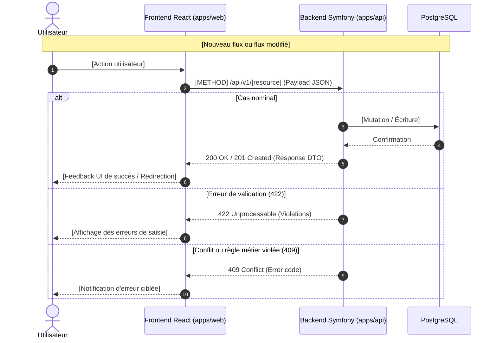
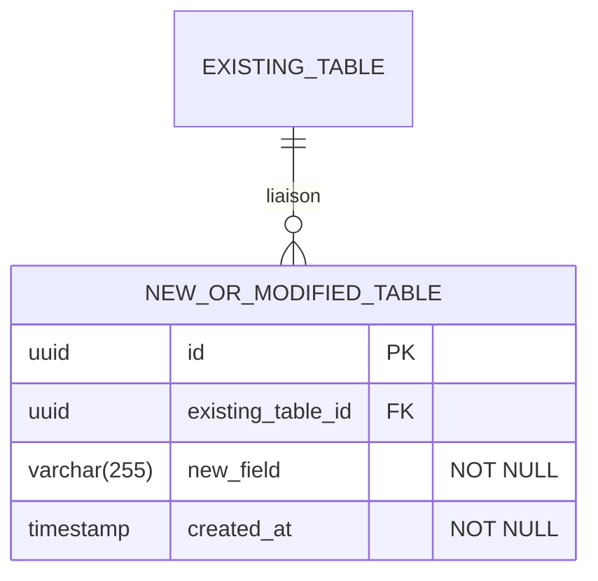

# Arborescence complète

```markdown
monorepo/
├── .claude/
│   └── commands/                      # Les skills exécutables par Claude Code
│       ├── spec.md                    # /spec : Rédige une demande d'évolution (Delta)
│       ├── build-spec.md              # /build-spec : Exécute le code et les tests
│       ├── sync-current.md            # /sync-current : Met à jour l'état courant et archive
│       ├── new-pdr.md                 # /new-pdr : Documente un arbitrage produit
│       └── new-adr.md                 # /new-adr : Documente un arbitrage technique
│
├── .specs/
│   ├── CHANGE_TEMPLATE.md             # Template Markdown structuré en diff/delta
│   ├── vision.md                      # Invariants produit & UX globaux
│   ├── architecture.md                # Invariants techniques globaux (monorepo, CI/CD)
│   │
│   ├── current/                       # ÉTAT COURANT DU SYSTÈME (Source de vérité vivante)
│   │   └── domains/
│   │       ├── auth-and-identity/
│   │       │   ├── behavior.md        # Parcours UX et règles métier actuellement en prod
│   │       │   ├── tech.md            # Patterns, services et stack du domaine
│   │       │   ├── contracts.md       # Endpoints REST/OAuth et schémas Zod actifs
│   │       │   └── models.md          # Entités Doctrine et schéma DB actif
│   │       │
│   │       └── workspace-management/
│   │           ├── behavior.md
│   │           ├── tech.md
│   │           ├── contracts.md
│   │           └── models.md
│   │
│   ├── changes/                       # DEMANDES D'ÉVOLUTION (Deltas temporaires)
│   │   ├── active/                    # Évolutions en cours de cadrage ou d'implémentation
│   │   │   ├── 001-init-auth.md
│   │   │   └── 002-add-magic-link.md
│   │   └── archive/                   # Évolutions livrées en prod (historique immuable)
│   │       └── 000-bootstrap-repo.md
│   │
│   └── decisions/                     # REGISTRE DES DÉCISIONS STRUCTURANTES (« LE WHY »)
│       ├── product/                   # PDRs (Product Decision Records)
│       │   └── PDR-001-auto-login.md
│       └── architecture/              # ADRs (Architecture Decision Records)
│           └── ADR-001-league-oauth2.md
```

## Templates

- Vision
- Architecture
- CHANGE_TEMPLATE.md
- Product Decision Record (PRD)
- Architecture Decision Record (ADR)
- Comportement (Domain Behavior)
- Technique (Domain Tech)

# Rôle des skills Claude Code

| **Commande** | **Rôle** | **Entrées lues** | **Sorties produites** |
| --- | --- | --- | --- |
| `/spec [domaine] [besoin]` | Interviewe le dev, compare avec l'état courant et génère la spec de delta. | `.specs/current/domains/[domaine]/*`

`CHANGE_TEMPLATE.md` | `.specs/changes/active/XXX-[nom].md` |
| `/new-pdr [sujet]` | Formalise un arbitrage fonctionnel ou d'ergonomie structurant. | Contexte de discussion | `.specs/decisions/product/PDR-XXX.md` |
| `/new-adr [sujet]` | Formalise un choix technique (bundle, protocole, stockage). | Contexte de discussion | `.specs/decisions/architecture/ADR-XXX.md` |
| `/build-spec [id]` | Implémente le code (Symfony/React), joue les migrations et valide la DoD. | `.specs/changes/active/XXX.md`

`.specs/current/domains/[domaine]/*` | Code source

Suites de tests au vert |
| `/sync-current [id]` | Répercute le delta livré dans les fichiers de l'état courant et archive la spec. | `.specs/changes/active/XXX.md` | `.specs/current/domains/[domaine]/*` mis à jour

Déplacement vers `changes/archive/` |

# Le workflow pas à pas

- **Schema**
    
    ```mermaid
    flowchart TD
        A[Idée / Besoin d'évolution] --> B["1. /spec [domaine] [besoin]"]
        B --> C["Lecture de l'état courant (.specs/current) & Génération du Delta"]
        C --> D["2. Relecture & Validation humaine du fichier Markdown"]
        D -->|Ajustements nécessaires| D
        D -->|Spec validée| E["3. /build-spec [id]"]
        E --> F["Implémentation Backend (Symfony) & Frontend (React)"]
        F --> G["Exécution des tests (Unit, Integration, E2E Préprod)"]
        G -->|Échec tests| F
        G -->|Tous tests OK| H["4. /sync-current [id]"]
        H --> I["Mise à jour de .specs/current/ (behavior, contracts, models)"]
        I --> J["Archivage de la spec dans changes/archive/"]
    ```
    

**Étape 1 : Cadrage assisté par IA (`/spec`)**
Tu décris le besoin brut. L'agent charge uniquement le dossier `current/domains/[domaine]/` pour comprendre ce qui existe déjà, te pose au maximum 2 questions de cadrage si nécessaire, puis génère le fichier `changes/active/XXX-[nom].md`.

**Étape 2 : Relecture et validation humaine**
Tu relis le delta : wireframes ASCII, DTOs, modifications DB et scénarios Gherkin. Tu affines le fichier en quelques secondes directement dans ton éditeur.

**Étape 3 : Implémentation autonome (`/build-spec`)**
L'agent lit le delta et l'état courant, écrit les migrations Doctrine, le code Symfony/React, et implémente les tests correspondant aux scénarios Gherkin. Il boucle jusqu'à ce que `phpstan`, `phpunit`, `typecheck` et `playwright` soient 100 % au vert.

**Étape 4 : Synchronisation et archivage (`/sync-current`)**
Une fois la fonctionnalité validée, l'agent extrait les ajouts du delta pour mettre à jour `behavior.md`, `contracts.md` et `models.md` du domaine concerné, puis déplace le fichier de spec active dans `changes/archive/`.

# Documents

Vision
```markdown
# Vision Produit & Invariants Globaux

## 1. Raison d'être & Cible
* **Mission :** [Description en 1-2 phrases du problème fondamental résolu par la plateforme].
* **Cible prioritaire :** [Persona clé : profil métier, niveau technique et contexte d'usage].
* **Proposition de valeur :** [Bénéfice immédiat différenciant pour l'utilisateur].
* **North Star Metric :** [Indicateur unique mesurant la valeur réelle délivrée à l'utilisateur].

---

## 2. Principes directeurs de l'expérience (UX & Product Tenets)
Ces principes guident les arbitrages fonctionnels et d'interface en cas d'ambiguïté :
* **Accès « Zéro Confiance » (*Zero Trust*) :** Toute surface applicative est verrouillée par défaut ; aucune donnée privée n'est accessible sans session authentifiée active.
* **Feedback immédiat & Transparence :** Aucune action silencieuse. Chaque mutation déclenche un état de chargement visible, un retour de succès ou un message d'erreur actionnable.
* **Simplicité & Zéro friction :** Moins de 3 clics pour accomplir l'action principale. L'interface guide l'utilisateur vers l'étape suivante sans surcharge cognitive.
* **Non-destructivité par défaut :** Toute suppression d'élément structurant exige une confirmation explicite ; privilégier l'archivage réversible (*soft delete*).

---

## 3. Cartographie des Domaines Métier (*Bounded Contexts*)

| Domaine | Répertoire | Responsabilité & Périmètre |
|---|---|---|
| **Identité & Accès** | `domains/auth-and-identity/` | Inscription, sessions OAuth 2.0, sécurité des comptes et profils. |
| **Espaces de travail** | `domains/workspace-management/` | Organisation des équipes, invitations, contextes collaboratifs et rôles. |
| **Facturation & Quotas** | `domains/billing/` | Abonnements, intégration PSP (Stripe), gestion des plans et limites d'usage. |
```

Architecture
```markdown
# Architecture Technique & Invariants Globaux

## 1. Topologie du Monorepo

```text
monorepo/
├── apps/
│   ├── api/       # Backend Symfony 7 (PHP 8.3+) - API REST & Serveur OAuth 2.0
│   ├── web/       # Frontend SPA React 19 (TypeScript, Vite, Tailwind CSS)
│   └── e2e/       # Tests End-to-End Playwright (exécution ciblée préprod)
└── .specs/        # Documentation vivante, décisions et flux de changements
```

---

## 2. Stack Technique & Versions de Référence
* **Backend (`apps/api`) :** PHP 8.3+, Symfony 7.x, PostgreSQL 16+, Doctrine ORM, `league/oauth2-server-bundle`.
* **Frontend (`apps/web`) :** Node.js 22+, React 19, TypeScript 5.x, Vite, Tailwind CSS, TanStack Query, React Hook Form, Zod.
* **E2E & Outillage (`apps/e2e`) :** Playwright, pnpm workspaces.

---

## 3. Invariants Techniques & Standards

### Conventions d'API REST & Contrats
* **Routage :** Endpoints préfixés par `/api/v1/`, ressources nommées en kebab-case au pluriel (ex. `/api/v1/workspace-members`).
* **Format payload :** JSON strict (`Content-Type: application/json`).
* **DTOs Backend :** Classes PHP `final readonly` avec contraintes Symfony Validator (`#[Assert\*]`).
* **Format des erreurs :**
  * Erreur de validation (`422`) : `{"violations": [{"propertyPath": "email", "title": "Format invalide"}]}`.
  * Erreur métier / Conflit (`409`, `400`, `403`) : `{"code": "MACHINE_READABLE_CODE", "message": "Description lisible."}`.

### Sécurité & Authentification
* **Sessions :** Spécification OAuth 2.0 (RFC 6749) avec jetons JWT Bearer signés en RS256.
* **Rotation :** Jetons d'accès courts (60 min) + refresh tokens à usage unique révoqués à la rotation.
* **Stockage sensible :** Mots de passe hashés avec Argon2id. Interdiction stricte de loguer des identifiants ou tokens dans Monolog.

### Frontend & Logique Client
* **Typage :** TypeScript en mode `strict: true`. Aucun usage de `any` toléré.
* **Validation :** Schémas Zod systématiques à la frontière des formulaires et des réponses API.
* **Intercepteur HTTP :** Gestion transparente du rafraîchissement des jetons sur réception d'un code `401` avec file d'attente des requêtes concurrentes.

---

## 4. Stratégie de Tests & Portes de Qualité (*Quality Gates*)

| Application | Niveau de test | Outil | Règle d'exécution |
|---|---|---|---|
| `apps/api` | Analyse statique | PHPStan (Niveau 8+) | `vendor/bin/phpstan analyse src/` |
| `apps/api` | Unit & Intégration | PHPUnit + DB de test | `vendor/bin/phpunit` |
| `apps/web` | Typage & Lint | `tsc` + ESLint | `pnpm --filter web typecheck && pnpm --filter web lint` |
| `apps/web` | Unit & Intégration UI | Vitest + RTL + MSW | `pnpm --filter web test` |
| `apps/e2e` | End-to-End | Playwright | `pnpm --filter e2e exec playwright test` (contre préprod) |

---

## 5. Règles de Base de Données & Migrations
* **Identifiants :** UUIDv7 obligatoire pour les clés primaires de toutes les entités métier.
* **Migrations :** Toute évolution de schéma passe obligatoirement par une migration Doctrine versionnée sous `apps/api/migrations/`.
* **Rétrocompatibilité :** Interdiction d'ajouter une colonne `NOT NULL` sans valeur par défaut sur des tables existantes en production.
```
CHANGE_TEMPLATE.md
```markdown
# Change : [XXX] - [Nom de l'évolution]

## Métadonnées
* **Domaine concerné :** `.specs/current/domains/[nom-du-domaine]/`
* **Type de changement :** `Nouveau module` | `Évolution` | `Refonte` | `Fix`
* **Cible :** `Fullstack` | `apps/api` | `apps/web` | `apps/e2e`

---

## 1. Intention & Contexte (Le « Why » du Delta)
* **Problème résolu / Besoin :** [Explication en 1-2 phrases du besoin et de l'irritant utilisateur traité].
* **Impact utilisateur :** [Ce qui change concrètement dans l'expérience par rapport à l'état courant].
* **In Scope (Ce qui est ajouté/modifié) :**
  * [Livrable ou modification 1]
  * [Livrable ou modification 2]
* **Out of Scope (Exclusions strictes) :**
  * [Comportement non touché ou reporté]

---

## 2. Flux & Architecture (Diff)



---

## 3. Delta Modèle de données & Base de données

### 3.1. Diagramme Entité-Relation (ERD - Nouveaux éléments / Liaisons)



### 3.2. Modifications de tables

#### Table : `[nom_de_la_table]` (`Création` | `Modification`)
* **Entité cible :** `apps/api/src/Entity/[EntityName].php`
* **Repository :** `apps/api/src/Repository/[EntityName]Repository.php`

| Action | Champ | Type SQL / Doctrine | Nullable | Contraintes & Index | Description métier |
|---|---|---|---|---|---|
| `Ajout` | `id` | `uuid` (v7) | Non | `PRIMARY KEY` | Identifiant unique généré. |
| `Ajout` | `new_field` | `varchar(255)` | Non | `INDEX idx_[table]_[field]` | Description du champ. |
| `Modif` | `status` | `varchar(50)` | Non | `DEFAULT 'draft'` | Ajout d'une nouvelle valeur d'état. |

### 3.3. Règles de migration & Intégrité
* **Fichier de migration :** `apps/api/migrations/VersionYYYYMMDDHHMMSS.php`.
* **Rétrocompatibilité :** [Ex. Pas d'ajout de colonne NOT NULL sans valeur par défaut sur une table existante volumineuse].

---

## 4. Delta Contrats d'API (Symfony)

### Endpoint : `[METHOD] /api/v1/[resource]` (`Nouveau` | `Modifié`)
* **Authentification requise :** `PUBLIC_ACCESS` | `ROLE_USER` | `Voter:[VoterName]`
* **Headers :** `Content-Type: application/json` | `Authorization: Bearer <token>`

#### Request (`[InputDtoName]`)
```php
final readonly class [InputDtoName]
{
    public function __construct(
        #[Assert\NotBlank(message: 'Champ obligatoire.')]
        #[Assert\Email(message: 'Format d\'email invalide.')]
        public string $fieldA,

        #[Assert\NotBlank(message: 'Champ obligatoire.')]
        #[Assert\PositiveOrZero(message: 'Doit être supérieur ou égal à 0.')]
        public int $fieldB,
    ) {}
}
```

#### Responses
* `200 OK` / `201 Created` :
  ```json
  {
    "id": "01918a24-7b3b-7c99-b1d5-2a1d2f34e567",
    "fieldA": "valeur",
    "fieldB": 10,
    "createdAt": "2026-08-31T01:00:00Z"
  }
  ```
* `422 Unprocessable Entity` : Format standard des violations Symfony (`violations: [{ propertyPath, title }]`).
* `400 / 401 / 403 / 404 / 409` : `{ "code": "ERROR_CODE", "message": "Description de l'erreur." }`

---

## 5. Delta Maquettes & Layout UI

### 5.1. Référence visuelle (Vision / Humain)
* **Fichier mockup :** `.specs/mockups/[XXX]-[change-name].png` *(ou URL Figma ciblée)*.
* **Consigne :** Respecter les alignements, proportions et contrastes de la maquette.

### 5.2. Wireframes conceptuels (ASCII Layout)

#### Vue Desktop (≥ 1024px)
```text
+-----------------------------------------------------------------------+
|  [Header / BrandLogo]                                                 |
+-----------------------------------+-----------------------------------+
|                                   |                                   |
|   ZONE SECONDAIRE / CONTEXTE      |   CONTENEUR PRINCIPAL (max-w-md)  |
|                                   |                                   |
|   - Titre / Visuel                |   +---------------------------+   |
|   - Informations d'aide           |   | Titre formulaire          |   |
|                                   |   |                           |   |
|                                   |   | Champ A : [             ] |   |
|                                   |   | Champ B : [             ] |   |
|                                   |   |                           |   |
|                                   |   | [ Action (Primary) ]      |   |
|                                   |   +---------------------------+   |
|                                   |   Lien secondaire             |   |
|                                   |                                   |
+-----------------------------------+-----------------------------------+
```

#### Vue Mobile (< 768px)
```text
+-----------------------------------+
|  [Header Mobile]                  |
+-----------------------------------+
|                                   |
|  Titre formulaire                 |
|                                   |
|  Champ A :                        |
|  [                              ] |
|                                   |
|  Champ B :                        |
|  [                              ] |
|                                   |
|  [     Action (Full width)      ] |
|                                   |
|  Lien secondaire                  |
|                                   |
+-----------------------------------+
```

### 5.3. Squelette JSX & Arborescence attendue

```text
apps/web/src/features/[feature-name]/
├── components/
│   └── [FeatureForm].tsx
├── layouts/
│   └── [FeatureLayout].tsx
├── hooks/
│   └── use[FeatureMutation].ts
└── schemas.ts
```

```tsx
// Structure de layout et classes utilitaires attendues
<FeatureLayout>
  <div className="hidden lg:flex flex-col justify-between bg-slate-900 p-12 text-white">
    <FeatureContextDisplay/>
  </div>

  <div className="flex flex-1 items-center justify-center p-6 sm:p-12">
    <div className="w-full max-w-md space-y-6">
      <div className="space-y-2 text-center">
        <h1 className="text-2xl font-bold tracking-tight">[Titre]</h1>
        <p className="text-sm text-slate-500">[Texte explicatif]</p>
      </div>

      <FeatureForm/>
    </div>
  </div>
</FeatureLayout>
```

---

## 6. Delta Spécifications UI & Logique Client (React)

### Schéma de validation Zod (`schemas.ts`)
```typescript
import { z } from 'zod';

export const [featureSchema] = z.object({
  fieldA: z.string().trim().email('Format email invalide'),
  fieldB: z.number().int().nonnegative('Doit être un entier positif ou nul')
});

export type [FeatureInput] = z.infer<typeof [featureSchema]>;
```

### Matrice des états d'interface

| État | Déclencheur | Rendu visuel & Comportement |
|---|---|---|
| **Idle** | Arrivée sur la vue | Formulaire accessible, inputs actifs, bouton d'action activé. |
| **Submitting** | Clic sur le bouton d'action | Inputs en `disabled`, spinner animé sur le bouton + texte adapté (« En cours... »). |
| **Error (Validation)** | Erreur 422 ou échec Zod | Bordure d'input en rouge (`border-destructive`), message sous le champ, focus sur le premier champ invalide. |
| **Error (Serveur / Réseau)** | Erreur 500 / 409 / Réseau | Bannière d'alerte dismissible en haut du conteneur avec message explicite. |
| **Success** | Réponse 200 / 201 | Redirection vers la route cible ou notification toast de succès. |

---

## 7. Invariants & Cas limites (*Edge cases*)
1. **Rétrocompatibilité :** [Impact sur les endpoints existants ou sur les clients déjà connectés].
2. **Idempotence & Concurrence :** [Gestion des doubles soumissions ou accès concurrents].
3. **Contrôle d'accès :** [Vérification des droits et renvoi explicite de 403 Forbidden via un Voter].

---

## 8. Plan d'exécution séquentiel

- [ ] **Phase 1 : Backend (`apps/api`)**
  - [ ] 1. Modèle & DB : Créer/mettre à jour l'entité Doctrine et exécuter la migration.
  - [ ] 2. DTOs & Validation : Implémenter les DTOs d'entrée/sortie avec contraintes `Assert\*`.
  - [ ] 3. Logique métier : Implémenter le service métier, Voter et Controller REST.
  - [ ] **Tests Unitaires Backend :** Valider la logique métier pure et DTOs sans DB (`tests/Unit/`).
  - [ ] **Tests d'Intégration Backend :** Valider les endpoints REST contre la base de test locale via `ApiTestCase` (`tests/Integration/`).

- [ ] **Phase 2 : Frontend (`apps/web`)**
  - [ ] 1. Contrats : Déclarer le schéma Zod et exporter les types TypeScript (`schemas.ts`).
  - [ ] 2. Hooks & API : Créer le hook TanStack Query (`useMutation` / `useQuery`).
  - [ ] 3. Composants : Implémenter le layout, le formulaire et gérer la matrice des 4 états UI.
  - [ ] **Tests Unitaires Frontend :** Valider les schémas Zod et fonctions pures (`src/**/*.test.ts`).
  - [ ] **Tests d'Intégration UI :** Valider le formulaire et ses états avec RTL + MSW (`src/**/*.test.tsx`).

- [ ] **Phase 3 : End-to-End (`apps/e2e`)**
  - [ ] 1. Implémenter le parcours utilisateur complet dans Playwright (`tests/[feature].spec.ts`).
  - [ ] **Tests E2E Préprod :** Exécuter la suite de tests contre l'environnement de préprod.

- [ ] **Phase 4 : Synchronisation documentaire (Automatisable via `/sync-current`)**
  - [ ] 1. Répercuter les modifications dans `.specs/current/domains/[domaine]/behavior.md`.
  - [ ] 2. Répercuter les nouveaux contrats dans `.specs/current/domains/[domaine]/contracts.md`.
  - [ ] 3. Répercuter les schémas de données dans `.specs/current/domains/[domaine]/models.md`.
  - [ ] 4. Déplacer ce fichier dans `.specs/changes/archive/[XXX]-[nom].md`.

---

## 9. Definition of Done & Stratégie de tests

### 9.1. Scénarios de validation (Format Gherkin avec tags)

```gherkin
# ==============================================================================
# TESTS E2E (apps/e2e - Exécutés contre la Préprod)
# ==============================================================================

@e2e @preprod
Fonctionnalité: Parcours complet [Nom de l'évolution]

  Scénario: Parcours nominal complet du delta
    Étant donné que l'utilisateur est sur la page "/[route]" en préprod
    Quand il remplit les champs obligatoires avec des données valides
    Et qu'il soumet le formulaire
    Alors l'action est enregistrée en base sur la préprod
    Et l'utilisateur est redirigé vers "/[route-cible]" avec un message de confirmation

# ==============================================================================
# TESTS BACKEND (apps/api - Unitaires & Intégration)
# ==============================================================================

@api @integration
Fonctionnalité: Endpoints API [Nom de la ressource]

  Scénario: Exécution nominale du nouvel endpoint
    Quand l'API reçoit une requête "POST /api/v1/[resource]" avec un payload valide
    Alors le code de réponse HTTP est 201
    Et le header "Location" contient l'URI de la ressource créée
    Et la ressource est bien persistée dans la table "[nom_de_la_table]"

  @api @integration
  Scénario: Rejet en cas de conflit ou doublon
    Étant donné qu'une ressource existe déjà avec le même identifiant métier
    Quand l'API reçoit une requête "POST /api/v1/[resource]" identique
    Alors le code de réponse HTTP est 409
    Et le payload contient le code d'erreur "[ERROR_CODE]"

  @api @unit
  Scénario: Validation des contraintes du DTO
    Quand le DTO "[InputDtoName]" est instancié avec des données invalides
    Alors le validateur Symfony renvoie les violations attendues

# ==============================================================================
# TESTS FRONTEND (apps/web - Unitaires & Intégration UI)
# ==============================================================================

@web @unit
Fonctionnalité: Schémas de validation client

  Scénario: Validation Zod échouée sur champ invalide
    Quand un objet invalide est passé à "[featureSchema]"
    Alors la validation échoue avec les messages d'erreur ciblés

  @web @integration
  Scénario: Rendu des états UI et gestion des erreurs API
    Étant donné le composant "<[FeatureForm]/>" rendu avec un mock API en erreur 422
    Quand l'utilisateur clique sur le bouton de soumission
    Alors les messages d'erreur s'affichent sous les champs concernés
```

### 9.2. Commandes de validation automatisée

```bash
# 1. Database & Backend (apps/api)
php bin/console doctrine:schema:validate
vendor/bin/phpstan analyse src/
vendor/bin/phpunit --testsuite Unit
vendor/bin/phpunit --testsuite Integration

# 2. Frontend (apps/web)
pnpm --filter web typecheck
pnpm --filter web lint
pnpm --filter web test:unit
pnpm --filter web test:integration

# 3. End-to-End (apps/e2e)
pnpm --filter e2e exec playwright test --config=playwright.preprod.config.ts
```
```
Product Decision Record (PRD)
```markdown
# PDR-[XXX] : [Titre de la décision produit]

* **Statut :** Proposé | Validé | Remplacé
* **Date :** YYYY-MM-DD
* **Impact UX :** [Ex. Onboarding, Rétention, Taux de conversion]

## 1. Contexte & Problème
[Quel dilemme produit ou besoin utilisateur s'est posé ?]

## 2. Options envisagées
* **Option A :** [Description + avantages/inconvénients]
* **Option B :** [Description + avantages/inconvénients]

## 3. Décision
[Option retenue]

## 4. Justifications & Conséquences (The « Why »)
* [Raison 1 : pourquoi les alternatives ont été écartées]
* [Raison 2 : impact sur les métriques clés]
* [Contrepartie acceptée / concession UX]
```
Architecture Decision Record (ADR)
```markdown
# ADR-[XXX] : [Titre de la décision technique]

* **Statut :** Proposé | Validé | Déprécié
* **Date :** YYYY-MM-DD
* **Impact :** `apps/api` | `apps/web` | `apps/e2e`

## 1. Contexte & Problématique
[Quel problème d'architecture, de performance ou de sécurité doit être résolu ?]

## 2. Options techniques étudiées
* **Option A :** [Librairie / pattern + contraintes]
* **Option B :** [Librairie / pattern + contraintes]

## 3. Décision
[Solution retenue]

## 4. Justifications & Conséquences
* [Pourquoi cette stack / librairie est choisie]
* [Conséquences sur la sécurité, le typage ou la maintenance]
* [Dette technique ou contrainte acceptée]
```
Comportement (Domain Behavior)
```markdown
# Domaine : [Nom du Domaine] - Comportement Produit

## 1. Mission du Domaine (Le « Why »)
[Quel problème précis ce domaine résout-il pour l'utilisateur final ?]

## 2. Parcours Utilisateurs Actifs
* **Parcours 1 :** [Étapes pas à pas de l'expérience nominale]
* **Parcours 2 :** [Parcours secondaire ou alternatif]

## 3. Règles de Gestion Métier
* **Règle 1 :** [Invariant métier incontournable]
* **Règle 2 :** [Politique de validation des données]

## 4. Matrice des Échecs & Cas Limites
| Situation | Comportement visible pour l'utilisateur |
|---|---|
| [Erreur courante] | [Message clair et action proposée] |
| [Perte réseau] | [Conservation des saisies et bandeau d'alerte] |
```
Technique (Domain Tech)
```markdown
# Domaine : [Nom du Domaine] - Architecture Technique

## 1. Stack & Composants Cibles
* **Backend (`apps/api`) :** [Services Symfony, bundles dédiés, Voters]
* **Frontend (`apps/web`) :** [Hooks, state management, layouts]
* **Base de données :** [Tables principales, types de clés]

## 2. Invariants Techniques & Sécurité
* [Politique de chiffrement / masquage des logs]
* [Règles de cache et d'invalidation]

## 3. ADRs de Référence
* `ADR-XXX` : [Lien vers la décision technique liée]
```